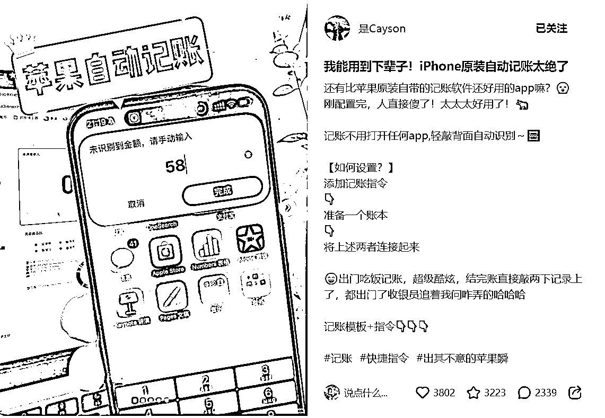
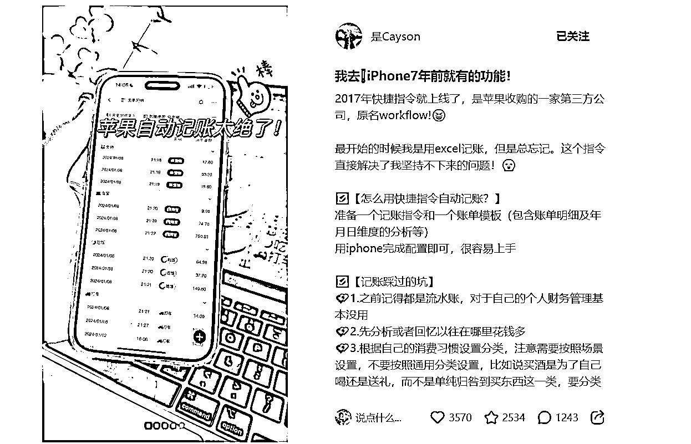
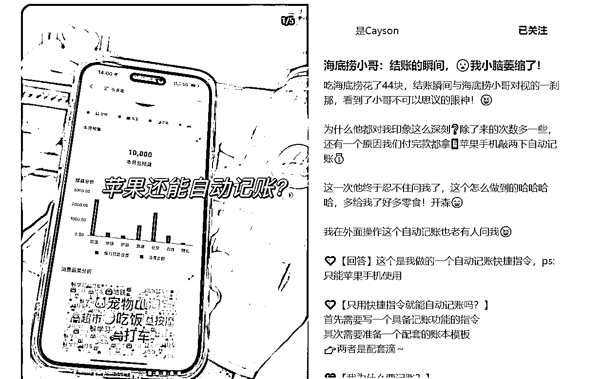
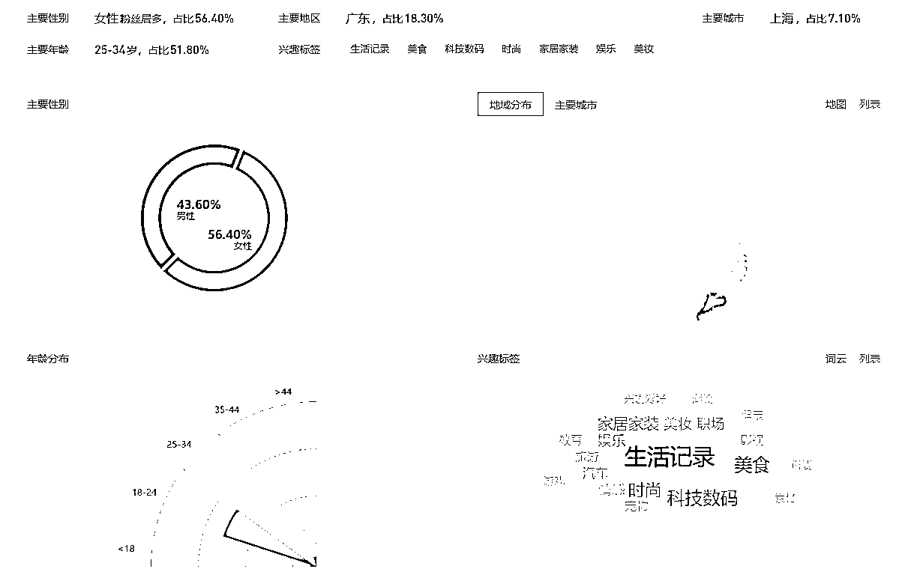
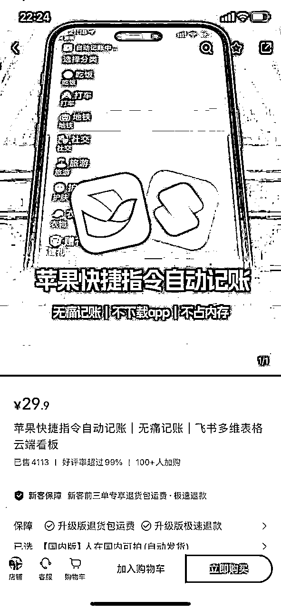
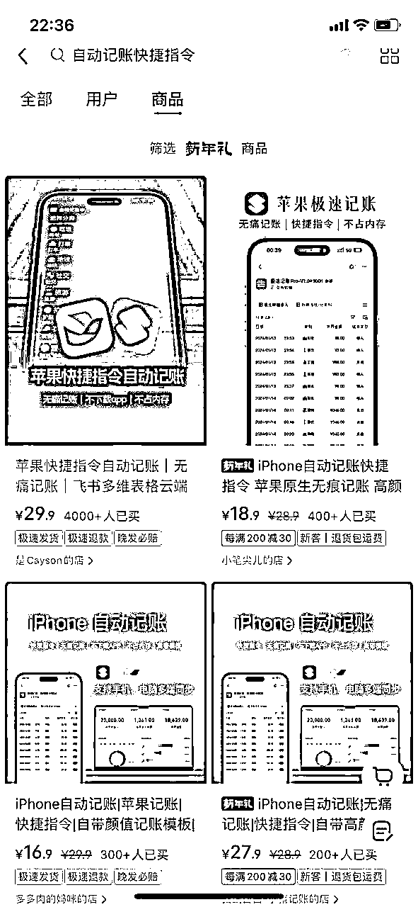
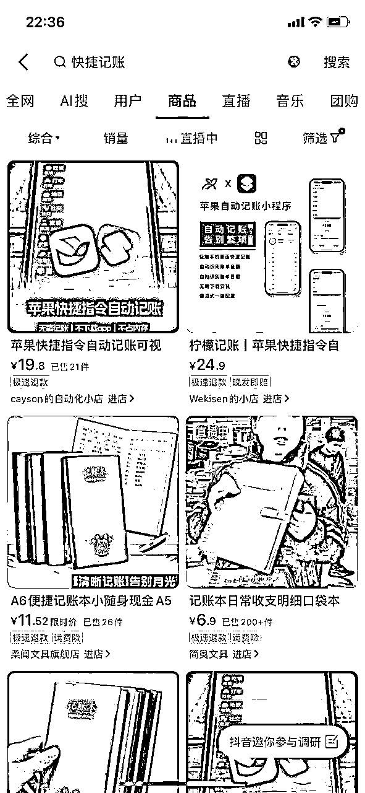
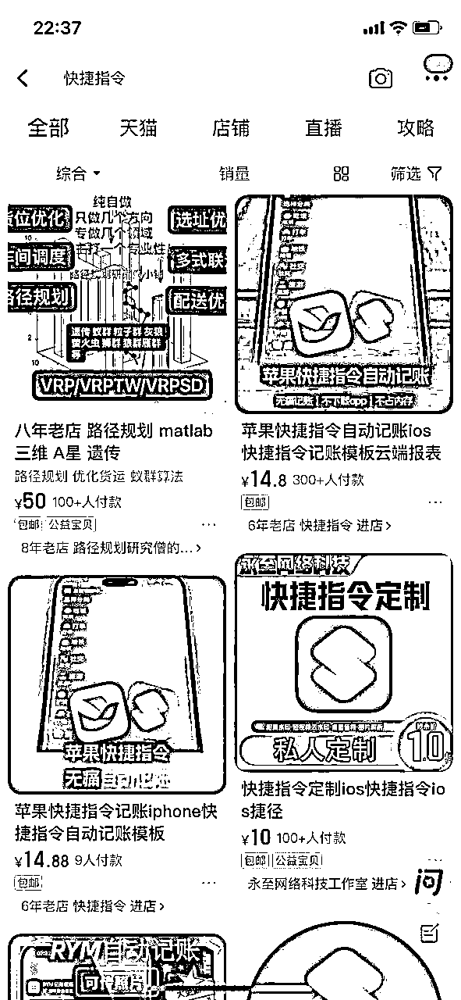

# 🔥风向标项目拆解计划 | 会偷懒就能赚钱，一个自动记账快捷指令是怎么变现的

> 来源：[https://j1enqkovxlg.feishu.cn/docx/XkH6dJS8mosWaJxeW1lckP71nVg](https://j1enqkovxlg.feishu.cn/docx/XkH6dJS8mosWaJxeW1lckP71nVg)

以下是4个项目拆解需要解决的核心问题：

✅流量怎么运营？

✅产品怎么解决？

✅利润怎么核算？

✅项目如何做&如何放大？

# 案例拆解

#### 基本情况

账号：是Cayson

类目：苹果自动记账

带货形式：通过图文和视频的方式起号，爆后通过小红书开通店铺进行成交订单。日常更新，图文挂车。

选择该账号拆解的原因：

*   是所有卖记账快捷指令当中销量最高的👉顶头

*   靠图文带货👉方便简单

*   一份记账指令卖了12W👉几乎0成本，高回报

## 1 流量怎么运营？

第一步，搞清楚流量从哪里来。

一个平台流量通常分为免费流量与付费流量。

*   免费流量：视频、图文、直播、搜索。

*   通过观察账号发布的内容、时间、数量、关键词等板块，了解他们如何通过优化内容形式，来拿到更多流量。

*   具体而言，要看内容形式是图文还是视频、实拍还是搬运、搬运的话如何去重不违规、什么样的选品方式、违规有什么后果、账号需不需要养号、用企业号还是个人号、不同账号权重是否一样、每天发布几条、账号起爆概率高不高、出现违规怎么办、搬运玩法能玩多久……

*   付费流量：每个平台都有自己的投放方式，整体要关注ROI（投入产出比）能否打正。

*   我们可以通过考古加等三方数据软件，查看账号的流量结构（feed数据与付费流量）

*   也可以通过系统推荐，来估算大致的投放ROI

*   观察他们有没有找达人进行推广投放

下面我们继续以是Cayson进行流量拆解，看看它的流量到底从哪里来。

经过第三方平台数据分析得出，该号没有付费流量，全都是免费流量

1）图文信息（30天）

*   新增图文15篇，视频2篇，其中挂车笔记12条，引导用户购物

*   一周发五条，按照30天来看，周四和周末数量最少，主要发布时间，星期三（按周）、20-24点（按日），5条里面2条爆文，2天之后的互动数可到3000

*   图文内容：一个手机记账软件的截屏，使用艺术字以疑问的方式表明（苹果手机记账），文案大多数是以一个故事开头，或者给一个场景，开始介绍关于苹果记账，讲清楚功能和方便，配上了表情加以修饰，吸引了年轻人

2）用户群体

需求分析：经济发达的地方需求量较多，同时25-34这一年龄段正好是事业刚成，同时消费能力强的群体，对于记账有一定需求

3）商品

4）结论

*   图文：通过挂车方式引导用户购买；通过介绍型偏暖色调图片和较为灵动活跃的文案，吸引年轻用户

*   商品：介绍清晰，空间感十足，图片科幻感较高，给人一种靠谱好用的感觉

## 2 产品怎么解决？

产品环节，首先关注这个产品是否需要自己生产。

*   如果需要，则需要从源头开始，考虑产品的生产成本、垫付资金、对接厂家等问题。

*   如果不需要，则考虑如何对接供应链，为自己稳定供货；同时考虑不同平台商品价差，为自己牟取最大利益。

以电商项目为例，基本以选品为主。

*   优先考虑官方的选品平台，如抖音、视频号的精选联盟，可以直接带货分佣，售后无忧。

*   如果没有需要的产品类型，或者佣金很低，则可以自己去拼多多、1688等平台，找到对应的商家进行谈判、解决物流售后等问题。

下面我们继续以是Cayson进行产品拆解，看看它的供应链到底是啥，具体产品价差是多少。

可以通过无货源来做，但是目前市场上类型较多，拿货可以从闲鱼或者淘宝入，当然还有更多的平台，像这种知识类货源，B站抖音上也有教学，也可以自学之后编写一个教程，取一个厉害点的名字就可以售卖了

1）成本和售价

成本预计0——10元以内

## 3 利润怎么核算？

利润的核算非常简单，本质上就一条核心公式：

利润=收益-成本

*   收益：可以通过三方数据平台看大致的收益空间；也可以通过店铺销量和销售额，计算大概的gmv。

*   利润率：通过精选联盟看佣金率，或通过不同平台差价，可以看出大致的利润率。

*   成本：需要考虑开店保证金、平台抽成、退货率、人力、物流、售后等多方面因素，考虑的要素越多，最终核算成本越精准。这些成本，可以从星球参考同项目的帖子，找找答案。

下面我们继续以是Cayson进行利润核算，看看这个账号到底赚不赚钱。

1）成本分析

*   小红书开店所需费用：保证金1000元+营业执照600元+开发100元（这里按市面上最大算）。总计：1700元成本

*   虚拟产品不可退货

*   月销售额<1000元，平台没有抽成

总计：1700成本，个人账号无其他费用

2）综合利润

目前销售4000+，单件29.9，成本1700

利润：11W

## 4 项目如何做&如何放大

这一板块，我们需要考虑，如果是自己来做这个项目，会有哪些关键环节，可以怎么做？

综合上面的结论，我们可以给出一套属于自己的路径。

以是Cayson为例，我们优先梳理：

*   项目的整体玩法是什么？靠图文怼量起号，再通过直播转化。

*   产品怎么解决？选品怎么选？走优选联盟则开通橱窗带货，解决千粉问题；走无货源模式则开通店铺，自己对接供应链，缴纳一系列保证金。

*   流量怎么来？图文要怎么起号、直播要怎么转化。

*   项目如何放大？矩阵要怎么玩、投流该怎么考虑。

基本上搞清楚这些问题，我们就会对项目有比较深入的了解了。

#### 1）项目如何做

1.  他是怎么做的

*   账号第一篇并没有直接发记账的图文，而是一个日常纪念，第二篇就是快捷指令记账的视频介绍，收获1889个赞直接爆款

*   文章小眼睛上来之后，博主通过让人三连+扣想要的方式赠送快捷指令，增加热度

*   账号到了高流量池，进入一周5更，反响很好，开设店铺，图文视频方式种草

1.  我们如何做

*   找到一个风向标产品（复购率低，成本低，知识类产品），进行图文展示，增加互动率养号

*   遇到第一次爆款开设店铺，通过图文种草的方式引导下单。开设群聊，图文中不种草，吸引用户进入群聊，群聊中给链接下单，同时群聊里面展示具体效果，还有客户反馈

*   持续输出图文

#### 2）项目如何放大

1.  多平台销售

小红书的人们有这个需求，其他地方会不会有，同样的方式可以放在抖音，B站等等

1.  多账号矩阵

开设多账号方式，增加主账号店铺销售率

1.  直播教学

拿老一点版本的快捷指令免费教学，有些人尝到甜头之后会主动购买高级版本，也会有人联系分销

1.  带徒弟

俗话说最赚钱的就是教人赚钱，可以通过带徒弟方式扩大

1.  付费投流

目前账号还没有付费投流，投流后数据应该更加炸裂

## 5 项目结论

从上面的分析来看，垂类图文+爆款打造的方式确实可行。利润在10w左右。需求量大，目前PDD没有相关销售，淘宝售卖快捷指令较少，属于是人多店少，但是由于是小众领域，用户范围小，运气成分也站一大部分，最好的方式是少量付费投流扩大影响+薄利多销，快速占据市场地位。