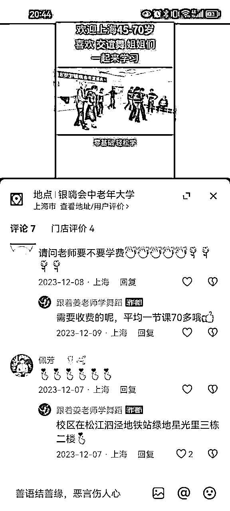

# 风向标拆解第3期-老年研学需求被满足的机会如何-Daemon

> 来源：[https://iy8tus37tl.feishu.cn/docx/YA0xdAdCLoXBlAx6q8Vc4NJ5nCc](https://iy8tus37tl.feishu.cn/docx/YA0xdAdCLoXBlAx6q8Vc4NJ5nCc)

这是一份项目拆解模板，希望能帮助你深入了解一个项目。

一个项目有很多种拆解方式，但一定会涉及流量和产品，两个关键环节。

所以，当我们能搞清楚流量怎么来，产品怎么解决以后，就能知道这个项目大概长什么样子；再通过核算成本与利润，就能知道这个项目是否值得做；最后通过拆解可达路径以及矩阵玩法，就能知道这个项目自己能不能做，有多少放大空间。

以下是4个项目拆解需要解决的核心问题：

✅流量怎么运营？

✅产品怎么解决？

✅利润怎么核算？

✅项目如何做&如何放大？

# 拆解的账号：

关于老年研学，选定的方向为老年人的“课余”生活，在抖音等按照“老年唱歌”、“老年跳舞”等关键词，发现一批老年人唱歌、跳舞的账号。

本次案例拆解选择以下2个账号作为目标进行拆解。

# 一、流量从哪来？

从账号的操作流量看，流量主要来自公域流量，视频的制作内容相对统一，视频为”学生演出视频“+标题；适合批量制作；

1、春秋老年课堂：在抖音和视频号可以搜到相同的账号，从视频内容看，应该是相同的内容在不同平台做分发；

2、跟着姜老师学舞蹈，在视频号等其他平台暂时没搜到相关的账号，应该主要做抖音的流量；

# 二、产品怎么解决？

1、从账号简介看，提供的产品主要是依托于老年大学，提供几类课程：舞蹈、声乐、乐器、形体等相关的课程，课程的教授有两种，一种是聘请专业的课程教师进行教授；另一种是本身就是相关的教师，通过平台将自己的优势放大；

2、但是从评论区内容看，舞蹈、形体、声乐等相关的课程比较适合本地生活线下业务，从评论区回复主要是咨询上课的地点，老年人主要靠近就近原则；

3、从添加老师的微信后，看朋友圈主要是相关课程介绍；引流的形式主要是添加微信后，先进行邀约，体验免费的课程，后续转化应该是在免费课程体验之后进行转化；

# 三、利润如何核算？

因为没参加体验课程，所以暂时没有明细的价格表，从评论区的价格看，单节课的课酬是70；成本主要是场地的租金和授课老师的课时费，利润主要在于学员的规模，这部分暂时没有详细数据进行测算，暂空。

# 四、项目如何放大？

1、项目的放大形式有两种方式：

方式一：通过扩大招生规模，引流更多的学员报名参加课程，从招生形式看，以本地生活为主，是否可以与其他本地生活机构进行合作，扩大招生的规模；

方式二：在看评论区的时候，发现一个有趣的现象，有很多90后开始参与到相关课程学习中，所以项目进行放大时，可以将人群要求放开

