# 风向标拆解第 3 期--小红书PPT模板店铺--言果

> 来源：[https://k4lvv97n87.feishu.cn/docx/YGuOdHL23oj7IRx5j15cFQSGnOe](https://k4lvv97n87.feishu.cn/docx/YGuOdHL23oj7IRx5j15cFQSGnOe)

# 1.赛道前景概述

### 为什么选择拆解卖PPT模板赛道

数据显示，截至目前，全国范围内已有超过300个设计素材平台，注册用户数量更是达到了惊人的1.5亿。同时，PPT作为市场上广受欢迎的工具，已经吸引了5亿学生、教师及职场人士的关注与使用。实际上，几乎所有行业都离不开PPT的应用，一份优秀的PPT往往能够为个人职业发展带来晋升机会和薪资增长。然而，对于那些从未接触过PPT制作的人来说，完成一份PPT仍然是一项相当复杂的任务。

选择赛道原因：赛道需求大，项目生命周期长，虚拟资料，没成本，不用发货；

### 为什么选择小红书平台

因为小红书这个平台电商卡的没淘宝，拼多多严格，还处在起步阶段，素人也可以出单。

# 2.如何在小红书起号

### 账号定位+首页装修

先去准备小红书账号，然后把账号名字、头像、背景墙、个人简介都去设置与ppt模板相关内容。

头像，名称，签名，这些去小红书上搜一下，模仿同行改一下就行。

类似下面的都可以，先找对标，模仿就行。

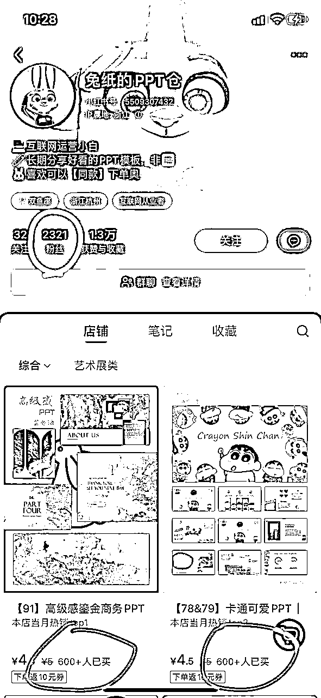

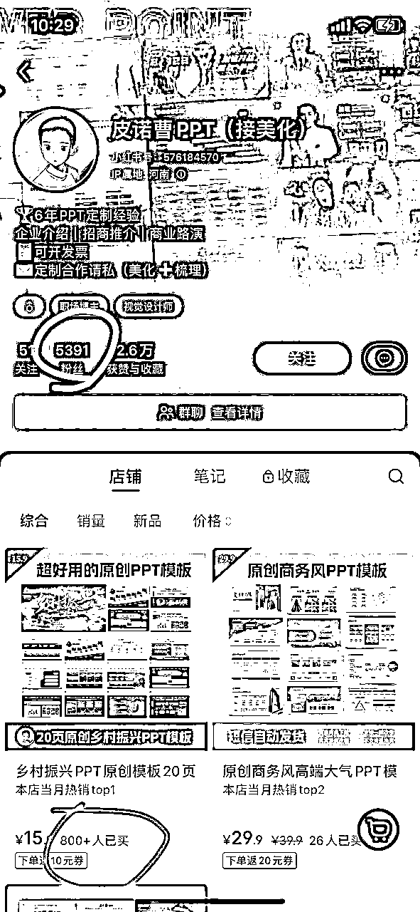

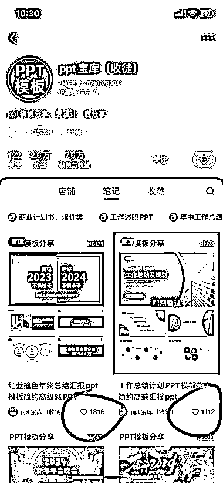

### 内容选题

浏览完风向标，各种公众号分享，教程后，我总结了这个选题很简单主要有几种：

*   普通的ppt模板,就淘宝，拼多多上搜集的；

*   可以直接套用的年终总结ppt模板，精美的汇报分析的模板；

*   卖 PPT 模板也能蹭热点；--这个思路打开，是不是能跟AI绘画结合起来等；

*   通过这个引流，卖其他资料；由A到B模式

*   卖细分领域的PPT模板；

### 内容输出

（1）用一些制作海报的APP，市面上有很多，比如美图秀秀，醒图之类的！

（2）把PPT的缩略图，做成一张张的海报图！

（3）直接搜索关键词“某某PPT模板”，找一些优质同行爆款笔记作为参考借鉴对象。

（4）一篇笔记作品大概是3-4张图，纯色背景图，每一张排版都有一张PPT大图作为首页+4张小图，大家可以参考这种来做，因为相对来说比较简单。

（5）这里大家可以去其他平台搜索一张纯底色图，然后把底色图导入醒图，点击调节-构图，选择画面比例3:4布局。

（6）然后用wps把PPT打开，并将ppt页面截图或者裁剪出来，因为制作图需要1大4小ppt页面，因此需要做3张图，也就是需要截15个页面图。

（7）最后把这些ppt页面导入到3:4纯底色背景图上。

### 案例分享

### 案例1：

刷到很多个博主的账号，都是属于低粉爆款类型，基本上1000粉丝可以卖出300单，1万粉丝有6000多单。店铺和笔记数据都很不错。

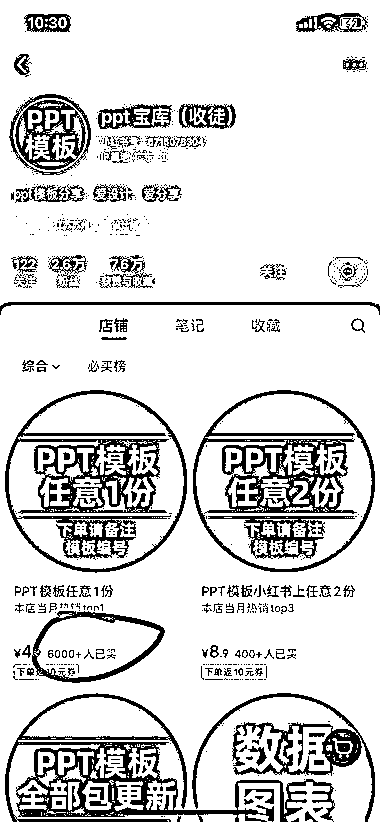

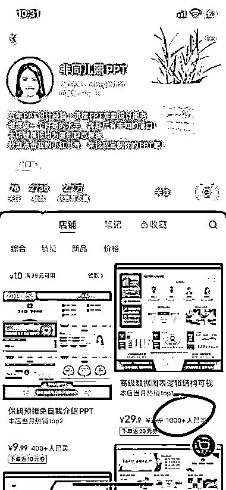

### 案例2：

小红书店铺卖PPT模板，包装审美做好，可以卖高客单价

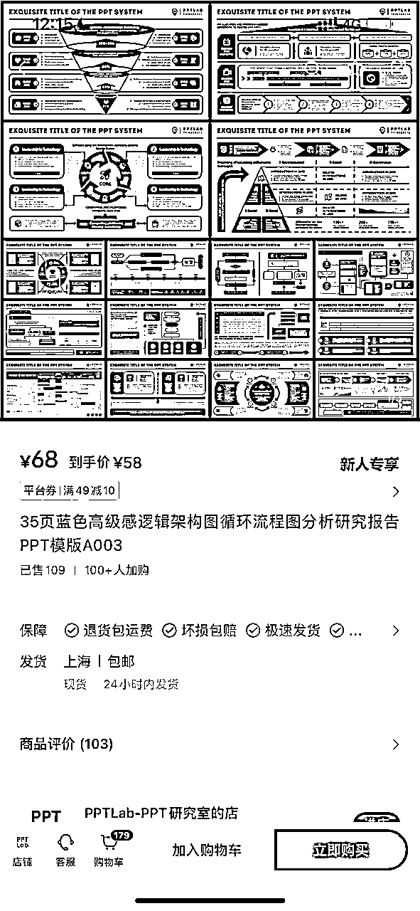

### 案例3：

卖 PPT 模板也能蹭热点，这个号 11 月 28 号发的第一篇笔记，目前已经卖了 888 份模板了

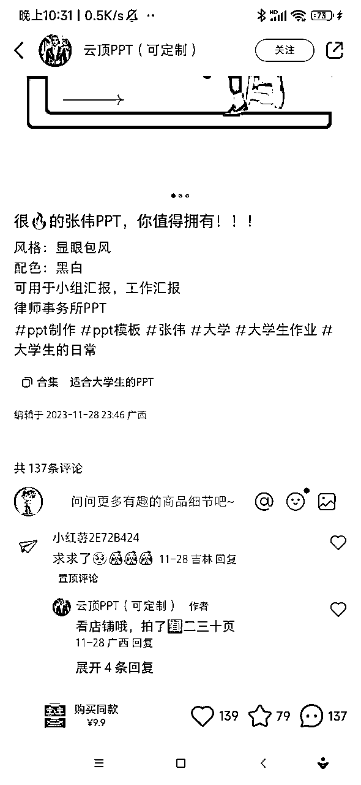

### 案例4：

又到年底需要年终总结的时候，这个工作总结的ppt模板卖的很好，直接套用又漂亮，领导最爱的ppt逻辑图，一看就吸引人，整套130页一杯奶茶钱，评价都很好，都5分

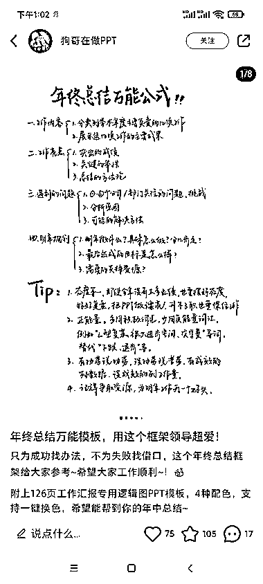

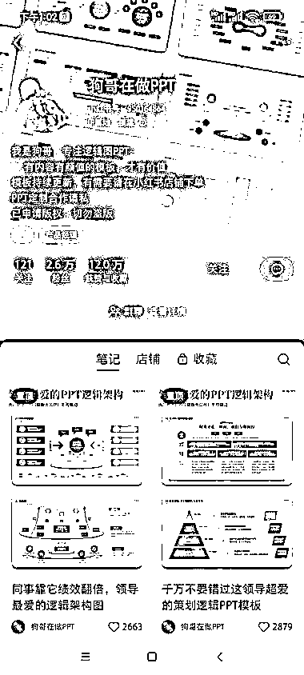

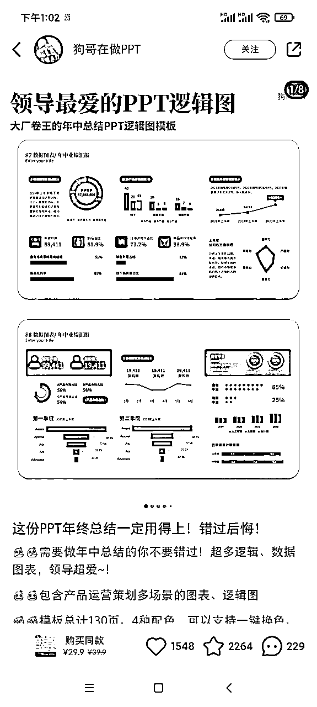

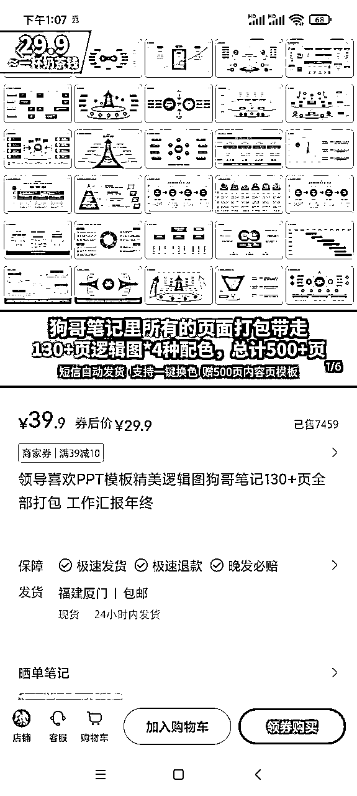

### 案例5：

小红书，大学生PPT代做。大学生会有很多PPT作业，卖课，代做，卖模板。

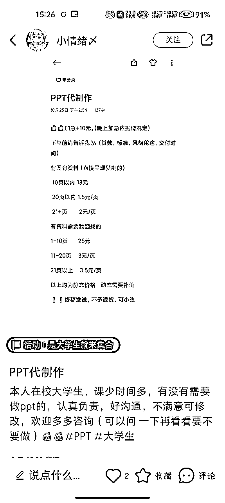

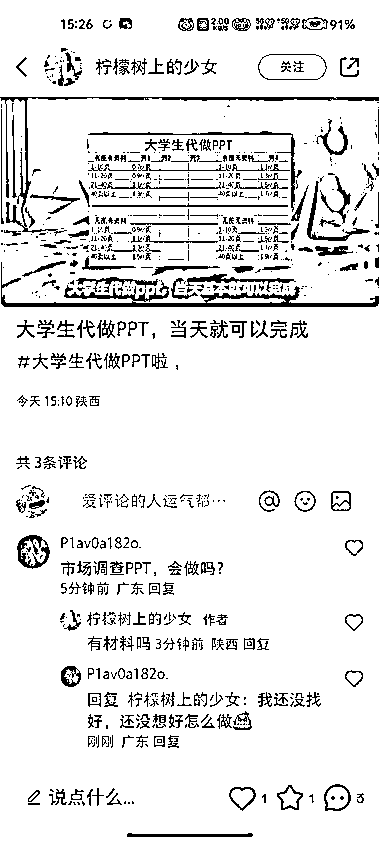

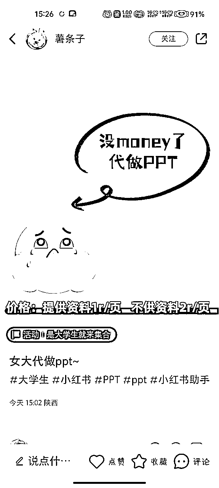

### 案例6：

小红书上发不同学校的 PPT 模板，引流到公众号卖资料，客单价 138，已经卖了 448 份。

朋友圈还在代抢演唱会门票，发一些考研资料，引流到另一个公众号专门卖考研资料。

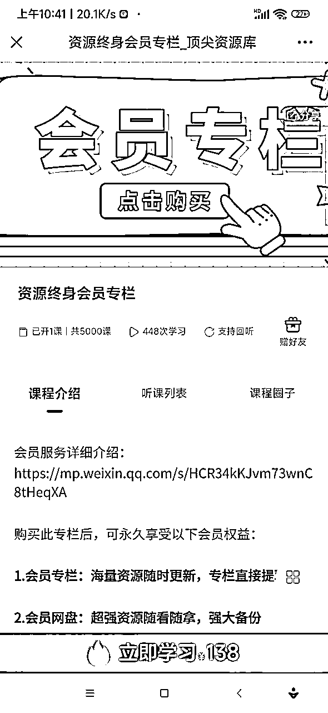

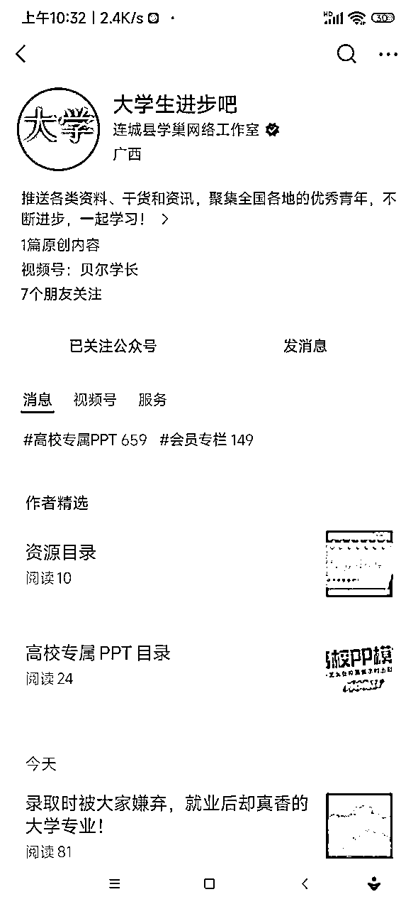

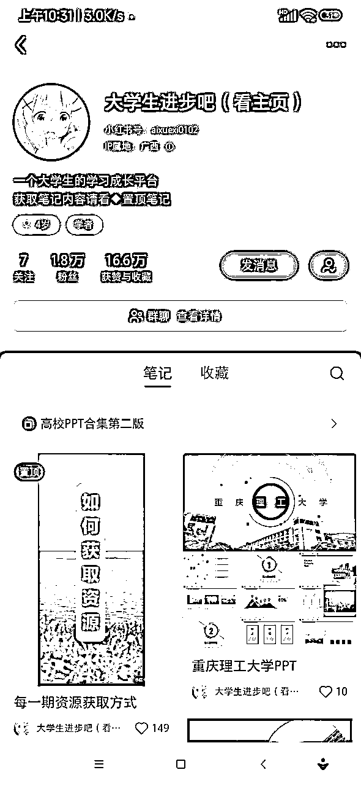

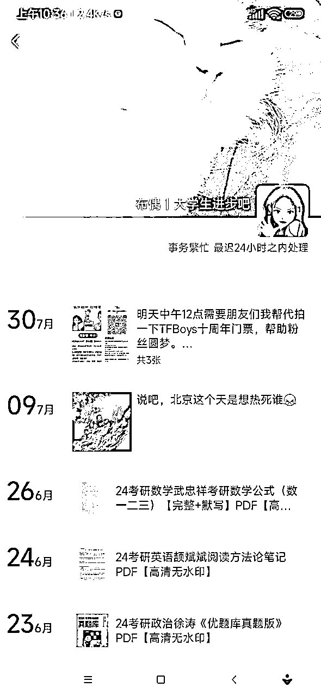

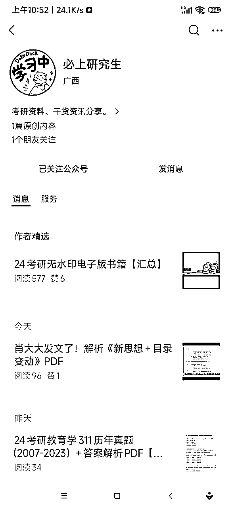

### 案例7：

最近关注的一个公众号，做 ppt 插件的，可以说相当细分，不像市面上islide 那种卖模板素材，而是专门做3D 科研绘图，买课送插件，目前看销量已经 5000 多份了，做工具的圈友可以借鉴

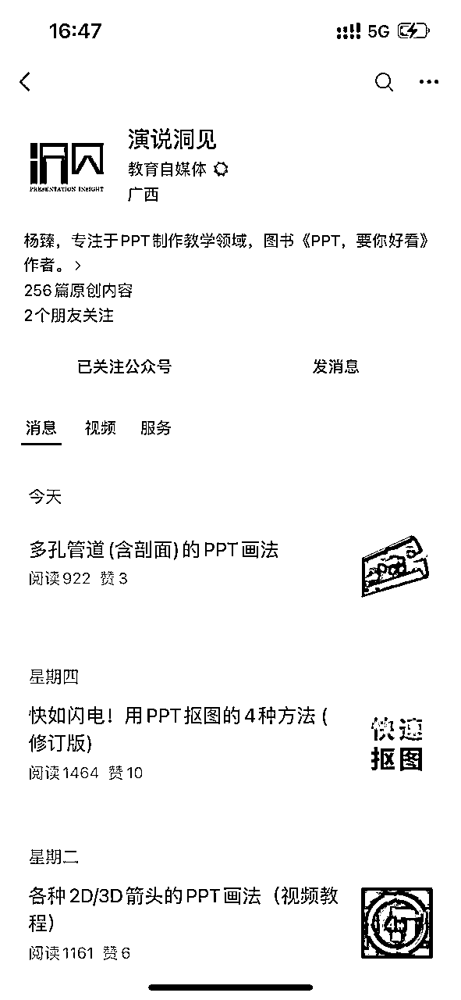

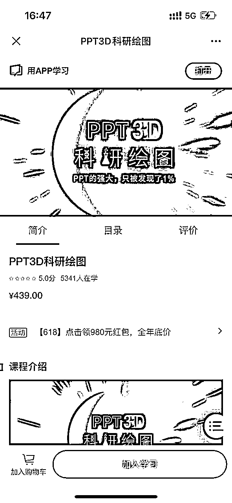

# 3.如何在小红书引流

每天至少要发布三条笔记，当笔记有流量后，即有点赞或者小眼睛达到100以上 ，就可以利用评论区引导粉丝评论666后来私信我们，最后在私信中通过话术引流至自己的微信号。

1、评论区引导私信。如下图:

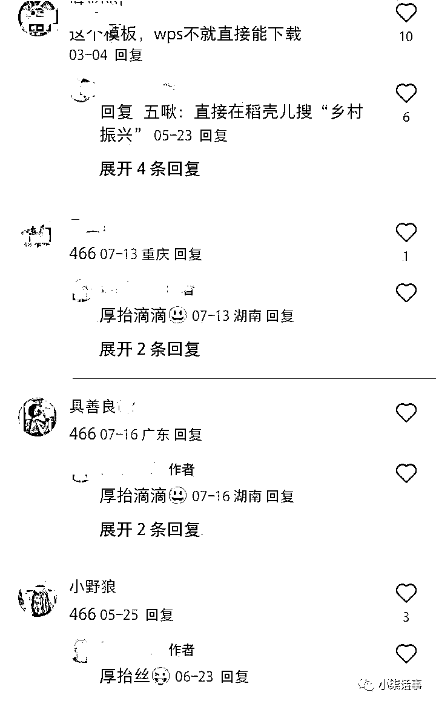

2、也有其他方法，多去小红书搜索一下同行学一学，多种方法混合使用。

3、私信的话术，私信一定要过滤白嫖党，说明收集不易，要求付费。

4、评论区截流，可以在同行的作品下面去进行截留，评论区求分享的都是有精准的需求的一些客户。

# 4.产品形式

1.  收集并整理PPT模板，建立资料库。

1.  通过某多多、某淘等平台购买优质PPT模板，然后筛选和分类。

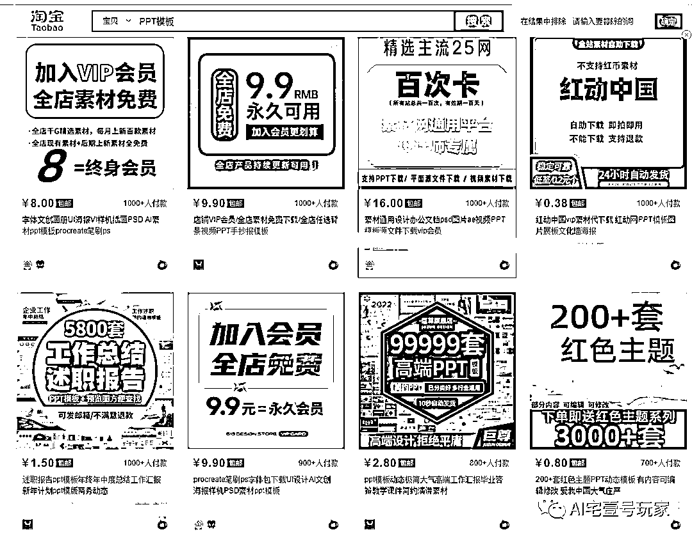

1.  通过一些免费的公众号获取。

1.  通过爬虫获取海量的PPT模板资源，在精选出符合我们要求的。

# 5.变现分析

1、单卖PPT模板

这个是指单卖ppt模板，比如手里有上千套模板，你可以单套卖也可以全套一起卖，单价在29.9-99左右。

2、定制PPT模板

很多人可能会制作PPT模板，也不用担心，可以去某宝寻找商家进行合作对接，定制单价相对来说也是比较高的。

3、PPT模板付费社群

你可以整合一些PPT模板素材，去做好分类，低质量的作为免费，高质量的作为付费，并且包更新。

4、网盘拉新

这个操作就更简单了，先去申请推广权限，然后把PPT模板资源保存到网盘内，做好分类，有需要的用户直接发给他，真的是一鱼多吃。

# 6.注意事项

1.小红书引流的时候，容易被封号，注意引流方法的使用；

2.注意转化路径，转化话术的设置；

3.注意收集的PPT模板的版权性；