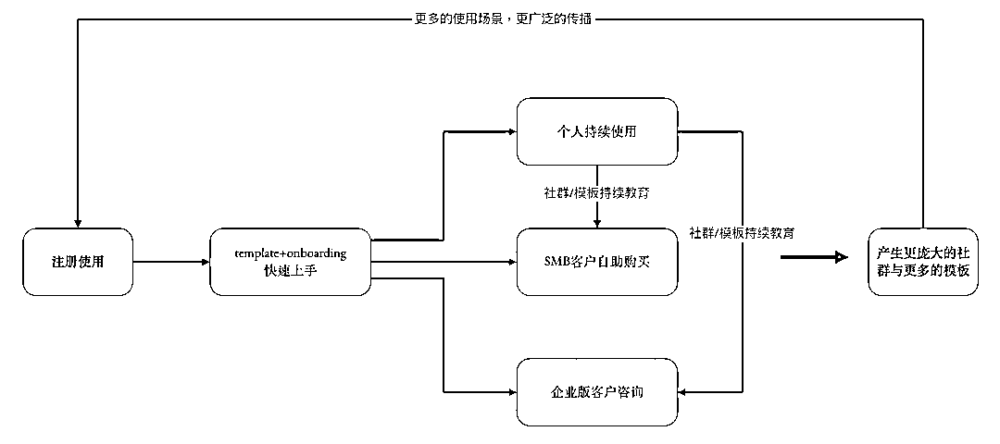
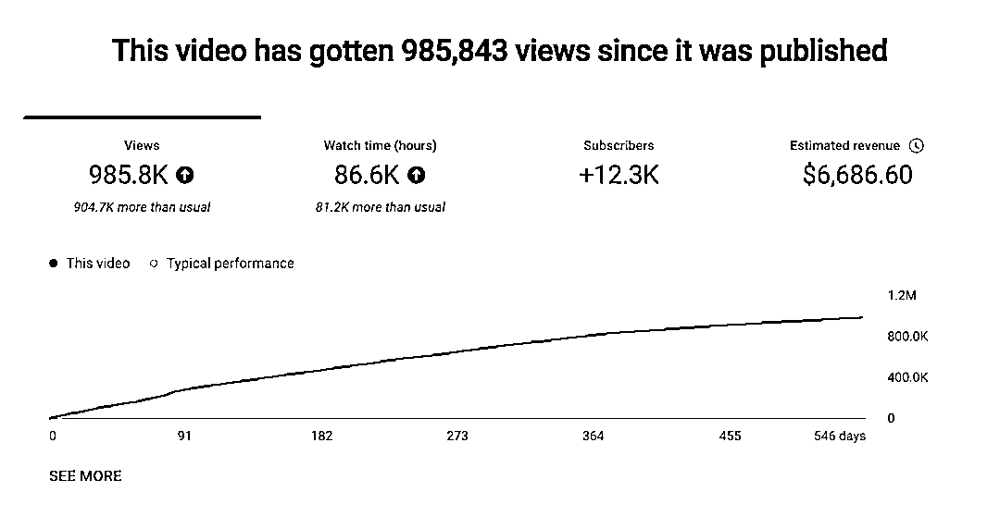
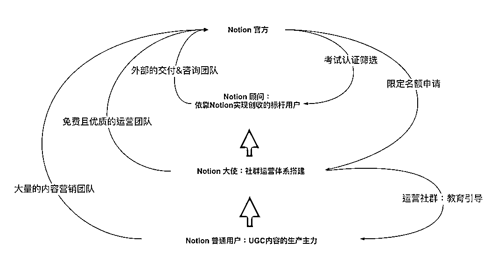
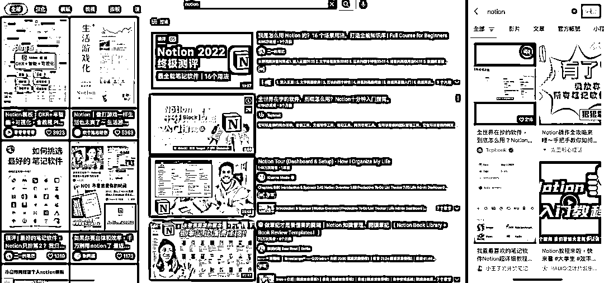
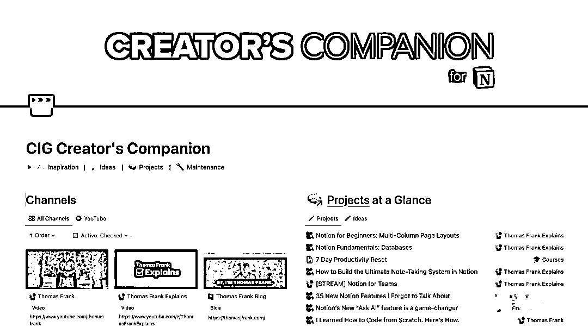
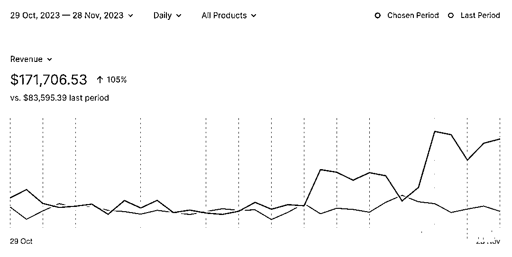
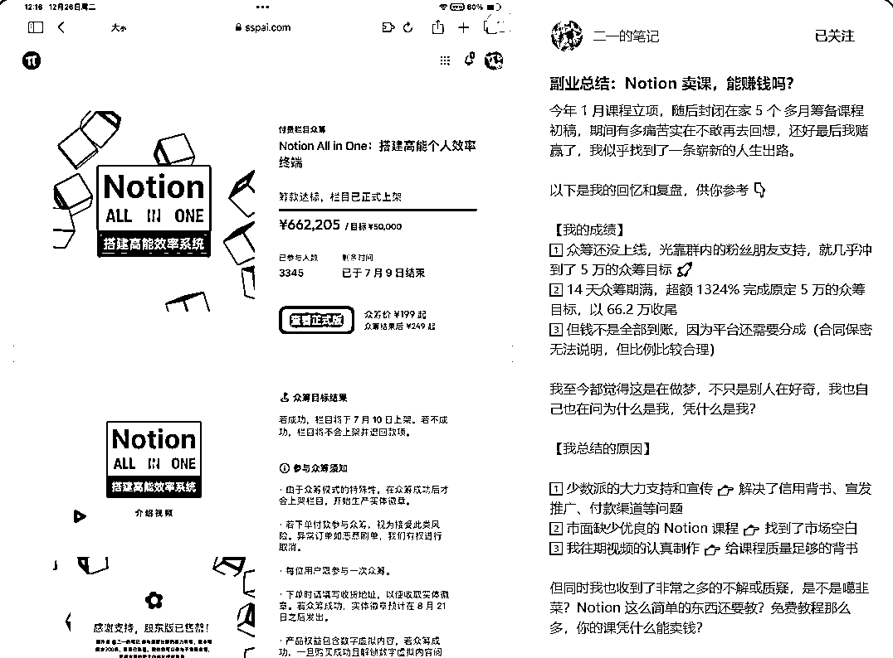

# 风向标拆解第3期--靠Notion模板年收入100万美元，通过资料整理变现的路径如何-韧而远行

> 来源：[https://zx5eujk7gcw.feishu.cn/docx/ZRTCdzsp9olw1jxaMi2c5yVZnsf](https://zx5eujk7gcw.feishu.cn/docx/ZRTCdzsp9olw1jxaMi2c5yVZnsf)

大家好，我是远行，一个刚刚进入生财，开始学习了解赚钱能力的新人。今天我就以一个新人的视角，来拆解一下这个Notion模板项目。

在进入生财之前，我压根没有听说过Notion，甚至不知道它是个什么东西。但为什么会选择这个风向标来作为拆解对象呢？因为好奇。对，我就是因为好奇，这个风向标的开幕雷击关键词有三个：模板、100万美元、资料整理变现。

对，没错。吸引我的就是最后一个关键词：资料整理变现。

第一次发现，靠这个能力也能变现。试问，现在哪个IT互联网公司的人，不会整理资料呢？所以，我想研究一下。

不查不知道，一查吓一跳。还真被我挖到一个哥们儿，2年靠Notion模板，变现了210万美元。他的名字叫托马斯·弗兰克。

好了，闲话少叙，进入正题。

以下是学习了Hedy大佬的拆解分享，我觉得她的这个拆解模板非常适合我，所以直接拿来用了（捂脸）：

✅赛道前景概述

✅如何起号（YouTube）

✅如何引流（YouTube）

✅产品形式

✅变现分析

✅利润怎么核算？

✅项目如何做&如何放大？

# 1、赛道前景概述

接下来我们会以《托马斯·弗兰克 靠卖Notion模版2年赚了210万美元项目》为例，为大家进行拆解。

首先，我们得知道Notion是什么，或许很多生财大佬已经知道了，但是我还是要在这里给同为新人的圈友们普及一下。大佬们可以跳过了。

Notion 是一款强大的在线协作工具，它将笔记、任务管理和知识库相结合，为用户提供了一个高度可定制和灵活使用的工作平台。

下面的介绍是网络上给出的通用介绍，内容太多。我觉得Notion官网的介绍，更清晰点：

“Notion 官网首页，在面向个人使用的场景上，介绍了6大主要使用场景：记笔记、一站式记录平台、任务管理、写文章、目标管理与建立个人网站。”

就从这句话的介绍来看，我觉得就很强大了。为什么？

上述6大场景中，单说2个：一站式记录平台和建立个人网站。

这两个场景，在过去，是需要组建一个至少3-5人的开发团队，才能搞定的，如果你想自己做，还得学习非常多的网站开发搭建技术。

扎心的是，即使你学会了，你搭建的，也不一定有一个技术小白在Notion上搭建的个人站好！

Notion主打的是All-in-one，把所有的信息化处理工作都放到一个平台上来完成。

###### 这里用网络上查到的通用介绍为大家说明一下（如果你不感兴趣，可以略过）：

一、应用概述

Notion是一款新兴的在线笔记应用，旨在为用户提供一个集中式的平台来整理、共享和协作各类信息。该应用融合了传统笔记应用的基础功能与现代团队协作工具的特性，适用于个人、学生、以及企业团队等多种用户群体。

二、功能特点

1.  多功能编辑器：Notion提供了一个强大的编辑器，支持文本、图片、视频、音频、代码块等多种内容格式。用户可以在一个笔记中自由组合这些内容，创建出丰富多彩的笔记页面。

1.  灵活的组织结构：应用允许用户创建无限层级的文件夹和子文件夹，以及通过标签、链接等方式灵活地组织和管理笔记。这种灵活性使得用户可以按照自己的喜好和需求来构建个性化的知识体系。

1.  实时同步与共享：Notion支持多设备同步，用户可以在任何设备上随时访问和编辑他们的笔记。同时，用户还可以轻松地共享笔记或文件夹，并与他人进行实时协作。

1.  模板与扩展：应用提供了多种预设模板，如项目管理、读书笔记、会议纪要等，方便用户快速创建标准化的笔记。此外，Notion还支持通过第三方扩展来增强功能，满足用户的特殊需求。

1.  搜索与发现：强大的搜索功能可以帮助用户快速找到他们需要的笔记或内容。同时，Notion还提供了智能推荐和关联内容展示，帮助用户发现更多相关的信息。

三、优势

1.  高度可定制性：Notion提供了丰富的自定义选项，用户可以根据自己的需求调整应用的界面、功能布局等，从而获得更好的使用体验。

1.  强大的协作能力：该应用注重团队协作功能的开发，提供了实时编辑、评论、提及等协作工具，使得团队成员可以有效地沟通和协作。

1.  跨平台支持：Notion支持在多种操作系统和设备上使用，包括Windows、Mac、iOS、Android等，为用户提供了极大的便利。

1.  丰富的扩展性：通过支持第三方扩展，Notion可以与其他应用和服务进行集成，从而提供更广泛的功能和应用场景。

四、不足之处

1.  学习曲线较陡：由于Notion提供了大量的功能和自定义选项，对于初学者来说可能需要一段时间来熟悉和掌握。

1.  性能问题：在处理大量笔记或复杂内容时，Notion可能会出现性能下降或延迟的情况。

1.  中文支持有限：目前Notion的中文支持和本地化可能还不够完善，对于中文用户的需求可能无法完全满足。

1.  价格较高：相比一些免费的笔记应用，Notion的定价可能较高，个人专业版也要4美元。不过一般个人使用免费版就够了。

所以，Notion初看之下，好像就跟飞书、腾讯文档、Keynote等等差不多？不不，如果是这样，那它的模板也就不值钱了。且看下面的总结。

## 赛道定义

这就要说一下Notion模板项目到底是干什么的，到底属于什么赛道：

1.  生产力工具：Notion 通过提供模板来帮助用户更高效地组织和管理信息，从而提高个人和团队的生产力。这一赛道包括其他类似的笔记应用、任务管理工具等。

1.  协作工具：Notion 支持多人实时协作，使得团队成员可以在同一个平台上共享信息、分配任务和跟踪进度。这一赛道包括其他团队协作应用，如 Slack、Trello 等。

1.  知识管理：Notion 的数据库功能使其成为一个强大的知识管理工具。用户可以通过创建自定义数据库来收集和整理各种信息，从而方便地查找和使用。这一赛道包括其他知识管理解决方案，如 Confluence、Notepad++ 等。

总结起来，Notion就是一个能够帮助个人、企业和团队提高创造价值效率的工具平台。因为它的自由定制特性，所以能够衍生出各种能力。

但一个硬币总有两面：正是因为它的高度自由定制的特性，Notion的使用成本很高，尤其是新用户，完全不知道该从何下手，它的学习成本很高，因此，就催生了一个很细分的赛道：Notion工具培训赛道。属于培训赛道。

我暂时将Notion模板项目划分为Notion工具培训赛道里，或者你也可以把它理解为知识分享赛道。

## 赛道前景

基于前面的介绍，我们知道了这就是一个工作效率提升类的工具平台。讨论赛道前景，主要要看这个赛道的受众群体都是什么样的？规模有多大？

### 受众群体

目标用户（个人）

基于 Notion 的面向个人的应用场景，在C端市场上，其潜在用户是除没有能力进行文字记录的儿童之外的所有人类个体。

但是，因为思考成本的存在，不是人人都有动力去进行各种文字记录与任务管理。所以，使用 Notion 的人，一定有提高生活效率、实现自我成长的动力，并且能上手使用、有时间进行思考记录。因此，按照这个条件，无非就2类人群：

*   大学生群体；

*   从事新兴行业（互联网、自媒体等）的知识工作者。

目标用户（企业）

Notion 的主要企业端客户大多是小规模企业，包括单独的小企业和大企业内的小团队小部门。

面向企业市场的 Notion，属于工具类 SaaS，定位是内容协作一体化平台，在强大的无代码能力支撑下，可提供企业知识库、项目管理、文档协作、自动化流程等除IM通讯与专业垂直服务外的多种服务。

与个人工具类似，作为企业工具的 Notion，提供的价值仍然是all in one——让企业在办公中减少软件的切换，用尽可能少的软件完成更高效的协作，实现内容的快速流动，提高企业协同效率。

#### 基本情况

账号：托马斯·弗兰克 靠卖Notion模版赚了210万美元

类目：Notion模板

带货形式：YouTube视频分享

选择该账号拆解的原因：

这个博主赚钱了，并且有了持续收入。

*   托马斯的模板销售额平均每月约为12万美元，

*   其他收入来源（如联盟营销和YouTube AdSense）每月约1.5万美元。

他是怎么变现的：

1.  市场需求：托马斯准确地识别了目标用户在组织、规划和生产力方面的需求，并提供了相应的解决方案。

1.  高质量内容：他通过发布高质量的教程、博客文章和视频内容，建立了良好的声誉并吸引了大量粉丝。

1.  多元化收入来源：除了模板销售外，托马斯还通过联盟营销和YouTube广告等方式实现了多元化收入。

1.  持续优化和创新：他不断优化现有产品并探索新的创新方向，以保持竞争优势并满足用户不断变化的需求。

### 市场规模

因为存在个人与企业两类用户，所以 Notion 可以支持的场景也可以分为2大类：个人内容管理与企业协同。

这里面，企业协同实际是Notion的主要盈利版块，相对而言，个人用户所贡献的利润并不占主要部分。

这里给出一个调研数据，来自Gartner:

移动互联网的普及，加上疫情的催化，使办公移动化、数字化程度不断提高，协同办公行业也在快速发展。从2019年起，协同行业的全球市场规模年增长率预计将达到约10%，在2024年达到481亿美元；且国内市场发展将更为迅速，年增长率预计将达到23%。

这里就要说到国内市场了，现在大家看到的有飞书等可以使用，是不是觉得很方便？但是如果你用过了Notion，那么你会发现这俩不在一个层级上。

飞书，蓝湖这些可能还只是一个工具，可能它们也在向Notion看齐，但目前还是有很大差距的。

Notion的优势就在于，它的天花板高，它像一个积木，可以搭建出无限可能。

但即使是这样：

国内对协同办公的投资也从2020年的82亿暴涨到2021年的243亿（数据来源：it桔子），且其中也有以蓝湖为代表的百亿独角兽公司诞生。

## 赛道总结

Notion所在的大赛道，追根溯源，其实就是几年前非常火的【SaaS】,也即是无代码平台。通过它的高度灵活性，形成All-in-one的协作平台。

### Notion的优势

它与其它类似的无代码协作平台之间比，优势是什么？

无代码提供的高度灵活性，形成 all-in-one 的协作平台，就是 Notion 最大的优势。

具体说是2点：多场景的支持与业务数据的互通。

1、多场景的支持

是指通过使用 Notion，不仅能满足最通用的文档协同场景，而且能够搭建出如 CRM、HRM、项目看板等工具满足更多的垂直场景。

这一点对大企业没有吸引力，因为它们都会单独采购或者开发适合自己的类似工具。

但是对于小企业、小团队而言，一个CRM、HRM的采购和开发成本，就可以让这个企业破产。

Notion解决了这个使用难题。

2、业务数据互通

通过 Notion 搭建出的诸如销售管理、采购管理、库存管理等工具，能够实现数据之间的任意引用，而不用再像以往单独购买软件时，还需要单独做接口，实现内部数据的互通，而这个过程带来的开发成本和实施成本都不小。但是，如果你使用了 Notion，这些成本都将降低为0。

### Notion的劣势

那么它就没有劣势吗？当然有，所谓“成也萧何败萧何”，Notion的优势是灵活，它的劣势也是灵活。虽然对于 Notion 自身来说，服务小B客户，交付部署时间快、成本低，服务标准化程度高，盈利也更加容易，但从另一个角度来看，优劣也是劣势，配置自由度高、应用场景广带来的劣势便是：

*   在某些复杂深入的业务场景下，Notion 的支撑能力明显不足；

*   交付咨询能力差，每个小企业的需求也是有个性化的部分，要使产品发挥出更大的价值，需要用户自己进行深入挖掘。

## 普通人怎么利用Notion赚钱？

到底普通人怎么赚钱？

看到这里，你大概能看明白了，Notion上，我们能赚钱的点到底是什么了吧？

对，就利用它的：【交付咨询能力差】这个缺点。

这也是为什么，现在内外网上，有如此多的博主可以利用一套模板，或者各种Notion课程赚钱的原因。

# 2、如何起号

通过教授人们如何使用Notion并销售Notion的模板，以及在YouTube上开设关注生产力的频道，托马斯就是这样，他的两个旗舰模板——"Ultimate Brain"和"Creator's Companion"——在大约两年的时间里创造了210万美元的销售额。

那么他是怎么做的呢？

## 1）发现需求

托马斯最开始并不是做notion模板项目的，他原本是只是一个普通的视频博主。从2018年开始使用Notion作为自己的自媒体效率提升工具。此时，托马斯还是一个完全的Notion新手，只是将Notion作为一个TODO类的工具在使用。

直到2020年，他开始将Notion引入自己的团队，作为协作效率办公工具。但这时候，他发现很多人都还不知道Notion，更不知道如何使用Notion。

因为托马斯在前期使用时，储存了一套模板，可以通过分享，让其他人快速的使用起来。但此时托马斯的Notion技能并不熟练。他的模板也并不完善。

从2020年开始，托马斯开始有意识地学习和优化自己地Notion模板，针对性的去解决一些生产力的问题。

## 2）起号

1、制作入门使用视频

托马斯发现竟然还有很多人连Notion的基础操作都不会时，就录制了一个入门使用视频。原本他并没有在意这个视频，但就是这个视频，让他真正意识到Notion模板的重要性。

2、在视频中分享了第一版的Notion模板

因为托马斯录制了第一个入门视频后，并将自己正在使用的Notion模板分享链接放在了视频下方，这个是免费的。但却因为这样一个动作，视频突然就火了，光这个视频的广告收入，第一个月就达到2000+美元。

这让他看到了商机。

## 3）总结

起号其实就是这么简单，并没有专门的包装，只是做了一期使用视频分享，附上了免费的模板链接。

不过，这里对我们而言，可能不具备可参考性，因为现在大多数平台，是不能这么直白的引流的。

# 3、如何引流

其实在前面也有提到，就是免费。

但有位产品大佬，将Notion的模式总结为PLG增长策略。

## 1）PLG增长策略

定义：

通过提供产品的免费使用，并进行终端用户生态的运营，凭借良好的产品力，实现从下而上由终端用户驱动企业采购的B端产品增长策略。

托马斯就是用一个免费的45分钟视频，深入的介绍了他的模板“Ultimate Brain”每一个部分的功能后，就获得了第一批用户：

## 2）增长飞轮

上图是这位大佬梳理的简略版 Notion 增长模型，结合 PLG 的定义，大部分 Notion 用户的使用流程大概是这样的：

1.  在 Youtube、Twitter、抖音、小红书等社交平台看到 Notion，于是进行了注册；

1.  在产品引导与模板的教育下，发现产品的价值所在，开始着手使用产品；

1.  在使用过程中，确认了产品的价值，并发现了更多好用的模板；

1.  越用越顺手，成为活跃用户，并加入了社群；

1.  尝试将 Notion 引入工作团队进行使用，开始订阅团队版或咨询企业版；

1.  成为长期留存用户，并开始主动分享使用 Notion 的方法与模板；

1.  于是，朋友看到了你的分享，并落地官网进行了注册……

就这样，循环往复，Notion 的 PLG 增长飞轮就完成了搭建。

## 3）成功的核心：定位

关于 Notion PLG 模型的成功，主要的核心原因，其实还是在于定位。

它的定位就决定了它非常适合 PLG 策略，主要体现在以下3点：

*   能满足的不仅是终端个人的需求，同时也是团队/企业的需求 对于个人来说，Notion 满足了个人场景下的项目管理，同样也能满足团队间的项目管理。这样带来的好处是，用户在个人使用的旅程中，因为个人场景管理与工作管理的内容重合度较高，所以很容易代入团队角色来理解产品价值，完成从”生活人“到”工作人“的过渡，那么，自然而然就会尝试团队版；

*   终端使用者能够对团队/企业的购买决策产生较大影响 由个人使用转化到团队使用，条件不仅仅是产品有价值，还涉及到决策购买的过程，这也是为什么目前大多数的 PLG 产品都诞生于互联网行业，其中很重要的一点，就是因为该行业中的小团队有较大的采购权，所以即使是基层人员，也能对小团队的购买决策产生较大影响；

*   庞大的用户社群与丰富的模板生态，且产品本身便于裂变传播 因为要面向大量的终端用户，所以自然而然就要进行C端式运营：打造用户生态。而在这个运营过程中，最大的武器就是 Notion 模板。 模板易制作且易传播。好用的模板裂变更多的用户，而更多的用户也就意味着更多好用的模板，二者相互促进，形成对 Notion 用户生态系统的增强回路，也就是我们常说的网络效应。据统计，2022年7月份，Notion 官网1亿+的月访问量中，至少90%是未经任何付费渠道直接落地官网。（数据来源：similarweb）

## 4）总结

从我这样的观察来看，Notion其实更像是一个具有社交属性的【SaaS】低代码开发平台。

是的，当我得出这个结论时，也吓了自己一跳。但是看看正在使用的飞书，它不也是在朝这方面去努力吗？

# 4、产品形式

## 1）Notion实际是一个内容生产平台

关于产品形式，我用下面这张图来展示吧：

Notion官方的产品是这个低代码工具应用平台，但它同时给普通用户提供了一个能力：UGC内容生产能力。

这就好比小红书、抖音这些社交媒体平台，实际上平台方就是搭建了一个舞台，剩下的事情都是用户在做：生产内容。

## 2）Notion的产品：Notion模板

对于Notion而言，它的产品就是Notion模板。

每个人，每个团队，每个企业，他们的需求、痛点、业务内容都不一样，但是又有很多类似的，共通的地方。

所以如果有人能够制作一套模板，并将这套模板推广出去，它总能适配到对应的用户。

这是不是跟小红书、抖音、视频号很像？

那我们再回到托马斯这里。

托马斯实际上只是Notion这个内容生产平台里的一个“博主”而已，他通过利用Notion解决了自己的痛点和需求，从而想到，自己的模板是不是可以帮助别人解决同样的痛点和需求？

对，就是这么简单一个思路：

*   托马斯的模板解决了用户在组织、规划和生产力方面的痛点。

*   "Ultimate Brain"模板将Notion转变为一个完整的个人生产力系统，涵盖了任务管理、笔记、项目和目标跟踪等功能，满足了用户对于一站式解决方案的需求。

*   "Creator's Companion"模板则针对内容创作者的需求，帮助他们直接在Notion中规划和制作所有社交媒体渠道的内容，提高了工作效率。

*   最重要的是：降低了用户使用Notion的学习成本，提高了生产效率。

# 5、变现方式

Notion变现的方式主要有2大类：

## 1）Notion模板销售：

个人用户，在Notion上的主要变现方式就是卖模板，将自己做好的一套Notion模板设置付费，分享给其他人去使用。用的人越多，赚的钱越多。

托马斯现在主要有两个模板产品，而且他从始至终都在卖这两套模板，卖了两年，月均收入12万美金：

*   Ultimate Brain完整个人生产力系统模板。

*   "Creator's Companion"内容创作者模板

## 2）卖教程

卖教程，就不多说了，跟其他社交媒体上卖课，应该是一个道理。星球上太多大佬讲了。我就不在此赘述了。

## 3）卖咨询和售后支持

因为Notion的模式就是，他们官方重点服务的是B端用户，大家可以再返回去看那个【产品形式的图】，所以注定是无法满足大量小团队和个人用户的咨询需求的。所以，对Notion有一定了解后，就可以为这部分人群提供咨询服务和售后支持服务。

就比如，为买了自己的模板的人做服务咨询、售后更新升级等等。

# 6、利润怎么核算？

*   托马斯的模板销售额平均每月约为12万美元，其他收入来源（如联盟营销和YouTube AdSense）每月约1.5万美元。

这部分，我实在不知道怎么写了。上面这个是托马斯的收入情况。这里附上一张图，这是他2023年11月，一个月的收入：17万美金。

具体的利润核算，我暂时还做不了。时间太紧了。这一期，就先拆解这么多吧。加入生财第一次写这么长的帖子，有点乱七八糟，不知所云吧。各位圈友，原谅我这赶作业赶出来的结果吧。轻拍（求原谅）。

后面有时间了，我再来补充更多内容。

# 7、项目如何做&如何放大？

*   托马斯正在开发工具（如Flylighter）来带动他的模板销售，这将帮助Notion用户更好地捕获和管理网络内容，进一步提高生产力。

*   他还在不断探索新的营销渠道和合作伙伴关系，以扩大受众范围并增加销售额。

*   托马斯计划继续优化现有模板并开发新的产品线，以满足更多用户的需求。

这里补充小红书上一个案例，这位博主，通过众筹的方式，14天，什么都没有的情况下，众筹了66.2万元！对于搞钱小白的我来说，简直不敢想！

好了，剩下的教程之类的资料，网上普天盖地，我就当时自己学习记录下这些内容在这里了。如果有写错或者不对的地方，请大家多多指教，但是轻点拍哈！！！！