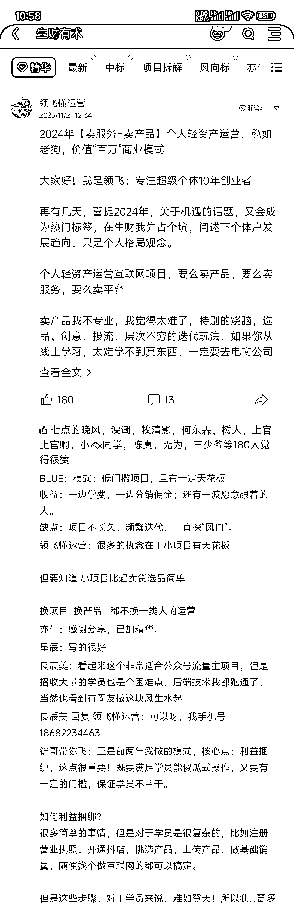
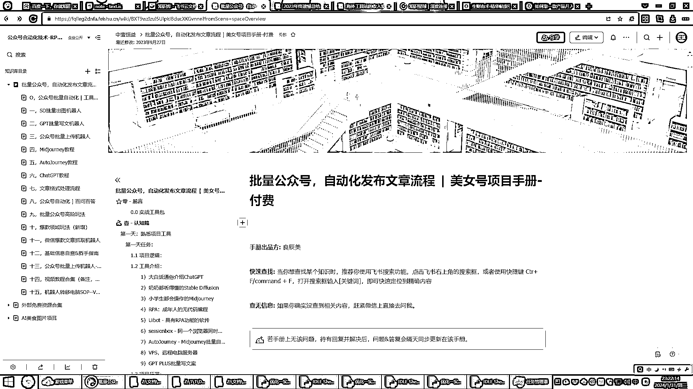
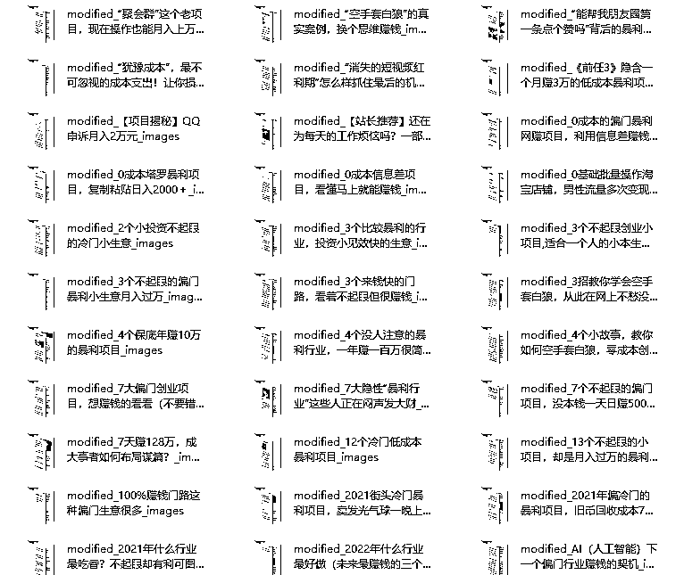
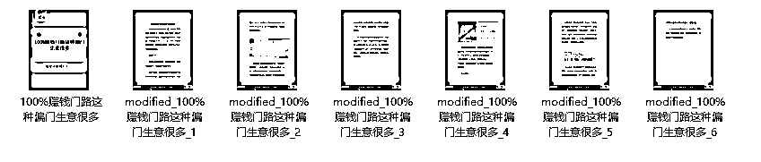
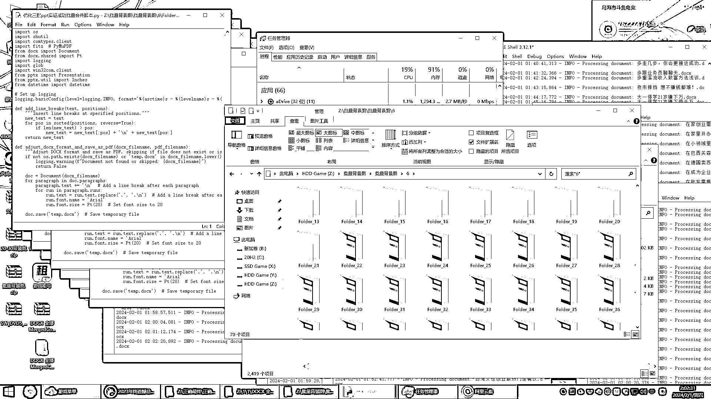

# 2023 年终遗憾总结：十天干了十个月的活

> 原文：[`www.yuque.com/for_lazy/thfiu8/uxcltposoyttvw6l`](https://www.yuque.com/for_lazy/thfiu8/uxcltposoyttvw6l)

## (47 赞)2023 年终遗憾总结：十天干了十个月的活

作者： 良辰美

日期：2024-02-01

大家好！我是良辰美！

这次分享的是批量产出图文过程，十天十台电脑可以做几十万个原创图文。

老财友都知道我，许久没写长文分享了，由于我今年全职带娃和伺候怀二胎的老婆，无法应对大家的回复；快过年了，我把妻娃送回了老家，也就有时间，出来走走，干点自己的事情。

年末因为和生财圈友@领飞得来的契机，那就认真写一篇年终总结。

对我而言算是完美收官，2024 又新增了几个业务，也许对大家有帮助，我的居家创业心得和规划。

**前言**

标题并非夸大，这十天 2024 年 01 月 25 日到 2024 年 02 月 03 日，我从深圳来到内蒙古，在生财有术圈友@领飞的工作室里，一个人干活的专注度，真相当于 2023 年大半年 6 个月的活。

没人打扰，简直不要太舒服，每天和@领飞吃内蒙的你牛羊肉，感觉也胖了十斤。

因为自从 2023 上半年，父母离开深圳之后，我们夫妻俩就全职带娃，我的日常就变成了：做饭带娃，做饭带娃，然后抽个空空工作两三个小时，随时候着小孩醒，晚上做完饭基本上到十一点，小孩哄睡着了才开始干活。

有时候忙就干通宵，次日就得补觉，整体平常一天工作的有效时间也就三五个小时，所以大部分时候效率都很低，可以说基本都没干啥吧。

**人生大事：一胎二胎**

我是 97 后，一线城市里面的同龄人，几乎没有多少像我这样“早婚早育”，我一直开玩笑说：我是先娶妻生子，再发展事业，绝对配合国家号召，而且早早完成任务。

我一直都是随缘，没想到这两年从婚姻到二胎，速度真挺快的， 朋友都说一个娃都忙不过来了，俩娃可咋办！确实难办，但是小孩有个伴也好，也就这两年。

对，我 2022 年喜当爹，2024 年即将迎来二胎，我这办事效率绝对杠杠的！三五年内，八九不离十都是和小孩子的屎尿臭屁过，但更多日子里确实很开心，虽然我的事业有些耽搁，但是愿意倾注一生给予全部美好。

**通宵工作：努力干活**

我一贯的座右铭：废寝忘食的清教徒，无可救药的乐观派。

因为我经常干通宵，不管是以往大学期间，乐此不疲的读书和学英语，还是现在求生存发展，自研 AI 和 GPT 的应用；我都热衷于专注，效率至上。

但是我并没有发现财富因此增长，反而是意识到，以往许多选择和决策充满了遗憾，长期主义的方向真的很重要。

**我现在的业务模型**

一、亚马逊&海外工具

1、经验与教训

23 年与我算是减少亏损的一年，这两年创业合伙中踩了不少坑，很久才算缓了过来，也算是吸取到很多经验和教训。

我从事 amz 卖家工作，从上班到单干与四年了，但是并没有实质的增长，所以也一直这在反思，个人缺乏财务&情商&总结意识，接下来计划杭州待一段时间，因为感觉到跟圈友一起工作让我效率飞升，也许十天还能顶半年。

2、好奇与尝试

我在八月底通宵完成了这篇文档，但是很遗憾后面一直没有推进工作（原因大家都知道了），[海外工具站的收入案例合集整理过程分享：1000 个以上分享真实收入的产品和服务 [MRR in Twitter&more] -付费](https://fqlleg2dnfa.feishu.cn/wiki/FfKYw5PYmil3SokojBpcxaSVnrb)

接下来我会继续推荐，也是尽可能找到相关行业的圈友，到办公室拜访请教交流。

二、公众号爆文批量自动化

公众号+RPA 写了份训练营手册，发现“批量自动化”这件事提起了我的热情，之后就用 Uibot 写各种机器人。然后我就注册了几个公众号，把自动化结果都验证了一遍，上面说到我现在居家的情况，这种赚钱方式还是比较舒服的，一天花 2 个小时，就能把日后 7 天的活自动化运行。

下面一些干货 SOP，大家可以参考下，绝对有价值。

1、批量抓取

[十一，微信爆款文章抓取机器人](https://fqlleg2dnfa.feishu.cn/wiki/EdMRwbTXni9Ynmk7PmocfEtpnAg)

2、自动化洗稿

[二，GPT 批量写文机器人](https://fqlleg2dnfa.feishu.cn/wiki/WbDowdjoJiAdJNksm30cHi01nbr)

3、自动化上传

[三，公众号批量上传机器人](https://fqlleg2dnfa.feishu.cn/wiki/GFAowodVsi9lUOkaDExcwh7UnNz)

[十三，公众号批量上传机器人-微小宝版本](https://fqlleg2dnfa.feishu.cn/wiki/PDMPwmodaie8j7kdrNuc067bnKd)

上面技术我卖了不少相应的服务，对于我来说，当下技术赚钱，是我最大的优势；又对于知识付费而言，技术是可以迭代的，也就解决了知识付费最大的难题“复购率”和“长期服务”。

其中一个圈友学习之后，找到我协助打造了“公众号爆文”的工作室，他现在一个人管理 10 台电脑，几百个矩阵账号，差不多实现了月入 5-10 万。

我为什么来到内蒙，【超级个体户】也许是近两年“屎尿臭屁过日子”最好的方式，即兼顾了照顾家庭，又能满足我日常的开销，能合作就合作，不能合作就出售，可能 2 年的积累，我精力自由了之后，就是我事业的真正起飞。

三、批量自动化技术

这是我重点要说的事情，我一直在研究和应用 Python，也因为 Chatgpt 写了各种脚本，批量完成了很多图片处理工作。

1、RPA+webscraper

这些都是纯粹自学自用，各种插件软件，有需要就研究一下，上手很快。生财也有相应的资料，你想技术赚钱，值得去学。

2、图文批量脚本开发

适用于小红书、小绿书、抖快视频号图文，以及图文合成视频形式的分享，大家都是搞自媒体的人，这里也都知道，要么精细内容以质量为王，要么批量矩阵以数量为王。

质量和数量，要同时兼顾，这就要看操盘手的能力，但不管怎么样，工具和技术加持一定是赋能；这也就是我为什么要在技术赚钱深耕的原因，内容太卷了，“卷”也就代表着更多的机会。

我很羡慕生财的一个圈友，他现在利用这门批量技术培训服务，实现了几百万的营收，这就是说明了市场的需求量。

3、实战批量 2 万个

上面说到来内蒙，由于@领飞给我提供了几百个账号矩阵，非常着急批量内容的产出，所以我们在这几天研发了各种批量技术，最为关键的是验证脚本速率和流畅。

我们用 2 万个 1000 字以上的长文进行测试，2 万个是数量，1000 字是含量；

第一步：1000 字以上转图文

做图文，一般没有这么多的字数，如果长图文运行流程，就留给选择更多，短小精干的文案，现在平台查重很严重，长文会更有利，当然长文能运行，短文也不再话下。

第二步：2 万个批量

这个比较吃电脑硬件，2 万数量也能考验脚本的流畅度，2 万个文案用一个图片底图即可，之后再换新底图，又是一套，调节下文案排版即可。

上面说到，我也可以批量采集文案，文案批量 GPT 转写，比起批量图文来说，多了几个环节，如果搭配起来，威力不可小觑。

第三步：原始批量

由于提前准备了 2 万个文案，我们用了 30 个底图模板，去网吧开了 10 台电脑，一天就批量产出了 50 万个图文包，每个图文包都是一个单独的文件，每个文件都是单独的一篇图文，使用起来会非常方便。

当然为了流程度，才用这么大的数据量，客户大多情况下，不会这样去做，个人一台电脑，一天跑出 1 万批量，内容不足之后，再重复流程就可以了。

（图一）

（图二）

（图三）

四、近期动向

本篇文章写于十天内熬的第四个通宵，所以才能干的了这么多活。两天后会去郑州，也是跟圈友一起再到山西，次日回来。

年后 3-4 月希望尽可能去杭州一阵子，也是跟一些圈友好好合作达成基本盘，之后就还是会长期在东莞&深圳，有想法沟通的可以约见面聊哇，或者瞅个机会参加同城聚会。

**【批量自动化】**是我明年的超级个体工作重心之一，因为这个市场需求量太大了，我会完善不同的功能，应用到各类领域中，通过此次的积累，服务更多的群体老板，技术赚钱这件事配合商业模式，也许就是我的基本盘，无论以后我再开发任何技术，都会水到渠成。

**最后：**提前给大家拜年了，欢迎有类似需求交流合作或者提出意见进步。

* * *

评论区：

婉儿婉儿 : 都看不了呢
良辰美 : 啥看不了
婉儿婉儿 : 飞书链接
良辰美 : 好像现在飞书链接必须进行组织认证才能公开分享
婉儿婉儿 : 是你设置了权限，我申请了
良辰美 : 好，刚看到，开放权限了
婉儿婉儿 : 压缩包下载不下来呢
良辰美 : 私信发你吧，具体我也不清楚[捂脸]

* * *