# 如何基于生财有术，构建可以复利终生的个人商业知识体系

> 原文：[`www.yuque.com/for_lazy/thfiu8/ongtg8qqggzd2cgp`](https://www.yuque.com/for_lazy/thfiu8/ongtg8qqggzd2cgp)

## (48 赞)如何基于生财有术，构建可以复利终生的个人商业知识体系

作者： 徐宿

日期：2024-02-02

生财有术是一个以「赚钱」为主题的内容社群，这里有各行各业成千上万篇教人如何赚钱的文章。

但可惜由于不同分享者的写作风格和阶段不同，导致很多新手朋友在阅读信息的时候并不容易抓重点、看本质。

虽然我们说，赚钱这种事，就是去吸收别人散落的面包屑，然后逐渐还原某些项目赚钱的流程和拼图，但具体怎么去吸收面包屑，才能真正的形成自己的赚钱知识体系，目前还没看到很底层的系统分享。

我自 2020 年加入生财有术社群，一直在尝试帮大家提炼出这么一套方法论，3 年来累计写了 13 篇长文章逐步探索：

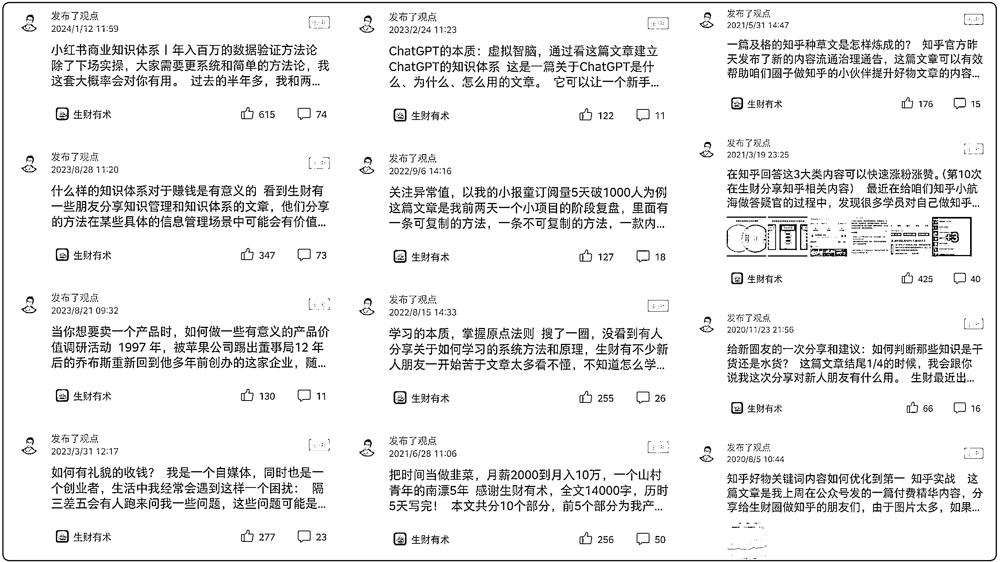

今天，基于过去这些文章中挖掘生财信息和实践赚钱心得，我把我是怎么基于生财有术提炼商业知识体系的方法论，分享给大家。

这篇文章中教的方法可复制性极强，所有生财圈友都可以用来构建自己的知识体系。

文章大概分为 7 个模块，目录如下：

**1、成事的本质**

**2、赚钱的本质**

**3、生财有术的价值**

**4、知识体系的本质**

**5、构建个人商业体系的方法**

**6、验证商业知识体系的方法**

**7、地图不等于疆域**

## 1、成事的本质：凑齐因果

我们要赚钱，就要做事，想要做事的成功率高，就要知道这个世界的一条基本运行规则：因果定律。

所谓因果定律，就是说一件事情的发生必然是有另一件事导致的。

比如你之所以能看到我的这篇文章，是因为我花了时间耐心编辑发布到了生财社群，所以你才能看到。

画个草图让你理解：

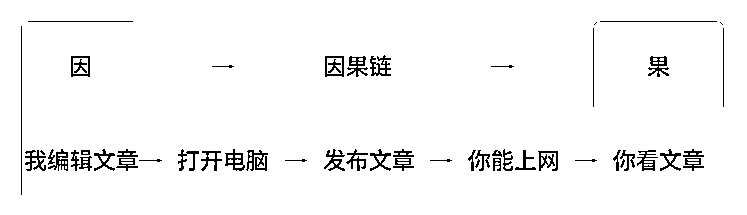

在这件事中，「我的发布」是原因，「你看到内容」是结果，而从我发布内容，到你看到我的内容整个事件的过程经历了一系列因果，叫做「**因果链**」。

再比如，我在[《小红书商业知识体系》](https://t.zsxq.com/16dLt9N1O)一文中展示过，如果你想持续生产出爆款笔记，那么你需要研究明白爆款内容的因果链是什么样的：

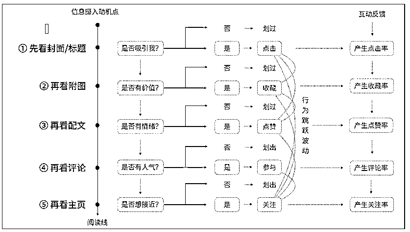

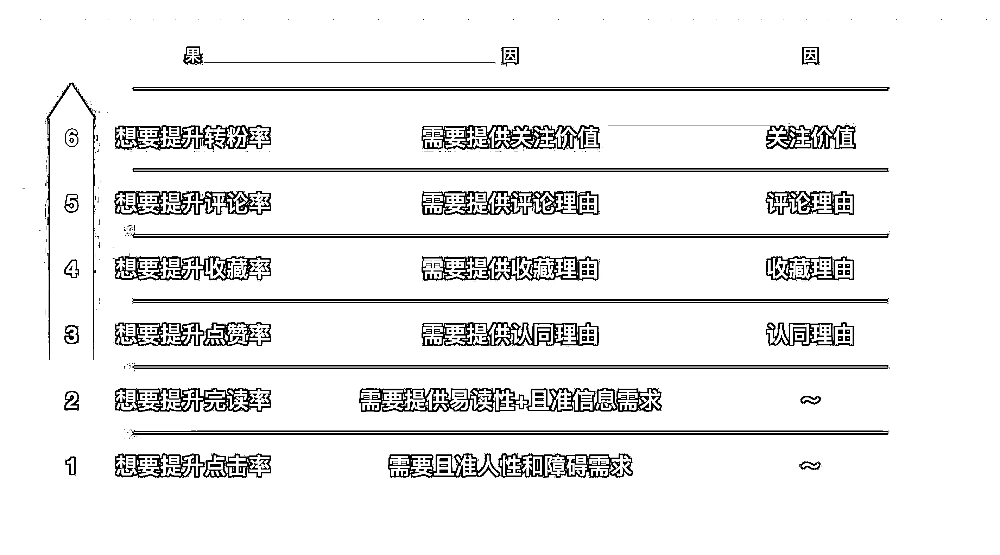

基于这两张图，你会知道，爆款笔记发生的因果链大概是下面这样的：

因为封面切中了他的信息获取需求，所以他点击封面↓

因为内容很有价值，所以他通篇读完↓

因为一下子看不完，所以他得收藏起来↓

因为很有共鸣，所以得点个赞↓

因为还有一些因为，所以他要在评论区留言↓

因为感觉你有价值，所以点个关注↓

因为你卖某个东西，所以他付费购买，你就赚到了钱↓

于是你可以理解，我们这个世界就是被因果机制统治的，人的一切行为的发生都是有原因的，因果这是这个宇宙的一种基本运行机制，不以人的意志为转移。

那么，当你理解了这个定律，你就知道想要做成一些事情，必须要凑齐那件事的因果，简单来讲：**你想要实现某种结果，那么你就要准备好使它发生的原因和条件，而如果你不想让他发生，你就尽力不让原因出现**。

举个例子，如果你想「怀孕」，那么你必然要和异性发生性行为，这个叫「凑齐因果」；否则，如果你不想要孩子，那么你就做好安全措施，或者别碰异性，这个叫「截断因果」。

因果支配这个世界，顺应因果，你就能持续成事，违逆因果，不合逻辑，你就做不成事，就这么简单。

## 2、赚钱的本质：凑齐交易条件

赚钱的本质就是和别人发生交易，交易作为这个世界万千事件中的一种，也必须遵守因果定律。

成交的第一原理非常简单，就是超价互换：

因：由于你给我的价值，明显高于我付出的成本

果：所以我愿意果断跟你交易

举个例子：

因：由于生财有术为圈友提供的价值远远高于门票

果：所以生财每年的续费率都很高

这里你要注意，虽然交易的底层逻辑很简单，可简单不是简陋！

人和人之间要发生交易，是需要前提条件的，比如你得有交易场所，你得有信任基础，你得有共识的语言沟通和共识的货币，假如你跟村里的老年人交易比特币，人家就不可能和你交易。

之所以，我们赚钱比较难，是因为这个世界上各种因素在阻碍我们进行交易。

比如小红书不允许你直接在平台上转账，由于它没有这个功能支持，那你想要在小红书赚钱，就必须在人家平台上开店铺、或者把人引流到微信做生意。

这一切的阻碍，就是导致我们赚不到钱的原因，改变或者凑齐这些原因，我们就能赚到钱！从这个角度讲，赚钱可以变成一个 100%的事情！

## **3、生财有术的价值：确定性**

赚钱最大的障碍在于，很多事情你不知道做了以后有没有果，在外面，我们根本不知道一件事和另外一件事到底有没有因果关系，如果你不确定有因果关系，你就很难有动力去挖掘这个事情中的因果！

为什么我说，每个人可以基于生财有术来构建自己的商业知识体系？

因为生财有术中存在着大量的确定性的结果案例，这是生财有术的核心价值之一。

亦仁在 23 年 8 月份说过一段话：

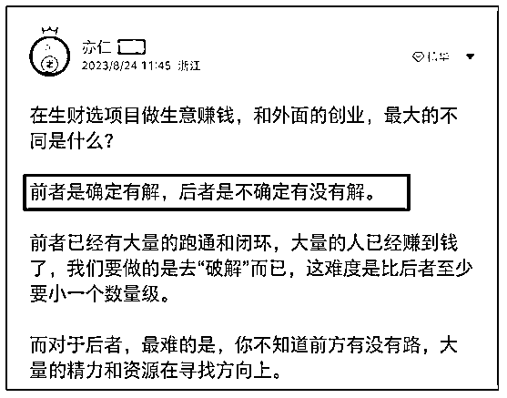

他这段话的意思其实很明确，「**有解**」就是**确定有因果**！

当一个事情确定有因果，那么你需要做的就是去挖掘、分析出每一个环节的关键因果，持续落实关键原因和条件，获得结果就是个必然的事情，赚钱就会成为一个必然的事情。

## 4、知识体系的本质

很多人对「构建知识体系」这个能力最大的误解，是认为这个能力是用来帮大家做知识管理、画思维导图的，似乎看起来和赚钱没有什么关系，因为大家在日常的互联网信息消费中，看到的都是各种导图笔记，整理名人名言等等

实际上，这完全是被带偏了，大家一直在被一种低维勤奋创造的成果物欺诈。

真正的知识体系，虽然也需要以导图形式来展示，但他更侧重对客观世界「**事物发生的因果关系**」做提炼和梳理。

举个例子：

拿「挖掘需求」来说，我们做生意最重要的是理解用户的需求，那么如果你想要长久的理解用户需求，就必须对人这个物种是怎么产生需求的，进行因果层面的认识。

经过我在生财和其他地方的信息搜集提炼，包括自己的商业实践，我对人类需求的产生机制有了一个比较系统的认识：

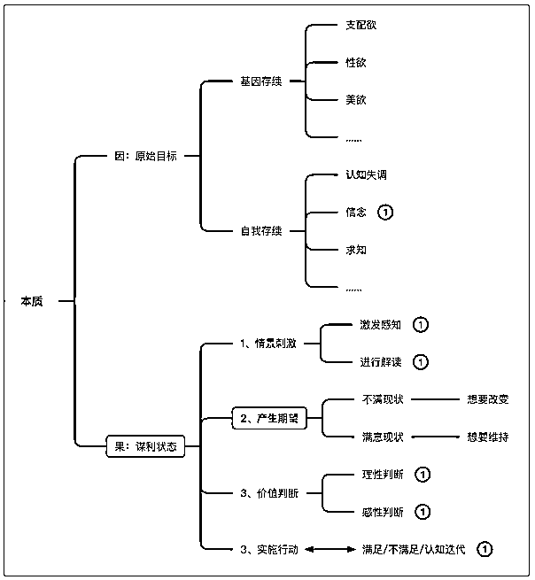

简单来讲，人之所以有需求，是因为人类先天就被设计出了一些**原始的目标**，比如基因层面的生存目标和繁衍目标，再比如心理层面的自我存在目标。

由于这些原始目标的存在，每当有情景刺激发生，我们就会进入一种为自己「**谋利的状态**」，然后基于不同的情景刺激产生不同的需求，如果具备条件，我们就会去实施行动来满足自己的需求。

如上，就是关于人类的「需求机制」运行的大体因果逻辑，这是底层的世界观。

当我们，了解了这个关于需求的底层世界观以后，我们就可以基于这个世界观去设计相应的方法论来达到我们的目的，比如下面是我创造的方法论。

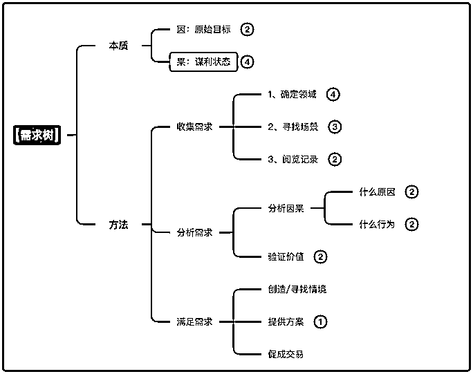

每个人都可以有自己的方法论，但你的方法论必须基于真实世界的客观运行规则来设计，这样才能在落地执行，改变世界的时候行之有效。

通过上面这个例子，你会发现，基于「因果定律」来研究一件事的世界观，再**基于世界观去设计方法论，这样构建的知识体系是可以迁移在你日常生活的各个领域的，这是它得以复利的核心原因**。

再举个我自己赚钱的例子，有一些圈友应该看过我的这两篇文章：

[《小红书商业知识体系|百万数据验证的方法论》](https://t.zsxq.com/16UhsPNEE)

[《什么样的知识体系对于赚钱是有帮助的》](https://t.zsxq.com/16YuPRpyw)

在这两篇文章中，我把我自己的小红书商业知识体系进行过基本展示：

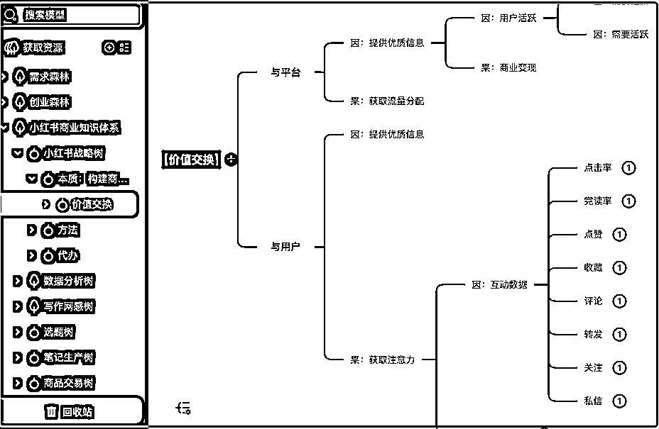

你会发现它的形成，也是基于因果定律、世界观、方法论这些框架来构建的，由于符合客观真实世界的运行规则，它得以帮助我在小红书短时间卖 100 万的货，而且这套方法论可以迁移到任何平台。

《财富流》中有这么一段话：**所有成功的企业家或投资者，在遭遇生意失败后，都能东山再起，因为他们掌握着了解他人需求并提供解决方案的能力。他们知道这种能力是人类迄今为止最佳的工作保障**。

我想要分享的知识体系构建方法， 就是这样的一种方法，挖掘事物因果，寻找真实需求，并创造解决方案的能力。

如上，**所谓知识体系，本质就是基于真实世界因果逻辑构建的思维投影，它们会像一张张等比例地图一样，指引你寻找和创造出自己的财富**。

## 5、构建个人商业知识体系的方法

基于 1-4 部分的世界观分享，当你想要构建专属于你的商业知识体系时，利用生财有术这座宝库，你可以通过以下几个步骤来逐步构建↓

#### 第一步：外接大脑

首先你得有一个能帮你生物大脑减负的工具。

它可以代替你的人脑储存知识，不论是笔记本、还是思维导图、或者云笔记软件，比如飞书、幕布、语雀等等，你得有一个长期沉淀信息，让你的大脑可以放松下来专注思考事物因果和本质的地方。

你不能总是靠你的脑子来记忆东西，爱因斯坦老爷子说过，**人类的大脑不是用来记忆的，而是用来思考的**。

记忆，是关于储存的能力；思考，是关于计算和排列的能力。

#### 第二步：确定主题

你需要确定一个你想构建的领域主题，比如你想构建小红书的商业知识体系，或者抖音和视频号等等。

确定主题的同时，你需要搜集优质的真实的信息素材，生财有术作为一个「有解」的赚钱宝库，是你最好的起点，你可以通过精华帖索引工具来搜集：

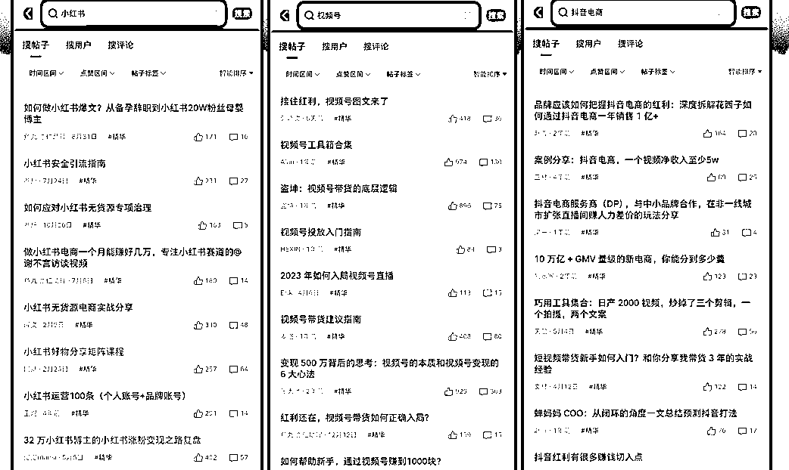

有了这些优质的信息源，就可以开始去一篇篇的挖金子。

#### 第三步：捕捉信息

虽然生财有术的大部分精华文章都看起来很有价值，但你得知道，价值并不体现在他们的整篇文章，收藏和学习整篇文章是没用的。

亦仁之所以给 1 篇文章加精华，很大一个原因是，在这里分享信息的最小单位是「1 篇文章」，他总不能只给半篇文章加精华对吧。

但很多时候，一篇文章中真正有价值的信息就那么几条，其余的都是一些情绪渲染和连贯词句，毫无营养。

我教你捕捉信息的标准和方法叫做：**有感就捕、五马分尸**

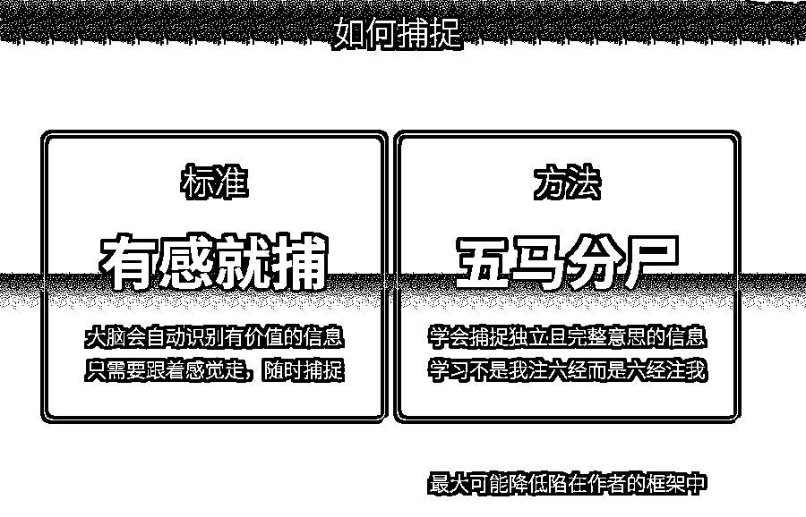

在很多精华文章中，有些信息一个段落可能会表达超 3～10 个意思，**你需要耐心将它们一句句拆分开来去独立捕捉，没有价值的信息，都要果断舍弃**。

为什么要这样？

因为不这样，你无法进行后面的分析，无法判断哪句话是事实，哪句话是他自己因为做成了事，偷懒脑补进去的错误逻辑。

比如下面这段话：

> 表面上看起来，这段话整体是在讲小红书流量的构成，似乎就 1 个意思。但实际上它里面可以细分 6~7 个意思：
> 
> 一个正常的小红书账号流量主要来源是：70%推荐；30%搜索 (商品搜索、笔记搜索)。推荐流量是指：直接靠系统的推荐机制让用户看到你。这种流量模式中，你的笔记只要带上商品，一旦笔记成为热门，很容易爆单 (哪怕是纯铺量也能出单，前提满足是几千以上笔记数和多店同时操作)。搜索流量是指：用户通过小红书搜索框搜到你的笔记。这种模式下，由于是用户主动搜索进来的，转化率很高，基本是有强烈需求的，一旦被笔记种草就会直接下单。
> 
> 你要像庖丁解牛一样，把一整段话拆分成一个个独立意思的知识碎片来进行理解：
> 
> 1.  ~~一个正常的小红书账号流量主要来源是：70%推荐；30%搜索 (商品搜索、笔记搜索)。~~
> 
> 2.  推荐流量是指：直接靠系统的推荐机制让用户看到你。
> 
> 3.  这种流量模式中，你的笔记只要带上商品，一旦笔记成为热门，很容易爆单。
> 
> 4.  ~~(哪怕是纯铺量也能出单，前提满足是几千以上笔记数和多店同时操作)。~~
> 
> 5.  搜索流量是指：用户通过小红书搜索框搜到你的笔记。
> 
> 6.  这种模式下，由于是用户主动搜索进来的，转化率很高。基本是有强烈需求的，一旦被笔记种草就会直接下单。
> 
> 拆分开，你就会知道，他的有些信息其实都是自己补充的，不一定是真实的。
> 
> 你只有这样捕捉信息，在后续思考的时候才能理解每句话中包含的各种关系，而**区分清楚知识之间的关系，是让你认识真实世界最重要的事情**！
> 
> #### 第四步：思考价值
> 
> 如何判断你捕捉到的知识到底有什么价值？
> 
> 这一步我教你的方法叫做：**价值三思**
> 
> 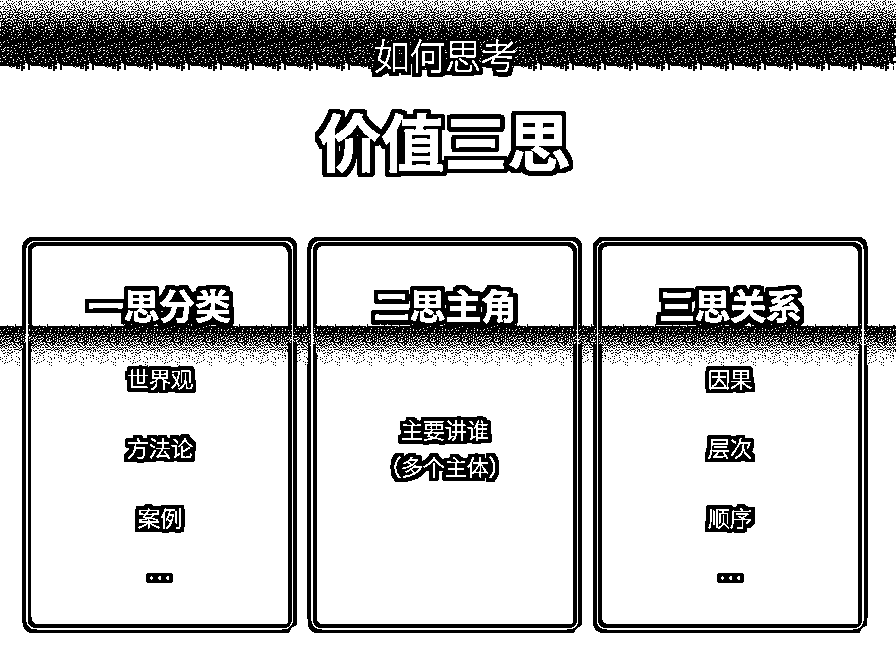
> 
> 知识是真实世界的缩影，得益于语言的出现，我们可以通过一些方式去高效理解知识。
> 
> 价值三思，就是利用一套语言框架，从三个角度去思考这个知识的价值，只有把这三层思考完，你才能对这个知识在某套系统中的位置有比较清晰的认知。
> 
> ##### 一思分类
> 
> 从知识的用途来说，这个世界上大多数知识都可以分为以下三类：
> 
> 1.  **世界观类（Paradigms）**：所谓世界观，就是人类对于这个世界的各种事物的认识、定义、价值判断，当一个内容中出现**【某某某是 xxx】【原则】【本质】【分类】【意义】【价值】【现象】【表象】【为什么】【是什么】**等等词语时，它基本就是在讲世界观方面的知识，这种知识最主要的价值是：**帮你更好的认识世界**。
> 
> 2.  **方法论类（Methodologies）**：所谓方法论，是人类基于各自的世界观研究出改变这个世界的方法类知识，当一个内容中出现**【做法】【步骤】【流程】【方法】【顺序】【方案】【策略】**等等词语时，它基本就是在讲方法论方面的知识，这种知识最主要的价值是：**帮你更高效的改变世界**。
> 
> 3.  **案例类（Cases）**：所谓案例，就是那些可以让你更好的理解某些世界观和方法论的故事或者例子，是具体的实例、事例，用来说明某些概念、原理或方法具体怎么应用。当一个内容中出现**【举个例子】【假设】【比如】【例如】【故事】【就像】【类似】**等等词语时，它基本就是在讲案例，这种知识最主要的价值是：**帮你更好的理解世界观和方法论**。
> 
> 如果你捕捉的某个知识碎片，不属于以上 3 个类型中的任何一种，那么它的价值大概率不高，可以果断丢弃。
> 
> ##### 二思主体
> 
> 每个人说的每句话，都有核心关键词，思考一句话的主体，就是去思考他这句话主要的关键词是什么，比如亦仁说：在生财有术找赚钱项目和在外面找赚钱项目的区别是，这里面的很多项目确定「有解」，外面的不确定。
> 
> 这句话中，最主要的两个关键词是：赚钱、有解。
> 
> ##### **三思关系**
> 
> 确定了关键词，就要思考关键词和关键词之间有什么关系。
> 
> 知识之间的关系主要有 3 类：**因果关系（核心）、层次关系、次序关系**。
> 
> 还是拿亦仁说的那句话来做案例，「赚钱概率」和「有解」之间有什么关系呢？
> 
> 很明显是因果关系，「有解」=「项目是经过验证确定可以走通的」：
> 
> 因：有人确实走通了
> 
> 果：我去做赚钱概率也高
> 
> 判断知识之间的关系的方法，我画了一张导图，供你学习：
> 
> 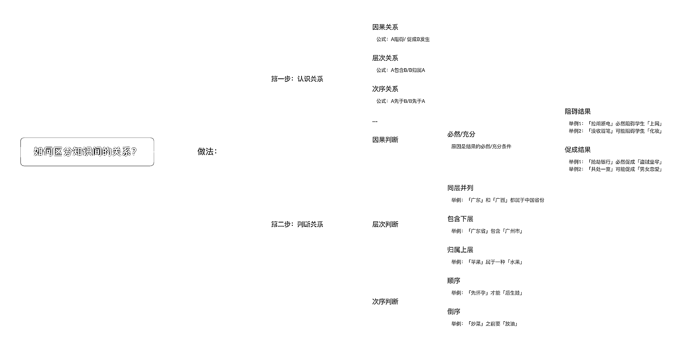
> 
> #### **第五步：压缩词语**
> 
> 我在[《学习的本质》](https://t.zsxq.com/16F201BVg)一文中说过，由于人类大脑单次记忆成本有限（每次只能最多记住 4 个字符），你需要把比较长的句子压缩成 2~5 个字以内的词，这种方法在记忆脑科学中叫做「组块」。
> 
> 由于知识具有收敛性，各种浅层知识总是可以被收敛到底层的几个第一原理知识中，我们最终需要记忆的都是一些非常简单的知识模型，这也是为什么中国很多成语得以广为流传的原因。
> 
> #### **第六步：纳入体系**
> 
> 从捕捉信息、到思考价值、再到压缩词语，这几个过程下来，你就完成了一个有价值的知识的提炼，接下来需要做的就是把这个词和相关的知识碎片填入你的知识体系：
> 
> 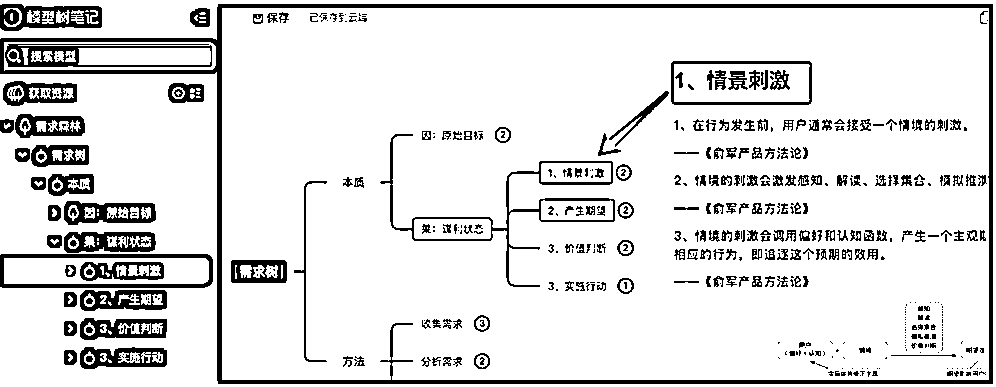
> 
> 在持续的思考和提炼过程中，你会把外界的、别人的知识，内化成自己的知识，形成自己的知识体系。
> 
> 比如我的很多知识体系都是按照这样的方法构建出来的：
> 
> 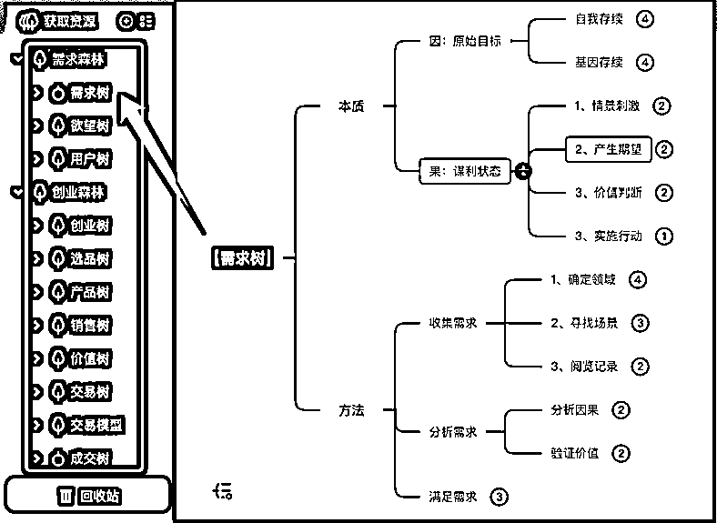
> 
> **当你拥有了这种分析事物之间因果关系的能力，随着你的知识体系越来越完善，你去做事情的成功概率就会越来越大。**
> 
> 随着你的成功次数越来越多，你改变世界的能力会越来越强，赚钱就会变成一个顺其自然的事情。
> 
> ## 6、如何验证知识体系的价值？
> 
> 关于如何验证某些事物的价值，我经常用乔布斯的例子来解释：
> 
> 1997 年，被苹果公司踢出董事局 12 年后的乔布斯重新回到他多年前创办的这家企业，随后开始了他一系列大刀阔斧的改革，一步步把苹果公司推向了这个世纪当之无愧的科创公司王座。
> 
> 遍读乔布斯过往大部分公开演讲和书籍，其中关于「如何判断产品价值」这个话题下最广为流传的是下面这段话：
> 
> Some people say give the customers what they want, but that's not my approach. Our job is to figure out what they're going to want before they do. I think Henry Ford once said, "If I'd ask customers what they wanted, they would've told me a faster horse." People don't know what they want until you show it to them. That's why I never rely on market research. Our task is to read things that are not yet on the page.
> 
> 翻译一下，大概是说：
> 
> “有人说给客户他们想要的东西，但这不是我的做法。**我们的工作是在他们这样做之前弄清楚他们想要什么**。我记得亨利·福特曾经说过：“如果我问顾客他们想要什么，他们会告诉我一匹更快的马。”**人们不知道自己想要什么，直到你向他们展示为止**。这就是为什么我从不依赖市场研究。我们的任务是阅读页面上尚未出现的内容。”
> 
> 乔布斯的这段故事总结起来就一句话：**如果你想验证一件事，最直接有效的方法是去做**。
> 
> 比如如果你想验证你构建的知识体系是否确有奇效，你应该直接按照你构建的知识体系去做事，去赚钱！
> 
> 通过践行你的知识体系，通过实操，去产生真实的交易，你就会获得自然生长出来的自信。
> 
> ## 7、地图不等于疆域
> 
> 最后想要跟大家分享一个注意事项：知识只是真实世界的投影，知识不等于真实的世界。
> 
> 我们去掌握构建知识体系的能力，只是为了让执行的成功率变高，变准确。
> 
> 但如果你不执行，不去创造真实的成果物（信息、钱、物质），那构建再多知识体系也没有用，很多问题只有实操才能遇到。
> 
> ## **写这篇文章的两个目的：**
> 
> 一是基于上次在生财分享过[《什么样的知识体系对于赚钱是有意义的》](https://t.zsxq.com/16YuPRpyw)，当时有很多圈友留言说需要构建知识体系的方法，今天算是安排了一波，应该会对大家有帮助。
> 
> 二是我自己有「个人知识体系」和「商业知识体系」相关的培训业务，如果有圈友和老板需要掌握，可以基于这篇文章对我进行一个了解和链接。
> 
> 事实上，我的很多社会生存技能都是在生财学到的，老实说，对这个圈子我有一种特殊情感，每次有了一些新的好东西总想先分享到这里。
> 
> 最后仍然用那段话来结尾吧：
> 
> **所有成功的企业家或投资者，在遭遇生意失败后，都能东山再起，因为他们掌握着了解他人需求并提供解决方案的能力。他们知道这种能力是人类迄今为止最佳的工作保障**。
> 
> 我是徐宿，希望你早日掌握这套能力。
> 
> * * *
> 
> 评论区：
> 
> 暂无评论
> 
> 
> 
> * * *