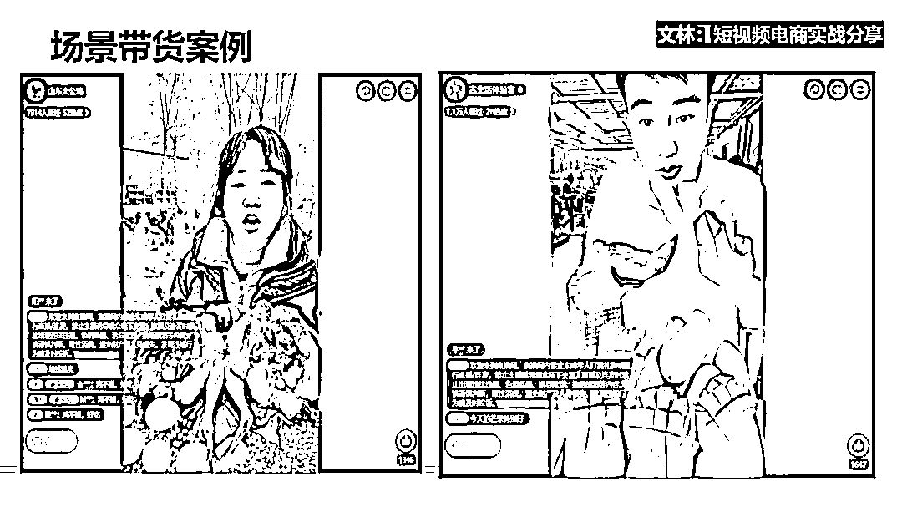
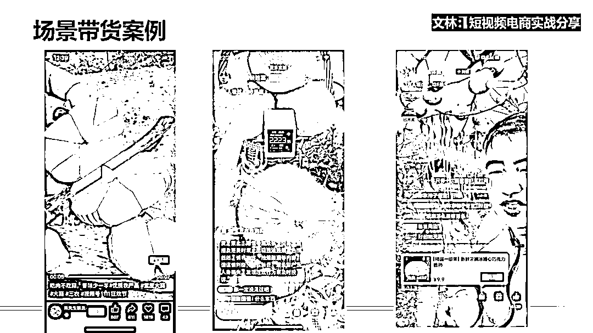

# 2024 年，抖音、视频号、小红书哪种短视频电商玩法更能赚到钱

> 原文：[`www.yuque.com/for_lazy/thfiu8/ghmmn8opbk80692g`](https://www.yuque.com/for_lazy/thfiu8/ghmmn8opbk80692g)

## (精华帖)(170 赞)2024 年，抖音、视频号、小红书哪种短视频电商玩法更能赚到钱

作者： 文林

日期：2024-02-02

生财的圈友们，大家好，我是生财 3 期老圈友文林，一直忙于短视频电商项目，很久没来冒泡，感谢咱们生财平台，转型做短视频这条路，就是受生财平台的启发。

2020 年 6 月在生财上看到一篇关于抖音电商的精华文章，受到启发后决定转型做抖音电商，经过努力，转型成功拿到了结果！转型过程去年在生财发了一篇文章，感兴趣的可以看一下这篇生财精华帖 [`t.zsxq.com/16tMb8QmW`](https://t.zsxq.com/16tMb8QmW)

今天，来和大家分享【2024 年，抖音、视频号、小红书哪种短视频电商玩法更能赚到钱？】.

**分享前先做自我介绍：**

我是文林，生财有术第一期抖音带货航海船长，腾讯视频号培训的特邀讲师、三年短视频电商实战者，擅长短视频电商选品，主业公司在做短视频达人带货账号，副业因为喜欢分享，享受分享的快乐，所以副业做一个分享者，带领圈友们在视频号、抖音上直出单金额破亿。

今晚我会跟大家分享，在短视频电商里面的踩坑经验，包括观察到的最新现象。主要从几个部分展开：

1、视频号、抖音、小红书的大盘和趋势

2、短视频电商的主流玩法

3、 0 到 1 短视频投流踩坑经历

4、普通人入局短视频电商的建议

# **一、大盘数据与未来趋势**

**（1）今年大盘**

首先，从大盘上来说，抖**音是 2 万亿左右，视频号的话是 2000 到 -3000 亿**。视频号去年是 1000 亿出头，今年是增长值翻了一番。

小红书的话，去年基本上没有听到风声，因为它去年基本上在内测阶段，今年开始放开，所以说今年是小红书电商的元年，有巨大的红利，不过我们现在也没有拿到太多数据，但预测是**百亿级别**。

**（2）大盘现状**

**1、平台侧：**

目前，视频号和小红书正在加速商业化进程，抖音一直在不断推广。视频号的月活跃用户已经超过 6 亿，小红书的月活跃用户达到了 2 亿，而抖音则达到了 9 亿。

可以看出，它们在用户规模上都是相当大的。虽然用户数量都属于同一级别，但为什么在电商方面，抖音的市值达到了 2 万亿，视频号达到了 2000 亿，而小红书只有百亿。

这是因为它们所处的发展阶段不同。抖音是最早开始涉足短视频电商变现的平台之一，当然还有快手，但由于快手的整体趋势正在下滑，我们暂时不考虑它。

23 年抖音尤其支持货架电商，这也是大家常听到的一个概念，比如商品卡。**商品卡的玩法**与传统的货架电商（如淘宝、京东）有所不同，除了利用搜索流量外，还利用达人视频中的商品链接来吸引用户点击。

商品卡就相当于视频下方的商品展示区域，用户可以在这里看到商品信息。这种流量玩法是与传统搜索电商不同的地方。此外，抖音还大力推广**本地生活**领域，这也带来了相当大的流量。

**2、流量侧：**

我有做抖音、视频号、小红书，也对这几个平台进行了观察，发现免费流量正在下降，尤其是在视频号和抖音上。

免费流量在下滑，付费流量在增加，这是整个平台的趋势。过去玩免费流量的人，如果一直坚持这条路的话，慢慢地就会被淘汰出局，他们的业绩也会下滑。

在这个过程中，我们作为一家公司也经历了从免费到付费的探索过程。

**（3）用户人群**

我们跨平台都会遇到一个问题，比如我从某个平台转到抖音，发现在抖音上卖货结果卖不动，整体数据和 ROI 都很差。后来我研究了一下，发现核心问题在于用户群体的差异。

视频号的主要用户群体是中老年人，22 年平均用户年龄是 50 岁，23 年已经下降到 45 岁，24 年预计会进一步下降到 35 岁。可以说，视频号的用户群体在不断扩大，并且趋向年轻化。在小红书上，主要是 90 后用户占比最多，占比达到 72%，而且用户群体主要是女性。

因此，在小红书上推出与女性相关的产品会更容易获得成功。而在抖音上，年轻人仍然是主要用户群体，虽然现在抖音已经涵盖了各个年龄段的群体，买东西的主要还是年轻人。

**（4）竞争激烈吗？好不好做？**

**1、新手赚钱成材率：小红书＞视频号＞抖音**

所谓的**成功率是指有 100 人参与某一个平台或项目，最终成功的人数有多少**。根据我的观察，包括与同行的交流，我认为今年来说，小红书的成功率高于视频号，而视频号的成功率又高于抖音。

为什么会这样呢？因为抖音目前非常热门，竞争非常激烈，因此机会也相对较多，但众所周知，抖音获取收入并不容易，所以挣钱的难度也较大。随着行业越来越倾向于专业化，如果你有某一方面的专业技能，直接选择一个平台进行运营，那么挣钱效率会更高。

**2、成熟团队赚钱效率：视频号＞抖音＞小红书**

对于成熟的团队来说，视频号的挣钱效率大于抖音，大于小红书。这一点可能会引起一些人的疑问。他们会问，小红书成材率这么高这么高，赚钱效率却这么低？

原因是，小红书今年才是它的电商元年，规则变化很多，而且说实话，小红书的市场份额较小。

因此，在规则变化较大且市场份额较小的情况下，像一些大的玩家，会**等盘子 GMV 超过 1000 亿级别的时候再进场，挣钱效率是最高的**。为什么说视频号赚钱效率大于抖音呢？

因为视频号目前的竞争程度远远小于抖音，所以挣钱效率较高，大概 2000 多亿的量级。这是针对成熟的团队而言的。

**3、竞争激烈度：小红书＜视频号＜抖音**

竞争激烈度是抖音最大，视频号次之，小红书最小。

**4、小红书、视频号、抖音各自竞争优势**

小红书的竞争优势在于**市场竞争较少**。

另外，最重要的一点是它能够实现高客单价销售。在小红书上，你可以销售几千块钱的商品，特别是一些与女性相关的产品，比如之前非常火爆的内衣，以及现在羽绒服等高客单价商品。

小红书目前处于商业化刚开始的阶段，其用户群主要是 90 后女性，她们的消费力很强。因此，在培养用户过程中，小红书的用户对价格的容忍度也相对较高，另外，小红书还可以打**私域玩法**。

视频号的优势在于盘子相对较大，同时**竞争也相对较小于抖音**。因此，总体来看，如果你做的是中老年人产品，做视频号的匹配度会很高。而如果你销售的是女性产品，那么选择使用小红书和抖音的匹配度会相对较高。

抖音的优势在于**平台规模较大，投放算法也比较精准**。

# 二、**短视频电商的主流玩法**

一提到短视频电商的主流玩法，我们就必须了解其中涉及的角色：商家、达人、消费者。

然而，消费者只是被触达的对象，因此主要的两个核心角色是达人和商家。换句话说，在这种情况下，商家会衍生出许多中间的角色，其中一个是招商团长。

此外，还有一些 KOC 分销的玩法，这属于比较小众的一种。还有大家所熟知的 MCN 机构和一些招商培训代运营服务商等角色。短视频电商的主流玩法都有哪些？分为商家端和渠道端（达人端）来说。

**（1）商家端**

包括了一些不同的特点，与传统电商平台相比，例如在淘宝上主要是通过搜索获得流量，还有可能存在淘宝客的角色；

而视频电商则主要依赖批量联系达人进行带货。另一种主流玩法是通过招商团长和 MCN 机构来赚取佣金，利用他们的力量批量联系达人，或通过其渠道帮助商家拿到更高的议价权。

另外，还存在商家自己进行短视频带货的玩法，以及抖音的商品卡玩法。

**（2）渠道端（达人端）**

首先要提及的是**直播带货**，它分为免费直播流和付费直播流。

此外，还有短视频带货这个玩法被很多人所忽略。实际上，**短视频带货**的投放流量比直播更加稳定。原因在于直播对主播的状态要求极高，一场直播可能在主播状态良好时场观很高，但如果状态不佳，投流效果就下来了。

但短视频来说，你一条素材生长好了之后是可以稳定成交的。

然后**图文带货**，我们从去年年底就已经在观察图文带货，那个时候只有内测资格。今年年初真正的才抖音才放开，图文带货红利是今年 3 月份到 9 月份的时候。

我们 3 月份测试，测到 4 月份开始爆发，一直接爆发到了差不多 9 月。那个时候是有免费流量的，但是图文带货对比短视频、直播来说门槛太低了，外面有很多培训机构带领了百万级别的宝妈、大学生来做图文带货。

所以导致图文带货的自然流量极度卷。我们内部的一个账号发现了一个情况，即当我们观察内部账号时，视频短视频的流量反而非常稳定。

在短视频之前，我们专门做图文内容，偶尔也会做一些短视频。这段时间内，图文内容在一个单独的账号中占据了 80%至 90%的比例，但后来发现整体收入比例降低了，反而是视频内容占据了 70%至 80%的比例。

关于达人带货有三种场景玩法

**（3）人带货**

人带货，就是**把个人经历、故事、工作过程拍写下来，把真字这个做到极致**。举个例子视频号有个案例叫赖家益，是一个三农博主，现在也是人大代表，通过视频号的红利跃迁。

小杨哥也是如此，相比于不熟悉的主播，有了人设的主播更能打动用户。

**2、货带人****货本身做到极致，视觉效果，具有信任背书**。

产品比较吸引人，主播本身不重要，重要的是货物本身，比如童装类的，就比较合适货带人的打法。你看到汉服的童装图，就会想起自己孩子穿上的样子。货带人本身和图文比较相似，最容易出单就两个类目：美食和服装。

因为这两个类目可以给到用户直接的效果，有时候视频展示反而没有图文的吸引力和转化率，像挤出水的橙子，会很形象的展示产品的优点，效果也比较好。

**3、场景带货**

场景带货是指**着重强调呈现特定场景**。

例如，在一个农场养鸡场景中，主播直接向观众推销农场的鸡，观众能够看到真实的场景，并且更容易相信所推销的产品。

主播会强调这些鸡是现杀的、散养的等特点，强调和其他商家提供的大批量工业化产品不同。通过这种方式，观众能够更好地理解产品，并且转化率会更高。

视频号的用户主要是中老年人群，他们更喜欢这种场景，因此可以与抖音等平台上的其他场景进行对比，发现在视频号上有许多精心布置的场景。

在视频号中，能够看到更多原汁原味的内容，比如农场和仓库等。这种内容能够吸引观众停留时间长，转化率也较高，这是因为中老年人更容易相信原汁原味的产品，包括相信产品的原产地等。

这是由人群的喜好决定的。还包括你在使用这个过程中的一个体验。

例如，一个主播可以直接展示采摘蘑菇的过程，这种场景可以是果园或者农家小院的感觉，包括背景和环境，这样的场景可以提高转化率。

你看到有人在视频号上销售菇，但实际上他们并不是在农民房里，而是在一个布景中，可能是在办公室里。我曾经去参观过**一些同行的直播间，发现实际上是在办公室里布置了果园这样的场景**。

另外除了有一些其他玩法，比如**招商团长**，也就是一些赚钱的机会。在抖音中，招商团长的利润空间从 3%到 10%（因为今年才开始，并不是太火爆），在视频号中则为 3%到 5%。

此外，还有 **MCN 机构和 IP 切片**（参考小杨哥、胡远行）的方式。

# 三、**抖音视频号投流经历和踩坑经验方法**

**（1）5 个新手投流认知误差**

想向大家分享我在从 0 开始创建抖音、视频号投流过程中的一些经验和教训。我刚开始做抖音是不投流的，当时**免费流是最香的**，提供的流量非常充足，曝光效果也好。

但这也**看你处于哪个阶段**，免费流对于新手投资成本相对较低，出了新手村就必须转向付费流。

但现在做视频号和抖音，我建议大家可以直接进入投放阶段。对于小红书，也可以进行投流，但需要根据类目选择。在今年很多类目仍然可以通过免费流获取大量流量。

另外，我以为投流门槛很高，但现在即使是 100 块钱也可以投放了。投流所需的技能并不是特别专业，因为现在平台相当智能，在抖音和视频号上都可以实现傻瓜式操作，而且虽然算法还没有那么精准，但已经相当智能化了。

因此，**即使没有专业的投手，也可以做得很好**。

我最初三个月都是亏的，后面才逐渐赚回来。最初我在投放短视频时毫无经验，最开始只投放了一个账号，发布了一条视频，后来我发现应该去**投矩阵**。

这是我在踩坑方面的经验。

当时跟做抖音做得比较成功的朋友交流，问他们是怎么做的，他告诉我主要是投流。于是我又试了几次，最后成功了，成功后发现很有趣的是，当时我试了一个点，就是这个过程可以与大家分享。

在抖音上，一开始我是投了一条美妆拿到正反馈的，刚开始投流美妆赚到了钱，但是后面发现投放越多，越赚不到钱。为什么呢？因为美妆市场竞争激烈，美妆投流达到了 1:0.8 的比例，但是很多品牌还是在投放。

为什么呢？因为他们有复购，而且有一定的忠实度，1:0.8 指的是投入 100 万，能够带来 80 万的销售额，还未扣除退货等情况。

很多品牌都在亏本投放。因为是美妆产品，他们的利润并不是立竿见影的，他们赚的是后期的钱，还有一些是通过资本融资赚的钱。当我们的美妆产品卖不动时，我**开始卖其他类目**，取得了成功，后来就越来越顺利。现在来说，我们前年和去年主要以免费流为主，从 22 年开始尝试付费流，现在主要以付费流为主。

**（2）投流 ROI 计算方法**

接下来主要是针对达人账号的，因为现在我们做的是达人账号的模式。我们的投放 ROI 计算公式实际的 ROI 与平台看到的 ROI 不一样。平台看到的 ROI，我称之为虚标的 ROI。

**真实的 ROI 是投放的成交金额乘以佣金率再乘以（1 减去 0.1 的服务费）**。这里不会是 10%的服务费，当然这个方法可以通过线下结算来操作，但很多商家不支持线下结算或者现在不方便做，所以很多情况下是不存在的。

所以实**际上还要考虑成交退货率，再除以投放金额，这才是真实的 ROI**。

比如做服装类目的话，很多伙伴 ROI 投放到 5-6，结果退货率 50%-60%，这时就很伤。有些 ROI 投放到了三的时候，特别是女装，你投放到 3，是能够赚钱的，但是女装的退货率却高达百分之五六十，这样一算就是亏的。

举例子，如果投放了 100 万，成交金额是 400 万，抖音后台显示是 ROI 为 4 的话，真实的 ROI 是 400 万乘以 40%的佣金，假设佣金是 40%，平台的服务费被收了 0.1，就是乘以 0.9，再乘以退货率 10%，然后再除以 100 万，这就是大概的情况。

投流工具的话，抖音主要是投千川，视频号跑量的话主要是 ADQ。

# 四、普通人现在**入局短视频电商的建议**

目前短视频电商已经开始越来越卷了，对于普通人来说没有像之前那么容易赚钱，但是对比其他行业来说，短视频电商依然是一个相对不错的机会。

如果新手现在想要入局的建议，做为在短视频电商上踩坑 3 年的过来人，给小小的 3 个小建议：

**（1）蓝海平台：**

抖音很卷，但是视频号小红书相对没有那么卷，尤其是小红书，24 年小红书电商机会很大，最近身边爆单的新手，主要就是小红书平台。

**（2）蓝海玩法：**

因为原创实拍很难，所以之前很多人都是靠搬运和混剪赚钱，但是目前大平台已经不缺这些混剪的内容了，一直在一线实战的我们已经发现单纯混剪已经很难获得大的流量了，我们从去年开始，就已经在实拍了，已经也验证这条路是对的，我们目前已经转型到实拍为主了。

但是对于新手来说，实拍很痛苦，一条正确但是很难的路，新手的话，一开始可以先混剪测品开始，成功后再去实拍。

**（3）蓝海类目**

**战略上，最好是找一个打得过的竞争对手，集中精力去攻打拿下。21 年我刚开始做抖音时，**我是挑选一个蓝海品，这个蓝海品是五金工具。

我把抖音上 20 个大的类目，拆分成二级类目和三级类目，最后找到了五金工具这个品，看了下同行，发现应该打得过。

五金这个类目对我转型去打更大的类目，积累了很大的信心。

**战术上，直接去找对标的账号去抄**，互联网上就离不开复制和复刻，对于新手来说更加重要。我现在每天养成一个习惯，就是会去**拆解案例**，拆解案例这个习惯让我们超越了很多同行，做出来的视频更容易爆了。

我一开始也做原创，但数据不理想。对着同行复刻完，数据立马就上来了。但现在我们很多品跑到行业第一的时候，会去创新，会自己写原创的脚本和视频。

对于新手来说，看了同行的视频和直播间，你可以去拿这个去练手。放弃五金类目并不是不能挣钱，而是天花板比较低，五金类目的月营收差不多是千万级，头部的能做到 30%，也就 300 万左右的级别，利润还是没多少。

我们希望去冲刺大的类目，哪怕很卷，但天花板很高，空间也很大。

**新手可以先从图文开始**。虽然图文有些卷，但还是一个可以利用的渠道，你会在朋友圈发布图文内容，你就可以用图文进行测评，再加上视频的混剪来进行测评，最后再用图文加实拍的方式。

我们现在主要以短视频为主，图文只是在红利期时的辅助手段。我们逐渐将短视频实拍作为主要方式，而图文则作为辅助手段。这是我的一个进化过程，新手也可以参考过程开始入局。

# 五、赚钱的踩坑经验

很早前，关于如何赚钱，我一般都是，我脑海里有什么想法，有什么新主意，然后觉得不错，就觉得能赚钱。

比如读大学时觉得冰淇淋能赚钱，就和同学在大学学校旁边开了一个小的冰淇淋店，原以为能赚钱，结果亏的挺惨的，这算是我的第一次创业的小尝试，幻想开始，失败结束。

毕业后，又经历了几年的毒打，在赚钱、创业这条路，从失败几次到开始拿到结果，这中间开始总结出来一些经验。

**赚钱、创业就像打战，不是想当然的去打，而是先胜而后战！有比较大的胜率再决定去创业，去打这场战，才能更大概率拿到结果。**

**（1）想方法搜集各种赚钱的信息。**

比如在抖音、视频号快手等短视频赛道赚钱的话，那么必须就要先搜集赚钱的信息，这里要郑重提醒大家的是。

最重要的是保证信息的靠谱程度，很多信息的来源，别人自己没有实战过，没有验证过，纯为了割韭菜而放出来的信息，或者为了避免竞争，放出来假信息也有。赚钱的信息真真假假

**（2）学会辨别赚钱信息的真假。**

辨别信息我一般采取两个方法，一个找靠谱的平台，比如我喜欢看生财的内容就是生财的内容比较靠谱，然后去找靠谱的人，人靠谱，信息质量也高，另外一个就是找到一手信息。

**一手的赚钱信息很难获得，但是有一个好的方法，就是找到对标账号，比如我做短视频带货，首先第一步就是找到好的短视频赚钱案例，短视频赚钱案例就是一手的信息，因为这个就是明牌信息！**

拿到了靠谱的赚钱信息后，第三步就是：要分析适不适合自己干，自己能否复制，比如薇娅、李佳琦很赚钱，但是咱们能否复制呢？其实真去实战，就会发现复制他们这种超级 ip 很难，普通人很难复制得了超级 ip。

**（3）行动去验证。**

万想不如一干，直接干了，才能得到答案，才能拿到结果！

在干的过程中，我们会发现很多困难，很多问题，这个时候最需要的就是耐力了，哪怕选对了方向，但是没有耐力坚持下去的话，也是挖不到金矿的。

送大家一句话，想都是问题，干才能赚钱。

最后感谢生财平台、感谢亦仁哥、涛哥、杨爽、静伟、鱼丸等伙伴的帮助！

希望我的分享对你有帮助，能让你在抖音、视频号、小红书等短视频电商平台，少踩一些坑，多赚一些钱，祝你 2024 财富自由，精神自由。

**END**

* * *

评论区：

暂无评论

* * *