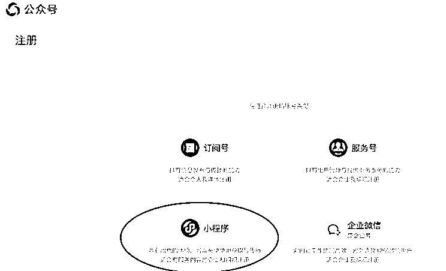
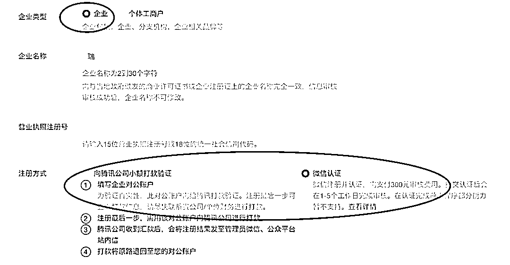
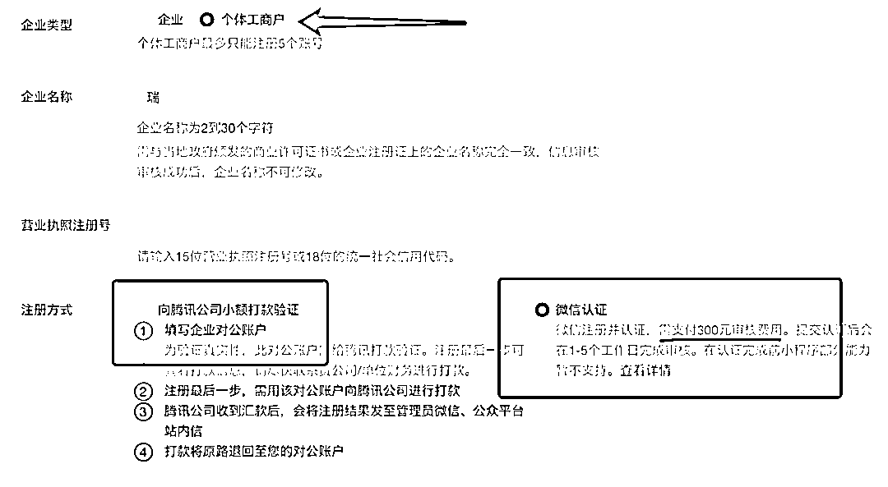
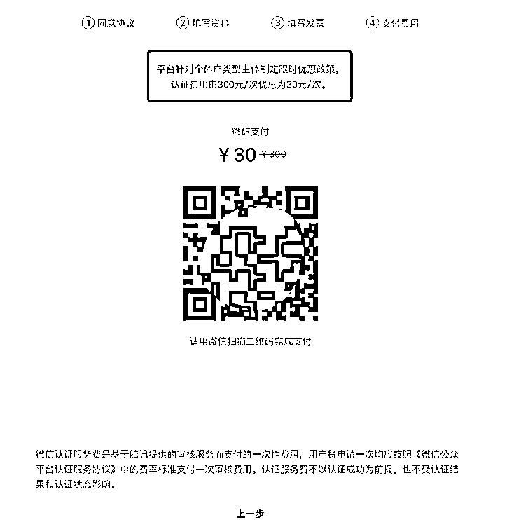
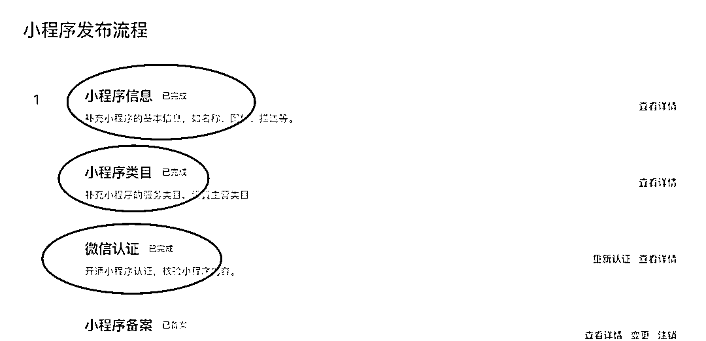
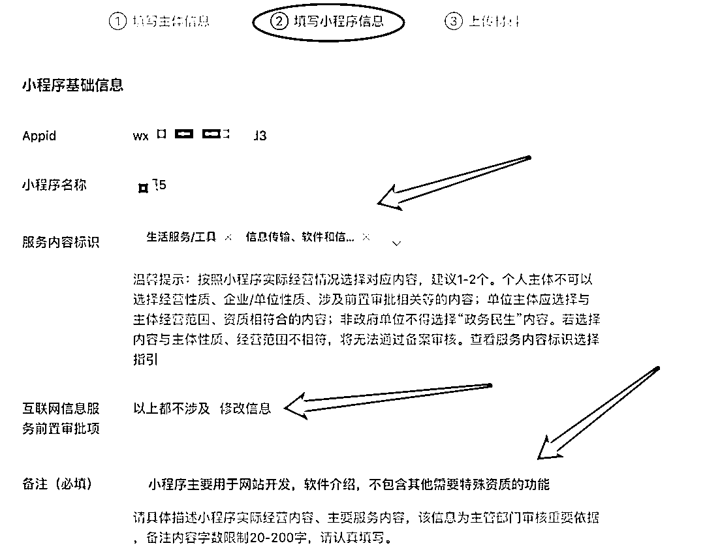
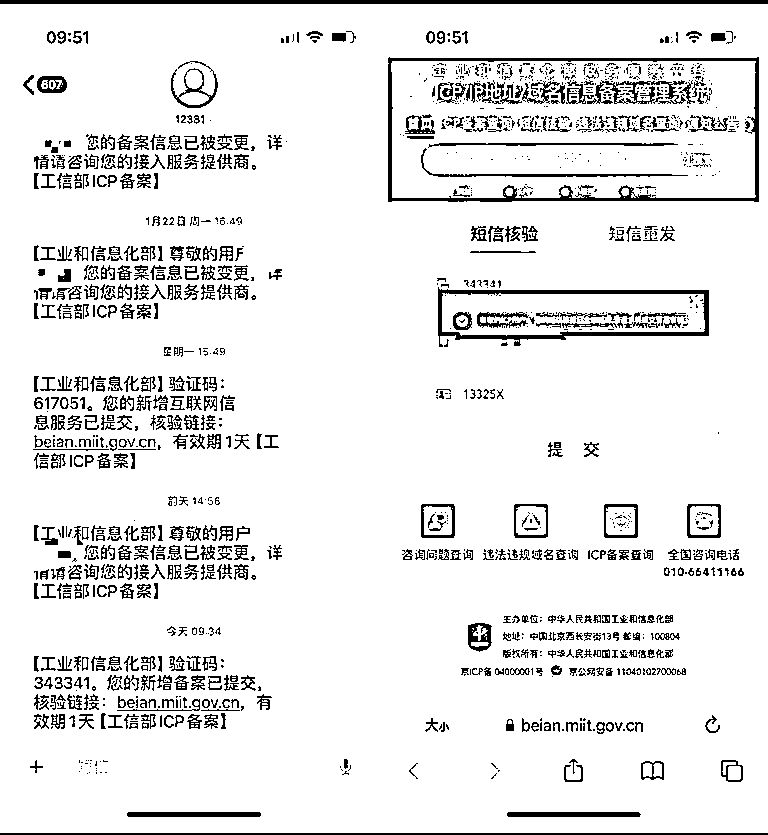
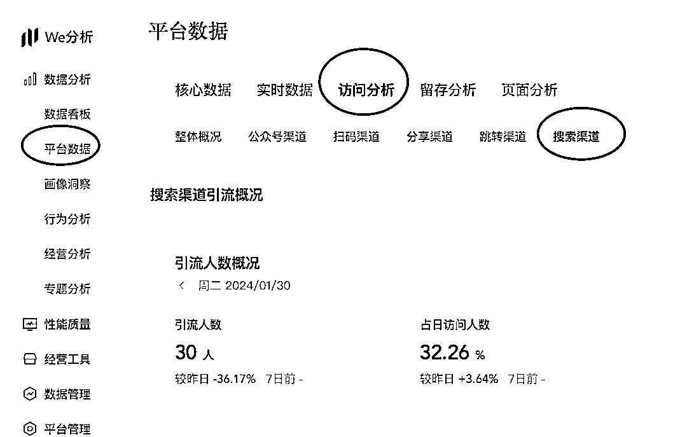

# 2024 微信小程序注册-认证-备案-上线等相关流程与疑问解答

> 原文：[`www.yuque.com/for_lazy/thfiu8/vi4w2tylqo3pku13`](https://www.yuque.com/for_lazy/thfiu8/vi4w2tylqo3pku13)

## (19 赞)2024 微信小程序注册-认证-备案-上线等相关流程与疑问解答

作者： 桔子@小桔圈

日期：2024-02-01

一，微信小程序如何注册

二，小程序认证需要 300，太贵了，怎么可以便宜呢？

​三，小程序怎么认证呢？

四，小程序怎么备案呢？不知道怎么填

五，个人小程序现在还有用吗？和企业（个体/公司）小程序有啥区别？

等等新手需要的相关微信小程序问题，咱们今天一网打尽。

**前言：**

我是桔子🍊，前健身教练，入互联网就做搜一搜（公众号）seo，累计注冊 2000+公众号，去年开始研究微信小程序 seo，累计上线 400+，最高单小程序日被动搜索点击量 2w+，自从小程序上线开始需要备案后，目前累计备案了近千小程序，今天说下现在关于微信小程序的那点事。

**一，****微信小程序如何注册**

正常官方渠道，[`mp.weixin.qq.com/`](https://mp.weixin.qq.com)

如果个人小程序，直接官方注册即可，但是目前个人小程序的适用性低，今天我们主要说企业（个体/公司）小程序，所有小程序认证备案流程是一样的。

个体或公司注册小程序，现在要么需要对公账户，要么就是直接 300 认证费，成本还是不低的。

而大部分伙伴个体是没有对公账户的，所以如果直接通过官方注册，那就必须直接 300 认证注册，很吃亏。

**二，小程序认证需要 300，太贵了，怎么可以便宜呢？**

有人知道，之前认证公众号可以直接免费创建一个认证小程序，这个口子自从需要备案后，就关闭了，所以，现在公司主体注册小程序必须都要花 300 认证后才能备案与上线，（公司）这个认证 300 是没有减少的方式。

但是，个体有方法可以不需要 300，只需要 30 即可认证，就是通过特殊渠道，之前这个渠道，个体小程序注册直接 0 认证费，现在所有微信小程序都需要认证费，所以，这个特殊渠道只能让我们个体注册小程序后，只需要 30 认证费，费用直接降到一折。个体小程序注册免 300 只需 30 认证费按照教程即可自己注册

**三，小程序怎么认证呢？**

刚注册好登录的小程序，会出现这个页面，记住前 3 个怎么填写

**小程序信息，**名字头像简介全部随便填写能过的，因为认证名称会覆盖掉所填写名称，都无用的。认证后所有资料都可以修改。

**小程序类目，**可以先随便填写或按照你想要上传代码的类目写。

**微信认证，**里面按照流程走，一定记住，认证写的名称尽量简单，**最好按照营业执照名称写**，如 我的营业执照是 “小桔圈网络工作室”，那么认证名称写“小桔圈 1”或“小桔圈网络 1”，认证名称千万不要直接写你最终想要的名称，有些名称可以改名通过，但是认证不给通过的，先认证通过，上线前可以免费改名 2 次的，不要做无用功，浪费时间。（认证备案近千小程序实操经验）

**四，小程序怎么备案呢？不知道怎么填**

备案最难的点，是在**2 填写小程序信息**这里，其他按照提示去走就行

**服务内容标识：**一般第一个可以选择 **生活服务-工具**，第 2 个根据自己营业执照里面有的内容去选择，如我的执照里带软件开发，我就选择，软件开发那个，有的伙伴带零售，你就选择带零售相关的即可（实在不清楚可以问我 无偿）

**互联网信息服务前置审批项：**修改信息-以上都不涉及。（一般用户备案都不需要特殊资质）

**备注（必填）：**类似于我上面写的这种，告诉别人你要做什么，不做什么，（千万不要写你将要搭建的小程序内容，如 你想搭建个小游戏 ，但是你执照里没有这些包含内容，你这样写肯定不给过，就按照执照里有的写，只要备案完，你随便上架你能上架的代码）

最后，备案提交后，其一，会有人打电话，一定要接，不接就备案失败（同主体下面小程序多次备案，可能不会打电话）。其二 通过后 工信部会发短信

**五，个人小程序现在还有用吗？和企业（个体/公司）小程序有啥区别？**

个人小程序主要**上传代码有限制，很多涉及资质的没有权限**，如图片类支付类等等，

大家用微信小程序的目的可能都不太一样，我主要通过微信小程序做 seo 用，所以我需要查看小程序后台有多少人搜索与点击。

个人小程序和企业版（个体或公司）都一样，可以查看搜索词数据，所以只要代码能通过审核上架，那没啥区别。

搜索词查询现在需要收费了，只可以免费查询 200 天了。且上线后开始算，（新上线的小程序约 3-4 天后，可去开通体验）之前都是免费的 ，所有小程序。。。

好了，以上就是我们目前新手常用的 微信小程序注册-认证-备案-上线等相关的流程与疑问解答

2024 年了，新的一年，新的星辰大海，准备启航 生财有术~

我是桔子，《小桔圈》社群创始人，专注于聚合 cps 项目与微信小程序 seo 蓝海项目被动流量+自动化变现，+微 请备注来意**10038140**

* * *

评论区：

单引 : 小程序有更便宜的方案哟
郭大 : 求大佬指教[握手][握手]
桔子@小桔圈 : 个体小程序注册认证免 300 只需 30 方法教程与链接渠道 圈友免费使用。

* * *