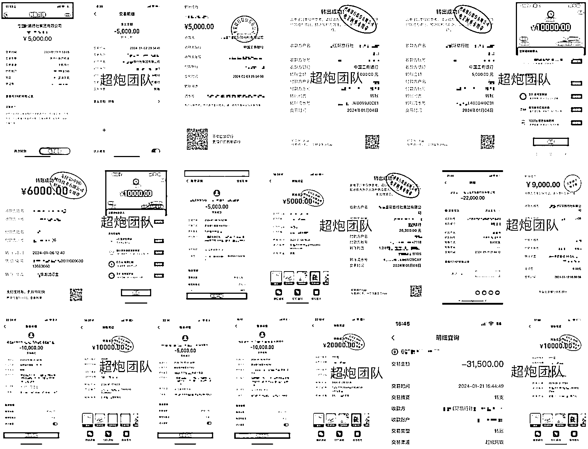
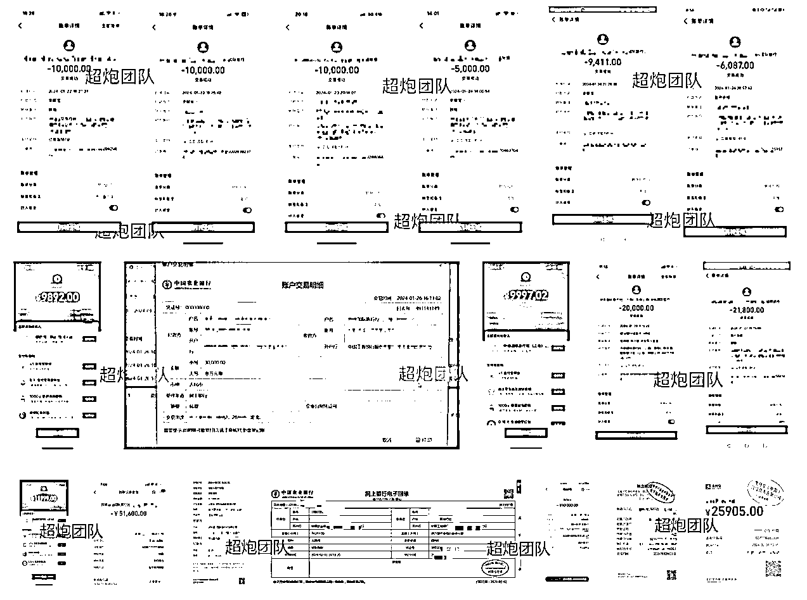

# 小红书高客单境外游今年目标利润 1000W，我们是 如何规划整个打法的？

> 原文：[`www.yuque.com/for_lazy/thfiu8/zrcf4gbezgmk2pie`](https://www.yuque.com/for_lazy/thfiu8/zrcf4gbezgmk2pie)

## (82 赞)小红书高客单境外游今年目标利润 1000W，我们是 如何规划整个打法的？

作者： 傅超人

日期：2024-02-02

哈喽，大家好，我是傅超人，我们团队今年 2024 年的目标是深耕境外游这个赛道，把利润做到 1000W，今天给大家分享一下为了达成这个目标，我们团队是怎么规划 2024 年境外旅游这块的打法的
[`xsej9se9cv.feishu.cn/wiki/HHDcwVcQeiveAnkJctMcwgGjngg`](https://xsej9se9cv.feishu.cn/wiki/HHDcwVcQeiveAnkJctMcwgGjngg)

* * *

评论区：

帅彬（蟹老板） : 牛
希声 : 厉害了

* * *