# 小红书接广告变现，怎么把一条笔记报价从 300 做到 30000？

> 原文：[`www.yuque.com/for_lazy/thfiu8/ly6a53qbl107ck7b`](https://www.yuque.com/for_lazy/thfiu8/ly6a53qbl107ck7b)

## (44 赞)小红书接广告变现，怎么把一条笔记报价从 300 做到 30000？

作者： 北

日期：2024-02-01

个人成长、金句汇总、励志文案，似乎是当下最容易爆的小红书赛道。

但偏偏，这些赛道的变现能力最差。因为大量的人涌入这些赛道，导致这些账号同质化严重，辨识度低，粉丝粘性低。

当然今天这篇内容，不会教你怎么选一个高客单蓝海赛道，而是教你，如何在现有赛道里提高变现力。我会告诉大家广告变现的底层逻辑，让你的账号脱颖而出，甲方爸爸一眼就能看到。

当然，本文主要讲的是怎么靠接广告变现，如果你走的是引流变现的运营思路，就可以划走了。

按照生财惯例，在文章开始之前，我 po 一下自己的成绩：**小红书 46.8w 粉丝，单篇广告报价 3w+～4w+，曾一周涨粉 10w+，孵化学员 300+。**感兴趣的话，欢迎继续往下看。

在小红书领域深耕很久了，发现很多人运营小红书都存在一个问题：账号变现价值低。

甚至不少知识付费的课程教出来的账号也是这样，结果就是，花了大量精力运营小红书，好不容易写出爆文，涨了粉，却发现无法变现。

但也无法吐槽，因为你账号做出来了，说明人家教学也是有成果的，至于能不能变现，那就不归他们管了。

不过今天这篇文能帮你解决这个问题，关于小红书，我的成果如下，咱们拿实打实的成绩说话

**小红书 46.8w 粉丝，单篇广告报价 3w+～4w+，曾一周涨粉 10w+，孵化学员 300+**

实话实说，这个广告报价在知识赛道不算低了，时间单价也很高。

不过我在一开始也并不知道怎样做一个广告变现价值高的账号，这些都是我摸索过很有用的方法，它们也在我学员的身上得到验证，很多本身无法变现的账号，在转变运营思路后，都开始接广不断了。

# 一、**指南声明**

如果你的目的是靠接广告变现，那这篇文肯定能帮到你，如果你靠引流等方式变现，那么本篇方法无需参考，两者运营思路不同哦。

# 二、**做账号误区**

先来了解一下做账号的误区，很多人走到无法变现或变现困难的结局，都是因为在刚开始做账号的时候存在这些问题，如

**1.只关注粉丝量**

什么内容涨粉快就发什么，不考虑粉丝粘性、变现价值，和账号形式，比如非常常见的一类账号，这种现在复制的人也不少

个人成长赛道，发金句汇总，文案汇总

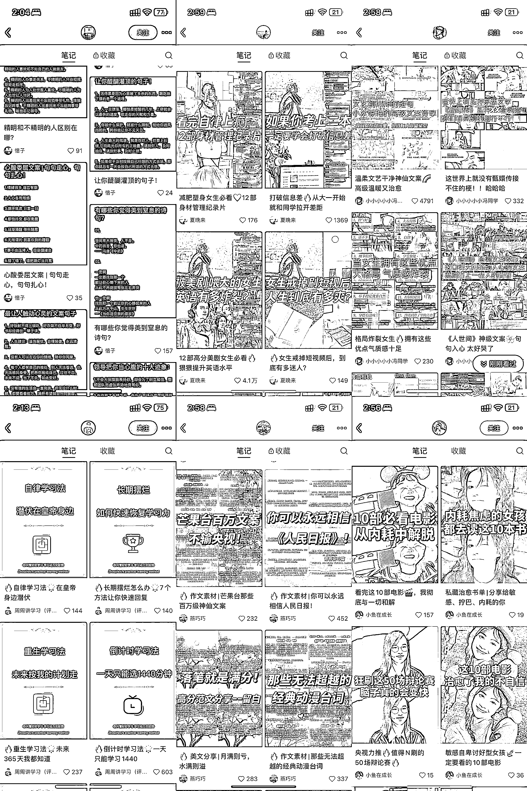

这种内容固然容易出爆文，涨粉，但是于广告价值来说，很低，如果你想靠广告变现，劝你远离这类账号。

**2.过于同质化**

这个很简单，上面那几张截图大家就能很清楚的感受到，他们的同质化。

我放的还都是不同风格形式的内容截图，其实每一类都有一大堆相似的，拼图文案形式、纯色底图配字、备忘录、明星拼图配文案……

他们都有着相似的风格和相似的选题，xxx 句封神文案，不愧是央视，女生一定要看的 x 本书/x 部电影/要懂得 x 个道理， 公主学习法/反派学习法/各种学习方法 等等等等

同质化带来的问题有很多，我们今天单讲在变现上的问题。

第一，粉丝粘性低，账号辨识度低，带来的结果是数据的不稳定，导致报价上不去。

第二，供求关系，市面上这样的账号越多，你的报价竞争力就越低，毕竟价格都卷下去了，供大于求。

说到这里，可能很多人会想，那我一个小白，刚做账号的时候，肯定要模仿呀，直接独创风格内容太难了。

这个是肯定的，小白难以摆脱模仿，但我们依然有一些方法，可以让你在吸取爆款优点的前提下，减少同质化。

**3.无人设感和质感**

人设感其实不用过多解释，这和上文提到的粉丝粘性和账号辨识度问题相似，账号体现不出人设，自然差异化也是比较低的。

而质感，我简单放几张图，如果你是品牌方，你想投哪个，你给哪个的预算高？

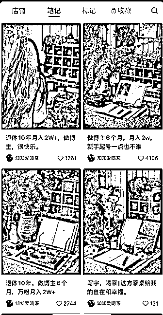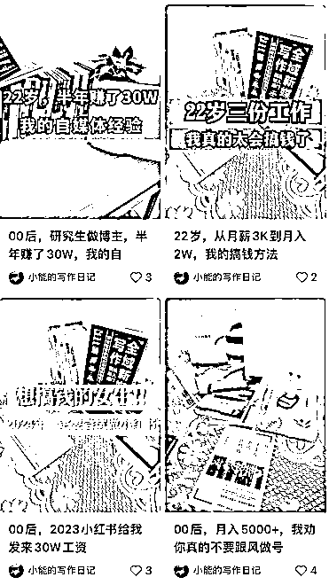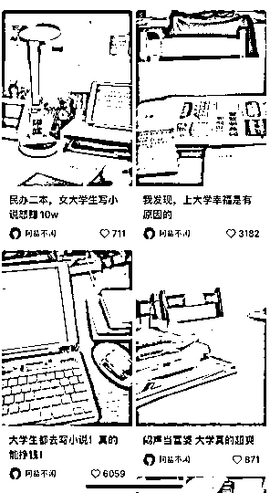

或者同一类博主吧，这样对比更明显，同一赛道，同一场景，同样粉丝数，你想投哪个？

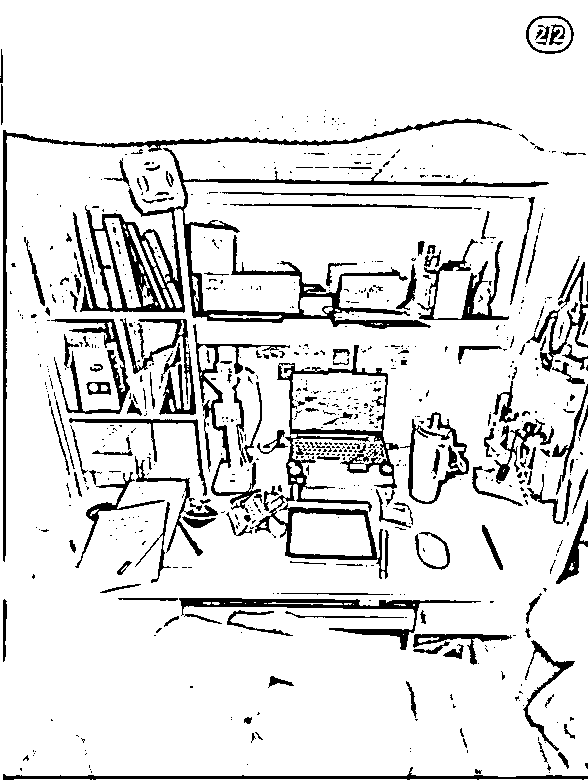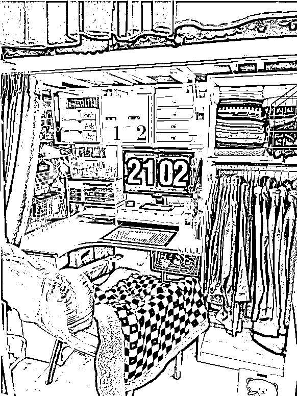

答案很明显，质感高的。

因为产品放进去都显得更高级了。这种能让品牌变高级的笔记，一定是受广告主欢迎的。

其实这些误区特别常见，一方面是小白没有经验，一方面是很多运营课追求“运营效果”，而非实际价值。

能让你用简单的方法快速涨个几千粉丝，那都是能拿出去宣传。至于变现，那无所谓了。

但很多人做小红书就是冲着变现去的，你花大量精力，做出来个不变现的账号，那不是白瞎吗？所以，运营目标应该在一开始就设定好：做一个可变现的小红书账号

如果你踩过上面的坑，没关系，我们今天的方法都能帮你调整转变。

既然了解了什么样的账号变现价值低，那接下来我们就探讨一下，什么样的账号更适合变现。

# 三、**什么样的账号更适合变现？**

这一点肯定有很多人会说，赛道啊！

诚然，赛道不同，报价不同，母婴护肤美妆家居这些赛道变现价值都很高，但综合竞争压力和个人擅长度，不一定适合每个人， 且有不少人已经选定了赛道，运营一段时间了。

所以我们今天不讲赛道选择，而是教你“如果你已经选定了赛道，如何在这个赛道里提高变现力？”

比如我做的是知识赛道，按理说，这个赛道广告报价是不高的，但我也能报到三四万，这其中肯定是有技巧的。

我们从两个维度来看，聊聊广告变现的底层逻辑。

（1）**广告数量**

你能接到的广告数量，取决于你的广告位大小

比如我一个大学生/高中生干货分享的赛道，很多人觉得接不到啥广告，最多也就是软件、课程类的广吧

但实际上，我接的广告范围非常广，科技生活护肤全都有，比如电脑、平板、手机、床垫、显示器、眼霜、智能锁、代步车、汽车

非常多，这里放一部分截图证明。

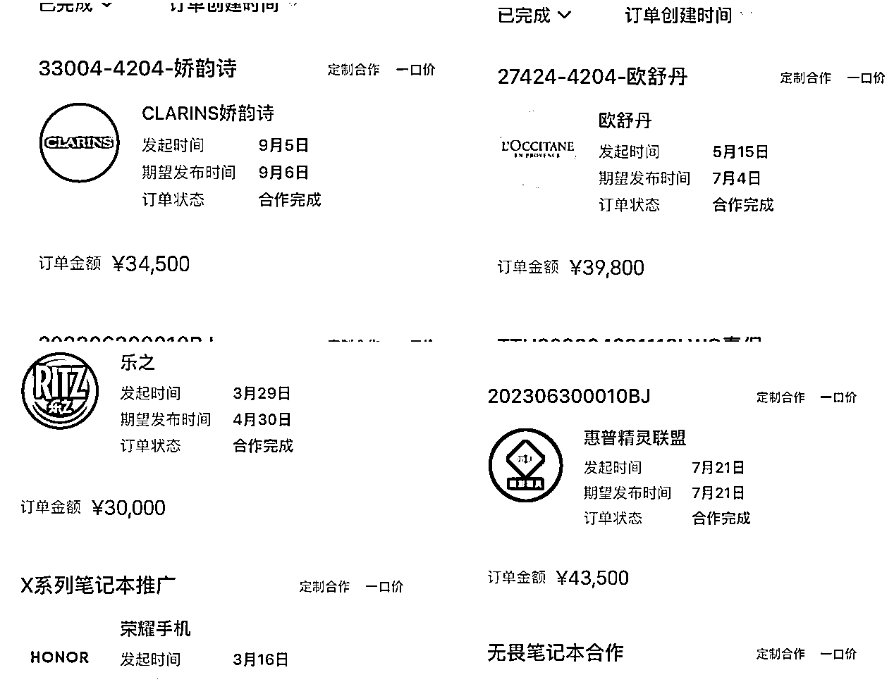

为啥一个非护肤博主的博主，能接到护肤品合作？为啥一个非科技博主的博主，能接到科技产品合作？

核心就是这句话“你能接到的广告数量，取决于你的广告位大小，而不局限于赛道”。

1、**什么是广告位？**

我的定义是：产品植入的空间。

下面我分成两个方向来讲，**主动选择和被动增加。**

2、**主动选择：**

很多时候，我们接广告是可以倒推的。

我记得之前跟一个学员聊天时，她说想买 ipad 配件，我跟她说完全不用买，你发个以 iPad 为载体的笔记就行了，不仅不用买，还能收到品牌的广告费。

这个转变非常简单，我举个例子，比如你本来要发一个不想学习能做的 x 件事，换成用 iPad 做的事，并拍下来对应画面就行了。

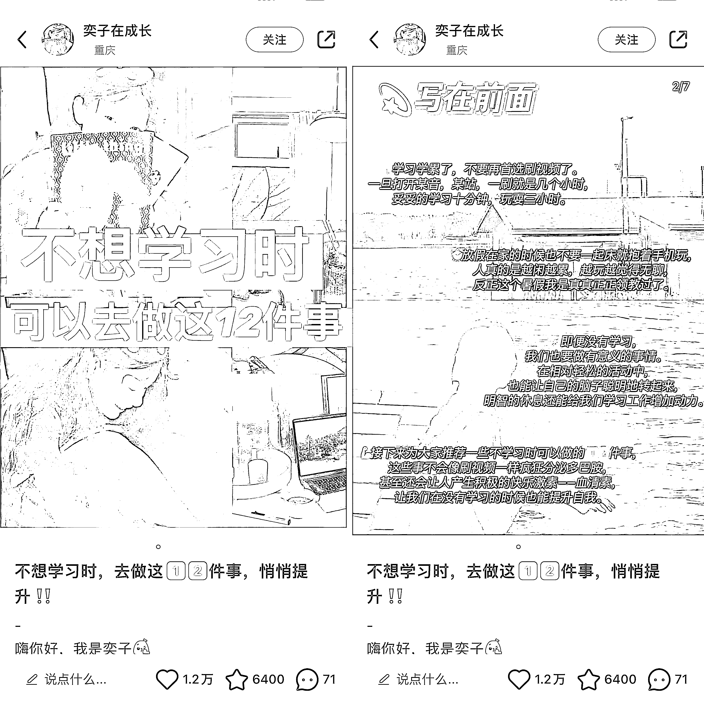

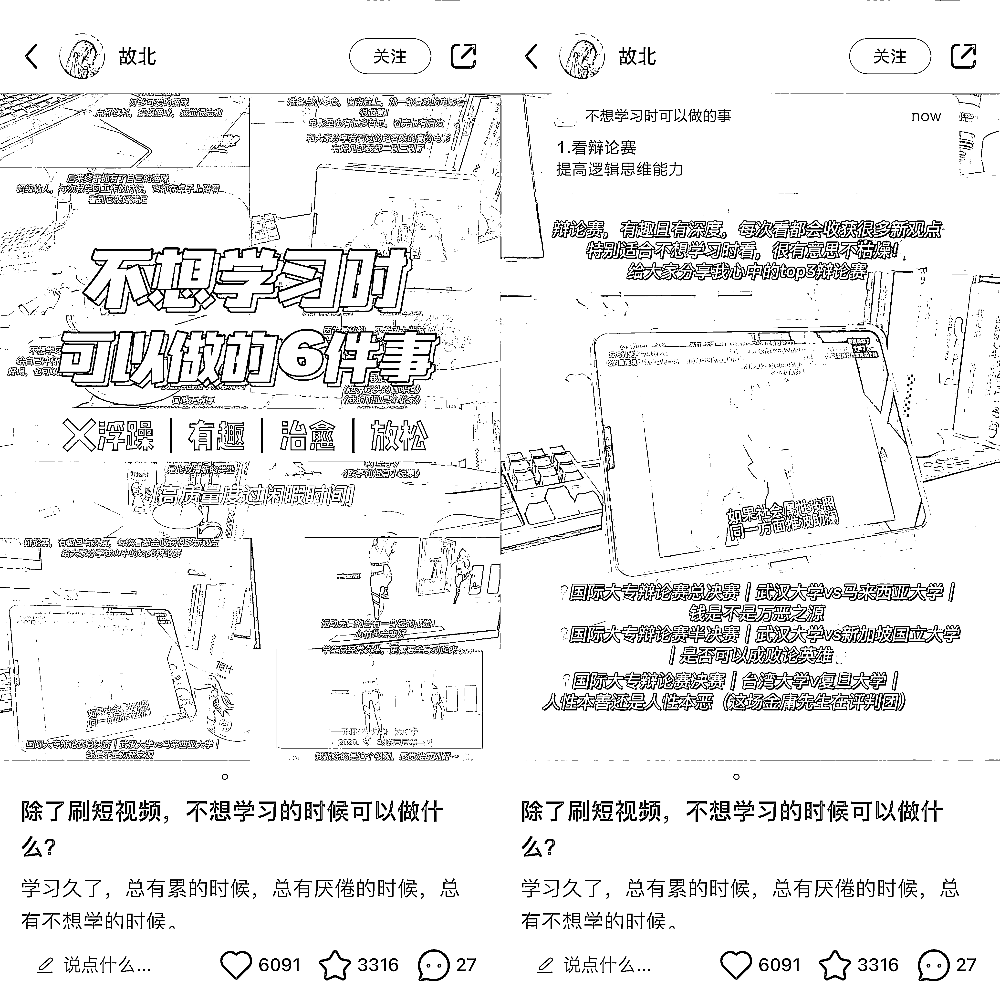

图里应该能看出来区别了，第一种是纯图配字，图为网图，且无场景，只为做背景。第二种则是实拍场景图，为 iiPad 使用场景。

当你想接 iPad 配件广告的时候，要思考的问题是：iPad 配件的植入空间在哪里？

当然是 iPad 旁边，那你的广告位就要把它露出来。自然而然就能接到对应的广告了。

用句夸张的话来说，当你懂得广告位导向的逻辑，很多东西都不需要买，都是可以达成合作的，不仅不用买，还能顺便赚钱。

3、**被动增加：**

如果你并没有想要某一品类产品合作的打算，日常如何增加广告位？

最简单的方法，出现场景，扩大场景。

正如我之前举的反面例子，很多人的笔记是没有场景的。如果你没有场景，那么要做的第一件事是增加场景。由自制图文，转变为实拍。

第二件事，扩大场景

我们举一个简单的例子，读书博主。

这个赛道，很多人都觉得广告变现空间小，只能接图书置换或小额推广费。但这其实取决于你怎么运营账号。如果你这样做账号，自然广告变现空间小。

因为你的场景里只有书，没有其他。品牌方看不到与你合作的可能性。

如果你稍微扩大一下呢？把你的书桌拍进去。

那广告空间一下子就变大了，因为桌子上能放的东西太多了，书桌上可以有电子阅读器，可以有显示屏，可以有台灯，而这些可以有的东西，就都可能成为你的广告机会。

之前有个做读书博主的学员就是这样的，稍微一调整，就接到了显示器和台灯的合作。

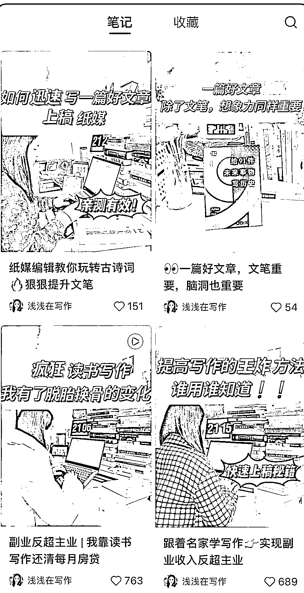

所以，如果你想扩大自己的广告范围，可以尝试扩大拍摄场景。

**（2）广告单价**

有些人在运营时会发现自己广告不少，但价格总是提不上去，怎么办？

能在相同的创作时间内，获得更高的报酬，那肯定是极好的，这一部分，我们来讨论如何提高广告单价。

在前面的问题描述中，我提到过账号的调性，图片的质感。看起来高级的内容，总是让人觉得配得上更高的价格。

所以同样的内容，不同的场景和拍摄风格，带来的报价都是不一样的。

除此之外，你要知道一点，大品牌相对小品牌，往往预算更多。而大品牌也往往更在意格调。即他们更倾向投放拍摄风格高级的账号。

这个在大品牌合作的 bf 里都有提及，这里可以分享给大家，他们的要求都是什么？进而倒推你需要做什么。

当然，不一定非要有特别好的摄影技巧，你可以一步步进阶。**比如，先做到干净。**

在很多大牌合作的 bf 中，有关于拍摄要求，他们都提到了这点，无论是妆造、着装、拍摄场景，都尽可能希望干净整洁明亮大气，以下是部分要求截图。

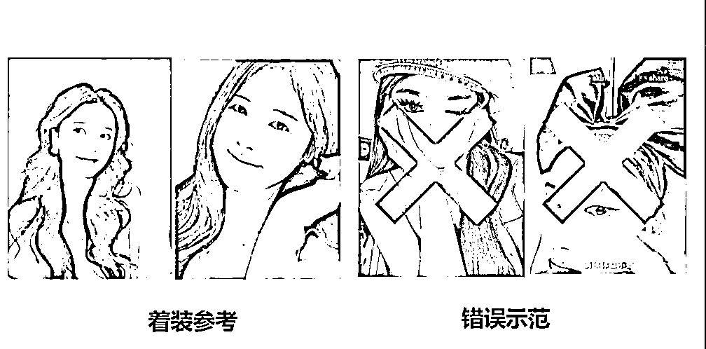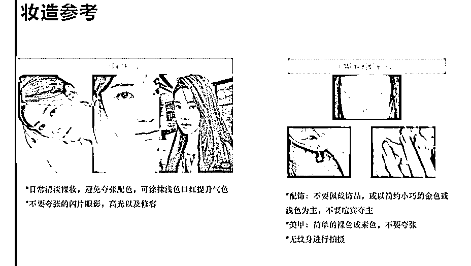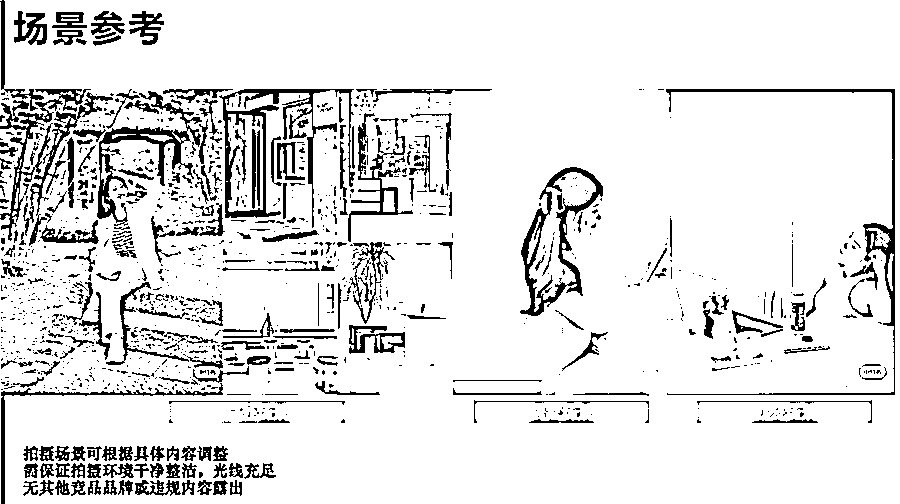

场景干净，人干净，色彩干净。简约大方往往伴随着高级感。

看看你的拍摄场景里有没有杂七杂八的东西？收拾干净。

有没有过多的颜色？经常有人把场景整理整齐以后，还是觉得很乱，多半出在了颜色杂上。

你的场景应该有一个主色调，不要太乱。如果你对这方面一无所知，那就从抄作业开始。

去找背景布置好看的账号，看看他们都是如何布置的，向他们学习。

**第二，学习简单的拍摄构图**

平常拍摄的时候，打开九宫格，会帮助你拍出更和谐的照片。

同时，要去学习常见的主体位置！刻意练习。

这部分并不难，小红书上就有大量教程案例可以学习。

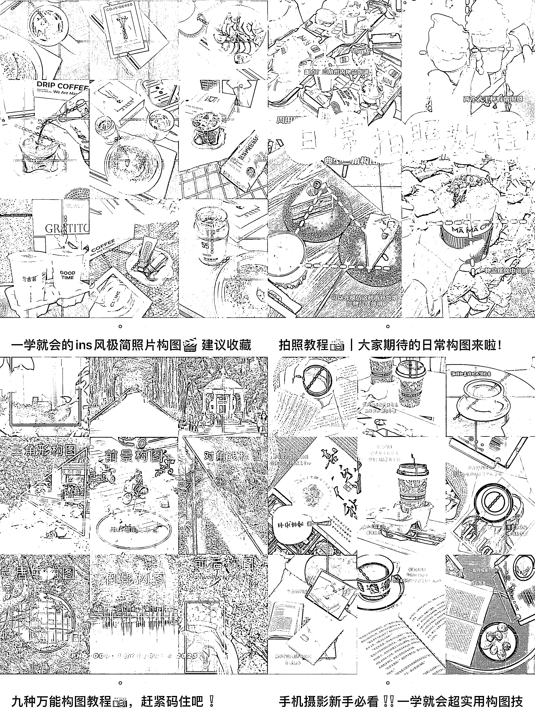

**第三，学习修图**

学会调颜色，让画面看起来更高级干净。

我曾经合作过一个知名电脑品牌，出稿子后，对方希望看起来更精致。

怎么改？

我当时是已经所有内容都通过了，所以这个时候，能改的就是滤镜。调了颜色以后发过去，品牌满意了。

这个技能也是很重要，我就不多说了，小红书上教程一大堆，搜调色教程就出来了。重点还是，平常多看好照片，培养审美，多修图，精进能力。

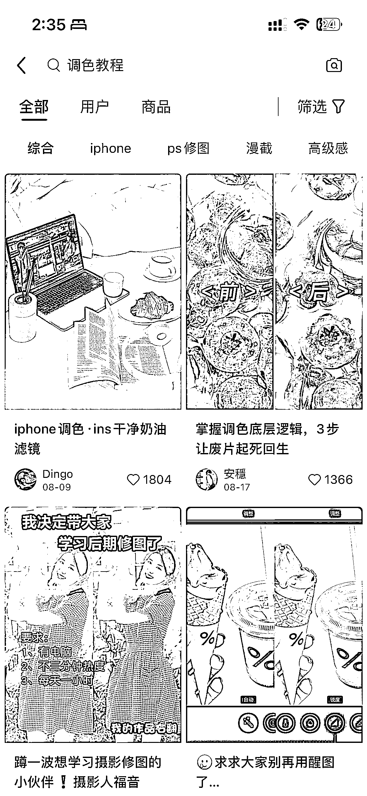

**第四，设备**

比如，使用相机拍摄，那质感肯定有所不同，但这一步绝不是重点！！！

我有必要在这里强调一下：**不要在没做出成绩的时候，就投入过多资金。**

没必要！这些都是锦上添花的东西，而非必需品。

我见过太多人做小红书上来就是想着要买什么，要准备什么。

千万别，你先做，真需要了再买，且最好用你赚到的钱去买，这才是良性循环。

我一开始也是用手机拍摄，后面才换的相机。但手机也绝对够用，我现在也还有不少照片都是手机拍的。

不要把学习拍摄的精力放到挑相机上，本末倒置了哈。

以上是可以帮你提高账号变现价值的一些建议，其实综合考虑，底层逻辑就是这两个维度，由此可以延伸出很多技巧和调整建议。

如果你还没有开始做小红书，那我建议你把变现加到账号规划里，认真考虑这部分，规划自己的账号形式。如果你已经开始做了，且方向不对，还踩了不少我上面提到的雷点，如何提高变现力？

答案：从现在开始，慢慢转变账号风格

**由纯图文无场景转为场景笔记**

学习拍摄构图，尝试真人出镜，在账号中增加人设，其实形式的改变就能大大降低同质化，随着你真实生活场景的露出，真实面貌的露出，你的差异化就越来越多。

首先你已经满足了“世上没有两片一样的雪花“这个条件，没有人和你长得一样，也不太可能场景布置得一模一样，这是最简单的降低同质化的方法。

在此基础上，把内容也做出差异，那就更加远离同质化了。

（我在开头有说过同质化的问题，在这里，做个小小的分享啦）

**接着，实拍进阶**

从有场景，进化为有精致的场景、从无氛围感图，进化为有风格质感的图。

不过！正如我开头所说，这是高广告变现价值账号的运营逻辑，如果你是做矩阵，做引流等等，那不需要去这样做。

高广告变现价值账号的优点是账号价值更高，广告变现能力强，账号不易被复制，更有个人特色，适合个人追求账号高变现的形式

但缺点也很明显，每篇笔记花的精力变多，需要更多的技术含量，不适合批量生产，大家根据自己想要发展的方向来调整哦。

# 四、**如何与 pr 对接**

一般来说，上面那些内容方面的建议主要影响账号的报价，而如何与 pr 打交道则影响后续的复投。

对接流程一般是怎样的？

首先 pr 可能会从邮箱、私信、蒲公英后台这些地方联系到你，加了好友以后，会告诉你合作项目信息，此时对 pr 来说主要是收集信息+提报，而我们要提供的信息大概是这些：

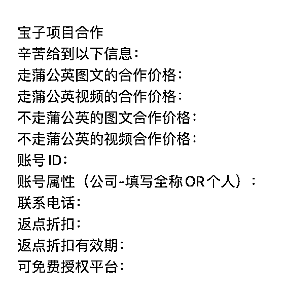

不过每个 pr 发的都不一样，价格、返点、档期是基本信息。

除此之外，可能会问你是否有分发平台？是否能把素材授权品牌使用？是否可以授权电商？免费授权还是收费？

有一些还会根据合作的产品问你有没有过往的参考案例，比如，一些电子产品类的合作，可能会问，有没有 3ce 合作案例笔记？

根据对方的要求给到这些信息就可以了，尽可能的全面。

那有人可能要问了：前期沟通的时候，怎样能增加被选中的概率呢？

那核心其实就是性价比，而性价比在具体的指标上可以被拆分成两点

**1、你的数据：**如果你近期笔记数据都很好，出了很多爆文，那自然更容易被选中。

**2、价格：**你的报价是否超过了账号价值？以及你能给 pr 多少返点？

这里我们科普一下，如果是小红书的新手，接广告比较少的话，可能不太了解返点。

一般，当你粉丝数有一定量了，后台也开通蒲公英了，慢慢就会有一些报备合作找上你。报备合作就是走小红书官方平台蒲公英，非报备也就是私下里接的广告。

而返点一般都对应着报备合作。

如果你对接的人是品牌方，那这个返点就相当于折扣。如果你对接的人是媒介，那这个返点就是付给媒介的费用，可以近似理解为中介费。

对于媒介来说，他们会接触很多博主，把信息收集起来提报，品牌来选人。那你的返点可能就影响了他们的提报。

这个很好理解，你给的多一些，他们就更想和你达成合作，有利润嘛。

而返点多少合适？一般来说如果你的账号是正常运营，数据也不错，那 10-20%差不多。

如果并不是正常运营，那就高很多了。

这里给大家解释一下什么是正常运营，什么是不正常运营？

不正常运营也就是水号，主页数据基本靠刷，找水军，做数据。那这种账号一般都会给很高的返点了。

不是走内容的路线。想高价值变现的话，不建议哦。

不要刷数据，正常优化内容。非水号，一般返点就是 10-20%。

至于报价多少，说实话，没有固定公式。你可能看到市面上很多教学告诉你 10%粉丝数，然而，很不幸，这并不是一个通用公式。

不同的赛道，不同的账号风格，不同的数据，不同的粉丝数，报价都是不一样的。

没有人能给出一个具体公式，但在合作过程中，慢慢就知道自己的价格合不合适了。核心还是供求关系嘛，

如果你的报价，让你每月档期爆满，那显然，你的价格是可以提高的。

如果你的报价，没人合作，那显然，你需要降价，

所以这是个很灵活的东西，都是根据市场反馈不断调整的。

好，确定合作前的流程我们走完了，

如果你很幸运，选中了，品牌下单了，那之后要如何做来提高复投率呢？

答案是双方体验感。

对接 pr 的体验感，和品牌的体验感。

你在执行过程中是否配合他们？有没有按时交稿？沟通态度是否友好？

如果你在整个过程中让他们感觉，跟你合作，很顺畅，很舒服，那自然希望再次跟你合作。

这里补充一个小建议，在确定合作后，给 pr 一个 timeline。

一般来说视频的稍微复杂点，图文简单点，这个就是最基础的 timeline：

1.  大纲：

2.  初稿：

3.  发布：

设置 ddl 还是非常有必要的，避免拖稿。而且！！如果你不想让自己的稿子改来改去！各种大改！那一定按我这个来！

先让对方确认大纲方向，然后才动笔细化。

如果你没让对方确认方向，一切都做完了，再让人家审稿，万一大方向品牌不接受，那你要推翻重来了。

这个 timelin 有时也会更细，他们会直接给你一个模板，总之，多沟通。

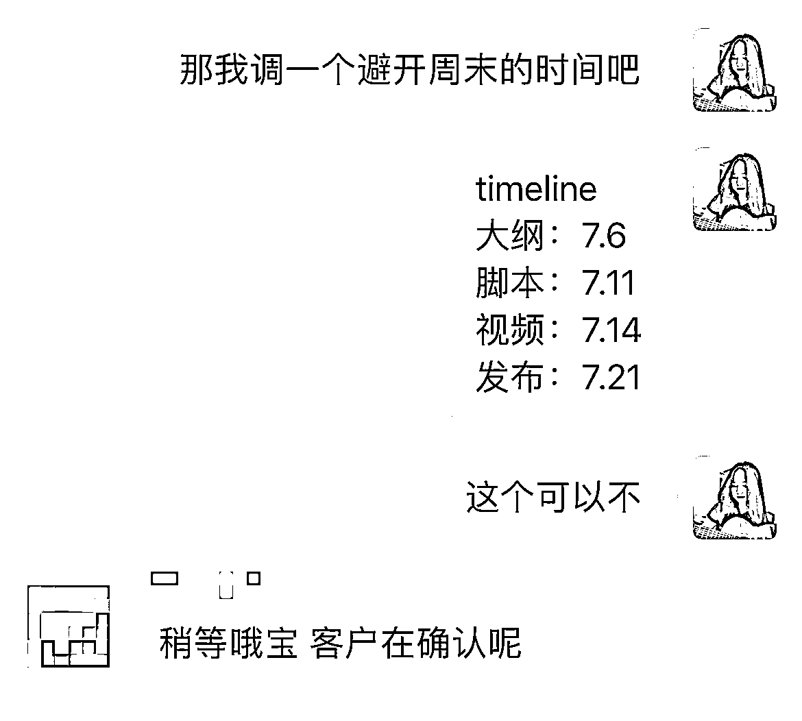

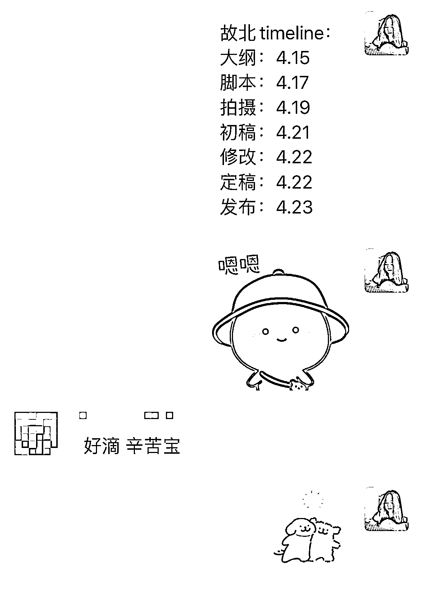

而对于品牌体验，配合度当然也是包括在内的，只是他们还要考虑一个因素：投放效果

如果他们跟你合作的数据很好，那自然倾向复投了，不过有两次合作，我记得是支付宝和京东的，数据并不太好，但 pr 又来找我复投了。但因为我觉得上次合作没给他们好的效果，就拒绝了

我这该死的责任心。

内容上我们尽力做好就行，毕竟数据有时就是有玄学因素在，沟通上我们尽量顺利推进，尽人事嘛，把自己能做好的，尽量都做好，这里放一些我和品牌多次合作的截图。

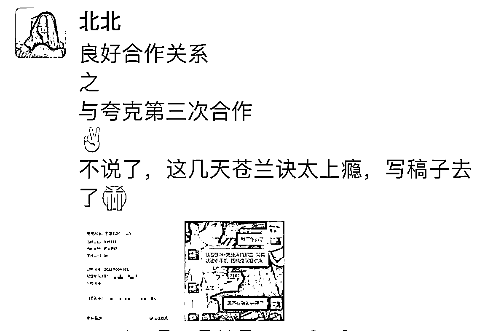

和夸克合作了很多次，这里是两个合作案例，可以看到数据都挺不错的

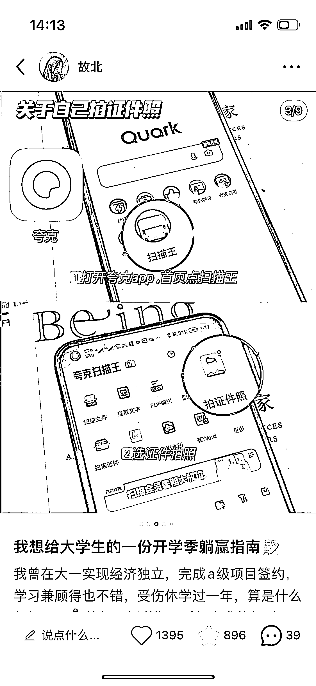

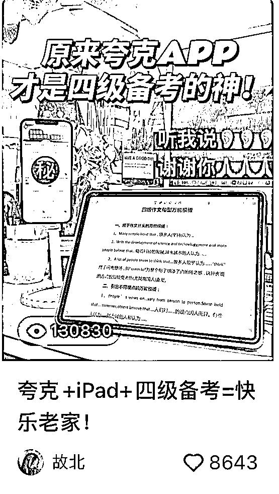

和华为合作的次数应该是最多的，大概有 5 次，这也是其中两个合作案例

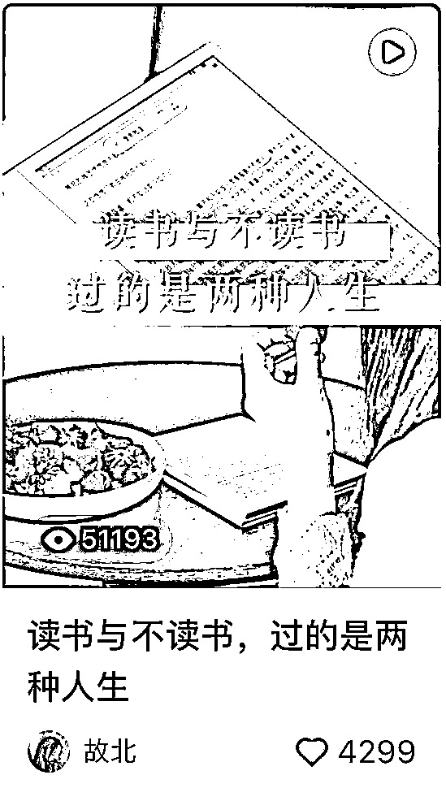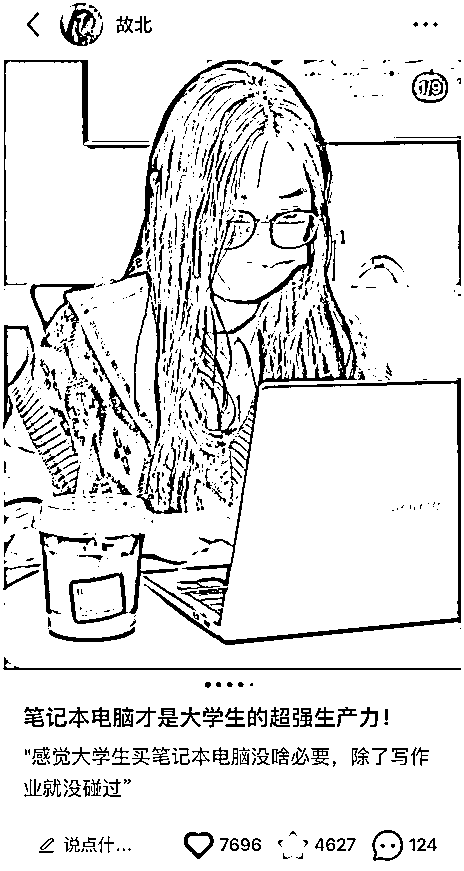

蒲公英后台，能直观看到过去有不少复投的，很多品牌都是合作了一次以后，还会再合作。

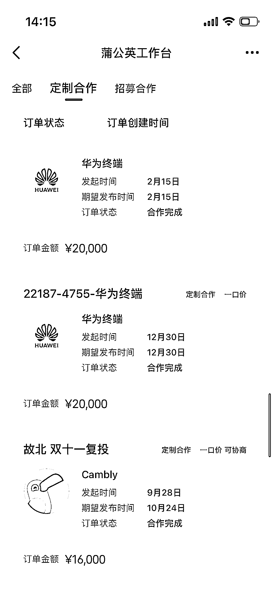

我之前在朋友圈见到不少 pr 挂博主的，pr 都有自己的圈子，是会一起交流避雷博主的。

如果每次合作都不给人家好好做的话，迟早会黄啊！

咱们就是，一定要认真对待每一次合作，爱惜羽毛！

讲诚信，负责任✅ 拥有一个好的合作口碑。

好啦，以上就是一个超全面的合作经验分享啦，希望对你有帮助。

* * *

评论区：

暂无评论

* * *