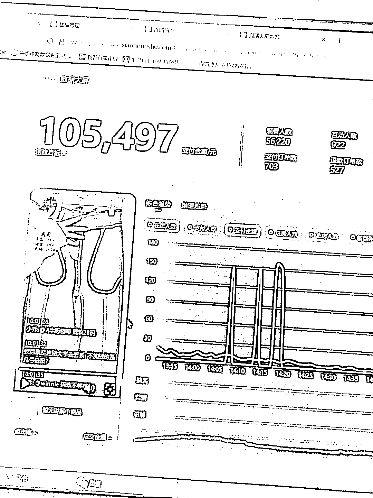

# 卖了五十多万，我来一次性说清小红书无人直播红利和坑

> 原文：[`www.yuque.com/for_lazy/thfiu8/oguysm6x5qd878r0`](https://www.yuque.com/for_lazy/thfiu8/oguysm6x5qd878r0)

## (34 赞)卖了五十多万，我来一次性说清小红书无人直播红利和坑

作者： 杨真🦈

日期：2024-01-29

小红书无人直播单场十万的方法论，这里面有哪些坑？

从 12 月就在关注小红书无人直播，一月份开始操作费了 6 个号，单场 5 万，单场 8 万，单场 7 万，单场 10 万加都卖过，却发现退货率真的是个大坑。

这篇文章记录了小红书无人直播我是怎么选品，怎么从开始的单场一万到后面的十万加，如果你正在做无人直播一定要看，记录了我踩的很多坑

最后小红书无人直播真的没那么多技术，别想复杂了

详情看飞书，只聊项目[`dkl7w7ir14.feishu.cn/docx/HEtJdnpXho3qOoxkrJjcn5lVnWg?from=from_copylink`](https://dkl7w7ir14.feishu.cn/docx/HEtJdnpXho3qOoxkrJjcn5lVnWg?from=from_copylink)

* * *

评论区：

Ante : 废了一个账号，开播 5 个小时，进人就 20 个不到[抠鼻]
杨真🦈 : 废了一个没做了？
Ante : 在继续测试
在三亚卖金枪鱼和野生* : 不废个 20-30 个号[偷笑]也难走出来
杨真🦈 : 没你想的那么废号，还没到那阶段
后知后觉 : 退款率这么夸张是这个款的问题，还是直播都这样
杨真🦈 : 服装行业的原因，找好包售后的厂家就行
后知后觉 : 请教几个问题：
1.这几个 选品渠道，哪个效果想对比较好些
2.退款包 50%，我看大部分退款率都在 60%左右，是不是自己要承担 10%

* * *