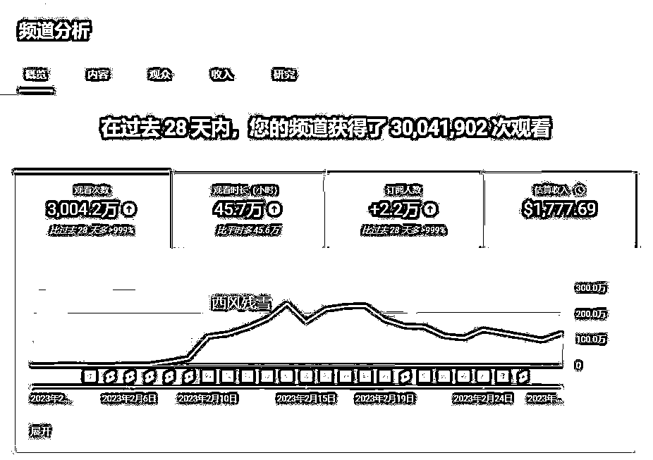
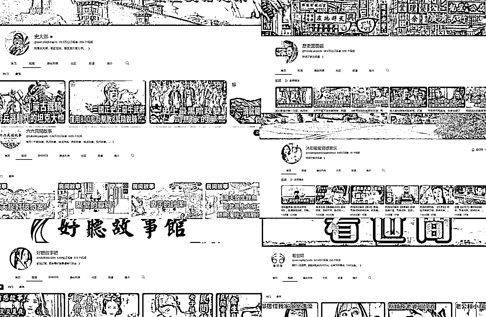
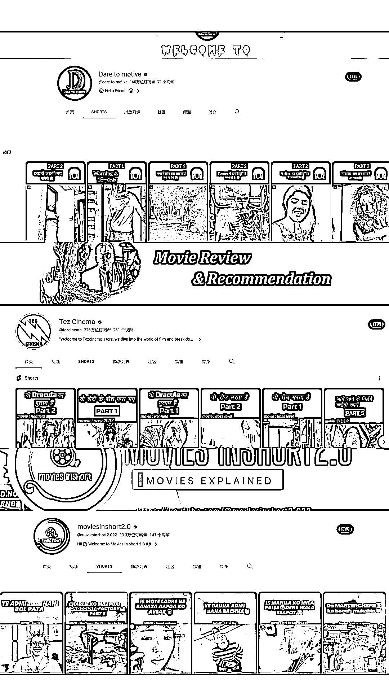
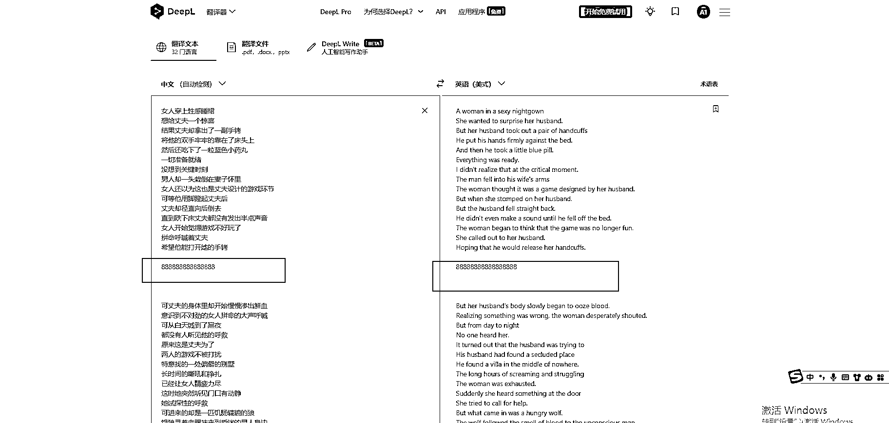
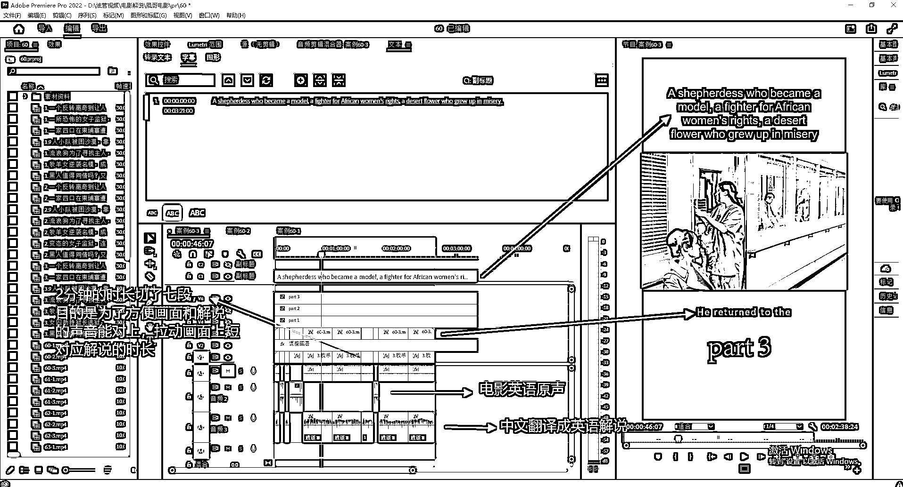
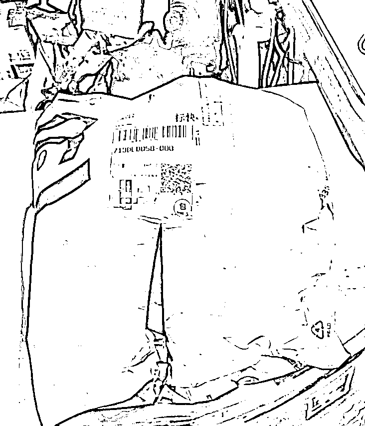
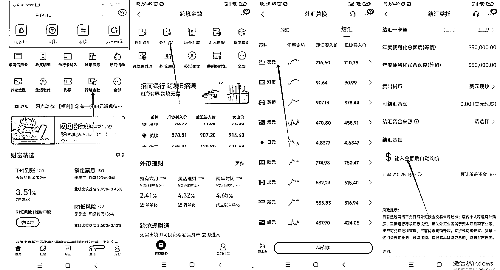

# 6 个月跑通 YouTube 起号 运营 开通 adsense 收款整个流程

> 原文：[`www.yuque.com/for_lazy/thfiu8/pot923mx2kvrtidm`](https://www.yuque.com/for_lazy/thfiu8/pot923mx2kvrtidm)

## (精华帖)(161 赞)6 个月跑通 YouTube 起号 运营 开通 adsense 收款整个流程

作者： 西风残雪

日期：2024-01-31

大家好，我是西风残雪，一个从事 8 年的影视后期从业者，从 2022 年 8 月份开始做 YouTube，花了半年时间，最终跑通了所有的流程，之前搜索生财，里面好像没有 YouTube 完整流程的文章，接下来给大家详细说说，从起号 运营 开通 adsense 收款整个流程

YouTube 是全球最大的视频网站，相比于国内的 B 站，今日头条，我觉得 YouTube 发展前景会大很多，粉丝价值更高，钱也给的多，但是 YouTube 门槛会相对高一些，开通收益需要 1000 粉丝，4000 小时播放量（短视频需要 1000 粉 1000W 播放量），我和很多小伙伴聊过，这一步卡死了很多人，原因是发的视频没有人观看，涨粉太慢，视频时长很难达到 4000 小时，发了 20-30 个视频，两三个播放，半个月过去了，一个月过去了，还是没有流量，很多就坚持不下去，于是放弃了，有这种想法是错误的，真正的原因是 YouTube 和国内的平台推流的机制不一样，YouTube 是全球平台，推流的速度是非常非常慢的，快一点需要 1 个月左右时间，慢一点需要 2 个月到 3 个月，才会渐渐推流，很多人等不到 YouTube 推流的时间。最好的方式是，在前期这段时间，每天将发视频数量拉满，以数量对抗质量，等到 YouTube 推流的时候，只要有一条视频爆了，整个账号视频播放量就起来，这样很快就能开通收益，现在 YouTube short 可以发布短视频，可以短视频涨粉，长视频拉时长，达到快速开通收益

一.如何选择赛道

这是 3 月份时候，发在生财的一个风向标，很多人加我问我有关于 YouTube 的问题，遇到最多的两个问题是，1.YouTube 能不能搬运？ 2.找不到赛道，不知道做什么？

搬运：我个人非常不建议搬运（除非国内有自己做的好的账号），YouTube 审核机制非常严格，一旦被判定搬运，直接封号，adsense 收益归零，申诉非常麻烦，基本不会通过，需要你提供制作视频的画面截图视频或者你办公的地方员工截图视频，另一个好不容易辛辛苦苦几个月，账号粉丝做起来，收益直接归零，人容易崩溃，我个人已经被封了 3 个搬运账号，1000 多美元取不出来，希望大家伪原创或者原创，搬运没前途

赛道：YouTube 有很多很好的简单的赚钱赛道，只是很多人没有做，这里发几个账号给大家参考：

这些都是将国内各种平台文章  音频配上画面，直接发布

下面账号是影视解说视频观看的人其实挺多的：可以做英语  法语  德语  西班牙语  土耳其语

这些语言做的人比较少不卷，收益会比较高

目前我在做的是上面两种， 一个是做海外华人  一种是做其他语种，像英语  法语  德语 西班牙语  

中文：只需要将国内的文章翻译成繁体，配上画面，添加音乐，发布即可

影视解说：抖音   快手   b 站下载视频，用剪映提取视频，deepl 翻译成其他语言

二：视频制作（主要展示英语影视解说，其他语种都一样，把英语翻译换成其他语种）

1.文案：下载视频用剪映智能识别字幕 ，用 deepl 翻译成英文，如果文案太长，可以用三段，中间可以用数字断开，目的是防止整段文案输出后，画面和文案对不上

2.视频：抖音，快手哼哼猫去水印下载（需要会员付费）

下载哼哼猫电脑版链接：[`www.henghengmao.com/page/appdownload`](https://www.henghengmao.com/page/appdownload)

3.配音：魔音工坊（需要会员付费）

4.合成：pr

三：开通 adsense 收益：

开通 adsense

达到 1000 粉丝，和 40000 小时播放量后，就可以开通 adsense，可以在 YouTube 账号后台申请开通 adsense，adsense 开通需要 PIN 码，才能绑定账号和银行卡收款，PIN 码获取是在后台申请，官方说法是亚洲从新加坡寄出来，通过中国邮政寄给你，后台填写 PIN 码申请的地址，**从我实操发现，根本收不到 PIN 码（不知道是不是因为我在武汉的原因），我申请的方法是，准备身份证正反面照片和身份证照片上地址一致的一张快递面单（快递面单可以寄空包裹到身份证地址，让快递员拍照发你），上传身份证正反面照片和快递面单到申请 PIN 码的地方，一般 1 天之内就能立马通过**

招商银行卡

adsense 拥有收益后，需要一张招商银行卡，不需要 paypal，招商银行卡直接绑定 adsense，每个月 21-28 号会自动打款到银行卡，有短信提醒，只需在招商银行 app 里面提取即可

四：个人心得体会：

YouTube 平台非常适合大家操作，播放量收益是国内平台都不能比较的，视频制作简单，几乎没有什么限制，不需要养号，注册谷歌账号直接发布视频，粉丝质量比国内的平台质量都要高，消费能力也比国内强，缺点是前期账号没起来，需要你一直上传视频，需用数量来达到质变

第一次在生财里面发帖，写的不是很好，希望大家见谅，原本应该 8 月发的，一直觉得文笔太烂，不敢发，最近鼓足勇气发布一下，献丑了

* * *

评论区：

菜菜 : 很棒
真探华生 : 👍同是武汉的，开始做 YT 的时间也差不多，向你学习～
冯驰 : 码了学习一下
幸福国度 : 学习了，很有借鉴意义
D•欢 : 一般多久起号呢？6 个月？
盟主君 : 目前收益如何？
西风残雪 : 坚持发视频，一个月 1 万人民币很容易的
盟主君 : 我也做了。播放几百万。但是来不了 yyp

* * *