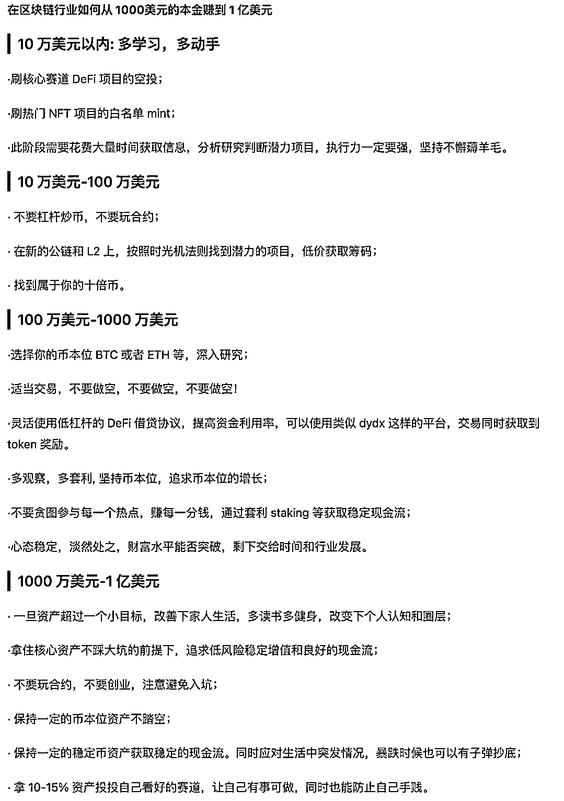

# Web3 新人必看之安全必修课

> 原文：[`www.yuque.com/for_lazy/thfiu8/nnn4hdx3wvws03fx`](https://www.yuque.com/for_lazy/thfiu8/nnn4hdx3wvws03fx)

## (28 赞)Web3 新人必看之安全必修课

作者： wenser2010

日期：2024-01-30

最近在航海家俱乐部看到亦总发了知名币圈巨鲸、鱼池矿场大佬神鱼的 0-1 亿美金的不同赚钱策略（来源：[`x.com/bitfish1/status/1751174787702174165?s=46）：`](https://x.com/bitfish1/status/1751174787702174165?s=46%EF%BC%89%EF%BC%9A)

正好借着这个话题，给有志于进入 Web3 掘金赚钱的圈友们一点安全类的背景信息，以免大家资产受损。

正文：

那些年在 Web3 踩过的“安全坑”，一个没中的话绝对是「天选之子」（根据严重性依次递减）——

1\. 助记词泄露

这是最致命的一种，常见的坑包括物理泄露和新设备、新钱包导入以及电子设备被黑，堪称真正的“一着不慎，满盘皆输”。之前亦总价值几千万人民币的 $BTC 被盗，就属于这种情况。

应对：助记词物理备份多份，或使用不联网硬件设备进行保存。

2\. 私钥泄露

如果是助记词泄露是“一锅端”，那私钥泄露更像是“一盘端”，也就是单个地址资产受损，常见的泄露方式主要是导出后的保存不当、网络软件发送和电子设备劫持，当然也不排除熟人作案下的现实操作盗窃。

应对：私钥原则上不触网，网络发送保存也采取分段甚至「加密保存」（比如最后 3～6 位采用凯撒加密），导出后减少发送点位等。

3\. 诈骗链接授权

进入 Web3 之后除了期盼暴富机会的降临，还有一件事情就是应对诈骗链接的泛滥，形形色色的骗局隐藏在 scam 链接之后，稍不注意就能让你「瞬间归零」——资产还存在，但已经不属于你了，这些链接主要的来源包括但不限于：

1）大 V 推文及评论区；

2）项目官推推文及评论区；

3）推特、telegram、discord 私信；

4）discord 社区公告频道、聊天区；

5）推特营销广告投放内容；

6）被劫持的正经项目官网；

7）谷歌、百度等浏览器搜索结果页面；8）微信群群友随手转发的（看似）热门空投领取链接；

9）opensea 等 NFT 交易平台被空投的垃圾 NFT 挂单授权的链接；

10）一个约你线上会议的 calendly 日历链接.....

应对：任何时候，任何平台，任何人的任何私信都要提起 120 分甚至 12w 分的警惕，虽然咱大部分人都只有三瓜俩枣，但骗子多数情况都是来者不拒的，这也是连 SEC 的官推都难以幸免的原因之一。

至于世界级知名杂志采访机会的垂青，或者投资机构大佬的主动私信，相信很多人也见识过类似的骗局，记住一句话：天下没有免费的午餐，除非这份午餐已经在暗中标好了其他的价码。

4\. 病毒软件

这个类型的安全问题常见于云服务器、远程控制软件、bot 领域和 gamefi 领域，之前有一段时间甚至出现了 gamefi 游戏病毒潮。

简单来说，就是你点击一个 .exe 或者其他格式的应用，然后电脑就相当于成了别人的提款机了，你的资产将会被分批转走，连地板价跌到 0.01 $ETH 的 NFT 可能都不例外。

应对：非必要不点击运行任何不明软件应用，无论是各类私信还是邮箱之中，亦或者微信群其他人发送的“神器”软件，不得不点击查看就使用虚拟机运行。

5\. 社工攻击

很多人可能对社会工程学攻击比较陌生，但这方面 Web2 领域的骗子已经技术娴熟到能够快速筛选目标并且快速执行了，简单来说，我们可以把社工攻击理解成对你做了一定调查后，为你“专属定制”的安全陷阱，比如冒充微信好友要求转账资金、假装买家求购你的珍稀 NFT、送上门来的工作机会、1：1 仿造的虚假账号精心准备的白名单名额等等，甚至 OTC 或场外担保群*假冒*担保人也属于这种。

应对：做一个「死抠细节的强迫症」，任何蛛丝马迹都作为疑点去看，宁杀错，不放过，小心无大碍，对别人抛出来的“饵料”一定要想清楚：

1）为什么他会选择我呢？

2）有什么值得推敲的支撑理由吗？

3）如果他是有备而来，他的目的是什么？

总体来说，应对安全问题的原则方法主要有 3 个：

1\. Don't trust, just verify.

（不要盲目信任，哪怕对方有 title 或者粉丝量等光环加持，也要多方交叉验证，从共同好友到物理信息以及即时软件，而且这只是第一步）

2.Slow down as you can.

（尽可能地慢下来去处理可能的骗局，无论是点击链接，还是授权签名，或者是运行程序，不了解的不动也好过盲目地瞎点一气，最后看着被清零的钱包帐户欲哭无泪）

3\. Be brave to ask for help.

（勇于求助，无论是自己身边朋友的，还是媒体交流群、NFT 社区、共识群，亦或者像

@SlowMist_Team

慢雾这样的专业安全团队，求助不可耻，更不要自己给自己预设“受害者有罪论”，觉得被骗是因为自己太笨太蠢，安全问题面前，每个人都可能是深陷其中的当事人）

最后的最后，再推荐 2 份书面资料，供大家避坑：

一、《Web3 生存指南之防骗反诈安全手册 V1\. 0（2022 年）》

飞书版本：https://e7qjl676i8.feishu.cn/docs/doccn2rvEMHefBYKvyTVRGwe7Pf?from=from_copylink

谷歌云盘版本：https://drive.google.com/file/d/14XeGdkLRC4wEyH2hdojcVqtxRFxVcY4L/view?usp=sharing

（这是一份更加针对新手 NFT 玩家的安全事例科普和防范注意事项）

二、《区块链黑暗森林手册丨慢雾出品》

微信公众号文章介绍：

https://mp.weixin.qq.com/s/A2XQEWlH25o8YsWjwCz2HQ

GitHub 地址：

https://github.com/slowmist/Blockchain-dark-forest-selfguard-handbook

最后，如果大家有其他关于 Web3 安全或赚钱的问题，欢迎在评论区交流讨论。如果你还有其他关于安全防范的经验之谈，也欢迎在评论区分享。

#Web3

* * *

评论区：

暂无评论

* * *