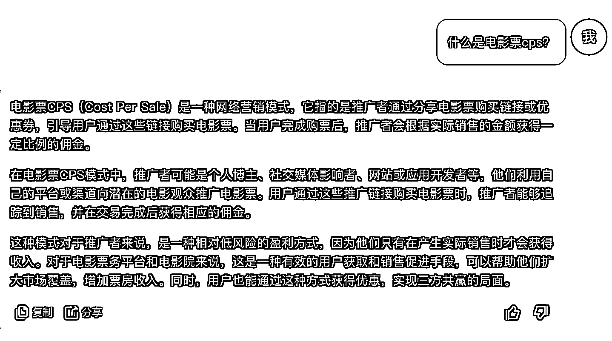
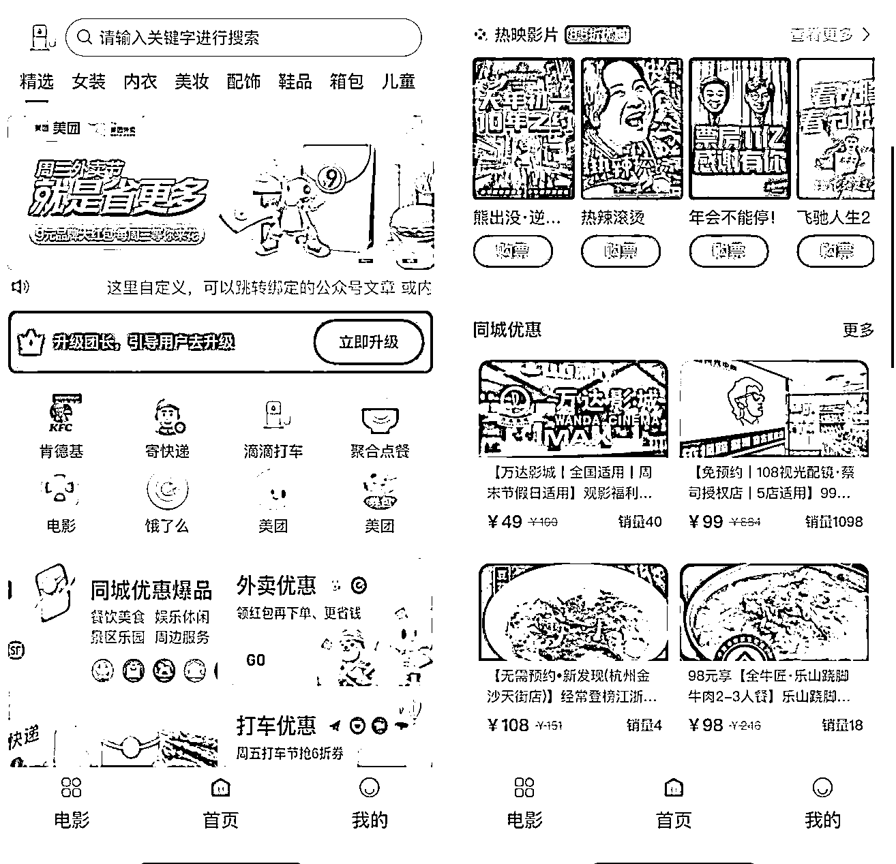
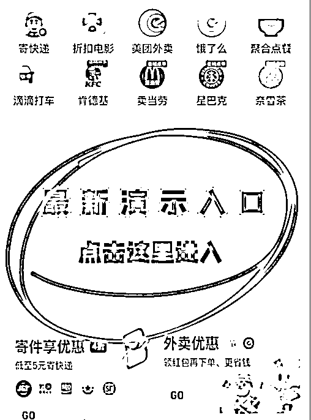
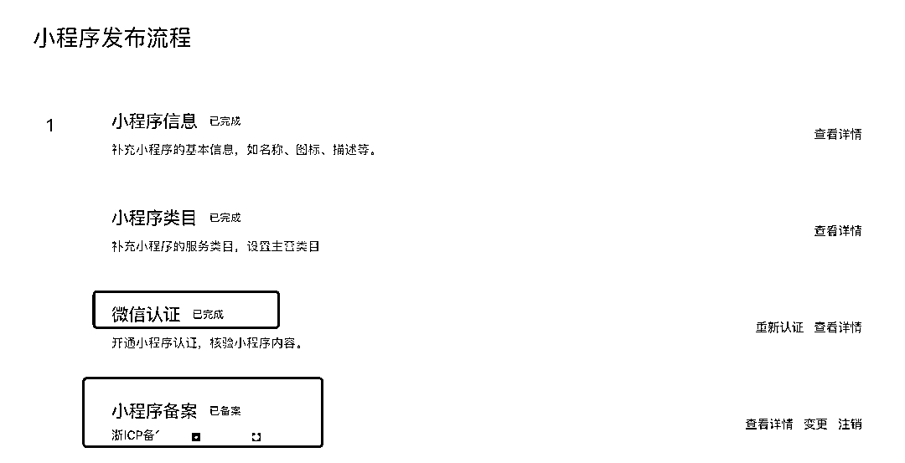

# 人人都应该有个属于自己的聚合 cps 小程序（自用省+佣金）

> 原文：[`www.yuque.com/for_lazy/thfiu8/zr66im0lbds16p40`](https://www.yuque.com/for_lazy/thfiu8/zr66im0lbds16p40)

## (26 赞)人人都应该有个属于自己的聚合 cps 小程序（自用省+佣金）

作者： 桔子@小桔圈

日期：2024-02-02

一，什么是 cps？

二，什么是聚合 cps？

三，自用省（优惠券）+赚（自用佣金）

四，聚合 cps 小程序怎么搭建？

五，疑问解答：

**一，什么是 cps？**

简单说，商家或平台给与优惠券和佣金，推广者帮商家或平台招募客户，客户使用优惠券消费得了划算，商家或平台获得了消费与客户，推广者获得了佣金，三方共赢。常见如淘客 外卖红包 cps 去年比较火的美团圈圈（本地生活）寄快递首重 5 元起  和一直都存在的电影票优惠等

**二，什么是聚合 cps？**

把以上这些几乎人们生活中都会用到的各种 cps 集合在一起，就是聚合 cps，可以为微信小程序，也可以为 h5 链接形式存在。

为什么  **人人都应该搭建一个属于自己的聚合 cps 小程序？**

**三，自用省（优惠券）+赚（自用佣金）**

**1.自用省****分享赚**对于普通消费者而言，因为各种消费基本你都有对应的隐藏优惠，所以自用是省钱的，很多做淘客的伙伴都知道，淘宝正常卖 100 的保温杯，隐藏优惠券可能高达 60-80，也就是不去查券就直接购买，就可能直接亏 60-80 元。

例如电影票，去电影院购买原价 40，聚合 cps 小程序 85 折，直接省 5-6 元

都说开源节流，赚钱不容易，但是必要的消费上，去通过隐藏优惠券省钱，那还是相当容易的，主要就是知道有这么个信息差。

如果自己搭建了一个属于自己的聚合 cps 小程序，那么除了有隐藏优惠券以外，还有相对应的佣金，例如电影票优惠后 35，还有 1-2 元左右的佣金。

所以，自己的聚合 cps 小程序，自己用+自己获得的佣金，如果一个月消费的多，一个月赚（省）几百还是可以有的。

  **2.配合自己的其他项目流量再次变现与提供福利**

大家多多少少都有项目或做过其他项目，聚合 cps 小程序最不挑用户， 只要会付费 上到 90 下到嗷嗷待哺，哪个不是我们的用户群体？聚合 cps 小程序本身追求的就是大而全，毕竟小而美 大而全 永远是冲突的

配合自己项目，有伙伴可能不太理解，我实际说个，

**网盘拉新 虚拟资料**诱饵，这类用户是不是可以把资料放到聚合 cps 小程序里，单独放个图，上面写着“某某资料 点击领取” **可以跳转绑定的公众号文章/内部文章页面 里面放你的二维码/自动付费链接**等

  

因为聚合 cps 小程序的不挑用户，所以我们只需要做到 2 步

**1.用户首次进入我们的聚合 cps 小程序**

**2.第一次体验消费得优汇/返用**（自己可以设置是否自用返用）

激活了用户，用户再次使用的概率就高了

有伙伴会呵呵，

不急，看看为什么各大平台会大几十 上百给与各自的**极速版**拉新报酬，他们就不怕这种地推拉新，用户拿到了大鹅就卸载了吗？

**四，聚合 cps 小程序怎么搭建？**

**聚合 cps 小程序搭建核心条件**

**一，一个个体或公司的小程序，个人小程序不行！**

**二，小程序需要认证+备案好，才可以正式搭建**

其他，没了

  **五，疑问解答：**

**1.个体小程序和公司小程序有什么区别？**

**答：成本不同**，其他没啥区别。个体目前通过我们服务商渠道注册，认证只需要 30，公司不管怎么注册，认证都需要 300.

  **2.我有个体或公司营业执照，但是没有注册过小程序**

答：我们有完整教程，按照教程操作就可以注册好，个体注册看我们教程，公司注册得有对公账号，要不然现在注册不了小程序

**3.我没有个体或公司营业执照，但是想搭建聚合 cps 小程序怎么办？**

答：要么就代办个个体，要么就我们有小伙伴会认证+备 an 好的小程序，你们可以沟通学习下

  **4.小程序认证和备案我不会，怎么办？**

答：一条龙搭建包含从注册-认证-备案的指导与代操作，全程跟随指导你扫码即可。

**6.我不想要小程序，h5 有吗？**

答：可以，需要认证服务号才可以搭建。

**7.聚合 cps 账号用你们的还是自己的账号？**

答：都可以，有搭建与独立部署，自己账号对接 cps 接口需要有服务器与备案域名。

**8.有演示后台吗？**

答：有的。

  

我是桔子🍊，加微备注生财

微：10038140

* * *

评论区：

暂无评论

* * *