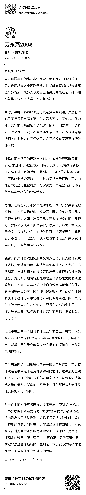

# 创业需要重视的话题

> 原文：[`www.yuque.com/for_lazy/thfiu8/lcsguwb487cuygm6`](https://www.yuque.com/for_lazy/thfiu8/lcsguwb487cuygm6)

## (精华帖)(264 赞)创业需要重视的话题

作者： Caoz

日期：2024-02-22

创业需要重视的话题。

* * *

评论区：

失踪的龙猫 : 不建议太敏感，如果严格执行，路边摊全部都要踩缝纫机😂
代号 f : 难难难
Darren : 如果真执行，在外面撒泼尿就得坐牢
强哥手记 : 太可怕了
张有财 : 理论是理论，实际是实际。
胖二十 : 说得是我[流泪]
江南 style : 看过《血酬定律》的一些案例，一般经济好的地区，执法人员会相对宽松些，经济不好的地方，因为需要创收，所以这一类执法就会更严格。所以会不会严格执行，取决于经济环境。
米柚 : 还有一个专利纠纷，著作权纠纷，有很多批量维权以及钓鱼执法的机构，小商户太难了

* * *