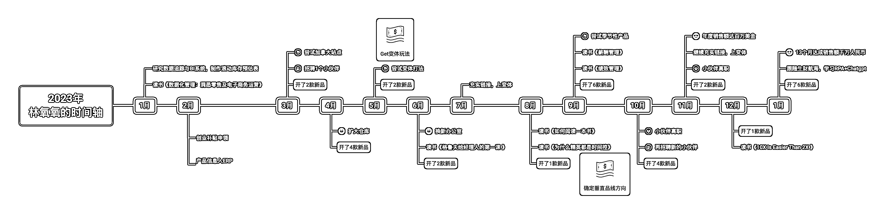
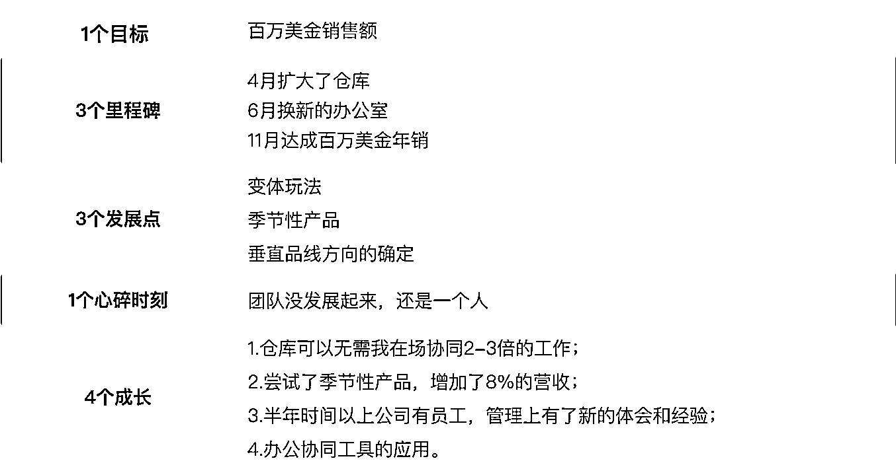
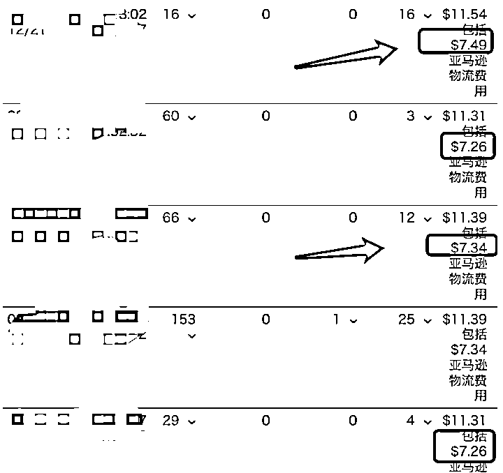
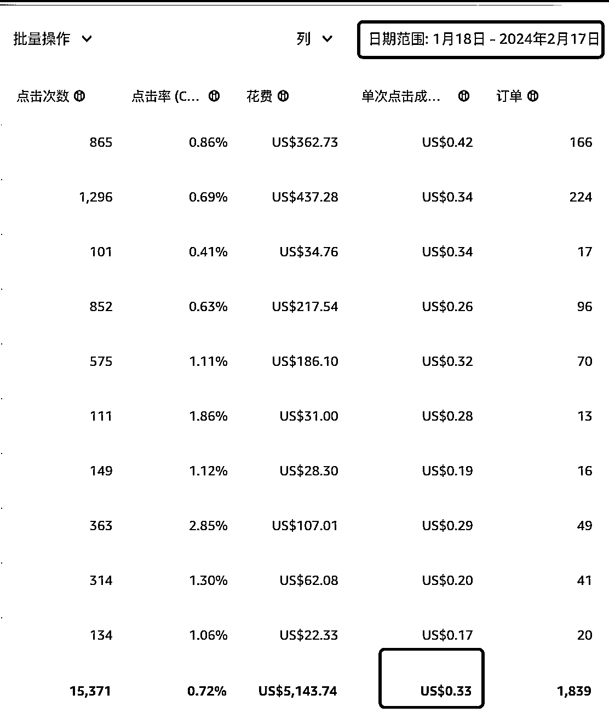
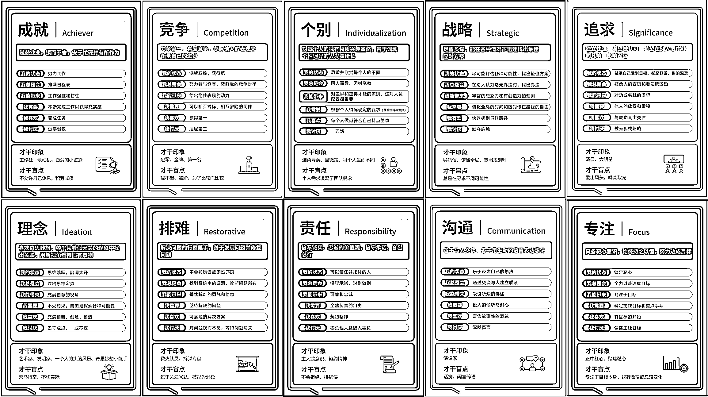
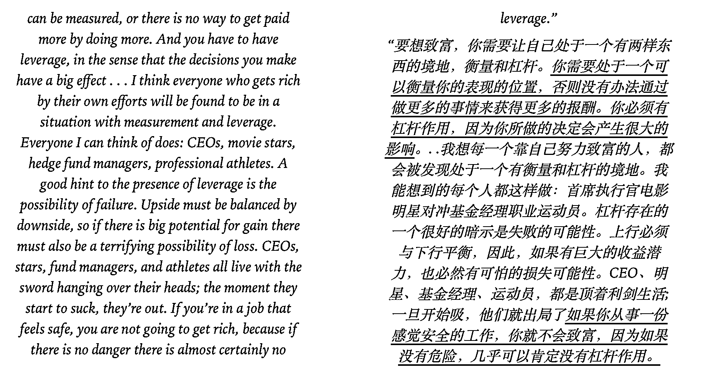
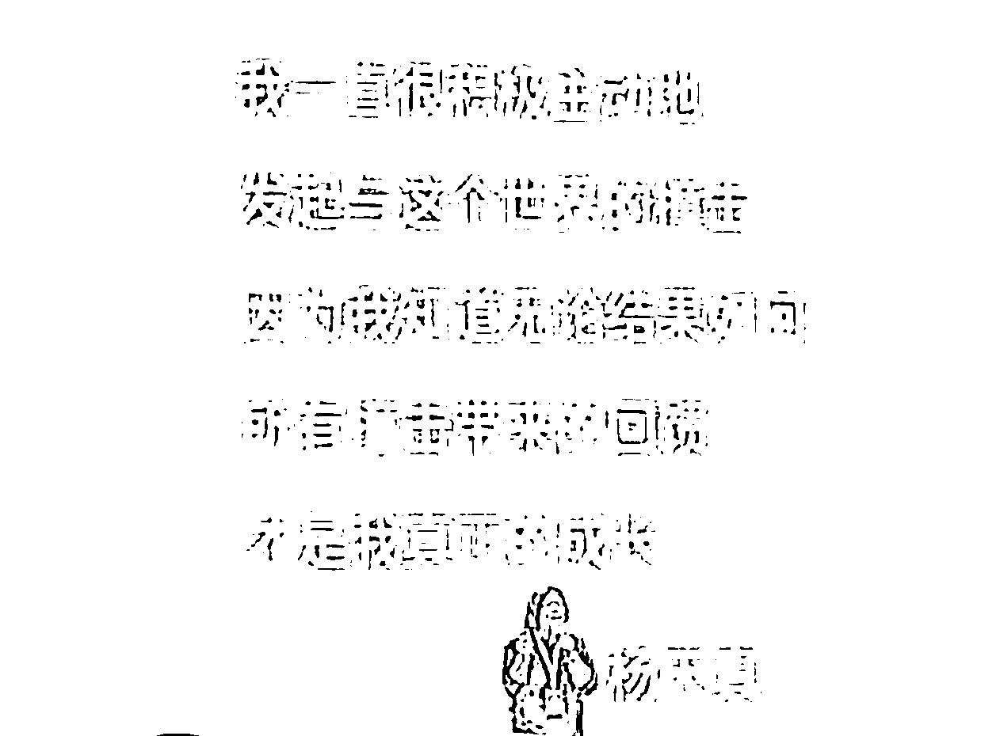

# 我是如何做到百万美金销售额的？

> 原文：[`www.yuque.com/for_lazy/thfiu8/tfq69rp7hwcvu3yt`](https://www.yuque.com/for_lazy/thfiu8/tfq69rp7hwcvu3yt)

## (精华帖)(231 赞)我是如何做到百万美金销售额的？

作者： Lissa Tam

日期：2024-02-18

生财有术的圈友们好呀，我是 Lissa 林氧氧，生财 5 年老圈友了，哈哈！

正月初九，开工大吉，先祝你新的一年一切顺利，红红火火～

先简单做个自我介绍：

Lissa 林氧氧，96 年创业女生，深圳搞钱女孩，电子商务专业，搞亚马逊的，18 年入坑，19 年从 0 到千万美金/年，20 年创业，创业未半而预算花光， 遂重启打工，21 年再度创业，10+万人民币起步，2 年时间 1 人达成百万美金年销。

23 年全年没在生财发过文章，沉浸在低头赶路上，忙碌且充实。年初了，抬头看天，和你分享我 2023 年的故事。

###   **一、 氧氧 2023 年的时间轴**

这是我的 2023 年时间成长轴。

2023 年，我开了 30 款产品，达成了 1 个目标，有 3 个值得纪念的里程碑，获得了 3 个发展点，有 1 个心碎时刻，得到了 4 个成长。

3 月开始招人，4 月扩大了仓库，6 月换了新的办公室，11 月达成了百万美金年销。这几个是我 2023 年特别值得纪念的事情。

一个是我有意识地在尽己所能，突破自己，搭建团队；一个是我的公司业绩在逐步往上走。

这些突破自我的成长点滴，对我来说弥足珍贵。

接下来，我想要和你分享，我从产品和运营端的玩法和思路，以及我在 2023 年的一些成长经验和 2024 年的规划。希望我的经验，能对你有意义。

  **二、我是如何做到百万美金的**

#### **（一）****关于产品**

我属于小资金创业，10 万+人民币起步。（之前分享过一篇文章：[我是如何度过亚马逊创业这一年](http://%E6%88%91%E6%98%AF%E5%A6%82%E4%BD%95%E5%BA%A6%E8%BF%87%E4%BA%9A%E9%A9%AC%E9%80%8A%E5%88%9B%E4%B8%9A%E8%BF%99%E4%B8%80%E5%B9%B4)）

我之前发过文章，关于公司增长，我的看法是，想赚 100 万，就做 10 个 10 万的产品，或者 20 个 5 万的产品。

起步不久、资源资金受限，这个策略，可以让我低成本测试，通过快速堆量，来达成目标。

因而选品对于我这样的公司来说，非常重要。选品的质量决定采购物流成本和推广成本，即测品总成本。

在这一个阶段，我在玩一个数学概率游戏。

**利润=销售额*利润率=选品成功率*选品数量*测品成本*平均投资回报率。**

也就是说，我只要拉高我的选品成功率，保证我的月度选品数量，定好选品 ROI，控制我的测品成本即可。

##### **👉 测品成本——优化产品物流费用**

测品成本单独拎出来再说，源自于其中的物流成本。

今年整体头程物流单价降低了很多，但是 FBA 费用一直在涨。我的一部分利润来源和我的选品空间，就在产品的尺寸优化上。

一方面是头程上，**我目前是实重产品和抛货产品结合在做。备补货一起，极大优化了我的头程费用**。

做了比较多的实重产品，那么我就有空间选择一些比较抛的产品。这些产品如果单拎出来做，成本会比较高，对于其他卖家来说，我的综合成本就可以相对更低，**即“总成本领先”**。

另一方面，**调整产品的尺寸和包装方式，来降低 FBA 费用。**亚马逊的规则一直在变，以及 FBA 配送费很多时候测试会有偏差，这个要时刻关注后台数据，不然一不小心就被多收了钱。小的东西，差 0.2 美金一个，30 单一天，就是 6 美金，365 天，就是两千美金。但凡有个五六个 ASIN，这就是上万美金了，这可是纯利润。

（同一个产品的颜色变体，不同 FBA 配送费）

FBA 配送费 60 天只能测两次，有时候开 case 还改不过来，可能是产品到了亚马逊，被挑到那个正好包装口松了一点，尺寸超了。这种情况下一定要及时优化包装方式，换 SKU 发货，避免后续的货被收了高配送费。

##### **👉 选品成功率及开品数量——找垂直品线**

在不包含变体拓展的情况下， 2023 年我开了 30 个产品。[我算了一下，我的 2023 年的开品成功率，去到了 90%](https://t.zsxq.com/17xUu1ZNh)（指没有被淘汰继续在补货备货的产品）。

当然，这也可能源自于我的要求不高，能正常销售，不咋压资金的情况下赚的也还行，我就留下了。

**我的拓品思路，可以总结为：在垂直品线里做精铺。**

第一年创业，一切都是懵懂的状态。通过一年时间，在产品方面，沉淀下来了对品类、产品材质的了解，也积攒了一些友好合作的供应商。

有了这些积累，23 年开始沿着产品材质、变体、以及人群需求方向，做垂直拓品。同时借着这一年来积累了几条优质链接，于是顺着品线又尝试做了一波季节性产品，效果非常好。

我的打法其实更偏向于精品，只是说在产品出单数量上并没有很亮眼，于是用产品数量来凑了。产品数量多也有多的坏处，这么说吧：**做简单产品和做价值感更高的产品，投入精力其实是一样的。**单品的选品制作流程、仓储、以及后续的推广精力和 ERP 等周边费用，实际上是一样的。只是碍于资金受限，只能**选当下最优解**。

要清醒地认知到：**我的目的就是为了赚钱。我就是个普通人，创业就是在自由市场里抢钱。**

**变体、垂直品类、季节性产品，这三大点，都是可以帮助我拓展产品数量、增加市场占有率的方式。**

同时，为了提高产品成功率、降低运营的难度，我的产品会做改色、组合、换材质等等方式，来做差异化。

**找到垂直品线的方式，其实核心真就是积累。**

先找能做的，然后通过一段时间的积累和市场认知，慢慢就能找到一条适合自己的垂直品线。后面的时间，就是在拓展品线，以及找更好的品线的路上。

#### **（二）****关于运营**

我在运营上有 2 个重点，1 个思维转换。

2 个重点是：有效流量和有效转化。

1 个思维转换是：付费流量的目的是放大，广告投放是为了赚钱。

##### **👉 有效流量和有效转化**

销量=流量*转化。想要增加销量，最快的方式就是提高有效流量。最省钱的方式就是提高转化。

**即：无限提高产品的有效流量，以及找到产品的有效转化点，进行优化。**

平台电商最大的流量来源是搜索流量，而搜索词下对应的，是一个个真实的消费者的需求。

为什么要说有效流量？**有效流量就是将我们的产品曝光在最有需求的消费者面前，从而达到转化率最高、广告投入产出比最高的结果。**

那什么是有效转化？这是我 23 年实操后得到的一个比较大的感触。“有时候我们所关注的点，不一定是用户所关心的”。

比如有的产品的颜色、一些简单的配件、某类产品的图片的精致度等等，不一定是用户关心。要保护精力，在用户关注的地方发力。

回到词，即：找词，做词库，尽可能找到足够多的相关度高的词。同时分析产品的曝光渠道，通过渠道+词，来拓展更多的有效流量。

回到人，即：研究消费者，调研用户需求、痛点，从而优化产品和链接，击中痛点的同时，找出更多的关键词，提高产品的转化率。在有效转化点上实在不确定的时候，就及时上架，尽快 AB 测试。

##### **👉 付费流量是为了放大盈利**

我们做付费流量，主要有 2 个目的，一是直接盈利，二是为了保住免费流量。

在此前的工作经验里，大部分时间我们的广告投放，是为了推排名，换言之“战略性亏损”。但自从摆正心态，成为一名商人之后，我把付费流量的方向主要定位在盈利上。毕竟咱也不是什么大牌，需要巨量品牌曝光。我把保住免费流量这一趴，用“做官方 Deal”的方式来搞。

广告的打法上还是使用上面的“有效流量”策略，核心目标是高转化率。

归结成具体操作，就是**“选词”“广告配置”“否词”。**

**把产品以符合且稍微超出客户预期的方式，通过能调动最多客户五感体验的方式，展示在精准客户面前。**

调动最多客户五感体验，对应的就是广告配置，视频展示效果>图片展示效果>文字展示效果。要让人“看得见，摸得着，身临其境”，因此我的大部分产品上架后会立即投视频广告，效果确实是很不错的。

符合且稍微超出客户预期，符合是“情理之中”，让他愿意点进来，稍微超出是“意料之外”，是为了打动他，进行购买。为啥特地把这点拎出来说，是因为有的低价产品，要足够“low”，这证明你确实没预算了，没挣他的钱。如果太过于花哨或者高级，就不属于这类低价产品的用户预期了，他可能还会觉得，是不是有什么问题。要在“情理之中，意料之外”，这样是最好的。

此外，精准客户，就是要做好人群定位，新品不要贪心，定位好一个人群即可，先把数据做好。人群定位好后，对应的图片和文案，才能一击即中。人群定位和投放词是否精准，可以直接看点击率。正常而言，我的产品的点击率要做到 0.8%以上才行，新品最好有 1%以上的点击率。

**此外，搞流量，一方面是提高有效流量，另一方面是降低无效流量，让链接更为精准。**也就是及时否词，及时更新投放词。

亚马逊广告匹配逻辑几乎每年都会更新，23 年更新的规则，会导致广泛投放投得非常泛，但是很多运营是不清楚的，没有及时否词，修正产品的算法定位的话，后续的广告花费会逐渐拉高。特别是视频广告，bid 相对会高一点，如果不及时否词，会造成很多无效花费。

投放这件事情，我如今会看得更纯粹了，“给产品带来的自然排名的增加”是附带效果。我更看重广告投放 ROI，投放有没有赚钱这回事，决定投放是否能长久。至于关键词下的自然排名，更和产品的点击率和转化率相关。那么就可以和上述提及到的人群定位+官方 Deal 来拉。

通过这样的方式，在我的产品类目，我的广告单次 bid，是可以做到 0.5 以内的，平均 0.35 左右。而且运营相对是比较轻松的，没有太多七七八八的事情，专注在拓词、完善页面，和开品就可以了。

(图为某一个品类，取了最近一个月的数据)

### **三、我的突破成长**

团队组建和管理是我极其不擅长的事情。这件事情我实在是太没有经验了，以前是站在巨人的肩膀上，显得轻松，现在真自己创业弄，左右为难。团队，成了我的瓶颈，也成了我突破成长的方向。

去年，我在公众号写下，2023 年我有两个目标，一是达成百万美金成就，二是希望达成五人团队。

3 月份开始招人，到 10 月份员工离职再次招人，到 11 月份再次又只剩我自己。我把这一条归结为我 2023 年的“心碎时刻”。

23 年我花了很多时间在提升自我管理能力和 HR 方向的招人用人绩效管理和激励上。

整个经历其实有一点好玩的，想和你分享一下。

#### **（一）****关于我在招人用人这件事上的成长**

我是在 22 年的时候，第一次招人带人，感受到了自己的问题：我不太清楚如何与运营沟通，如何激发对方的能力。我容易给对方比较大的压力，并且无法为其排解。

彼时我在复盘我的职场跳动经历，思来想去，觉得我自己应该有比较大的问题。于是我去做了个盖洛普优势测试，并找了醒醒为我解读。

(我的盖洛普前 10 才干)

测试与解读的结果 belike:

我就是个天生爱竞争爱卷的人。我还慕强，虽然我菜，但我还就只爱和贼优秀厉害的人一起玩，这样能激发我的卷度。因此我还希望身边的人和我一样是工作狂，像我一样卷和努力。如果他没有像我一样努力，那就是不努力。

可怕不，绝望不 ಥ_ಥ

当我和醒醒一层层剥析我的底层特质后，我就知道什么叫做“有的特质是成就你的原因，也是阻碍你的原因”。

**妨碍人的不是 TA 的底层特质，而是****TA****利用特质的能力。**

然后我开始觉察。努力觉察。我的情绪逐渐变得稳定，也是基于此。

当运营做事情不符合我的预期，我开始想，是他不愿意，还是不会。我放弃让运营自己发挥，放弃“测试”心态，转向“信任”，把我想要的效果、结果明确告知，再让运营放手去做。中途检查，如果不符合预期，及时纠偏，确认对方意愿程度，如果是不会，就好好教，再把教的内容落地 sop。

这些对于其他人可能是非常简单或者理所当然的事情，对我来说，真的非常辛苦。我很努力地在提高自己觉察、控制和利用我的性格的能力。

2023 年，再次招人，我开始研究绩效管理和薪酬管理，想要通过一些工具，来提升工作效果和员工满意度。

然后我才发现，原来好多东西，都是在绩效管理内的。招的人做不好事情，有可能就是他不会做，对人要有规划和安排，有人才发展计划，要有绩效有考核，要有追踪有辅导，辅导是为了把事情做得更好，所有的这些内容，一起构成绩效管理。

很多人和我说过，对于小公司来说，这些过于复杂了。小公司的核心在于一句话“带着团队打胜仗”。

但对于我来说，或许他的价值在于，了解如何才是一个好的绩效管理和激励方式，我才能知道如何在不同的阶段选择对应的方式，野蛮生长吧。有问题不可怕，可怕的是不知道问题出在哪里。

当然，在学习和了解团队组成和管理这部分的内容同时，我也走了许多弯路。

####   **（二）****关于团队的经验**

刚出来创业，多少沾了点大公司病。这体现在招人的心态转变上。

我的招人心态 belike：

before: 我们一起做一家公司，公司是我们的！

then: 来我这里，我带你成长带你飞！我为你的成长负责！

now: 把事情踏实做好就可以下班了，发展空间是有的，成长需要自己负责，但是如果你想，我愿意带你飞！

**👉误区一：把员工的成长当作自己的责任**

回归到用人的本质上，就是价值交换。让员工在公司有所成长，是公司的绩效管理的内容，一是为了更好的胜任工作，有所晋升，二是为了留住员工，谁不想干得开心、有成长有收获呢？

但是每个人的成长应当是自己负责，人与人所期待的不同，我们可以给空间，但最终成长成什么样子，是自己决定的。

**👉误区二：把招人看得太难，拖慢了做事的脚步**

23 年身边有太多朋友踩了招人的坑，导致我也跟着担惊受怕了。心里抱着“招人”很难的想法在市场上海选，以至于团队搭建没有很好的进展。

事实上，市场上什么样的人都有，那么如何招到合适的人，就是招聘渠道的问题了。

**👉成长一：人才是不流通的（from 涛哥）**

像我招聘大部分时间都是在 boss 直聘上次海选，但真正优秀的人才，都是不经过市场的，大多内推、各个公司间的资源互换挖走了。初创公司，就是带着一帮能力各异的人打胜仗。所以初创公司很多时候，更希望招的是“有责任心、靠谱”的人，态度比能力更重要。

**👉成长二：公司招人，赚的是人的成长价值**

公司招人成本其实很高，一个人到公司，前三个月一般都是亏的，特别是没经验新人，前半年可能都是亏的。要一直到半年到一年以后，新人熟悉公司业务了、技能也成熟了，那个时候公司才能有盈余，如果能多呆两年，公司就赚到了。我不奢求一个员工能在我这里呆很多年，能互相满意呆两年，我认为就非常好了。其二，初创公司团队是很不稳定的，人才流动率很高，好不容易把人带出来，人就跑了，这个是最痛的。初创公司最好的还是招有经验的直接用，获得直接产出，并且要想办法留住人。

**👉成长三：人用不好，可能是人没选对**

我在很多时候，人用不好我会先质疑自己的能力。但很多时候真实情况可能是双方的匹配问题，“是否把对方放在合适的地方”，“以及团队间的性格是否合适”，这决定了大家干得开不开心，能否获得正反馈。正反馈带来的情绪价值的满足，远比直接给钱来得更重要。

**👉成长四：招极度信任和喜欢自己的人**

招人要招极度喜欢和信任自己的人，老板要成为精神领袖**（from 李鲆）**。22 年的时候我招人会给对方看我的公众号内容，并且有一些是从圈子里来的，大家的信任度和配合度其实会更高；23 年全部来自于市场海选，实际上信任的磨合花了比较多的时间，并且流动率相对是更高的。

**👉成长五：招人一次最少要 2 个**

其实如果第四点能做到，这一点就不是一定的了。在没有很强的信任基础和员工影响力的情况下，公司的氛围对于新进来的员工是很重要的，招 2 个及以上，一来是他们有话说，办公室不会很尴尬，相对放松一点，二来是大家可以有一些良性的竞争关系，相互学习、相互竞争。一个人在没有对比的情况下，是非常容易摆烂的。

### **四、2024，十倍增长**

22 年我们在生财在谈论适应焦虑、活在当下，23 年我们在生财谈论复利（纳瓦尔宝典）、个人才干优势的利用，24 年我们在生财谈论 10X 增长。

在看完《10X is easier than 2X》这本书，再思考如何做到 10 倍增长的时候，一开始是完全知道怎么办的。这可是千万美金啊！天呐！

然后慢慢沉下心来，开始思考如何“做到”，转换思路，有了一些相对清晰的画布。

引用亦仁老大的话：

“10 倍在这是泛指，不要线性的努力，而是持续的跳出现在的思维框架。通过这种 10 倍的思维方式来进入到更大的价值空间。

在战略上努力，而不是在战术上卷，不断找到更大的增长空间和机会。

一直这么想这么做，最终可能是五倍的增长，也可能是百倍的增长，达成的时间点，慢一点快一点都行。”

  当我开始思考十倍的时候，我发现当前的模式是无法支撑我做到千万美金的。

**我必须得换模式，加杠杆。**

**组织杠杆、产品杠杆、乃至资金杠杆。**

回到最开始的话题：

“关于公司增长，我的看法是，想赚 100 万，就做 10 个 10 万的产品，或者 20 个 5 万的产品。”

我实操下来累成狗。但确实也是真正切切做到了。

**百万美金，是我靠努力和蛮干做上来的。这个时候的产品模式，在初创没有任何资源的时候是很适用的。这意味着，你也可以通过自己的努力和蛮干，做到百万。**

一年后，在有了一定的资金和资源积累下，我的观点有了一些迭代：

**在验证成功的商业模式下，尽可能专注于做一些价值感更高的产品。**

“If you’re trying to make $10 million, rather than solving 100 problems at $100,000 each, it’s much easier attempting to solve a single $30 million problem——10x Is Easier Than 2x”

借鉴“10X 增长”的观点，专注于解决更为垂直和专业的问题。相较于分散精力解决 100 个问题，集中精力解决一个 3000 万美元的问题要更容易。

对于做精品/爆品的公司，或许更有体会。就是你想赚 100 万，可能是 2 个产品赚了 150 万，剩下的 8 个产品亏了 50 万（例子来自于刘钦）。

当然，不乏很多铺货公司做得非常好，但其需要强大的供应链资源和供应链管理能力。这完全不是我擅长的点。

对于我来说，我的优势在于对消费需求的捕捉以及精细运营产品的能力。那么，

2024 年，我需要加产品杠杆，即：做价值量和成本投入更高的产品；我需要加组织杠杆，即：招人，拉团队，拉高人效团队。

（图片来自于《10x Is Easier Than 2x》）

**创始人最宝贵的资源，是自己的时间、注意力，和精力。**

把最重要的 20%的事情提炼出来，把精力集中在最重要的 20%上，放掉那不重要的 80%，腾出时间多思考、多学习、多探索，公司才能有更长远的发展。

创始人，才能有更长远的成长。

员工，才能有更大的空间。

最后总结一下：

创业肯定是艰难的，正如打怪一样。你不要怕他，你要当作这是一个个挑战和游戏。在玩游戏的过程本身，就是成长。

（图片来自于生财圈友线下见面会，黄小刀老师的分享现场）

2023 年的成长，感谢亦仁老大（生财有术）、杨涛涛哥、纪老板、高翔、李鲆、醒醒同学、拓跋勇、Lenry 的无私经验分享，感谢你们，让我逐步精进！

以下是我在生财有术的精华帖（按时间排序）

[`t.zsxq.com/03E27qvjM`](https://t.zsxq.com/03E27qvjM) 手把手教你如何选出月入上万的单品

[`t.zsxq.com/03RvRzFqr`](https://t.zsxq.com/03RvRzFqr) 我是如何毕业两年晋升为跨境电商大厂经理的

[`t.zsxq.com/03AUZrVZn`](https://t.zsxq.com/03AUZrVZn) 手把手带你在亚马逊开店卖货

[`t.zsxq.com/03QneyJyJ`](https://t.zsxq.com/03QneyJyJ) 10 人团队做亚马逊年营收 7000w 的方法论

[`t.zsxq.com/03z3NJa2b`](https://t.zsxq.com/03z3NJa2b) 疫情下，跨境电商还有机会入局吗

[`t.zsxq.com/033nu7MFM`](https://t.zsxq.com/033nu7MFM) 不靠广告，如何在亚马逊 3 个月把一个产品做到 100W 销售额

[`t.zsxq.com/03MFMjQF6`](https://t.zsxq.com/03MFMjQF6) 我是如何 3 个月时间推出一个类目老大商品的

一篇分享贴

[`t.zsxq.com/17KzThejb`](https://t.zsxq.com/17KzThejb)  我是如何度过亚马逊创业这一年（经历/营收/时间管理/日常）

最后，因为业务增长，有一些招人扩团队的需求，求两位优秀的 1-2 年经验的亚马逊运营同学，欢迎来撩！

感谢生财让我们相遇～

* * *

评论区：

BLUE : 看了你分享的很多帖子，很棒，学到很多。
小明摘葡萄 : 经历过才知道一个人有多累。
谢雪峰 : 感谢分享！
章果老 : 文章写的很好，可读性强
芷蓝 : 写的真好，尤其是最后一段，只筛选，不培养
浅浅 : 感谢分享
Feynman : Lissa 大神出山啦，感谢你的帖子，2 年前刚开始搞亚马逊也是选了 N 个品踩了很多坑，这一年多开始走超级大单品的模式，销售也将突破百万美金了
土拨鼠 : 同做亚马逊可以加一下好友吗

* * *