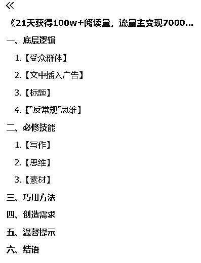

# 21 天获得 100w+阅读量，流量主变现 7000+

> 原文：[`www.yuque.com/for_lazy/thfiu8/lmm8ff83c9uz1bwc`](https://www.yuque.com/for_lazy/thfiu8/lmm8ff83c9uz1bwc)

## (60 赞)21 天获得 100w+阅读量，流量主变现 7000+

作者： 微微

日期：2024-02-18

**祝大家大年初九开工大吉！**

你好，我是微微，一名拆书写作者，今天咱来分享一下在 12 月航海所取得的成绩。

**在 12 月的「公众号爆文写作（原创）」航海项目中，短短 21 天依靠流量主变现 7000+（然后月入 1W+了），创作多篇原创 10W+爆文、每天稳定 3W+阅读，单号累计阅读量达到 100W+的成绩。引流到私域 100+人，后续还可以转化变现。（而且所写的一篇日志还被亦仁老师点赞了！）**

**（同时，不仅被邀请到航海大群作为结营唯一一个压轴出场分享的船员，而且新开的号在航海结束一周后，成功进池突破日均阅读量 1W+）**

加入生财有术已经快一年时间了，前半年我和很多新手小白一样，面对生财如此庞大的信息流、信息差、资源库，完全不懂得该如何选择项目、该如何起步、该如何变现。

过于迷茫会错失很多机会，迟迟不下手会产生内耗焦虑，这也是小白长久停留在新人阶段的根因。**坏脾气的小可爱老师说过：犹豫就会败北。**

越是举棋不定，越是会在时间的过滤下丧失自信，其实大部分人的智商都一样，你只是需要一个开始的动作，正如生财有术广为流传的一句话：何以解忧，唯有实战；躬身入局，把手弄脏。

我们需要输入，但是更需要输出，不去勇敢试错，是不会知道自己适合什么的，而新手小白往往有着一个致命的弱点：“我怕坚持了但是没有效果，然后白白损失了时间成本。”

真相是：试错也是成功必经的环节，你只有不断地填坑，才能拥有一步步踏上上顶的垫脚石。

如果你仍然不知道自己该做什么，**我觉得按照理白老师分享过的一点去做是最正确的，那就是：执行力是前提，可以先去尝试正反馈明显的事情。**

就像是鱼丸在朋友圈里分享的：并非年入百万才叫成绩，也不是升职加薪才叫成长，迈出第一步尝试，开始 1%的改变，获得正反馈的每一天，都是值得欢呼的日子。

**而公众号爆文写作（原创），就是最好的出发点。（小 Tips：过年期间连续七天日均 20W+的阅读量，节假日的流量非常猛！！）**

详情请移步飞书阅读，确保阅读体验：

[`eqc9f6vzuhv.feishu.cn/docx/GqPgdVtAZoTobBxixYmcYobUnZb?from=from_copylink`](https://eqc9f6vzuhv.feishu.cn/docx/GqPgdVtAZoTobBxixYmcYobUnZb?from=from_copylink)

  

* * *

评论区：

微微星光 : 有新感悟 参加完航海到现在我几乎没爆过 哎
微微 : [机智]日更、受众群体、标题，先从这三方面优化，其中日更绝对不能停。
Denggh : 每天发布文章数量多少篇，能分享下嘛～
微微 : 当时是一个号至少 2 篇，多的话不超过 6 篇。
Denggh : 好的谢谢

* * *