# 半年变现 20W，普通人如何搭建“强变现”朋友圈

> 原文：[`www.yuque.com/for_lazy/thfiu8/pqg98cy0prvtaidd`](https://www.yuque.com/for_lazy/thfiu8/pqg98cy0prvtaidd)

## (33 赞)半年变现 20W，普通人如何搭建“强变现”朋友圈

作者： 公子正

日期：2024-02-20

大家好，我是公子正。

上个月，侥幸在粥左罗老师的万元产品【顶峰会】分销榜单上，拿了榜一。

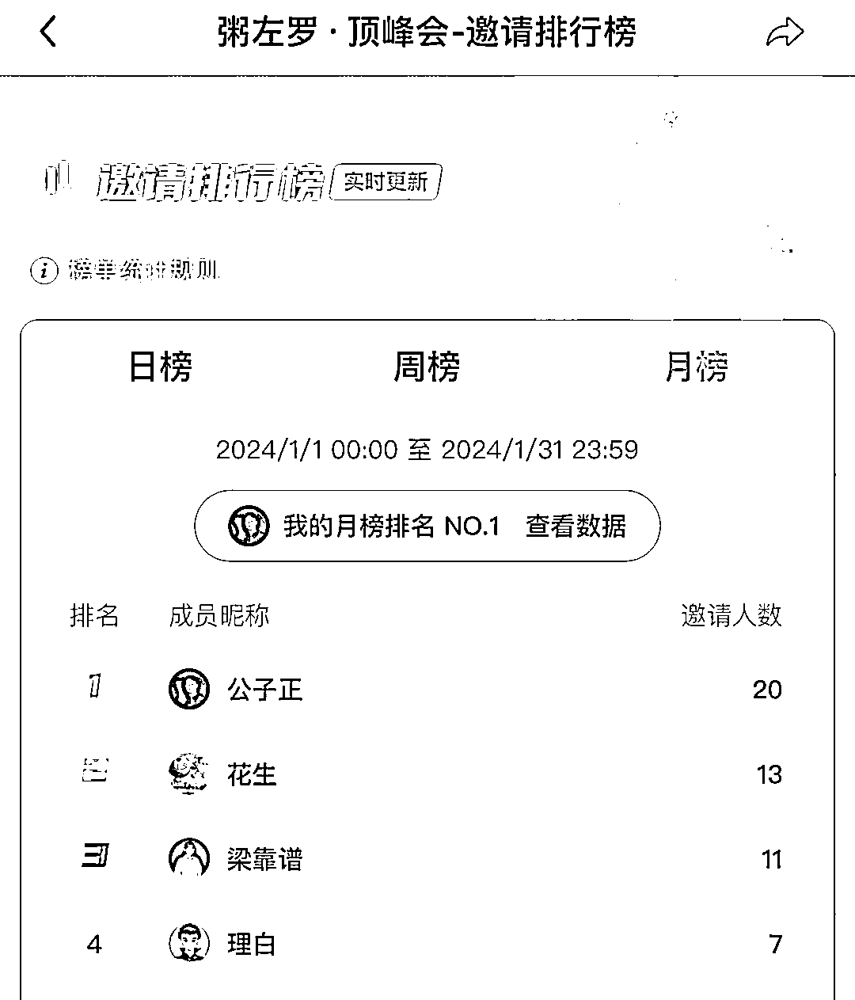

我从去年 9 月加入顶峰会，至今在粥老师这领了 15 个 W，加上我自己的社群和合伙人上的营收，这半年已经变现超过 20 万。

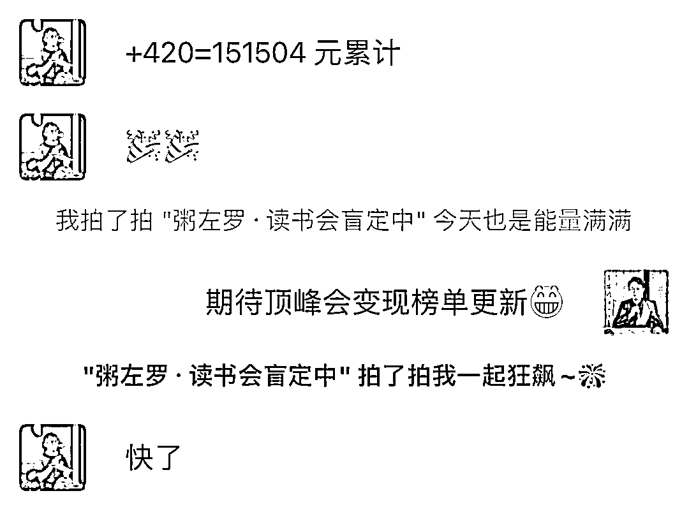

而这些收入，都离不开我日复一日地发朋友圈。

我的偶像刘德华先生曾说：**“得到的要给人，学到的要教人。”**

接下来，我将毫无保留地分享，如何从 0 开始搭建朋友圈，跑通强变现。

本次分享，分为三部分：

**第一部分、经营微信朋友圈的三大价值**

**第二部分、朋友圈实现“强变现”的底层逻辑**

**第三部分、如何搭建强变现朋友圈**

**√第一部分、为什么要经营朋友圈？朋友圈的三大价值。**

19 年，我开过一家小超市。那时从年头干到年尾，除去房租水电，能赚个十来万。

但缺点是，从早到晚都得有人在店里看着。而且附近的客流量是固定的，最多不超过一天不会超过 50 人，也就是说，它的收入上限基本是固定的，很难有什么突破。

这还算是好的，毕竟多少赚到了钱。更多开店的，是赔得血本无归的。

那几年很多朋友开奶茶店、餐饮店、服装店，一毛钱还没赚到，就先砸进去几十万加盟装修进货。结果因为疫情，入不敷出，只好关门大吉。

当时我就想，有没有什么生意，能够满足下面三点：

**一、不用受地点限制，整天绑在门店里；**

**二、上限很高，可以持续积累增长；**

**三、风险很低，赔了也不会倾家荡产。**

**而经营朋友圈，完全符合上面三点**。

首先，不用受地点限制，一台手机，一张能上网的电话卡，就可以实现随时随地运营。

其次，上限很高，随着微信里精准客户的增加，自己营销技巧、行业口碑的积累，会越做越好，理论上没有上限。

最后，风险很低，最多就是浪费点时间、电费，网费而已。

所以，像经营一家店铺一样，经营朋友圈，可以将它发展成做成一个长久稳定的生意，是一件性价比极高的事情。

以上，就是经营微信朋友圈的三大价值。

**√第二部分、朋友圈实现“强变现”的底层逻辑**

首先，明确一下，“什么是强变现朋友圈”？

我的定义是：**能够持续让用户因为你的朋友圈购买高客单价产品。**

很多人觉得不可思议，毕竟平时朋友圈点赞的人都没几个，让人直接掏钱，还是几千上万，咋可能？

其实没那么玄乎，这点事儿，古人早在两千多年前就想得明明白白了。

小时候我们都学过一篇课文《邹忌讽齐王纳谏》，里面有一句话很经典，道出了人际关系的本质。

“吾妻之美我者，私我也；妾之美我者，畏我也；客之美我者，欲有求于我也。”

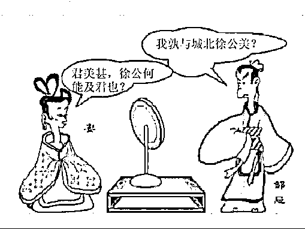

翻译成大白话就是：“老婆觉得我比徐公帅，是喜欢我；小妾说我比徐公帅，是敬畏我；客人夸我比徐公帅，是有求于我。”

**总结就是，别人关注我们、偏向我们，选择我们，要么是因为喜欢和信任，要么是因为觉得我们有价值。**

**当喜欢、信任、价值足够，用户又有需求，那么付费是顺理成章的事情。**

而打造“强变现朋友圈”，本质就是经营微信里这三种关系的人数。

先说经营喜欢，这个其实很难，毕竟咱们都是不是人民币，做不到人人喜欢。

再说塑造价值，这个性价比不高，因为圈子里总有比你厉害，价值比你高的大佬。仅靠价值，你很难获得优势。

**而经营信任，才是普通人做生意，可行性最高的策略。**

比如很多人朋友圈里都有房产销售和保险销售，但等买房或者买保险时，依然会先问问亲戚朋友。

是因为亲戚朋友更专业吗，当然不是，只是他们更让我们信任罢了。

所以，除了经营喜欢和塑造价值，我们更应该做的，是让用户对我们产生信任。

以上，是打造强变现朋友圈的底层逻辑。

**√第三部分、如何搭建强变现朋友圈**

刚刚提到，打造强变现朋友圈的底层逻辑，是和用户建立信任。

那什么是信任呢？

在互联网上，信任其实是一种感觉，或者说是一种主观的判断。当用户觉得可以依赖你、相信你、并愿意与你有更多的互动时，那么就可以说你拥有了他们的信任。

搭建强变现朋友圈的过程，就是和用户建立信任的过程。

如何搭建？可以从两个方向入手：

**1、微信门面包装**

这是个看脸的时代，朋友圈也不例外。

任何行业，人们都会对看上去更专业、更有内涵的人产生好感，进而生成信任。

比如都是服务员，大家对空姐就特别崇拜，还不是因为人家包装精致，气场上就赢了。

所以，如果你的微信门面包装得好，用户自然而然会觉得你很认真、很用心、很专业，天然就会更信任你。

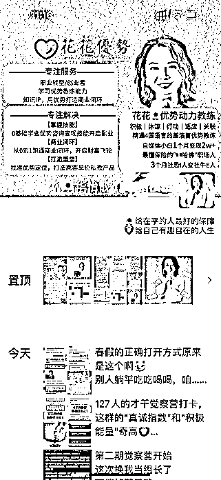

举个例子，这个是之前加我的一个同行，她是做优势动力教练的，虽然我不知道是啥，但是不是一看就觉得不简单？是不是一眼就能知道她能提供什么，价值在哪，给你的感觉更专业、专注，更值得信任？

大家对比下看看自己的朋友圈包装，感受下两者的信任值是不是不同。

那我们怎样去包装微信门面呢？

很简单，从三个地方入手：

01 头像

02 昵称

03 朋友圈封面

**咱们今天先说第一点：如何打造高信任的微信头像。**

头像是我们在社交媒体上与别人互动时，第一个被注意到的身份信息。

让我们想象一下，如果你看到一个模糊或不专业、没有显著性（特征），甚至“不知道你是谁”的头像，比如这样：

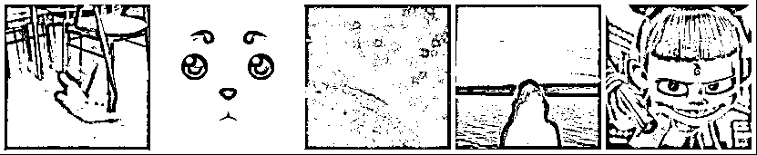

我们问一下自己，你会刚认识不久，就给上面头像的微信好友哐哐打钱吗？

我想大部分人都不会，毕竟谁的钱都不是大风刮来的。

为啥？

因为未知=风险。从头像上看不到任何专业性和可靠性，那我们心理上肯定很难去信任对方。

一个卡通人物、风景图片的头像，肯定没有一个真实的且专业的形象，更让你感受到信任。

比如这样：

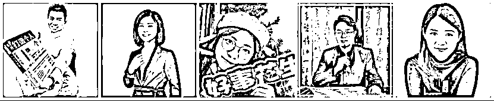

那么，我们应该如何选择头像，分享 5 条建议：

① 真人形象，用最近的照片，避免使用与现实不符的图片。

②条件允许，可以去影楼拍更清晰、专业的形象照。

③表情轻松自然，切忌严肃凶狠装逼。

④服装得体，可以选择代表性的道具，例如粥老师手里拿的《学会写作 2.0》

⑤最好有显著、吸睛的颜色和风格，快速吸引用户注意，并坚持长期地使用这个头像，让用户牢牢记住。

**再说第二点：如何打造高信任的微信昵称。**

昵称对于我们在互联网上做生意的重要性也是不可忽视的，一个好的昵称，可以快速引起用户注意，也可以让用户印象深刻，有需求时第一个想到我们。

通常满足以下一点或几点要求：

①与业务或个人身份有关，让人一眼就能看出你是谁，或者你做什么。

②简单易懂，便于记忆。

③尽量使用易于拼读的词汇，不要用特殊符号或者外文，避免用户需要时找不到你。

放两张图帮助大家加深理解：

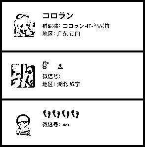

这三个昵称，我不说，谁能猜出他们是干啥的？而且就算知道他们有啥业务，等有事想联系他们，怎么在搜索框里打出来，都是个大问题。

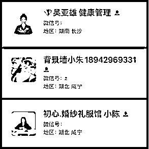

而这三个昵称，业务一目了然，易于记忆，有需求时也方便找出来联系。

以上，大家可以对照看看自己的昵称，是否有需要优化的地方。

**最后，再说第三点：搭建高信任的朋友圈封面**。

朋友圈封面图，就好像店铺的招牌，当用户访问我们朋友圈时，一眼就会看见上面展示的信息。在搭建朋友圈时，重要性不言而喻。

选择朋友圈封面，不仅仅是挑一张好看的图片，要搭建高信任的朋友圈封面，通常包含以下几个要素：

①个人形象照

②个人定位

③主营业务

④成绩背书

当然，不必巨细无遗，只要把重要的信息展示出来即可，当做设计一张名片就好。

需要注意的是，朋友圈背景图的设计规范，因为图片上传到微信背景时，有些地方会被遮挡。

所以在设计内容时，需要区分好哪些是可视区域，哪些是不可视区域。

这个可以私我给你发模板图，也可以直接用“稿定设计 app”里面的专属模板制作。

以我自己举例，之前的背景图是一张个人照片，没有太大意义。而现在背景图重新设计后，和用户建立信任的效率提高不少。

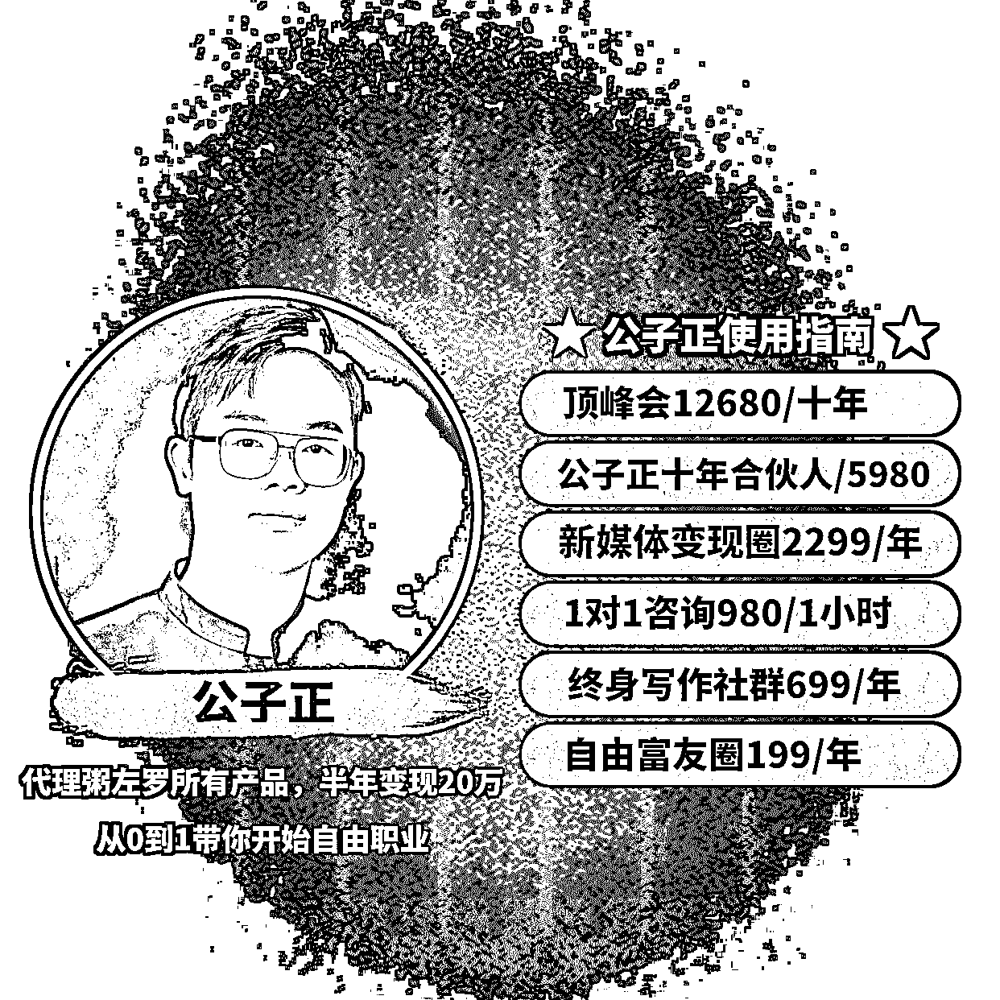

靠这一个动作，起码少说了上千句话，而我设计时只花了 10 分钟。

所以，这件事性价比很高，建议大家看看自己的朋友圈背景，有需要优化的可以重新收拾下。

以上，是从包装微信门面上，搭建强变现朋友圈。

**2、朋友圈内容搭建**

文章开始我曾提到，经营朋友圈，就像经营一家店铺。

既然是店铺，那我们打造朋友圈，就应该关注怎么招揽客户，怎么卖出去东西。

对此，**我有一个“夜市理论”。**

**微信这个生态就像一个夜市，我们打造朋友圈就像在里面摆摊，而要想卖出去东西，就得先吸引用户注意力。**

**你朋友圈发的内容，就像吸引用户来逛你摊位的吆喝。**

**你的吆喝不能引起用户反感，你的摊位布置得让用户有兴趣浏览，然后用户才会来你店里购买。**

至于怎么吆喝，这里分享几个内容方向，可以参考一下：

①自律打卡

每天固定发一条打卡内容，具体打卡什么不重，可以是早起、晚睡、健身、读书、写作、跑步……

但你必须每天在一个固定的时候，把它发到朋友圈里。

这个类型的内容，价值在于，让你的微信好友看到你长期坚持在做一件事，向他们传递出你是一个自律的人，你一直都在。

自律和坚持，是高价值的品质，天然可以建立信任和好感。

②价值展示

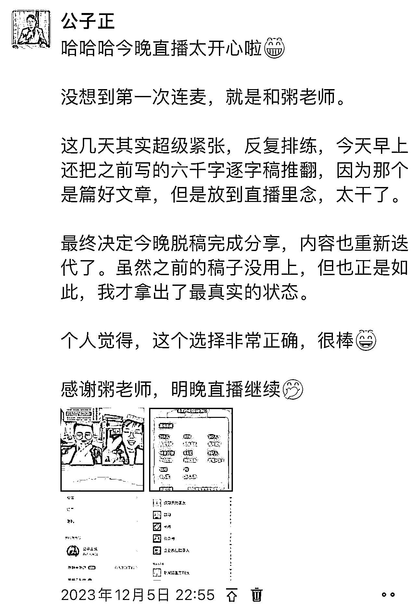

你可以分享你做出的成绩，你成功的经验，你拥有的人脉和圈子，还有你学到的知识。

这里重点展示的，是你对用户的价值。比如专业能力，你能解决的问题，和你拥有的资源。

这样做属于软营销，不是为了成交，而是为了吸引。

也许你分享的价值里，刚好某一点打动了用户，他就会主动找你咨询或者下单，或者在以后有需求时，会想到你。

③产品广告

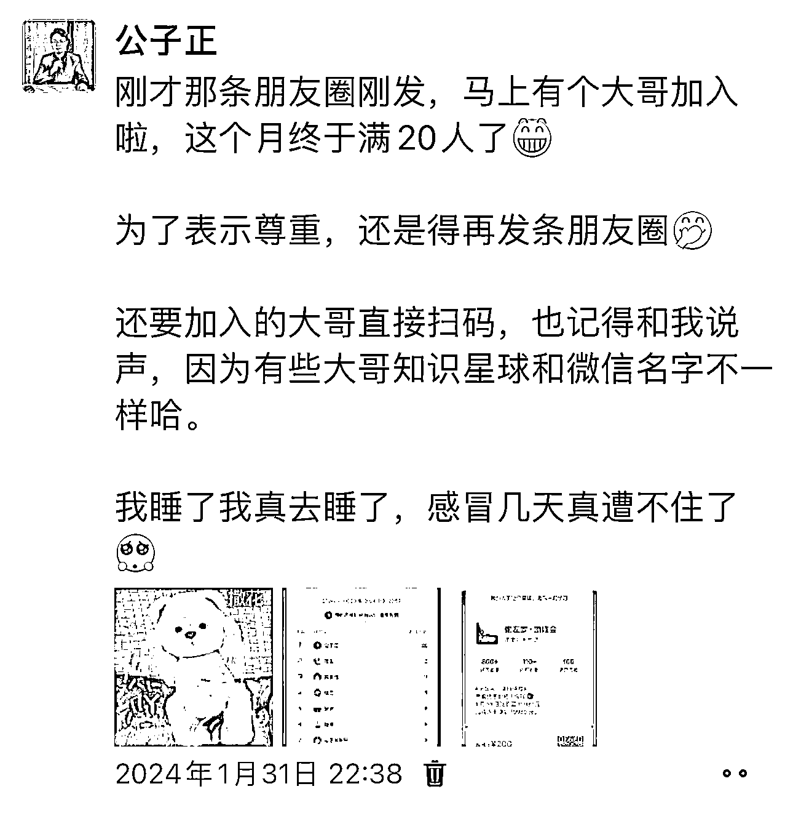

摆摊时，你不能光吆喝用户来逛，而不给他们看产品。

咱们打造朋友圈也是一样，想要变现，广告必须要发。

但要注意的是，发广告也不是只能干巴巴地介绍产品，它的形式有很多：

可以晒收款截图，可以晒用户故事，可以晒用户好评，可以晒用户成绩，可以晒涨价倒计时……

形式很多，根据你手里的素材随机去发即可。

至于一开始能不能发广告内容，是可以的。

但能不能卖出去，取决于你的产品是否能满足你微信用户的需求，还有他们对你的信任度如何。

一般来说，新手起步，可以试着销售解决具体问题的低客单价产品，比如大佬几块钱的引流课。

这样一个容易拿到正反馈，二个也可以积攒初始用户。

毕竟买过你一次的老用户，只要你服务好了，会比新用户更容易继续购买你后续推荐的产品。

④袒露自己

现在这个社会，不缺产品，缺的是能卖出去的人。

什么样的人能卖出去产品？一定是客户足够信任的人。

而信任，来自确定性，来自对方足够了解你，确定你是同频的人。

所以我们要释放确定性，就得大胆真诚地袒露自己。

袒露自己，可以从这三个方面入手：

1、露自己的三观

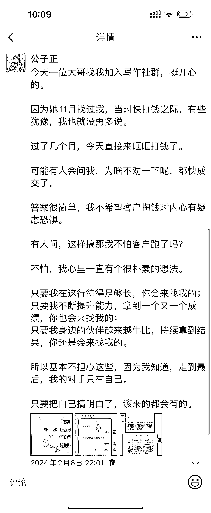

你的三观决定了你的调性，一个独特鲜明的人，才会在芸芸众生中脱颖而出，吸引欣赏你的人关注。

2、袒露自己的圈子

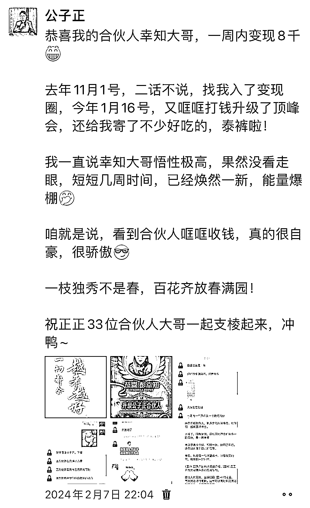

你的生活圈决定了和你同行的人是谁，也能进而印证你是怎样的人，从而引来同类。

3、袒露自己的生活状态

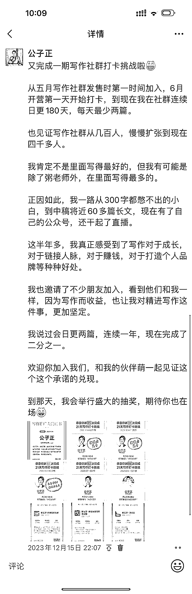

你的生活状态决定了别人是否想要靠近你。

现实中，人们更想追随的，是那些自己渴望成为的人。

这也是你努力的方向，成为某部分人渴望成为的人，并展示出来。

4、袒露自己的成就

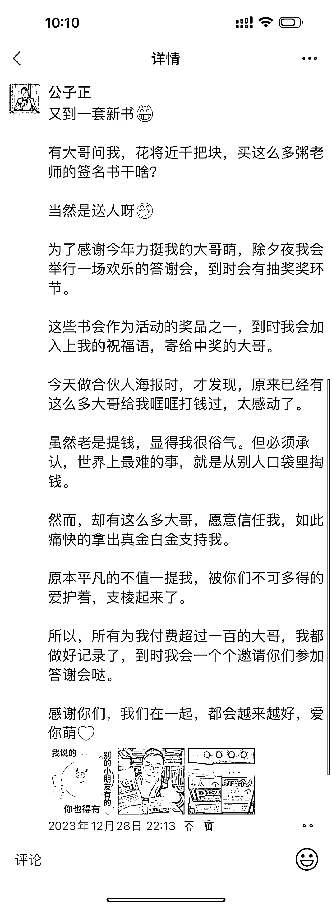

人人都是结果主义者，有结果的人更容易被人选择。

就好像同样的产品，大家都会倾向于找销量更高，评价更好的商家。

所以有成就，要敢于展示，同时，也要敢于去获得成就。

以上四点，就是朋友圈搭建内容的方向。

以上，就是一个半年变现 20W 的朋友圈，完整的搭建方法。

希望对你有用，希望你会喜欢，等你来报喜~

* * *

评论区：

微微星光 : 喜欢 求多多分享

* * *