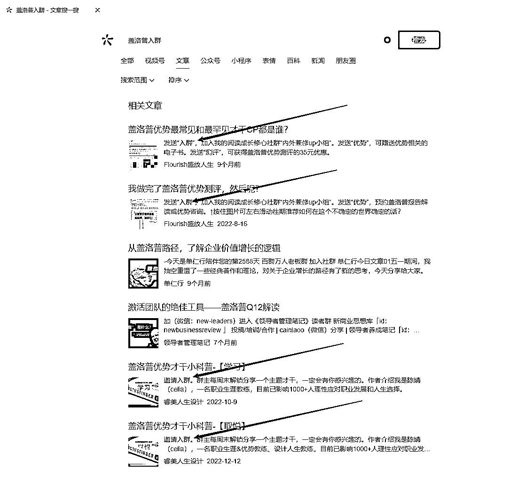

# 做私域引流的秘诀,总结成了 3 招

> 原文：[`www.yuque.com/for_lazy/thfiu8/ogk71wlibma5a702`](https://www.yuque.com/for_lazy/thfiu8/ogk71wlibma5a702)

## (22 赞)做私域引流的秘诀,总结成了 3 招

作者： 玉勇｜优势教练

日期：2024-02-19

对于普通人而言，从公域转化到私域流量，有点难，因为内容不太好做，坚持日更也不太好坚持。

但是对于普通人而言，涨粉最快的路径是什么？

## 第一招、主动搜索

什么叫主动搜索？就是去别人的鱼塘，别人的社群，尤其是高质量的活跃社群输出价值，让别人看到你，从而加你。

社群涨粉是比做公域账号好用 100 倍甚至 1,000 倍的方法，而且社群里的用户已经有了知识付费的习惯了，他能为别人付费，那么大概率能为你付费，所以相对来说成交难度会低一点。

那问题的关键是什么？就是你得拥有足够多的高质量的社群，这个基数很重要。

那怎么样找到这么多高质量社群的呢？

### 1、微信搜索功能

在微信搜索框里面搜搜你的行业关键字，加上入群。

比如说你是做盖洛普优势的，那你就搜盖洛普加入群，把这个行业所有的相关字全部都加上入群搜一遍，然后你看下面不是有一排选项，就是视频文章公众号小程序，让你选择搜索的内容类型，那你点击文章，这样所有的你这个行业里面的同行给精准客户的入群方式，你就都有了。

以下是盖洛普入群这几个关键字搜出来的文章内容。

### 2、挖掘客户身边的优质社群

物以类聚，人以群分，一个用户能够在你这付费喜欢你的产品，那代表他周围就有两到三个跟他同类型的人也喜欢你的产品，是你的精准目标用户。

所以你只需要搞清楚你已经在这里付费的用户，他平时在哪些社群活跃，你就能顺藤摸瓜找到那些隐藏起来的流量池。

比如说我会回访我的用户，你平时还跟哪些平台学习？他可能就会跟你说，我平时还听听樊登读书，还在十点读书。那我的客户就在这些平台上，原来爱读书的人就是我的目标客户，只要我加入这些爱读书的社群，我去寻找他们就可以了。

### 3、付费课程

现在基本上所有的付费课都会去建立社群，你只要在千聊、小红书、喜马拉雅、知乎 b 站这些平台，选择你认为你的目标客户可能会去学习的课程，然后购买进入到对方的付费社群就可以了。

比如说你是做儿童阅读的，你的目标用户是家长，那你不要紧盯着儿童阅读社群，什么清华好爸妈养成营、儿童财商都可以看看，所有这些家长可能会购买的课程，背后的社群都是你的精准用户资源，而且他们都是愿意为了孩子学习付费的人。

做完了这些事情之后，你怎么样才能够让社群里的人主动来加你？

千万别一进一个群就暴力加人发硬广发链接，只有小商小贩才这样。那该怎么做呢？

## 第二招、魅力人物

就是要成为这个社群里面的魅力人物。

IP 靠的是什么？

靠的是个人的魅力，我很牛，我价值很高，我能量很强，我自动吸引你们，是你们追着我跑，而不是我追着你们跑。

那怎么成为一个社群里面的魅力人物呢？

1、**超牛的自我介绍**

你进入到社群的那一刻，而是最引人注意的那一刻，也是你自我介绍最佳的时刻。你不说你自己厉害，其实没有人知道你厉害。

有什么本事、有什么头衔、有什么成就，咱就别藏着掖着了，往上堆吧。我见过一个人进群之后发三张他的真人照片，一篇个人故事的公众号文字介绍，一篇十年短视频故事其实成就也没有那么厉害，但就这一套操作下来，把大家给镇住了，至少大家觉得这个人用心了，是个靠谱的人。

2、**高能量报喜**

你一进入到这个社群里面，你就跟人家说，我是做盖路普优势的，你们有什么问题都可以来找我，请问大家用什么样的心态看？你是不是觉得你这个到处拉人，段位也不怎么高嘛？但是你转换一个方法，你可以说今天有一个学员给你反馈，自从通报了你的课，个人思考和行为跟以前很大改善，行动力突飞猛进，特意来感谢你。

你把用户对你的反馈发到群里，然后发一个红包，跟大家说，分享一件开心的事儿。去年一个人出成果来跟我报喜，我觉得这就是我坚持做这份工作的意义。其实我就是用了这一二三个方法快速把成绩提升上来的。那这个方法呢？我整理成了一份资料，想要的咱们社区里的同学可以私信我，我发给你，当你这样说的时候，大家想不想靠近你？想不想接近你？想不想加你？

3、**学会感谢群主支持**

大家一定要明白，你进入到一个社群以后，你是客人，你不是主人，作为一个客人对吧？

每天在主人家里说我好牛，主人会很反感你，所以你一定要去提，你在这个社群里面收获了什么，学到了什么，这是一个大家双向赋能的事情，也是一个基本的社群礼貌。

为什么有人在社群里面引流，大家都很喜欢，觉得他是大咖，很高势能。

而有的人去社群里面引流，大家就很讨厌他，觉得他又是来薅羊毛的，区别就在于都不懂得感恩。

4、**主动获取分享机会**

主动分享比被群主邀请正式的在社群里面做一场分享，更能凸显你的个人魅力和涨粉的了。

那这种机会怎么获得呢？你要主动的去跟群主申请，因为群主他也在愁他的社群如何正常的运营，如何产出更多优质的内容。所以如果你的分享内容跟这个社群的主题是相符合的，他是乐意你来分享的，只是有的人开口说了这句话，有的人没有开口，他就失去了这机会。

## 第三招、私域标签

所有引流来的用户全部都要记好来源，方便管理。

其实这是有一套非常复杂的私域标签管理体系的，如果说你的体量没有做到那么大，一开始不用那么麻烦，你只需要简单的在他的微信备注这里修改好就行了。开头是 a、b，c，d，

1.  a 代表高潜用户很有可能成交，

2.  b 代表信任度不够，还需要继续培养。

3.  c 代表目前还不是目标客户，

4.  d 代表已经成交的客户，

然后是添加日期昵称和来源社群，比如 A 210901 张帅@生财有术 就代表张帅这个用户是我的高潜用户，是在 21 年的 9 月 1 号加的，是在生财有术这个社群里面加的我。标签它不是固定不变的，是动态变化的 ABCD 可能会随时根据用户的意向度来进行调整。

* * *

评论区：

暂无评论

* * *