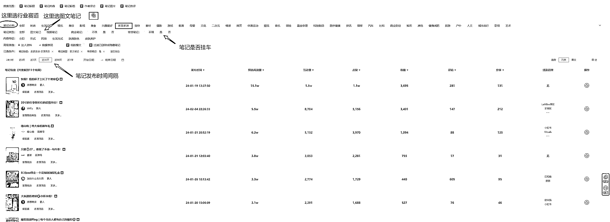

# 新手小白小红书电商卖货春节 10 天爆单全流程分享

> 原文：[`www.yuque.com/for_lazy/thfiu8/edpzx14gwgl11f87`](https://www.yuque.com/for_lazy/thfiu8/edpzx14gwgl11f87)

## (63 赞)新手小白小红书电商卖货春节 10 天爆单全流程分享

作者： 北瑜

日期：2024-02-18

大家好，我是北瑜。

去年 9 月份参加了坤哥@盗坤 的小红书流量变现实操训练营后，对小红书这个平台的底层逻辑，基本操作和变现方式等有了全方面的了解，加上自己之前做过淘宝虚拟产品这个项目，对电商还有那么一丢丢的认知，老实说，做图文是我的强项，毕竟在淘宝虚拟上我做过 N 多个主图和详情页图，对于图片的美观，什么样的图美感更强更吸引人有一些自己的感觉和见解。也参加过坤哥的抖音男装图文带货训练营，虽然没有爆单，但走完了 0-1 流程。所以感觉在图文平台上做内容是自己的强项，于是 11 月小红书流量变现实操训练营结束后，决心往电商卖货这条路走。

坤哥说过，选品大于运营，测品大于选品。小红书上选品无非是通过第三方平台，比如灰豚红薯版，站外抖音精选联盟里的图文爆品，站内小红书刷发现页找低粉爆款等方式来进行。哪个方法适合自己就用哪个，也可以结合起来一起用。我是在灰豚红薯版上找到一些觉得还合适的品之后，通过这些品找到对标账号，用小号给这些对标账号点赞评论等，再去刷发现页，小红书平台就会推很多类似的笔记给我，这样找到了春节这款爆品。

**第三方平台如何找低粉爆款，以灰豚红薯版为例**

灰豚红薯版可以到闲鱼上买会员，周卡很贵没有多少优惠，月卡季卡和年卡优惠多，年卡优惠最大，大家各取所需。

举例如上图，我选择了家居这个行业赛道，选择低粉爆款，笔记挂车的图文笔记，时间间隔 30 天内。就会出现一些数据比较好已经挂车的笔记供我们作为选品参考，有时候时间间隔太短，比如 7 天低粉爆款没有或是很少笔记，那么可以适当延长时间间隔。除此之外，在发现页刷低粉爆款也能有不错的效果，只要勤快点刷，总能刷到意想不到的品出来，小红书是懂我们电商选品的

刷到爆款后，先不要急着马上去测品。**赚钱就是复制，谁赚钱就复制谁**，但是复制之前要先做好调研。可能有圈友会提出疑问，如果不马上测品，尤其是时效性产品过时了怎么办，自己选到的品岂不是白瞎了。其实这种担忧大可不必。世间的品千千万万，但是隔行如隔山，不做好调研就不知道这个品这个款成本、利润、退货率，转化、内容展现难不难、对标有没有投流、有没有直播等。我们只需要做个大概的调研了解，就能知道自己有没有能力复制，试错成本能不能承受，也花不了多少时间。一旦确定是自己可以复制的，马上用矩阵账号测品，请不要忘了，选品的目的是为了测出爆款，内容电商爆款才是王道。

**测品实操**

当我们找到合适的爆款后，要不要马上去找对应的货源？我的答案是要。虽然也可以等到笔记出单了再去联系货源，但太耽误事了，如果没有合适的货源需要联系客户退款，联系不上反被平台以超时发货甚至缺货为由处罚，还不如尽早联系好货源再发笔记整个流程更顺畅。由于图文笔记容易模仿甚至是 1：1 抄，所以建议大家实拍为主，甚至一开始就去实拍。现在无论哪个主流平台，都在严厉打击搬运混剪的内容，与平台规则背道而驰不但做内容的时候辛苦，而且就算内容爆了，也容易被限流。很打击做号的信心。实拍的货源可以在拼多多买，也可以从 1688 上买。买回来一些样品，能实拍的同时，方便自己去了解供货商的产品质量，印证供货商的实力如何。拼多多买样品的好处是可以找到很多退货包运费的品，相当于可以免费拿样品来测试笔记内容，测出爆款就多号去怼，测不出来果断放弃，自己也没啥进货成本。1688 上大部分的供货商退货是不包邮的，如果要测的品拼多多上也有还包退货运费的话， 建议在拼多多上买，尤其是 1688 上和拼多多上货源质量都差不多的情况下。

图文实拍需要场地布局背景、灯光、摆件、物料、样品等东西，这些成本支出，加起来也就几百块，大部分人家里或者住的地方就能满足场地要求。小红书账号至少准备 2-3 个，有条件的申请个体户执照的企业号，一般情况可以申请个人号。企业号的优点是，可以申请多个，有 N 个营业执照就可以申请 N*2 个企业号，方便矩阵布局。缺点是成本比较高，600 元单个号的审核费用，有点肉疼。当然，如果有实名的个人号资源，那就更好了。

拍照建议用苹果手机，苹果手机自带的 Live 动图效果，能让照片有 2 秒左右的视频动态效果，拍得好的话非常好看。举个例子：去年圣诞节有一款卖的非常火的摆件，摆件里面是透明液体，还有金光闪闪的粉末，摇一摇这个摆件，整个效果就出来了，拍成 Live 图相当漂亮，拍成视频也是可以的，如果拍成图片，整个效果就出不来了。安卓手机也有 live 动图功能，但感觉不太好用，发小红书动不起来或者动得不自然。苹果手机可以买二手机，如果担心是违规号用的或者工作室的机子，就挑稍微贵一点的，这样遇到的概率低。

如果 Live 图拍的效果不理想，但是后期修图导致动图不动了，有一个办法可以解决。

如图，美图秀秀有个视频美容功能，首页找到后点击进去。

选择视频剪辑，增减调色、滤镜等，也可以增加文字或者水印，让 Live 图更好看。完成后点击右上角保存旁边的三个点，保存为实况 Live 到相册就可以了。

逻辑就是在美图秀秀里修苹果手机的 live 图视频，保存为新的 Live 图。

测品的时候，单号至少每天发 5 篇笔记，我见过有些号发笔记非常勤快，每天十几篇笔记，照样能有不错的数据反馈，说明还是要多发才好，爆款是建立在概率上的，同样的概率下，基数越大，爆的笔记数量才多。春节期间我每天发的笔记都在 10-20 篇之间。每周测 3-5 个品，单账号单个品每天发 5-10 篇笔记，三个账号一个月下来就可以发 600 篇笔记，整个数据是很惊人的，传说@木易 大佬曾经在视频号红利期间，矩阵每天混剪发布 600 个视频，什么是效率，什么是执行力，一目了然。大佬与普通人的差距就在这里。

个人认为颜值类产品更适合图文笔记，好不好看比好不好用，图文展示更直接。所以批量发笔记建议主打颜值类产品，标题和文案也不需要很复杂，一两句话就可以。

**一些赛道需要注意的地方**

小红书是女性占比超过 80%的平台，女装、美妆、护肤、穿搭、饰品这些赛道非常火热，竞争激烈。女装的缺点相信大家都明白，退货率高，@书豪 大佬说过，低价女装，狗都不做，形容得很贴切，哈哈哈哈。女装里的功能产品，是有机会的，但供应链也要很硬才行，女装功能产品在换季的时候特别容易出爆款，大爆款，大大爆款，十分考验供应链能不能跟得上。所以，如果大家没有很牛逼的供应链关系，慎做女装。很难想象，有单没货的尴尬，尤其是各大平台都对超时发货缺货扣钱扣分非常严格。

我在选品的时候发现很多爆款手链饰品，后来调研发现，多数是原创自制产品，这当然不是我做一件代发的菜，如果心灵手巧又具备原创能力和审美的，可以尝试一下。从销量和成本来看，手链饰品这个赛道图文带货加直播，每年也能赚十几万到几十万的收益，缺点是自己制作产品囤货发货。

百货赛道是比较容易出单的，如果新奇特、高颜值加上百货的功能性，那么极为可能成为一款爆款产品，新手建议从百货赛道出发，去跑通 0-1 流程。应季高颜值百货产品，比如日历台历、暖手宝、中秋礼品、新年肉桂生财摆件等，不乏爆款频出。甚至数码这种男性更喜欢的产品，去年中秋在小红书上也有过图文笔记大爆款，同样具备高颜值、应季、新奇特的特点。

**单子爆了后如何联系供应商发货？**

我的这款产品在 9 号就开始爆了，清楚的记得 9 号那天起床开机，看到商品访客比平时多了很多，心理就知道可能是要爆了，于是赶紧实拍发笔记，不得不说春节流量真的是好，随便拍出来的数据都是平时的很多倍，每隔十几分钟就有人下单，到了 10 号 2 分钟一单，直接吓尿了。新手从没见过这阵势，一直火到今天访客才降下来。这里有对手休假导致竞争减少的原因，也有春节流量暴增的原因，最重要的还是坚持选品测品，定好计划，流程化的去执行。

爆单后联系了 1688 上的供应商，但由于春节休假原因，只有两家发了微信给我对接，于是找到了这家靠谱的供应商。事后想想也有一些风险，如果找不到合适的供应商，这么大的单量，超时发货或缺货，扣起钱来那真是一个痛。所以我们在测品的时候，就选好供应商，不然笔记爆了发不了货就很被动。

在 1688 上跟供应商的联系对接也不复杂，他们一般都用 ERP 做大订单量的一件代发，少量的就手工直接拍。跟他们确定好使用哪款 ERP 软件后，把自己店铺的单子通过 ERP 软件推给他们，他们开通好小红书电子面单，就可以打单出来了。如果自己做的品是多 SKU 的，颜色，型号，款式都很多，那么供应商会弄一个备货单，方便他们拣货发货。这个备货单能在 ERP 软件里下载出来最好，下载不了就只能自己在小红书下载待发货的清单表格，整理好颜色型号等，再发给供应商，让他们对照推给的单子进行发货。

货款的结算一般走微信或者在 1688 上下一个大单后，通过平台结算。如果是第一次合作，能走平台还是建议走平台，双方合作熟悉后再微信结算不迟。要不要签代发合同？其实谨慎点是需要签订的，不过我并没有签，这次跑通了爆款一件代发流程后，以后再有爆款就签一下，有备无患。

爆款有偶然也有必然，要建立在自己每天雷打不动的测品上，建立在每周的选品上，建立在正确的电商卖货认知上。坤哥说时间是最大的壁垒，日拱一卒、功不唐娟，一些商业的常识，才是最昂贵的认知。2024 年小红书依然有很大的机会，感谢@盗坤、@木易、@书豪、@叶声等大佬的支持和解惑！龙年祝大家都能生财！继续生财！

* * *

评论区：

YolyArk : 谢谢北瑜老师的分享，小白感觉受益良多，还有些问题还想详细问问，不知道能否加您？
北瑜 : 留联系方式我怕被亦仁大佬拉黑。。。
晓雪森 : 牛逼[强]学到了

* * *