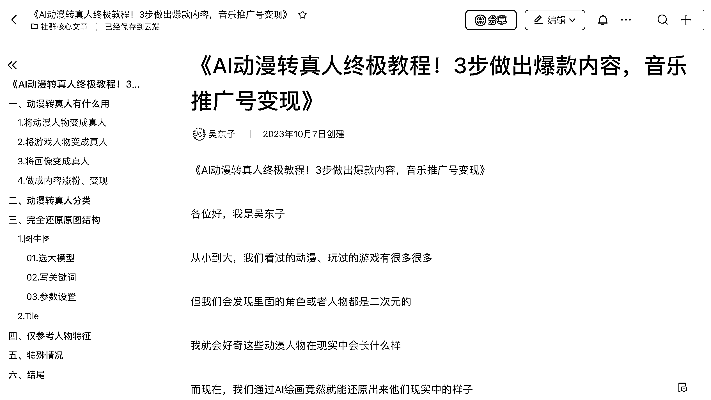
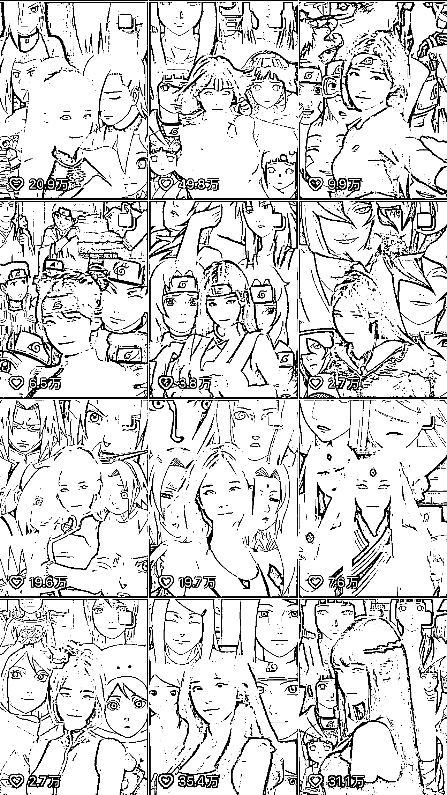
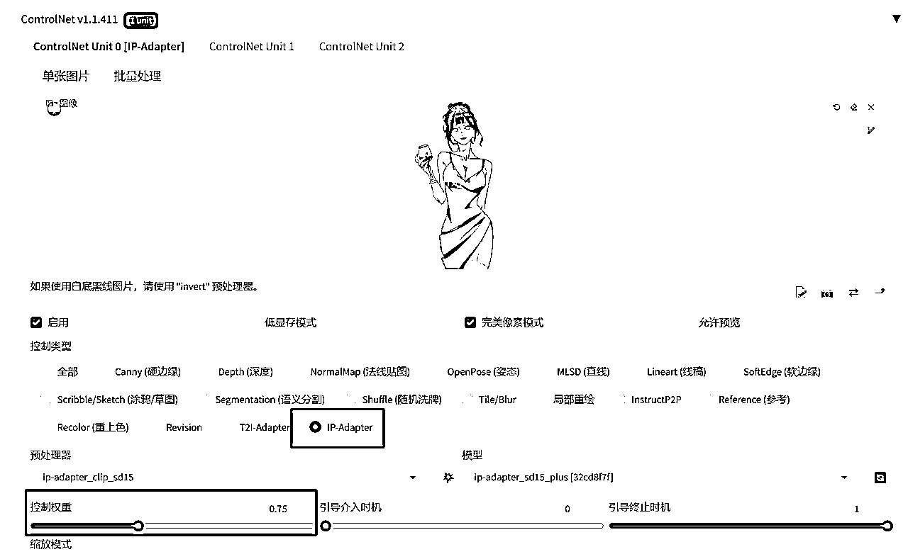
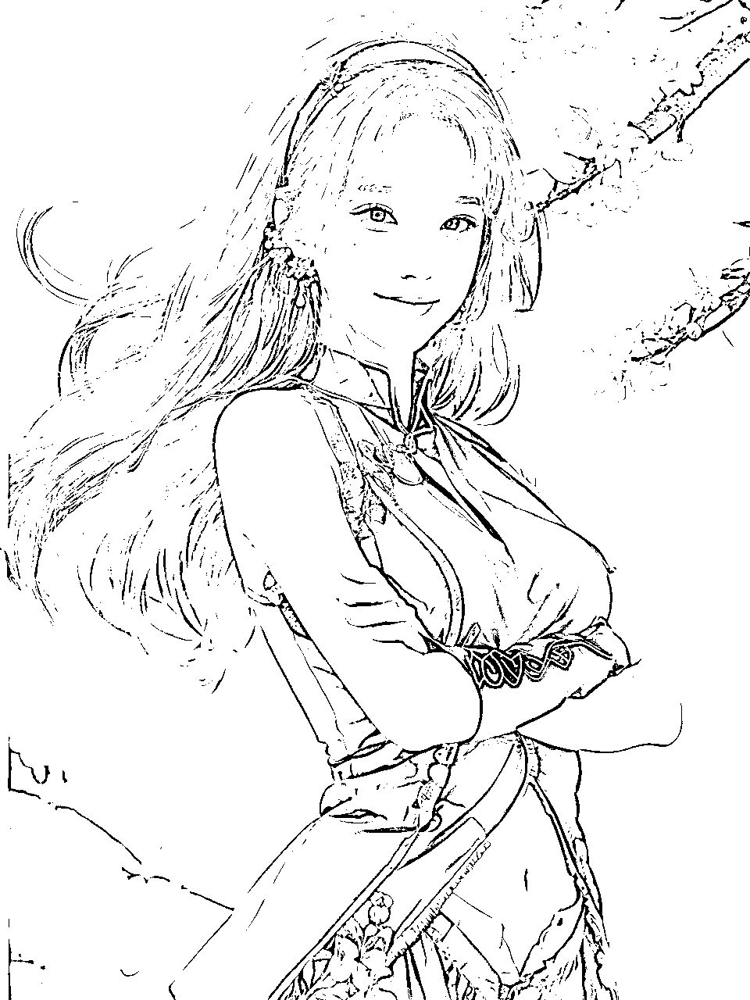
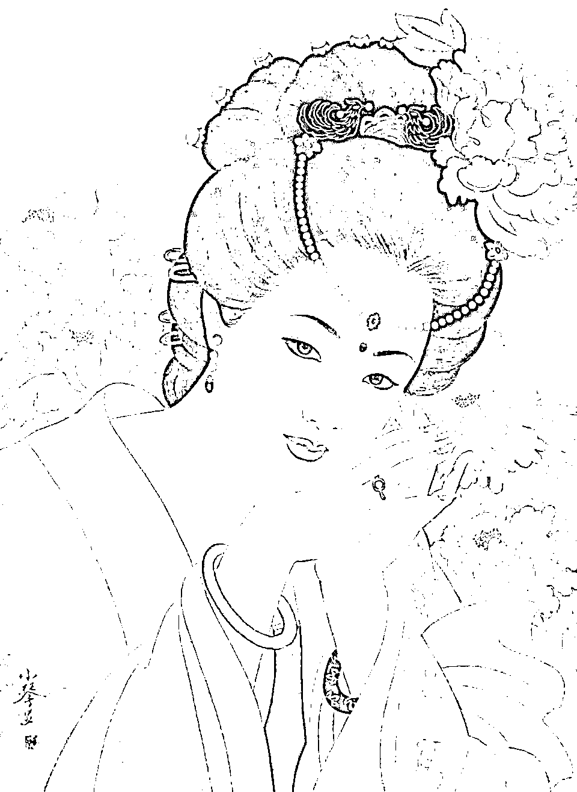
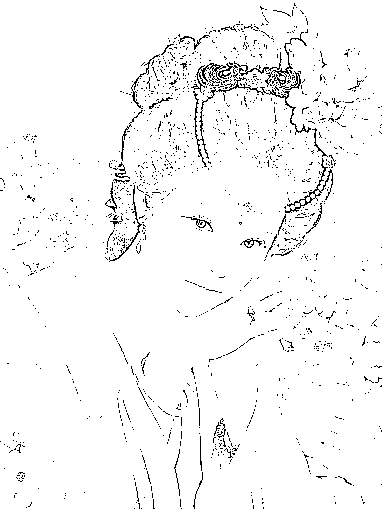
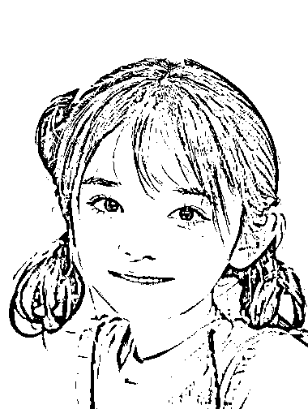

# AI 动漫转真人终极教程！3 步做出爆款内容，音乐推广号变现

> 原文：[`www.yuque.com/for_lazy/thfiu8/ncd81c76ysc8c8nc`](https://www.yuque.com/for_lazy/thfiu8/ncd81c76ysc8c8nc)

## (134 赞)AI 动漫转真人终极教程！3 步做出爆款内容，音乐推广号变现

作者： 吴东子

日期：2024-02-18

《AI 动漫转真人终极教程！3 步做出爆款内容，音乐推广号变现》

各位好，我是吴东子

从小到大，我们看过的动漫、玩过的游戏有很多很多

但我们会发现里面的角色或者人物都是二次元的

我就会好奇这些动漫人物在现实中会长什么样

而现在，我们通过 AI 绘画竟然就能还原出来他们现实中的样子

除了动漫角色和游戏人物，古代的画像、经典的二次元图像等等，都可以把他们转成现实中的样子

无论用作满足好奇心，还是文创科普，亦或是教育都能起到辅助的作用

另外，我们也可以把这些图片做成视频内容发到网上，不仅可以获赞涨粉，还可以用作音乐推广号变现

那今天这篇文章会详细地介绍动漫转真人地制作方法，你只需要一步一步跟着操作，也能做出同款图片

另外，文中需要用到的模型文件，也都给大家打包好放在末尾的网盘链接里，不需要大家再自己到处去找

花了很多时间才整理出来，希望对你有帮助

一、有趣的动漫转真人案例
二、音乐推广号变现
三、保姆级制作手册
四、特殊情况参考

[`ry5hwpuf7b.feishu.cn/docx/Iphcdi7wPoRKQFx7EoIcJ6Glnih?from=from_copylink`](https://ry5hwpuf7b.feishu.cn/docx/Iphcdi7wPoRKQFx7EoIcJ6Glnih?from=from_copylink)

* * *

评论区：

阿里斯宝 : 先赞再看
咿呀花花 : 太厉害了，已经学习了
程爱娟-直播运营 : 厉害厉害 感谢分享啊
狗头军师 : 这样素材又多了一个纬度，而且不侵权。
渔人 : 先赞后看
知了. : 这个怎么变现呀

* * *