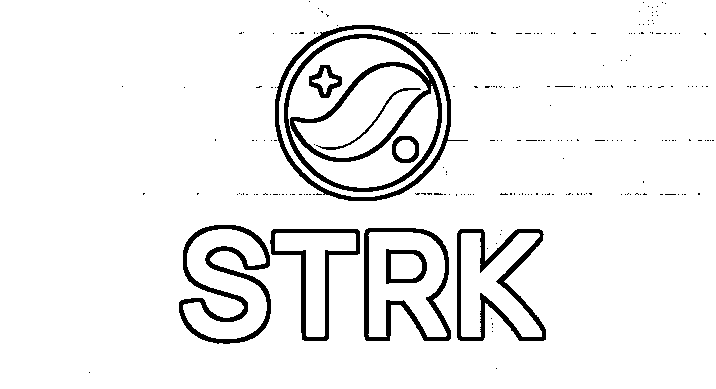
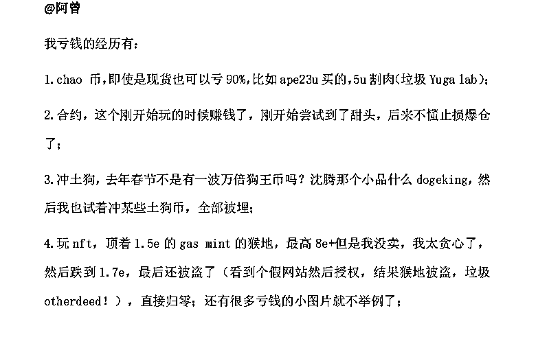
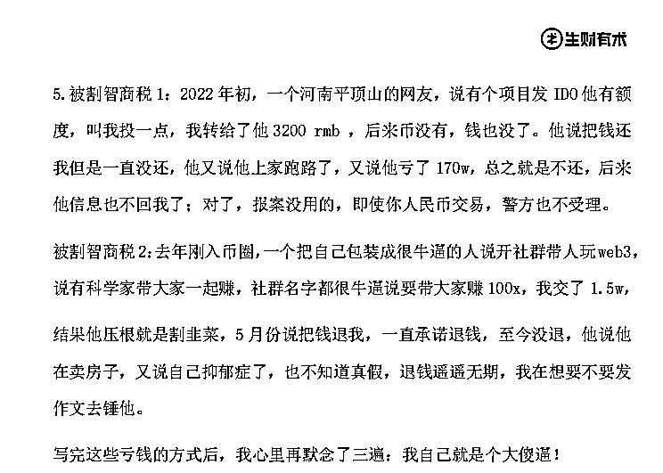
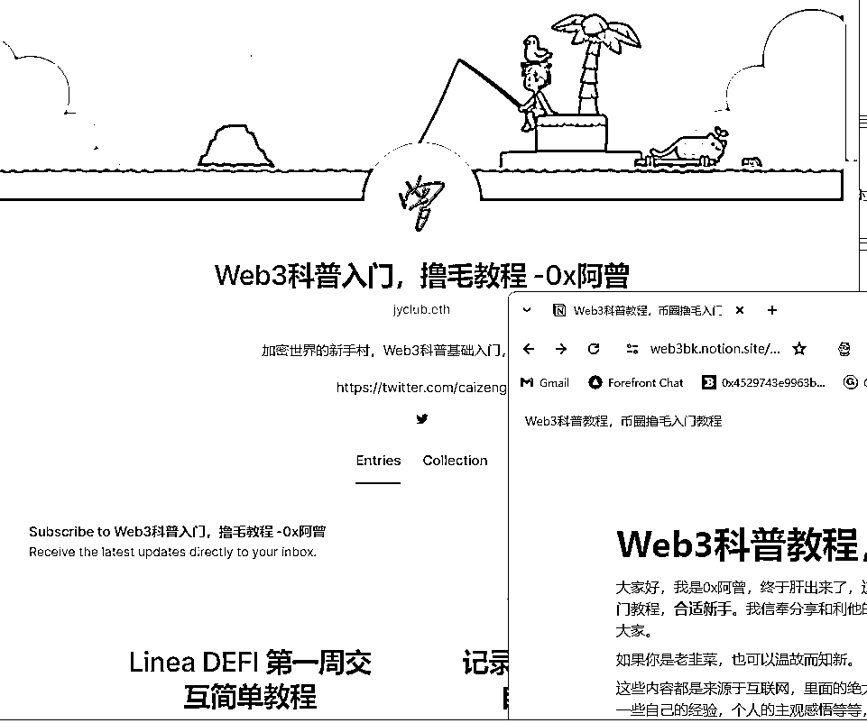

# 怎么在 Web3 撸毛从 0 到 A7

> 原文：[`www.yuque.com/for_lazy/thfiu8/tbs9izo579ls9u8q`](https://www.yuque.com/for_lazy/thfiu8/tbs9izo579ls9u8q)

## (37 赞)怎么在 Web3 撸毛从 0 到 A7

作者： 阿曾

日期：2024-02-22

大家好，我是阿曾，最近刚拿了$strk 空投，这是一次 A7 的空投收益。

（题外话，我是挺好看 STRK 这个公链的，所以一个没卖，准备拿到 5U+）

我写一下自己的在 web3 的经历，怎么在 web3 撸毛从 0 到 A7；

## **一：入场从亏钱开始**

撸毛，我是真的从 0 开始撸的。

在 2021 年 21 月，揣着 3w+（人民币，下同）进入 web3，但是遇人不淑，识人不善，被割韭菜；

以及入圈之后乱冲乱撞，玩现货，合约，贷款进场，最终 NFT 被盗，导致归零，差点就退圈。

当时我还把亏钱经历写出来了，在生财有术的《人生亏钱指南》里面（如图）。

所以在这里也建议：web3 的风险大，未知的坑很多，不要在场外使用杠杆进入 web3，那种感觉是很难受的，我不想去体会第二次；

要在自己可以承担损失的范围内去参与。

我当时在 web2 还有一些场外收入，所以我亏了十几万，我也还能 cover 住；

## **二：找出路**

亏完之后只能自己找出路，我发现撸毛是一件高概率高赔率的事情。

为什么说是高概率呢，因为 Web3 有个特性是去中心化，去中心化就意味着权力下放，权力下放就需要治理代币，就需要发行代币给用户（划重点）；

为什么说是高赔率呢，因为区块链还在快速发展中，一些热门项目动不动就融资几千万，几个亿，用户用很小的本金就可以博取高倍空投收益；

但是这是一件延迟满足感的事情，短时间赚不到钱，需要很长的时间才可以看到结果；

毕竟一个项目从开始到上线运营，慢的话需要几年时间；

需要一直陪伴一个项目几年时间，默默耕耘，如果项目黄了，自己投入的时间经历和本金也会随之而去。

所以这是一个长期的事情。

撸空投刚开始是不懂，不懂就要学，于是我是自己学着别的 KOL，自己写教程，分享输出。

自己整理 web3 的各种内容，从基础知识，到项目分享，如果自己写的教程，别人看得懂，也能撸到收益，那么就说明自己也算是入门了。

**为了提升自己，我还申请担任了 web3 入门航海教练，一方面能帮助到群友，另外一方面自己也得到更多的成长。**

## **三，从 0 到 A7 的过程；**

我粗略说一下我撸空投收益的时间线：

1，2021 年 12 月，3w+(人民币)入圈，

2，2022 年 4 月，玩合约全部归零，开始撸毛，

2，2022 年 5 月贷款 10w+，mint 猴地，8 月被盗，再次归零，

3，2022 年 10 月，castaways 第一桶金，合计 10+ETH，

这是 0 撸的，持续地玩游戏就空投 NFT，直接空投到钱包，一分钱都不用出。

这为以后撸需要付费的项目打下基础。

4，2022 年 10 月，APT 空投 5w+，

这个也是 0 撸的，测试网 mint nft 就给空投，单号 150 个币，当时价值约 1200u；

5，2023 年 2 月，blur 空投 12w+，

在 blur 玩 nft 就有机会获得空投；

6，2023 年 3 月，arb 空投 17w+，

arb 是我一个意难平的项目，起了大早赶了一个晚集，当时没有多号思维，只会傻傻撸几个号，导致拿的币不多。

7，2023 年 10 月，tia 空投 3w+，

tia 完全是意外，但是认知不够啊，2.5u 就卖完了，少赚近 10 倍；

8，2024 年 1 月 alt 15w+，

9，2024 年 2 月 strk A7+，

alt 和 strk 我践行了多号策略，终于拿到结果。

10，预计 zksync，linea，SOL 生态等等还会有福报

11，我在 web3 如履薄冰，我能走到 A8 吗？

以上就是从 0 到 A7 的过程。

## **四：跟对人，做对事**

在 web3，跟对人，做对事我认为真的太重要了。

如果一开始就跟对靠谱的人，你会少走很多弯路；

如果一开始就做正确事，你赚钱的速度就会快很多；

如果跟错了人，就只能越走越难走。

我第一桶金是跟着 NFT 很厉害的花总带我玩的，他说坚持玩 castaways 这个游戏，于是我就跟着撸，没想到两个月时间就拿到了结果；

撸空投我都是跟着撸毛界的天花板丰密老师，学习丰密老师交互理念，持续践行；

跟对人，路就好走了。

## **五：Web3 的撸毛机会/项目**

撸毛项目，我一般是看两点，

**1，看赔率和概率。**

如果是高赔率高概率那肯定得重仓；

如果是高赔率低概率，其实也值得去做。

用比较低的成本去博大的收益；

通常项目方融资高的，去参与这种项目生态建设，确定性就大。

如果成本比较高的项目，就要衡量是不是值得投入，毕竟机会无限，本金有限。

**2，看能不能相对容易批量上号；**

web3 一些项目，比如某测试网参与要买服务器搭建节点，对于不懂技术的人参与门槛就太高了，很难批量去搞。

像一些绑定三件套（dc/x/gmail）就可以搞的就可以多上号。

以前很火的 cb 打新，港股打新也是一样的道理。

毕竟任何一个小毛*100 都是大毛。

对了，

我在上上期 web3 入门航海 分享过《Web3 撸空投打造精品号》的方法，并且以打造 zksync 精品号为例，分享过交互过程。

链接：

[`t.zsxq.com/17s9ofKiA`](https://t.zsxq.com/17s9ofKiA)

从目前的热度看，**Zksync 的空投也快要来了**，如果之前有航海群友做过交互，记得坚持做下去，会有福报的。

除了 Zksync，近期的撸毛机会我觉得还有 Linea，SOL 生态等等，这些都是热门的项目，有兴趣的朋友可以多看看。

## **六：写在最后**

在 Web3，机会虽然很多，但是时间窗口很少。

一旦错过了最佳时机，就会踏空。

如果你看到好的机会，就要减少社交，全力以赴，争分夺秒。

用几年时间赚到一辈子的钱。

借用亦仁说过的话，“有钱赚的时候，要集中所有的资源和精力，allin 进去，切忌小富即安，过几年你会拍大腿，那么好的捡钱的时候，为什么错过了。 任何业务都有生命周期，如果你不进化，就会被后入场的人干掉，早晚而已，汤都不给你留”。

在 web3 没有毫无道理的暴富，都是需要靠积累的，没有白走的路，你刷过的每一条 tx，你熬过的每一个夜晚，都是为你在下次暴富的打下坚实的基础。

希望我的分享能给大家一些启发，在 2024 干起来，冲 A7，一起冲 A8。

* * *

评论区：

才 : 完全看不懂术语
薯条 : 我也没看懂在做什么 有详细的介绍吗[尴尬]
阿曾 : 你去搜下，找一下 web3 入门航海手册
白黑 : 感觉水太深了，不敢搞
陈大小姐 : 感谢教练分享～

* * *