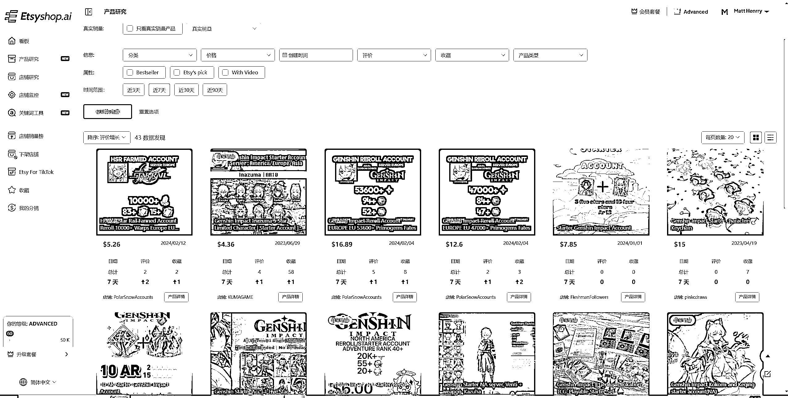

# 2024TikTok 广告出海新趋势，原神初始号下的机会思考

> 原文：[`www.yuque.com/for_lazy/thfiu8/psq4uxoun2zk7v6m`](https://www.yuque.com/for_lazy/thfiu8/psq4uxoun2zk7v6m)

## (20 赞)2024TikTok 广告出海新趋势，原神初始号下的机会思考

作者： 阳光杉木

日期：2024-02-20

PiPiADS 广告数据监测，发现有几家独立站投放 Tik Tok 广告售卖原神初始账号做小生意，给大家进行拆解和分析，皮皮上可以挖掘到一些小市场利润不错的小类目，例如去年到今年都一直投放的祝福视频项目、健身、电商等培训课程，虚拟产品的优势是无需线下发货配送，直接通过邮箱等方式快速交付给客户。

本篇文章会以原神账号的玩法来给大家进行拆解，同时分享怎么去获取资源和延伸

PiPiADS 搜索关键词 Genshin Impact/**[Genshin](https://www.pipiads.com/product-search/642ddce1009def6f0771f1fb/)**

链接：[`www.pipiads.com/zh/product-search/63fb02a4009def6f0761bf11/`](https://www.pipiads.com/zh/product-search/63fb02a4009def6f0761bf11)

观察到售卖账号的广告链接，皮皮抓到该广告主广告展现 200 万，广告数 24 条。

观察原神的市场情况

《原神》通过其多元化的文化创作手法，成功地开辟了国际市场。作为一款开放世界冒险游戏，它以七个具有不同文化背景的“国家”为故事舞台，每个“国家”都融合了来自世界各地的文化元素和符号。例如，“蒙德”借鉴了欧洲中世纪的风貌，结合了荷兰、德国、英国等地的自然美景和文化特色；而“璃月”则深受中华文化的影响，从美术风格到剧情都体现了浓厚的中国文化元素。另外，即将推出的新区域“枫丹”也通过其预告片在法国及西欧地区的玩家中激发了极大的兴趣。这种多元化的内容策略，使得《原神》能够吸引全球不同文化背景的玩家，从而在全球范围内取得了巨大的成功。

原神上个月数据显示全球有 200 万人下载 全球收入 1400 万美金

文创：

根据 pipiads 广告数据观察和分析，目前有广告主投放 玩偶、钥匙扣、角色徽章、包包等相关文创衍生产品

初始号虚拟项目拆解:

对刚入坑原神的萌新来说，开荒期是比较煎熬的阶段。前期大家手里只有开局赠送的几个免费四星角色，虽说打通剧情没问题，但是没有割草的快感。想要抽到强力的五星角色，不仅要囤一两个月的原石，而且当期 UP 的五星还不一定喜欢。这时候就会选择购买初始号进行快速度过开荒期

初始号，又叫自抽号。在大多数游戏中，新账号往往会得到丰厚的资源赠送，这是为了吸引玩家并增强游戏体验。然而，有些玩家利用这一机制，通过不断创建新账号，以获取更多资源和角色，这就是初始号的由来。

初始号的价格各不相同，从几毛到数百元不等，而其中一些高价初始号的售价甚至高达数百元。而且价格高昂的初始号甚至能够让玩家自选五星角色。

例如刚开服前两天，刻晴初始号价格可以炒到上千，后续这种初始号价格就会降下来，单刻晴三无的初始号，价格大概在 200 元左右。

然而，与初始号所提供的资源和角色相比，其实际价值存在较大差距。市面上绝大多数初始号几乎都是通过科技脚本养成的。这些脚本通过自动搜刮大世界中容易获取的宝箱、神瞳、草之印、雷之印等资源，并且利用外挂打通深渊 8-3 来获取大量的原石。然后，这些初始号会被打包出售，其中也会包括一些特定的五星角色。

总的来说，初始号所提供的原石都是通过搜刮大世界获得的，而如果你是一个零氪玩家，在正常玩游戏的情况下，也可以获得同等数量的资源。

大多数初始号都是通过科技脚本或人工操作获取的，由工作室批量生成后进行售卖

tiktok 搜索 Gamesbay/Genshin Impact/**[Genshin](https://www.pipiads.com/product-search/642ddce1009def6f0771f1fb/)**

可以看到售卖原神初始号的视频

复制广告文案到 pipiads 搜索同样可以搜到

查看广告主详情

广告展现：635.8k

广告数：10

投放天数 ：217

广告投放时间：2023.04.13-2023.09.24

观看播放量最高的广告素材 广告展现 312.4k

暂时无法在飞书文档外展示此内容

详情链接：[`www.pipiads.com/zh/advertiser-analysis/6437ce65f6c98803f714e314/#nav2`](https://www.pipiads.com/zh/advertiser-analysis/6437ce65f6c98803f714e314#nav2)

观察目前投放 tiktok 广告 2.4M 展现的广告主。

广告条数 29 条

投放时间 2023.02.23-2024.02.19

观察广告素材脚本

拍摄套路非常简单，游戏页面展示+游戏角色道具展示+业务描述文案 批量生成

通过 pipiads 分析游戏和 app 的类似广告，发现一条广告的生命周期相比电商广告偏长

一条广告可长时间持续投放

暂时无法在飞书文档外展示此内容

观察网站落地页:

网站落地页制作简洁，客单价范围$4.75-$37.95

对于游戏玩家来说，通过我自己和身边游戏爱好者的观察，结合其他游戏的相关调研

发现一般如果选择买游戏账号，大多数人消费心理会选择一步到位购买高配，从而拉高客单价

这也是该项目能支撑 tiktok 广告的原因之一：

分析货源渠道：

对于类似虚拟产品来说，稳定的供货工作室是非常重要的，通过我的详细挖掘，主要货源渠道也同步给大家

1.通过[etsyshop.ai](http://etsyshop.ai)查询（etsy 上有大量的虚拟产品售卖资源）

整合 etsy 上的供货渠道，出单后，直接通过 etsy 购买发货，不需要囤货和压货，售卖后采购售卖

2.通过谷歌搜索整合最优质渠道，赚取差价

3.通过 ebay 购买

本篇案例的可延伸性包括海外各热门游戏和对应的 app，这些出海小项目对应的低成本，快尝试，小而美

大家可以通过 pipiads 搜索海量短视频广告数据从而发现立基市场。

对于出海玩家来说，供应链一直以来是一个非常明显的痛点。虚拟产品无需实体备货出货，降低成本和管理难度，未来将会有越来越多的人进行选择。

**我最近一直在输出自己所收获的实战经验，关于 TikTok 营销相关的教程，涵盖选品，投流，工具，技巧等等，相关投放的玩法移步文章。**

快来查看我用飞书分享的【TikTok 广告知识库】[`za6kyadmdr.feishu.cn/wiki/wikcncOk1xFT3RO3wVhaBQoGeke`](https://za6kyadmdr.feishu.cn/wiki/wikcncOk1xFT3RO3wVhaBQoGeke)

* * *

评论区：

小马哥 xy50 : 海外短剧有操作的朋友没？

* * *