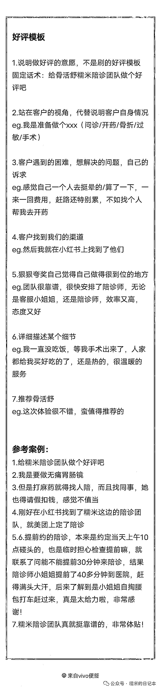

# 《糯米的陪诊实战手册》——如何教会你的陪诊师做美团好评

> 原文：[`www.yuque.com/for_lazy/thfiu8/xh1fb8au6rw86orz`](https://www.yuque.com/for_lazy/thfiu8/xh1fb8au6rw86orz)

## (23 赞)《糯米的陪诊实战手册》——如何教会你的陪诊师做美团好评

作者： 糯米

日期：2024-02-19

糯米现在在用美团平台的系统，实现陪诊下单的部分自动化

同时，这也给糯米的陪诊服务每天带来一定的曝光

**糯米断言，在美团上及早扎根，一定是机会！**

从战略上看，美团这个平台的定位就是**本地生活**为主

无论你是在本地还是外地，是给自己还是给亲戚朋友点陪诊，似乎美团这个平台都更为接近人的自然选择一点

假如你准备去看个病，觉得需要找个熟悉医院流程的陪诊师陪同，你会优先选择抖音？小红书？还是美团？咸鱼？淘宝？

可能对于第一次找陪诊师的，会优先去自媒体平台找，但只要在美团上找过一次的，一定会在美团上找！

**为什么？**

因为自媒体平台追逐新奇特，用户更多的是尝鲜式消费，但美团多为本地生活习惯性重复消费，信任度更高

在一个行业没普遍走进大众的常规消费习惯中时，自媒体平台是大家的优先想到去检索的渠道，因为平台信息更新速度快

但当这个行业不断成为大众的常规消费习惯时，美团这种平台就会变成大家的优先选择，流量开始沉淀，消费需要的是持续稳定靠谱

**因此，在美团这个平台上等风来是非常靠谱的**

只要用户的陪诊消费习惯在美团上不断养成，店铺赚钱爆发是迟早的事儿，一定要入场早，紧抓牢

那说到美团上做陪诊，无可厚非，美团店铺排名是看评分的

而好评又是最影响店铺评分的！

因此，做好店铺的好评是很重要的！

糯米也不啰嗦了，直接讲结论

**陪诊师陪同客户，线下一对一场景下，是最好拿下即时好评的**

所以糯米要求陪诊师在陪诊快结束的时候，尽可能盯着客人让对方给自己做好好评

话术也很简单，可借鉴这个思路

“咱现在闲着也是闲着，您要是对今天陪诊还满意的话，给我们个好评呗，文案图片我们提供，您不用麻烦的，复制粘贴就完事儿”

对应的场景可以是最后等报告，等结果，等着拿药的时候，提前准备好物料，一键复制粘贴

对吧，客人最怕麻烦了，哪怕你给他服务得很好，还是会很讨厌麻烦的

**咱们要做的就是让客人少麻烦**

虽然话术和场景举例说明了

但是糯米实战发现，很多陪诊师不会自己写好评（或者说不愿意好好写），写出来的好评真实无法直视

**解法也很简单，替他们出个模板即可**

其他行业的做美团好评，也可以借鉴这个思路，即，**给员工出好评模板**

员工如果在执行上不愿意积极行动的，糯米也有思路

“那我来帮你写，可以吧？但我帮你承担了一部分工作责任，那我就要分你的钱哈（doge）”

再鼓励一下员工，很简单的，你写两次就信手拈来了，基本就 ok 了

那陪诊的好评模板，糯米这里也直接奉上

其实这些操作并不难，难的是人懒，没有行动力，难的是人的畏难情绪，想着一大堆细节性操作，文书，马上就不想做了

那我要说，其实这些都是正常的

是人都会有这些情绪，但你要习惯与这些情绪相处，找到哄骗自己的方法，减短行动链路，降低启动负荷，这样才能成为行动派

不然你再牛逼的想法，不行动也不会有结果，对么？

* * *

评论区：

暂无评论

* * *