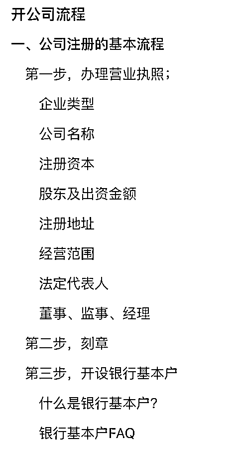
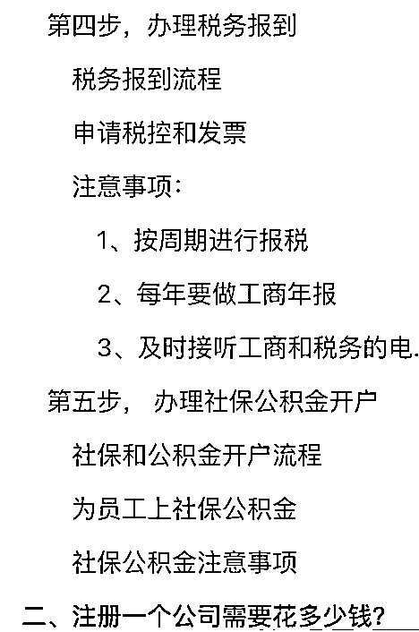

# 新手开公司需要了解哪些知识？开了公司之后需要做什么？

> 原文：[`www.yuque.com/for_lazy/thfiu8/py54czs7w092tqvk`](https://www.yuque.com/for_lazy/thfiu8/py54czs7w092tqvk)

## (40 赞)新手开公司需要了解哪些知识？开了公司之后需要做什么？

作者： 广深莞注册公司@山歌

日期：2024-03-05

大家好~我是一个专门为小微初创类企业老板提供工商财税知识的山歌，致力于为开公司新手老板答疑解惑，传播客观知识，打破信息差，破除焦虑！

  

整理不易，如果对你有帮助，感谢点赞，交个朋友，一起生财有术！

开公司流程

新手开公司必备知识

下面是新手开公司的一些基础知识：

详情请移步飞书：[`cc0xe90dra.feishu.cn/docx/FyPQd1HZ9oSw5WxYSzMcHwbzn9f?from=from_copylink`](https://cc0xe90dra.feishu.cn/docx/FyPQd1HZ9oSw5WxYSzMcHwbzn9f?from=from_copylink)

* * *

评论区：

十一 : 没有权限
沐风 : 没有权限
广深莞注册公司@山歌 : 更新链接
广深莞注册公司@山歌 : 更新链接

* * *