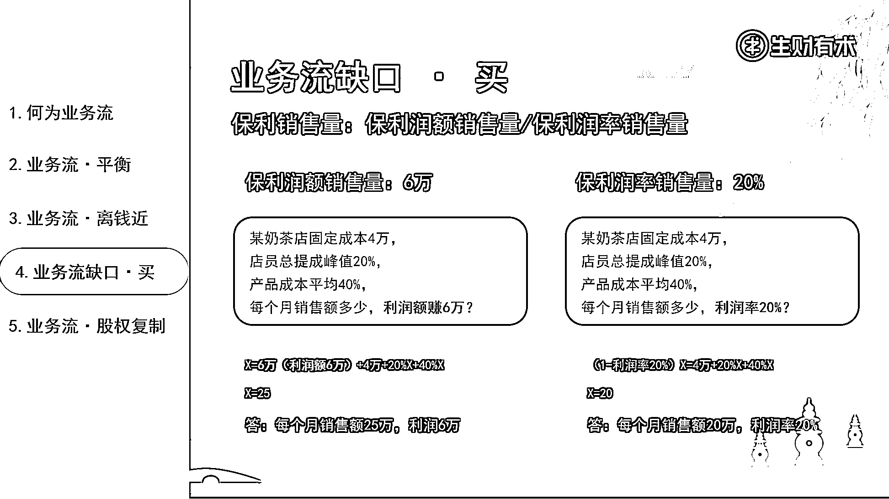

# “如何掌握好业务流的 3 个端口，让业绩翻倍”

> 原文：[`www.yuque.com/for_lazy/thfiu8/abkoxskgid3kpfv5`](https://www.yuque.com/for_lazy/thfiu8/abkoxskgid3kpfv5)

## (29 赞)“如何掌握好业务流的 3 个端口，让业绩翻倍”

作者： 深圳刘宁培

日期：2024-03-08

感谢生财有术平台，感谢亦仁大哥，有不少客户是通过生财有术圈子一起合作、一起合伙。

今天在这里跟大家分享下，“如何掌握好业务流的 3 个端口，让业绩翻倍”，信息点有点多。

我叫刘宁培，生财第二期就一直续费至今的老圈友；

主业企业咨询：擅长股权、薪酬、管理体系；

综合能力模型：客户 0-1 跑通，市场容量大的情况下，我擅长做将客户的体量从 1 做到 10；能做利润/业绩翻倍；

> ### **一、何为业务流**
> 
> 什么是业务流？
> 
> 业务流，也称业务流程，是指企业为达成特定目标，所采取的一系列有序的活动和流程。
> 
> 了解业务流之前，先了解两个名词：波特价值链、业绩 SOP。
> 
> #### 1、波特价值链
> 
> 经营好一个公司，要了解很多，如：营销、总务、采购、服务、法务、财务、行政、销售、信息系统、进货物流、技术开发、出货物流、人力资源管理、产品规划、产品研发......
> 
> 正常看以上名词，会有点混乱，加上波特价值链这个工具，就简单清晰。
> 
> 以上所有活动可以分为辅助互动、基础活动。
> 
> 辅助活动包含：企业基础设施、人力资源管理、研究与开发、采购；
> 
> 基本活动包含：进料后勤、生产运营、后勤发货、营销销售、售后服务；
> 
> 每一项更加细节的，我做进 PPT 里面了 ，大家可以看下图：
> 
> 
> 
> 简化版的波特价值链看下图：
> 
> 
> 
> 举例：快递公司的波特价值链
> 
> 
> 
> 举例：摆摊卖红包对联的波特价值链
> 
> 
> 
> #### 2、业绩 SOP：
> 
> 任何一个公司的业绩核心在于 4 个关键子因素：流量、转化率、客单价以及复购/转介绍。
> 
> 这 4 个子因素共同构成了企业业绩的基石。
> 
> 每个企业所做的营销方案、活动策划的目的，都是为这 4 个子因素服务的。
> 
> 举例来说：公域获客为了流量；私域运营为了转化率、复购/转介绍；产品迭代为了客单价；
> 
> IP 打造，为了流量+转化率+客单价+复购/转介绍；
> 
> （为什么 IP 打造重要且困难，因为 IP 同时为 4 个子因素服务，一举四得，肯定重要且困难）
> 
> 简单来说，业绩就是这四个子因素的乘积。
> 
> 业绩=流量×转化率×客单价×复购/转介绍
> 
> 如果 4 个子因素每个环节都是 1 ，那业绩=1×1×1×1=1；
> 
> 如果第二年能力强，能将每个子因素都变成了 2，那业绩=2×2×2×2=16；
> 
> 这意味着业绩能够翻 16 倍。
> 
> 
> 
> 波特价值链+业绩 SOP=组织架构图
> 
> 最上面是公司的 CEO，也就是操盘手。
> 
> 中间是公司主要的 4 个部门：基石部门/成本部门、前端打单部门、后端交付部门、产品研发部
> 
> 1.  基石部门/成本部门=波特价值链的辅助活动；
> 
> 2.  基石部门/成本部门包含行政、人事、财务、仓管、后勤等；
> 
> 3.  前端打单部门、后端交付部门、产品研发部=波特价值链的基本活动；
> 
> 4.  前端打单部门、后端交付部门、产品研发部包含了业绩的 4 个子因素：流量、转化率、客单价、复购/转介绍；
> 
> 
> 
> **小结：**
> 
> 公司业务流的 3 个端口：流量、转化、交付。
> 
> **流量指标：**PV、UV、SEO、完读率、完播率、咨询率、加 V 率、进群率、进店率等；
> 
> **转化指标：**点击率、访问到转化的比例、二跳率、购物车转化率、咨询转化率、跳出率、平均访问时长等；
> 
> **交付指标：**好评率、满意度、孵化率、退费率、投诉率与解决率、续费率、活跃度、留存率、互动率、内容转化率、LTV 等；
> 
> > 
> > 
> > ### **二、业务流平衡**
> > 
> > > 业务流平衡：简单来说，就是确保公司的业务流 3 个端口能够协调运作，避免资源的浪费和效率的低下。
> > > 
> > > 要实现业务流平衡，有 4 个关键要求：
> > > 
> > > 
> > > 
> > > **1、CEO 必须懂得看财务三表**
> > > 
> > > 即资产负债表、利润表和现金流量表。这三张表是财务的基石，它们反映了公司的资产状况、盈利情况以及现金流的变动。（这个财务三表包含什么内容就不一一解释了，如果大家不清楚的话，可以买这本书《**用生活常识就能看懂财务报表》**，当年老婆买了这本书给我看，学会了很多，也通过这本书赚了挺多）
> > > 
> > > **2、波特价值链“辅助活动”跟“基本活动”的平衡**
> > > 
> > > 在公司初创期，为了节约成本，一人多岗是常见的现象，不用请一堆的行政、人事、会计、出纳、仓管、前台等；
> > > 
> > > 但随着公司的发展壮大，就需要请专业的行政、人事、财务等人员来支持公司的运营。如果一直依赖外包或者非专业人员，可能会导致年底交税时，才发现自己交了过多的税费。
> > > 
> > > **3、流量、转化的平衡**
> > > 
> > > 不能一味地追求流量而忽视转化，否则就是浪费流量资源。同样，也不能因为流量过大，转化部门人员不足而失去最佳成交时机。
> > > 
> > > **4、前端打单部门、后端交付部门的平衡**
> > > 
> > > 前端部门负责获取流量和成交，后端部门则负责交付服务。如果前端部门过于强大而后端部门跟不上，会导致服务质量下降，影响公司口碑。反之，如果后端部门过于庞大而前端部门无法提供足够的订单，则会造成后端人力成本的浪费。
> > > 
> > > 当然，在企业中，一定程度的不平衡是可以接受的，上班摸摸鱼，刷书抖音看看美女帅哥。
> > > 
> > > 但如果不平衡的比例过大，比如达到 50%左右，那就意味着公司的盈利可能无法支撑员工的工资，甚至老板的收入可能还不如员工，老板给员工打工。
> > > 
> > > 以我的客户高夫人蛋糕店为例，更直观地理解这一概念。
> > > 
> > > 跟高夫人蛋糕店是在 2023 年 7 月合作，给高夫人上了三天两夜企业基本盘的培训，拿到了店铺详尽的经营数据。
> > > 
> > > 流量：高夫人跟谢无敌老师学习了小红书商家实战营，客户来源主要来自于小红书及后期的私域（现在也做各外卖平台）；
> > > 
> > > 转化：高夫人做的蛋糕好看、好吃、二次元得很可爱，上海客户从小红书加到公司微信，由一个专业的客服做转化，转化率 30-40%左右；
> > > 
> > > 交付：店里面 5-6 个员工做蛋糕，安排跑腿或者送货师傅给客户送蛋糕；
> > > 
> > > 服务之前，每个月的流量、转化都相对稳定，有个稳定值，
> > > 
> > > 流量×转化=1（为便于理解，将其设为 1，此处为脱敏数据）
> > > 
> > > 但是后端交付的上限是 1.8（脱敏数据）
> > > 
> > > 前端打单、后端交付部门不平衡，1 跟 1.8
> > > 
> > > 这种不平衡意味着店铺在人力成本上存在较大的浪费，
> > > 
> > > 
> > > 
> > > 面对这一情况，我提出了两种解决方案
> > > 
> > > 一个是放大流量/转化率，把前端打单的数据维持在 1.8 左右；
> > > 
> > > 二是裁减后端交付部门的人员，裁人裁到交付能力在 1 左右；
> > > 
> > > 问高夫人选择哪一个？
> > > 
> > > 因后端交付人员实培训时间成本比较久，高夫人说选择第一个，放大流量/转化率；
> > > 
> > > 接下来出了放大流量/转化率的策略，尽量把前后端拉到平衡；
> > > 
> > > 策略实施了 3 个月左右的时间，前端打单的数据做到了 2.7，后端交付还是 1.8，轮到后端缺人了，接下来开始招聘后端交付人员，甚至还在小红书投广告招聘人员，慢慢将后端的交付能力也拉到 2.7 左右；实现了前端打单、后端交付的相对平衡；
> > > 
> > > 
> > > 
> > > 
> > > 
> > > 如果有选择，宁愿哪个端口量多？
> > > 
> > > 
> > > 
> > > 情况 1：流量多，转化一般、交付一般
> > > 
> > > 情况 2：流量一般、转化多、交付一般
> > > 
> > > 情况 3：流量一般、转化一般、交付多
> > > 
> > > #### **答案是情况 1，流量多**
> > > 
> > > 手握流量，兴风作浪，只要在自己的行业里面做了一段时间，肯定有可以合作的竞争对手，
> > > 
> > > 有过多的精准流量，自己转化不了，交付不了，就外包给同行赚佣金，至少有钱赚；
> > > 
> > > 情况 2、情况 3 就不一样了，有可能是老板给员工打工。
> > > 
> > > #### 做好小结：
> > > 
> > > 1、CEO 要懂财务三表，要会算账，需要时刻关注业务流的平衡状态，并根据实际情况进行调整和优化，确保企业稳健发展不亏钱。
> > > 
> > > 2、流量部门、转化部门、交付部门三个部门负责人的周会或者月会，有个议题必须要讨论，要告知彼此“稳定峰值”，只有当企业的各个环节和部门之间实现协调运作，才能避免资源的浪费和效率的低下。
> > > 
> > > 3、否则其中某个端口越积极，另外两个端口不平衡越大，就会出现越积极越亏钱；（可以有 10-20%的不平衡），像某公司在抖音上的流量已经特别大了，公司的转化部门跟后端的私域交付部门已经忙不过来了，还在招聘小红书新媒体运营部门的人员在搞流量......
> > > 
> > > 
> > > 
> > > ### **三、业务流，离钱近，才实在**
> > > 
> > > 从业 5 年来，接触了很多老板，发现很多老本都有 3 个通病；
> > > 
> > > ①情绪化严重；②缺乏安全感；③完美主义；
> > > 
> > > 尤其是第三条，完美主义；
> > > 
> > > **有时候跟完美主义的老板沟通起来特别累，累到以后都不想跟这类老板合作；**
> > > 
> > > 流量要做到 100 分、转化做到 100 分、交付要做到 100 分才开始做市场，
> > > 
> > > 每个环节 100 分的时候，黄花菜都凉了，资金链早断了；
> > > 
> > > 流量、转化、交付**再拆成**流量、转化、客单价、复购/转介绍
> > > 
> > > 前面说到：业绩就是这四个子因素的乘积。
> > > 
> > > 业绩=流量×转化率×客单价×复购/转介绍，
> > > 
> > > 如果 4 个子因素每个环节都是 1 ，那业绩=1×1×1×1=1，
> > > 
> > > 如果第二年能力强，能将每个子因素都变成了 2，那业绩=2×2×2×2=16，
> > > 
> > > 这意味着业绩能够翻 16 倍。
> > > 
> > > 但是第二年将每个环节的子因素都翻倍变成 2，意味着要投入更多倍的时间、精力、金钱，这是不太现实的。
> > > 
> > > 所以我每到客户公司时，都会分析下客户公司的流量、转化率、客单价、复购/转介绍，哪个子因素今年在公司资源、股东资源的加持下，可以快速放大的，挑 1-2 个子因素，重点放大来打。
> > > 
> > > **另外 2-3 个短时间内不可能快速放大的，直接放弃，维持原状就可以。**
> > > 
> > > 举例，来进一步解释业务流与盈利的关系。
> > > 
> > > #### 1、闪亮猫传媒·谢无敌
> > > 
> > > 我对整个公司的产品体系进行了深入的分析，细致地研究了每个产品的流量、转化、客单价以及复购和转介绍的情况。我发现提升流量、转化率这两个子因素相对简单，2023 年的重心就是放大流量、放大转化率，而客单价、复购/转介绍这 2 个子因素则暂时维持现状，不考虑放大；
> > > 
> > > 
> > > 
> > > #### 2、高夫人蛋糕店
> > > 
> > > 同样将整个公司的产品体系进行了深入的分析，流量和客单价的增长潜力最大，制定了 5 个策略，集中力量专注于提升流量和客单价，转化率、复购/转介绍这 2 个子因素则暂时维持现状，不考虑放大；
> > > 
> > > 
> > > 
> > > #### 3、某情感/相亲业务
> > > 
> > > 同样将整个公司的产品体系进行了深入的分析，流量和客单价的增长潜力最大，制定了 3 个策略，集中力量专注于提升流量和客单价，转化率、复购/转介绍这 2 个子因素则暂时维持现状，不考虑放大；
> > > 
> > > 
> > > 
> > > #### 做个小结：
> > > 
> > > 1、不要完美主义，否则断资金链；
> > > 
> > > 2、先完整，再完善；
> > > 
> > > 3、流量 60 分、转化 60 分、交付 60 分，已超越 60%+的同行；
> > > 
> > > 业务流与盈利是紧密相连的。
> > > 
> > > 深入剖析所有的产品体系，找到增长潜力最大的因素，并集中精力进行提升，才能更快见到钱，见到正反馈。
> > > 
> > > **而那些增长潜力相对较小、需要长时间培养的子因素，暂时维持现状就行，避免过度扩张带来的风险。**
> > > 
> > > 
> > > 
> > > ### 四、业务流缺口 · 买
> > > 
> > > 前面讲到，流量 60 分、转化 60 分、交付 60 分，就可以超过 60%的同行了，如果我准备做的项目，缺了其中一个缺口怎么办？
> > > 
> > > 假如公司没人会做流量，只会最传统的坐商、行商的销售方式怎么办？
> > > 
> > > 假如公司没人会做转化，产品不错，但是转化率一直都很低，可能只有 1%的转化率，怎么办？
> > > 
> > > 假如公司没人会做交付，或者说公司整体的交付能力很弱，跟竞品完全没得比，被竞品直接吊打怎么办？
> > > 
> > > #### **有两个方法可以解决：**
> > > 
> > > 
> > > 
> > > #### **1、股权层面的合伙：找合伙人**
> > > 
> > > 股权合伙的 4 步走（顶层控制权、进入机制、分配机制、退出机制）之前的帖子写过了，不复述了
> > > 
> > > 以前精华帖链接：
> > > 
> > > ③企业初创期股权知识，避坑 80%+：[`t.zsxq.com/fyNbAuR`](https://t.zsxq.com/fyNbAuR)
> > > 
> > > ④股权顶层设计：[`t.zsxq.com/UBqVvjU`](https://t.zsxq.com/UBqVvjU)、[`t.zsxq.com/27eqV7A`](https://t.zsxq.com/27eqV7A)
> > > 
> > > ⑤股权激励：[`t.zsxq.com/05iMB2Zfu`](https://t.zsxq.com/05iMB2Zfu)
> > > 
> > > ⑨公司注册资本的坑有哪些：[`t.zsxq.com/13jA8pnI3`](https://t.zsxq.com/13jA8pnI3)
> > > 
> > > 说下找合伙人的 3 个基本的标准：
> > > 
> > > **（1）相同的格局：**彼此之间的格局差不多，不会因为 1%、2%的股份在那里计较，要考虑的是 100 万利润的分红是多少、以及 1000 万利润的分红是多少，而不是考虑 100 万利润我的股份多 1%少 1%的分红差多少（小胜小负没意义，小钱不计大钱赚）
> > > 
> > > **（2）互补的能力：**合作人之间的能力是互补的，你擅长流量、我擅长转化、他擅长交付，彼此之间的能力是互补的，我不用花 3 年的时间去学习你流量的打法，你不用花 3 年的时间来学习股权薪酬；如果大家彼此能力是半斤八两的，就没有合伙的必要。
> > > 
> > > **（3）分未来的蛋糕：**彼此之间合伙，能不能让业绩翻 5 倍？你单干一年可以做 100 万业绩，我单干一年也可以做 100 万业绩，我们两个人合伙，未来一年或者未来第二年，年业绩能不能做到 5 倍，即 500 万以上，如果能，又满足相同的格局、互补的能力，就合伙。
> > > 
> > > 如果不能，如果未来第一年、未来第二年只能做 200 万业绩，就没合伙的必要了，彼此之间商务合作，互推客户彼此互拿提成就可以了。
> > > 
> > > #### **1、经营层面的招聘：计算好盈亏平衡/投入产出，花钱买**
> > > 
> > > **第四个板块的内容，着重讲这一点。**
> > > 
> > > 学会买，要学会 3 个名词，费比、保本销售量、保利销售量。
> > > 
> > > #### （1）费比（费用比例）：
> > > 
> > > 公司的年收入=年支出+年利润
> > > 
> > > 年支出=固定成本（房租+水电+人员底薪）+浮动成本（提成/奖金+产品成本）
> > > 
> > > 年利润=公积金（不能提取）+分红比例（股东约定好的分红比例）
> > > 
> > > 房租水电杂费等、人员底薪、人员提成、奖金等、产品成本、股权分红比例，
> > > 
> > > 以上每组数据÷总销售额=费用比例（财务三表里的现金流量表，公司每个板块现金流出的比例）
> > > 
> > > 
> > > 
> > > #### **（2）保本销售量（盈亏平衡）：**
> > > 
> > > 这个板块的内容，望各位做老板的好好看下，如果自己公司的盈亏平衡点是多少都不知道，盲目创业，容易负债；
> > > 
> > > 举例：准备开一家奶茶店：
> > > 
> > > 固定成本：房租水电 1.5 万
> > > 
> > > 固定成本：5 个员工底薪+社保 2.5 万
> > > 
> > > 浮动成本：产品成本占比 40%
> > > 
> > > 浮动成本：员工提成占比 20%
> > > 
> > > 问：每个月销售额多少达到盈亏平衡？（如果认真看到这里，大家可以先不看后面的答案，尝试自己算算）
> > > 
> > > 解：假设奶茶店每个月的收入为 X
> > > 
> > > 收入=支出（盈亏平衡/保本销售量）
> > > 
> > > X=1.5 万+2.5 万+40%X+20%X
> > > 
> > > 最终解出 X=10 万，奶茶店每个月要 10 万营业额，才不亏不赚
> > > 
> > > 
> > > 
> > > 
> > > 
> > > #### **（3-1）保利销售量（保利润额）**
> > > 
> > > 固定成本：房租水电 1.5 万
> > > 
> > > 固定成本：5 个员工底薪+社保 2.5 万
> > > 
> > > 浮动成本：产品成本占比 40%
> > > 
> > > 浮动成本：员工提成占比 20%
> > > 
> > > 问：每个月销售额多少，利润额 6 万？
> > > 
> > > X=6 万（利润额 6 万）+4 万+20%X+40%X
> > > 
> > > X=25
> > > 
> > > 答：每个月销售额 25 万，利润 6 万
> > > 
> > > #### （3-2）保利销售量（保利润率）
> > > 
> > > 固定成本：房租水电 1.5 万
> > > 
> > > 固定成本：5 个员工底薪+社保 2.5 万
> > > 
> > > 浮动成本：产品成本占比 40%
> > > 
> > > 浮动成本：员工提成占比 20%
> > > 
> > > 问：每个月销售额多少，利润率 20%？
> > > 
> > > （1-利润率 20%）X=4 万+20%X+40%X
> > > 
> > > X=20
> > > 
> > > 答：每个月销售额 20 万，利润率 20%
> > > 
> > > 利润率 20%？
> > > 
> > > 
> > > 
> > > 
> > > 
> > > 有份保本销售量、保利销售量的表送个大家，大家把公司固定成本、浮动成本的数据填进去，就知道自己每个月的保本销售量、保利销售量是多少了。
> > > 
> > > 
> > > 
> > > 再倒推业绩=流量×转化率×客单价×复购/转介绍；
> > > 
> > > 公司每个月流量多少、转化率多少、平均客单价多少、复购/转介绍多少，最后相乘，看能不能做到保本销售量？看会不会亏钱？看每个月可以赚多少？
> > > 
> > > > 刘老师不是要讲**经营层面的招聘：计算好盈亏平衡/投入产出，花钱买**这个话题吗？
> > > > 
> > > > 怎么讲到了一家奶茶店的保本销售量、保利销售量了，是不是扯远了？
> > > > 
> > > > 大家暂停一下，可以先不往下翻，认真思考几个问题？
> > > > 
> > > > **保本销售量、保利销售量的计算公式，可以在一家奶茶店里面应用，**
> > > > 
> > > > **是不是可以在任何一家公司里面应用？**
> > > > 
> > > > **是不是可以在公司的某个部门里面应用？**
> > > > 
> > > > **是不是可以在某个部门里面的某个人身上应用？**
> > > > 
> > > > 
> > > > 
> > > > 这个课件在陈雪老师组织的杭州生财年会分享过，给大家出过一个题目，这里也同样出个题目，算出答案的，可以在评论区留言；
> > > > 
> > > > 准备招募个流量部门主管：
> > > > 
> > > > （1）固定成本：房租/基石部门摊销 5000 元
> > > > 
> > > > （2）固定成本：底薪+社保 10000 元
> > > > 
> > > > （3）浮动成本：产品成本占比 40%
> > > > 
> > > > （4）浮动成本：主管提成占比 10%
> > > > 
> > > > 问：每个月销售额多少，达到盈亏平衡？
> > > > 
> > > > 问：每个月销售额多少，流量部门主管创造的利润额为 6 万？
> > > > 
> > > > 问：每个月销售额多少，流量部门主管创造的利润率为 20%？
> > > > 
> > > > 
> > > > 
> > > > 讲 3 个案例，继续熟悉下保本销售量、保利销售量。
> > > > 
> > > > #### **案例①：优剪理发店**
> > > > 
> > > > 我加盟之前，参加了优剪的招商会，知道了优剪的基本财务模型；然后自己通过优剪的财务模型算出盈亏平衡点，每个月销售额做到 36000 元（840 人），每天 1200 元（28 人），可以做到盈亏平衡，
> > > > 
> > > > 加盟之前我去我家附近的一家优剪门店蹲点采集数据，蹲点了两天，一天工作日一天双休日，工作日的来客数是 46 人，双休日的来客数是 75 人，算下来一个月的销售额 69000 元（1612 人），远高于盈亏平衡点，直接就加盟了。
> > > > 
> > > > 
> > > > 
> > > > #### **案例②：某 MCN**
> > > > 
> > > > 第一笔启动资金几百万。聊到这个项目怎么打？我说几百万的启动资金太好打了，我就担心那种账上没多少钱，要整合上游、要整合下游、要做平台、心比天高的老板。
> > > > 
> > > > 首先，你基本知道整个业务流程怎么跑通。
> > > > 
> > > > 直接招人：流量团队招 10 个人，转化团队招 10 个人，交付团队招 10 个人，给这 30 个人定好对应的一个薪酬绩效指标**（保利销售量指标）**，3 个月试用期；
> > > > 
> > > > 试用期后，可以达到保利销售量指标的，留下来，一来他创造的收入能养活自己，二来也能让公司赚钱，达不到保利销售量指标的，全部开掉；
> > > > 
> > > > 假如流量部门剩 3 个人合格，转化部门剩 2 个人合格，交付部门剩 1 个人合格，3+2+1 组成一个团队，组成一个最小的 MVP。最小 MVP 保证了公司的每个人都可以帮公司赚钱，接下里就不断做团队复制。
> > > > 
> > > > 
> > > > 
> > > > #### **案例③：加盟国医仲景**
> > > > 
> > > > 感谢生财有术平台，感谢亦仁大哥，在杭州找到了两个优秀的合伙人，一个是刘驴，一个是旭教练；我们三在杭州加盟了一家店，国医仲景，大健康赛道，艾灸养生馆。
> > > > 
> > > > 当我们做大健康赛道，开艾灸养生馆的时候，很多朋友过来问，我们三个人没有做大健康的基因，为什么去开这么一家店，能赚钱吗？
> > > > 
> > > > 肯定能赚钱，一家门店不就是流量、转化、交付 3 件事情嘛？
> > > > 
> > > > 流量：总部解决线上抖音直播、线下开业帮扶、线下中医帮扶、线上美团-6 月
> > > > 
> > > > 转化：总部解决总部品项设计、产品实力见证、线下中医帮扶、销转流程
> > > > 
> > > > 交付：总部解决产品、品牌、店务运营体系、线上线下工具
> > > > 
> > > > 我们各自互补的能力解决
> > > > 
> > > > 流量：线下地推（旭教练）、私域帮扶（刘驴）
> > > > 
> > > > 转化：线下销售专家（旭教练）
> > > > 
> > > > 交付：财务模型（刘老师）、薪酬绩效（刘老师）、股权激励（刘老师）、线下艾灸师**（经营层面花钱买）**、店长**（经营层面花钱买）**
> > > > 
> > > > 
> > > > 
> > > > 
> > > > 
> > > > 一家店能赚多少钱，大家等数据哈，1 月 3 日开业，第一个月已经跑通盈亏平衡点了。
> > > > 
> > > > #### **做个小结：**
> > > > 
> > > > 1、CEO 要懂财报，要会算账，要会算盈亏平衡；
> > > > 
> > > > 2、不要自己把流量、转化、交付全干完，做不大；
> > > > 
> > > > 3、要么志同道合合伙一起赚，要么算好账花钱买；
> > > > 
> > > > 
> > > > 
> > > > ### 五、业务流· 股权复制
> > > > 
> > > > 不管是线上的互联网项目还是线下的实体店项目，任何一个项目的坪效、人效都是有上限；
> > > > 
> > > > 所以在有上限的情况下，要通过股权去绑定资金、人才，不断做项目的复制、复制。
> > > > 
> > > > 
> > > > 
> > > > 高夫人的陪跑服务包含了针对内部高管 / 合伙人 / 合作渠道 / 投资人的落地宣讲方案，代为宣讲；
> > > > 
> > > > 高夫人说有投资人要投资她，一起约了时间，在上海见面讲清楚项目。
> > > > 
> > > > 2023 年 10 月 23 号我跟他三个投资人，大概经过两小时宣讲、百问百答，其中两个投资人要在南京开二店，二店在 2023 年 11 月份开业。
> > > > 
> > > > 
> > > > 
> > > > 我给高夫人的商业模式是做连锁，每个店不会做到坪效、人效最高值 100%，做到坪效、人效最高值 80%就可以，避免后期因为某个业务流端口的缺失，导致利润率断崖式降低。
> > > > 
> > > > 稳定在坪效、人效最高值的 80%之后，不断开店，上海不说开 100、200 家店，开个 10 家、20 家店还是可能的。
> > > > 
> > > > 高夫人会成立一家餐饮咨询公司去持股每家店，每家店给店长做股权激励以保证坪效、人效最高值 80%。
> > > > 
> > > > 讲完这个商业模式之后，其中有两个投资人愿意花 10 万块钱买还没成立的餐饮咨询公司 1%的股权。
> > > > 
> > > > 
> > > > 
> > > > #### 做个小结：
> > > > 
> > > > 1.CEO 要懂财报，要会算账，要会分钱；
> > > > 
> > > > 2.不要自己全干完，做不大，不能复制；
> > > > 
> > > > 3.商业模式的终局，复制/批发；
> > > > 
> > > > 
> > > > 
> > > > ### 六、做个总结，一起生财有术，2024 年赚大钱
> > > > 
> > > > 1、流量、转化、交付是公司重要的 3 个业务流端口；
> > > > 
> > > > 2、流量、转化、交付 3 个业务端口要平衡，不平衡，亏闲置的人力成本；
> > > > 
> > > > 3、哪个端口最快可以放大的，优先放大，不要完美主义；
> > > > 
> > > > 4、哪个业务流端口缺，可以是股权层面的合作一起做，也可以经营层面的花钱买；
> > > > 
> > > > 5、股权复制 MVPplus、股权复制 MVPplus、股权复制 MVPplus；
> > > > 
> > > > 
> > > > 
> > > > * * *
> > > > 
> > > > 评论区：
> > > > 
> > > > 暂无评论
> > > > 
> > > > 
> > > > 
> > > > * * *