# 最朴素的小红书种草，如何从 0 到 1 开始投放，做到 20 的 ROI、女装冬季 400w GMV

> 原文：[`www.yuque.com/for_lazy/thfiu8/zxr6fz92pgvr7f9b`](https://www.yuque.com/for_lazy/thfiu8/zxr6fz92pgvr7f9b)

## (精华帖)(146 赞)最朴素的小红书种草，如何从 0 到 1 开始投放，做到 20 的 ROI、女装冬季 400w GMV

作者： 戴 ss

日期：2024-03-04

生财圈友大家好，我是戴 ss，四期老圈友了。

23 年冬季，通过小红书最朴素的种草方法——软文种草评论区引流淘宝成交，3 个月时间在女装新店用不到 20w 投放费用做到了 400w gmv，并且接到传统女装品牌的老板邀请合作，给其带来 200w 的小红书站外增长，整体的投放 ROI 在 20 以上。

有时候跟朋友聊，说这种草方法 N 年前大家都在用了，你们还能玩出花来？今天给大家完整复盘，如何通过三次选品，把爆率拉满，去年还是比较保守的投放策略，今年目前还在紧张筹备春夏款，希望对做服装和其他类目达人投放的圈友们有所启发，一起赚钱。

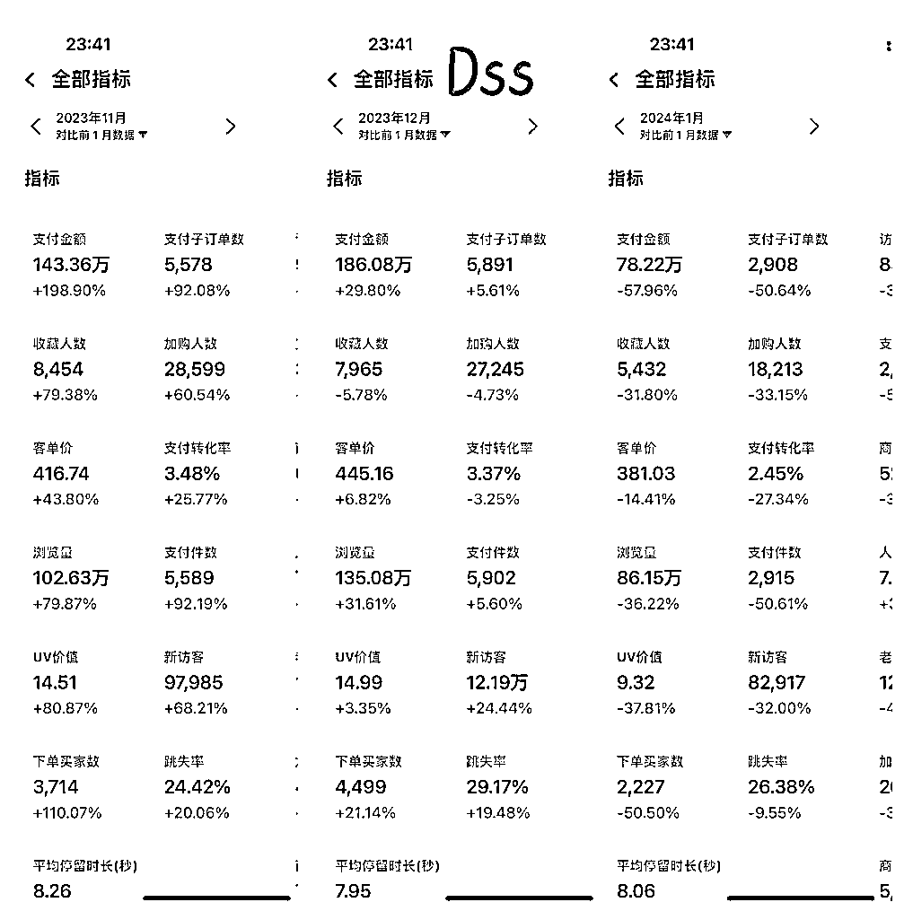

## 先上一个小菜

在复盘之前，这套打法来自我一个习惯，这个习惯跟一个字强关联——爆，那就是刷榜单，正确的刷榜单。

就以现在的榜单为例，不用看我都知道充斥着社会新闻、娱乐八卦等，以下为截图

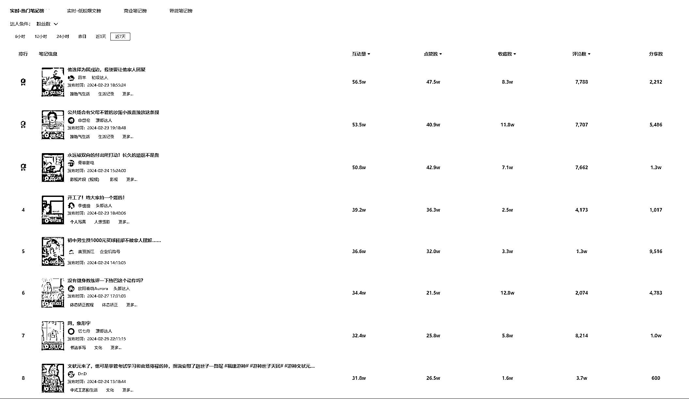

但是一个操作就可以直接让榜单价值度提升，按收藏排名，

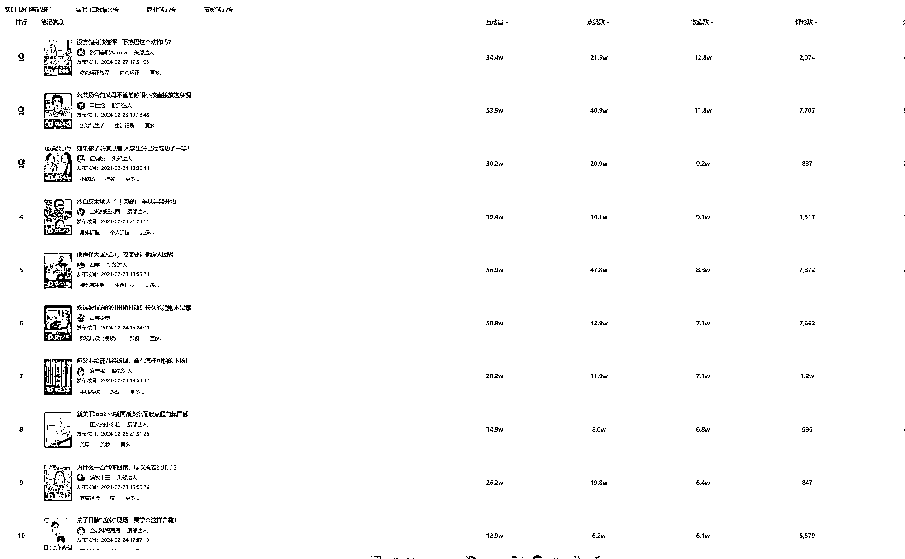

价值度一下就上来了，就拿榜 1 来说，是不是一个比较好的选题，热巴的这个动作可以建立足弓、直腿，相关行业前 5 秒甩上去，爆？恰巧我也做过腿型矫正的 IP，我们最爱用的模板就是明星的气质变化、明星的健身动作。再看第八位的美甲，如果你是一个美甲店，搞出同款美甲你看爆不爆！啊，价值度还不够？

可惜数据软件没有点赞收藏比筛选，那我们只能肉眼看喽。主动设置：赞藏比小于 3。

现在筛选出来的基本就是含金量比较高的内容，再结合自身行业的类目精筛，价值度进一步升华。

比如我们穿搭行业的去年的榜单某个款就让我们爆了一下。除了选题，利用这个方法其实也可以筛选出非常多的项目。提一个搞笑的，之前看到榜单的美甲，我甩给媳妇问问好看不，她拿着图就去找家附近的美甲店，一比一复刻了下，店家拍下发小红书也爆了，很多北京的跑过来找她做，还给我媳妇免了一次单哈哈，有点意思。

以上就是一碟小菜，它确实比单纯刷小红书、抖音要高效很多，不会迷失在美女跳舞当中。正确刷榜单的习惯我保持了一年多了，从流量倒推产品和项目，甚至去年我还为此做了两个产品（红酒、养生茶）。

差点忘了，还有一个习惯就是在生财刷精华和风向标，拾起对我有用的碎片拼图，在此感谢生财团队为我们筛选优质信息。

# 正式复盘

现在想想应该不叫复盘，更像“现在如果我做这个项目应该如何去做”，这个大家读起来更有参与感，实操也更方便。服装选品定生死，如何通过三次筛选品，最终锁定目标，逐步放量。

## 一、第一次选品，让往日的数据决定

比如现在时间是二月底，春款太晚，只能着手夏款。夏款最爆的是连衣裙，我们就拿连衣裙举例，小红书搜“连衣裙夏”，须符合以下标准：

1.  点赞超过 2000

2.  赞藏比小于 3

3.  该款流量明显大于该博主平时其他款式

依次解释，点赞超过 2000 是为了确保选品为爆款，但是并不是硬性规定，比如在一个 1000 粉丝的博主平时数据就 20 赞左右，突然出现一篇 1000 赞的，那这种款爆率就会相当高。

“赞藏比低于 3”是规避掉娱乐属性的种草，比如穿一个性感的连衣裙去跳舞，数据都不错，但不是不带货。

“流量大于平时”是为了排除掉博主自身流量的影响，有的博主均赞 1000，反而让我们无法去评估这个款本身能不能打。

上案例，在小红书搜索“连衣裙夏”以后

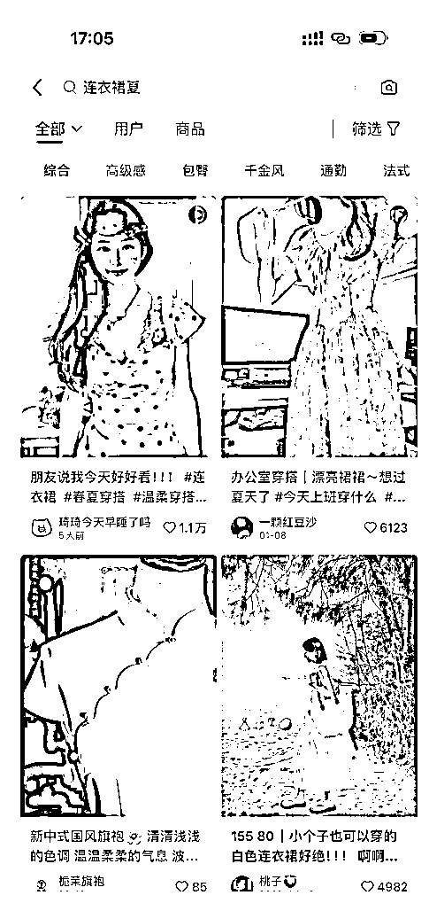

我们直接看到一个 1.2w 点赞、一个 6k 点赞，刚好这两个也比较具备代表性，“琦琦今天早睡了吗”这件裙子 1.1w 赞，但是赞藏比大于 3，赞藏比大于 3 的原因是她本身的美已经超过了衣服本身，所以我们无法判断该款是否是真爆，只能说人是个爆人。

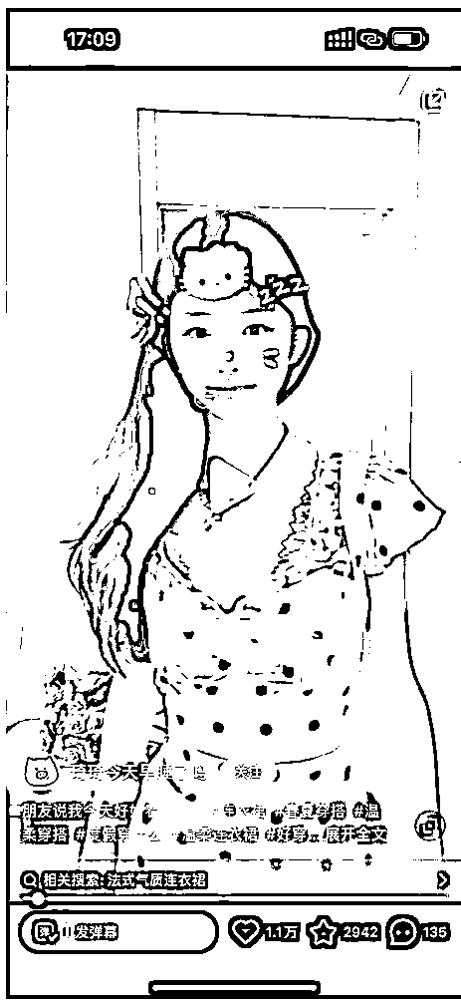

而且我们可以去主页看一下，基本上流量都很不错，触发了 1 和 3 条件，看多了会大概知道这类博主流量好，但是带货一般，当然我们还有更精准的方法去判断博主究竟带不带货，后文会给大家解答。

然后我们看到第二个案例（图），“一颗红豆沙” 该篇 6k 赞，收藏快 4k

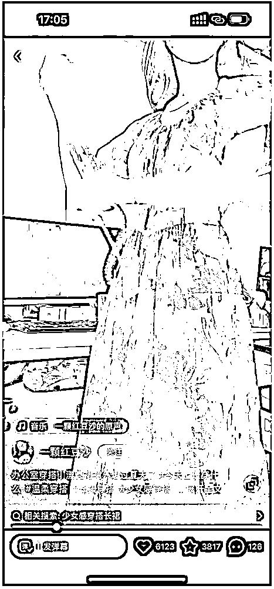

我们可以看一个细节，口罩挡脸了，也并没有露身材，那这个帖子爆的真正原因是什么？再看评论区求链接的数不胜数，我们再点进主页，平时流量也就百赞，这说明什么？数据异常值！潜在爆款啊！为什么是潜在，且听后几章分解！

按此逻辑，可以初选不少品，切记一点小博主的爆文一定要珍惜，数据异常值！话又说回来，虽然它们都是爆品，但是是别人爆的，没在自己博主上爆，所以只能算初选品，那我开始下一步操作，进一步锁定博主和品。

## 二、博主库的建立

博主库的建立是一个熬人的过程，需要人需要时间，但是熬人也意味着门槛，意味着价值。刚开始建立博主库效率会非常高，录入特别快，但是越往后期越会发现找到的博主都在博主库里了，会存在极大降低工作效率。所以后期挖掘新博主的工作一般交付给兼职 PR 做补充，按数量结算。俩月时间累计了将近了 1000 人的博主库，说实话刚开始自己也没意识到博主库的价值，直到有品牌通过 PR 找到我们合作投放。建立博主库是个粗活儿，谁都能干。但是，为什么有的女装十投九亏，而我们的博主流量都好，都夸我们爆率高呢，继续往下走。

1.如何找博主。

基本上在小红书搜索服装就会出来一堆，点击关注会弹出相关博主，裂变又一堆。主页大部分都有邮箱，有的小红书号也是微信，有的则是放小号置顶，这些没有技巧性的操作不再赘述，咱们生财人找对标那套都拿出来。找到以后批量发邮件，加到微信。

2.博主的筛选。（**重要**）

1.  排除大学生分享、PDD 平替分享、1688 平替分享，这是另外一种玩法，这种玩法也经常冲榜单，有机会给大家分享。这次我们做的客单价比这会高很多，这类博主博主带不动，所以先排除，如下图

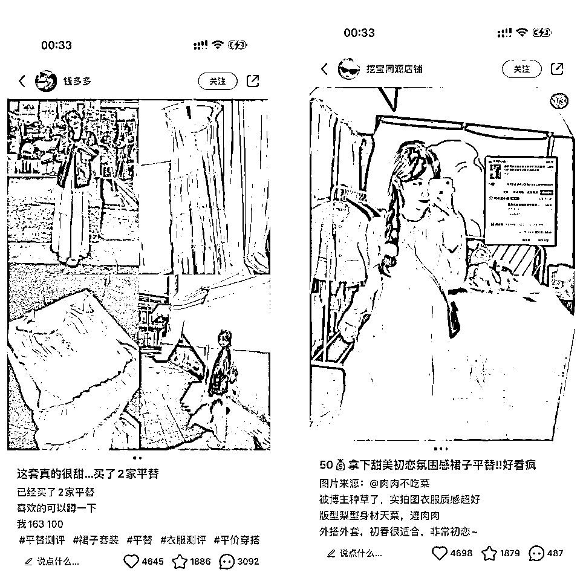

1.  作品赞藏比小于 3，这个比例经常出现，收藏意味着价值

2.  作品以衣服为主，人美胸大搞擦边搞氛围感的，做 IP 的要仔细的排查，如下图

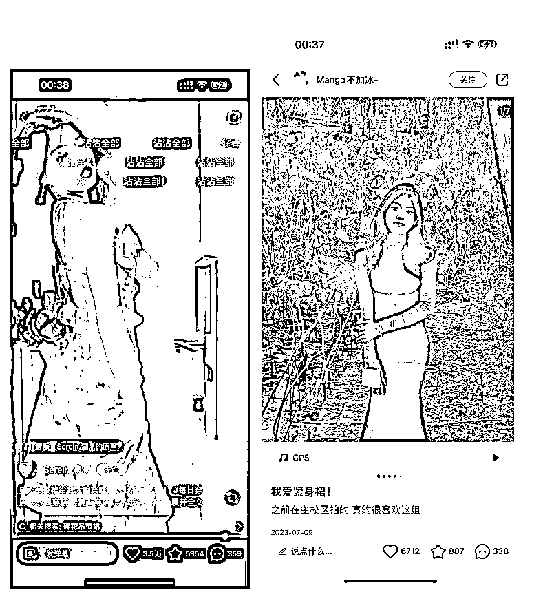

1.  报价合理，目前我们平均价格在 800 左右，很多时候穿搭博主因流量周期影响报价非常不稳定，合理即可，因为约款都在一个月以后，所以无法评估那个时候的流量周期。

2.  **检验一个博主是否真能带货。这是非常核心的一步**，用数据说话！检验博主是不是真的带货！还是拿上面的“一颗红豆沙”举例，如果一篇文章爆了，我们只需按她评论区的店铺名去淘宝找到链接，然后通过千牛——市场洞察——竞品分析，无奈店铺的市场洞察到期了还未续费，没办法用更直观的案例给大家展示，做过淘宝的应该能懂竞品分析，能直接分析当爆文出现以后，千牛后台的数据增长也是同步的，直接查询该品牌商品链接的加购数据。带货比较好的博主，收藏转淘宝加购率在 40%左右，也就是 6000 点赞，2000 收藏，可以获得 800 人的加购。

3.博主的分类

经过博主的筛选以后，会筛出很多优质的博主，也会存在一些数据不太好看的博主，不完美的千万不要直接拒绝好友申请！为什么呢，且看后续。目前我们按 ABCD 档进行分类

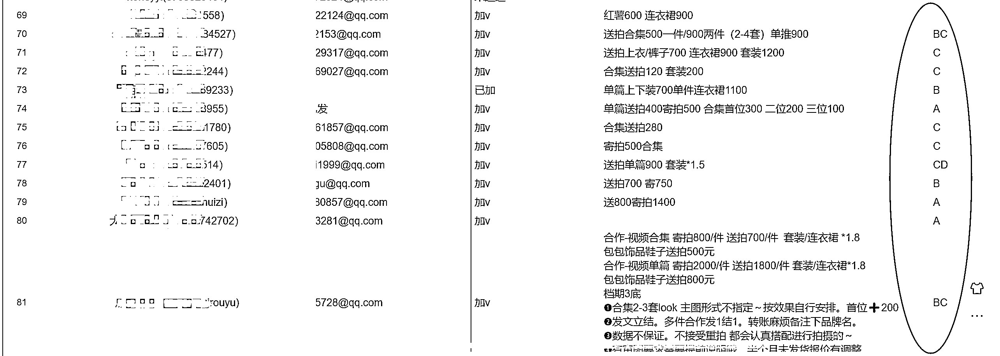

A 档为流量好，报价合理且带货的博主

B 档为流量和报价存在略微偏差，但带货的博主

C 档基本上是内容存在问题的博主，偶尔会有小爆，报价低的博主，这类博主后面有大用

D 档基本是素人博主，当且仅当在拥有大爆款进行放量时投放，不然一投一个亏

博主的筛选和分类是我们保 ROI 很重要的操作，在投放过程中真的看到非常多品牌的 PR 是只要是博主看得过去就一顿乱投，不亏才怪，一定要把帐算好。

## 三、约款——第二次选品，让优质博主决定

经历第一次我们自己的选品后，接下来来到第二次选品，此次选品我们仅充当计数器。

想必经历一、二步骤，已经能够准备 10-20 套夏款出来，这些款已经通过了我们的严格筛选标准，客观上已经是爆款，是宝藏。但我们要的是——在自己店里爆，所以开始第二次选款并约档期。

将第一次准备的款列为文件图

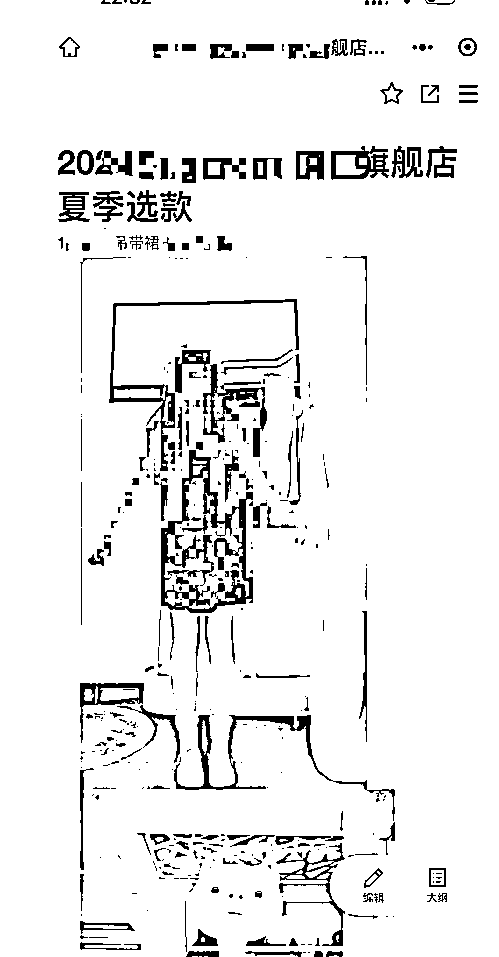

发送给博主库中 A 类博主进行挑选。

我们来说说这些 A 类博主，这部分博主一般比较“职业”，因为流量好，广子也多，基本都是日更。她们对穿搭、对品的理解有一定深度，所以这个时候把我们选出的款给她们进行选择可以进行二次筛选，对！就是最原始的画“正”字，每人可以投 1-5 票，筛选出投票前十位的款。并约好夏天的发文档期，处理好供应链的样品周期。

接着拿着 A 类博主投票的前 5-10 款，去约好 B 类博主的 4 月初的初夏档期。

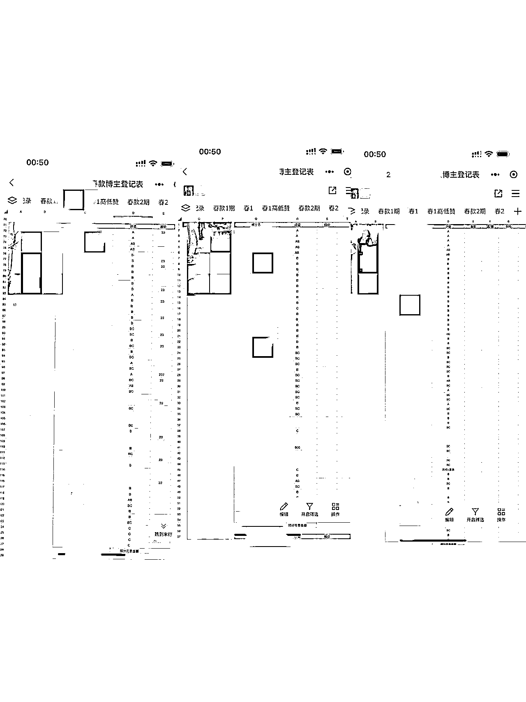

## 四、发文——第三次选品，让最新的数据决定

假如我们第二次选款确定了 ABCDE 五款衣服，每款约了 30 个 AB 类博主，并约好了 4 月 1 日开始发文，时间很快来到了 4 月份，约好档期的文章陆陆续续应该发出了，很多人觉得，前期的努力终于到了收获的季节！等爆就行。NO！这一步也只是筛选过程中的一步，别着急。在此发文过程中，当 ABCDE 分别发出 10-15 篇文章时，你会发现咱们有些款的流量普遍都不错，也有某一篇爆文冲榜单，但是并不是所有的都爆。这个时候需要从财务逻辑去分析复盘筛选最终真正的 BOSS——放量款。先说一个结论，设立一个标准，后面来仔细的算这个值是如何得出，每一个加购按 5 块钱来算。比如 ABCDE 款的发文数量均为 15 篇，每篇广告平均 800 元，广告费每款花费 1w2，由于淘宝活动转化有周期，我们直接用加购来算，加购数据靠前的 1-2 位出列！（根据数据来评估）这就是我们的最终 boss！！我们假定为 E 款加购物车表现极为优异。

## 五、BOSS 放量

通过 15 篇左右的发文，我们选出了最终爆款 E 款。为什么 ABCD 会在这轮筛选中败下，基于经验的总结主要有如下几点：

1.  这些款在早几年前就开始爆，爆款是可以重复的，但是是有周期的，换句话说就是被人推烂了

2.  毕竟我们测试发文是 15 篇，博主流量存在不确定性

3.  并不是 ABCD 不优秀，而是只有 E 从财务上算 ROI 最高，很有可能 ABC 都能赚钱，但是 D 只能保本，那就去掉 D。

之前我们 ABCDE 是每款约了 30 个博主，通过财务计算，能赚钱的都可以保持继续发文，但不进行放量操作。同时对 AB 类博主进行公关插档期，比如“目前有一个谁发谁爆的款谁有档期，可加价”，一般博主看到爆文就会临时加个档期，实在不行可以高出报价几百进行合作，爆款在手，不慌。同时，我们当初的 CD 类博主派上用场拉，此时的 E 是什么级别的爆款呢，可以说只要有基础权重和拍摄，谁穿上发小红书都会小爆一波流量。直接上图，基本小红书爆了，千牛后台加购也会顶满

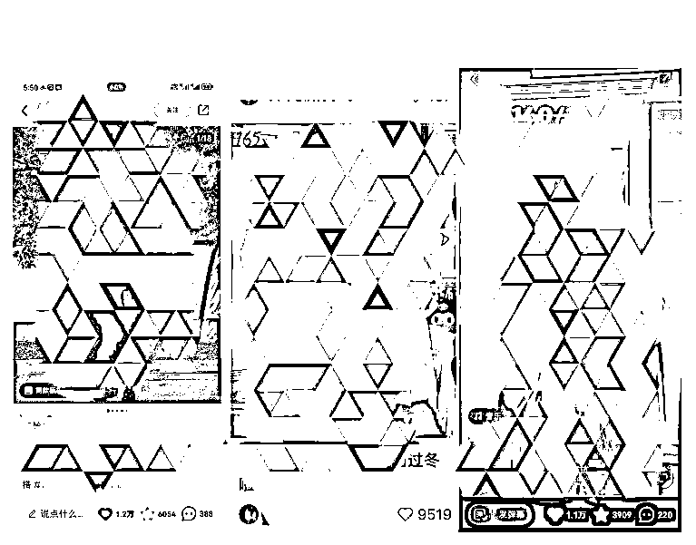

再来说 C 类博主，占我们博主库的 50%，这类博主发文需要一定的引导，说白了她们自己爆了帖子她会归因于是自己运气好，所以对于 AB 类的模范爆文，一定要直接把链接甩给 C 类博主，听话照着拍！一般在确定好最终的 boss 以后我们会把发文增加到 100 篇甚至 150 篇，具体可以实时做调整，但一定要放量！大胆干！放量到什么地步呢，曾经有顾客讲，她起码看到了 5 篇我们的帖子，200 个博主同时发爆款的概念就是关注该类女装的基本上都会刷到小红书的推文。

# 总结

本来这次分享想来一个赤裸无码带财务报表的分享，想想商标没复审下来，截流很痛苦，请大家理解，不过多刷刷穿搭榜单也能找到我们的品牌。

整个投放的过程其实可以分为三次筛品，第一次是往日的数据选品、第二次是让博主帮我们筛品，最后一次是在小红书投放进行实战出来的数据筛品，只有爆在自己品牌上，才能算的上真的爆。从这就是为什么我们投放能做到 20 以上的 ROI，而其他品牌都已经认为这是一个过气玩法，他们在选品、选博主、后期挪款放量上有着很大的差距。曾经跟其他品牌的 PR 聊，他们的 KPI 只是把博主加到手里把品投出去这么简单，甚至有一些是兼职 PR 在进行投放。

再聊聊财务。我们的定价体系是成本乘以 2.5 作为售价，利润看来颇高。但是为了避免女装的库存压货，种草基本上玩的就是 15 天预售，前期的库存基本上就是博主的样品，达人爆文以后迅速小单多返进行补货发货。库存没压力的同时，仅退款上来了。而且再冬装期间，供应链端排期出现了问题，导致我们一堆待发货难产，损失挺大，最后排除库存、员工场地纯利润在 35w 左右。11 月、12 月财务报表如图（投放费用分别为 7w，9w2，对应营业额 140w+，180w+）

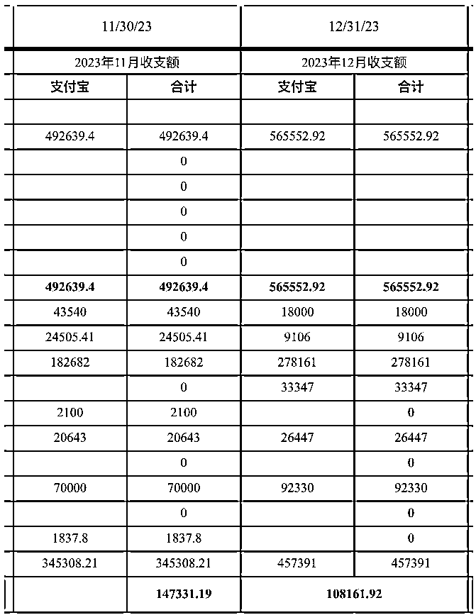

### 可能存在的答疑

1.  为什么选择女装

其实最早我们定的类目是女鞋，谈好了最顶的一件代发供应链，结果卡在女鞋类目出爆文，但是查千牛加购数据增量不明显，需要多次投放曝光种草才能完成转化。恰巧我们有服装供应链的朋友，所以才选择尝试。其实还有很多类目具有可能性，比如光腿神器、功能性内衣等

1.  为什么不做站内电商

这个应该是圈友会问的一个问题。我们其实做过 AB 测试，一个大爆款，通过不挂车的形式爆量产生的加购进而产生的转化远远大于给同类型博主挂车产生转化要高，也就是内容流量杠杠更大。为什么呢？因为定价！小红书站内电商无人设型博主带动的客单价拿连衣裙举例，不会超过 100。这时候又有人会问，为什么站内存在 300+以上的连衣裙销量也不错？因为这类博主通常 IP 属性非常强，属于真正小红书官方喜欢的品质买手，这个玩法在后面答疑中会解释。

1.  这套模式的低阶和高阶玩法

客观来说不能将其分为低阶和高阶，赚钱嘛，能赚就行。在低客单价领域，小红书存在非常多的平替号，甚至有很多都是 pdd、1688 商家自营，专打平替爆款，考虑客单价和供应链的原因，并不性感。相反，存在另一类高客单价玩法更吸引人。目前我们投的博主前面说到基本平均报价在 800，他们的作品中规中矩，但是如果把投放标准放在单篇 2000 价位，这种段位的博主再配上淘宝高质感的“外模主图”，基本能带动 300--700 价位的夏款，700-1000 的冬款，整体的回报也还不错。

1.  自营博主的玩法

其实就是自营型博主，选中的爆款 ABCDE，拿给一个不错的穿搭博主正常都能起号，甚至是爆，这个适合流量就会便宜很多，目前我们有一位全职博主和多位兼职博主，除了带自己品牌爆款以外，甚至还能接一些其他品牌的种草广告，在某些时候还可以反哺选品。

1.  女装供应链

供应链基本上是走 15 天预售，博主爆单我们下单，大概做货在 7-10 天。其实本来想把供应链写进整体的复盘当中，后来想一想，价值度不高，而且现在回忆起来是如此的痛苦，所以高高兴兴的复盘更重要。插播一条，有优质服装供应链可以一起合作！

最后的最后，为什么写这篇文章，是因为作为四期老圈友，第一次来到了生财办公室，这种感觉很美妙，又像老友，又那么陌生。平时只能周期性的刷风向标和精华，没有做出一些分享属实感觉惭愧，这次索性一边参加 tiktok 的课程，一边晚上码码字，希望对大家有用，行文逻辑格式没有太注意，大家多包涵。

* * *

评论区：

芝慧 : 大佬思路超棒！学到啦～感谢
小毛驴 : 厉害厉害
龙腾 Juan : 牛
北瑜 : 最关键的还得是供应链
戴 ss : 重要但不是最重要
邱惠铂 : 请问刷榜单用的是什么第三方软件？
戴 ss : 你好～灰豚～
邱惠铂 : ok，谢谢

* * *