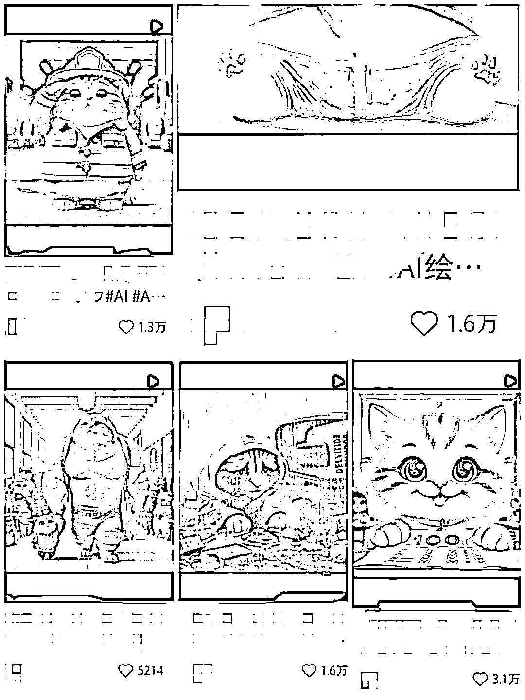

# 小红书商单变现：7 天涨粉 1.2w+，AI 猫咪视频真火

> 原文：[`www.yuque.com/for_lazy/thfiu8/gdhc01ildi6uxsit`](https://www.yuque.com/for_lazy/thfiu8/gdhc01ildi6uxsit)

## (116 赞)小红书商单变现：7 天涨粉 1.2w+，AI 猫咪视频真火

作者： 格子

日期：2024-03-06

**前段时间，我被疯狂洗脑的就是喵喵喵的 BGM，AI 画出来的喵喵送外卖、学贾玲健身、救火等，各种胖橘猫拟人化的剧情，看得我根本停不下来！**

而且很快，这种类型的视频就攻陷了 B 站、小红书、抖音、视频号等各大短视频平台。

那会我都不敢相信，一个随随便便的视频都能有几千上万的点赞，简直是看得我眼馋啊。

既然打不过，那就加入呗，于是我这个 AI 绘画小白，也吭哧吭哧去 AI 画猫咪了！

**还别说，这抓住了流量的风口啊，涨粉就是容易，我一周的时间，涨粉 1.2w，我每天只发一个作品，所以一周就 7 个作品而已。**

**来看看我 AI 喵喵的战绩：****出了 1 个 3.1w 赞的，2 个 1.6w 赞的，1 个 1.3w 赞的，1 个 1.2w 赞的，还有很多个大几千赞的。**

这个流量确实猛啊，我一个 AI 绘画小白都能有这个战绩，属实想不到！

今天保姆式和大家分享下这个领域怎么做。

提前挽尊下：**我对 AI 研究不多，对 AI 绘画更是 0 知识，所以我给的指令，纯粹都是我自己瞎写的，如有 AI 绘画专业的小伙伴轻喷！**

**一、项目逻辑**

chatgpt4.0 内置 DALL·E3 文生图工具，我们给出脚本和指令，就会给我们生成图片，图片生成后，我们用剪映剪辑下，加个配音，让剧情串联起来就可以了。

**二、详细操作流程**

1、我们登录 chatgpt 后，可以点击探索 GPTs

2、然后选择这个 DALL·E

3、点击一下 DALL·E 就添加上去了，像这样就是添加成功了：

需要对话的时候，点开 DALL·E，输出你的脚本和指令就行了

我为了节省对话的次数（4.0 有次数限制，3 小时 40 次对话），我调试了一个脚本，一次性给指令，让它一次性给我出图，减少我输出对话的次数。

**参考指令：**

你想要图片是什么内容，自己把细节描述好，写好对应的指令，另外就是有几张图片就写几张图片详细的指令即可。

我的账号基本能一次连续给出 9 套图，甚至更多。

当然，AI 发挥也是不稳定的，如果哪张图不满意，就发指令继续修改，如果画了前面几个指令，后面不画了，可以再把没画的指令单独发一下，让它继续。

图片画好了，就可以用个配音神器配个简短的配音，剪映剪辑就行了，当然，也可以直接剪映配音，再配上那个魔性的喵喵喵洗脑 BGM，一个视频就搞定了。

而且因为 chatgpt 出图都是一次性出两张的，咱们画一次图可以直接做两个账号，省时省力。

大家要切记一点：**AI 就像一个小孩，需要我们慢慢去调教它，只要我们调教得好，它就会从小学生慢慢变成大学生，AI 的内容好不好，在于调教的人会不会用。**

**三、变现途径**

1、培训课程

2、卖 gpt 账号

3、引流卖 AI 类的课件

4、小红书商单变现（我们主做的）

5、微信视频号分成计划

像我们做的就是小红书商单项目，AI 猫咪的流量很好，基本上几个视频就能千粉，千粉后开通蒲公英接广告，一单广告 180-240 元，一个号一个月接 15-20 条广告，单号月入 2000-3000 元。

**想要挣更多钱，那就多做几个账号，还是挺香的，做 3-4 个千粉账号，有希望月入过万。**

**如果想对小红书商单项目有更多了解的，可以看看往期发过的详细的帖子：****[小红书商单变现：简单粗暴无脑接广告，新手月入 6000-8000 并不难](https://articles.zsxq.com/id_nkst3ovqzl5p.html)**

**好啦，今天就分享到这里，祝愿每个坚持做小红书的小伙伴，多拿爆款，多多涨粉，多多挣钱！**

* * *

评论区：

拾一 : [强][强][强]
黄岛主(副业项目) : 学习了
敢拼，世界就是你的！ : 学习了[微笑]
Rio : 受教了谢谢
光光 : 这么可爱的小猫，不用来带货可惜了
Blue : 这个猫咪的能带什么货？
大屋顶(Peter) : 感谢
十月 : 学习了，感谢分享[玫瑰]

* * *