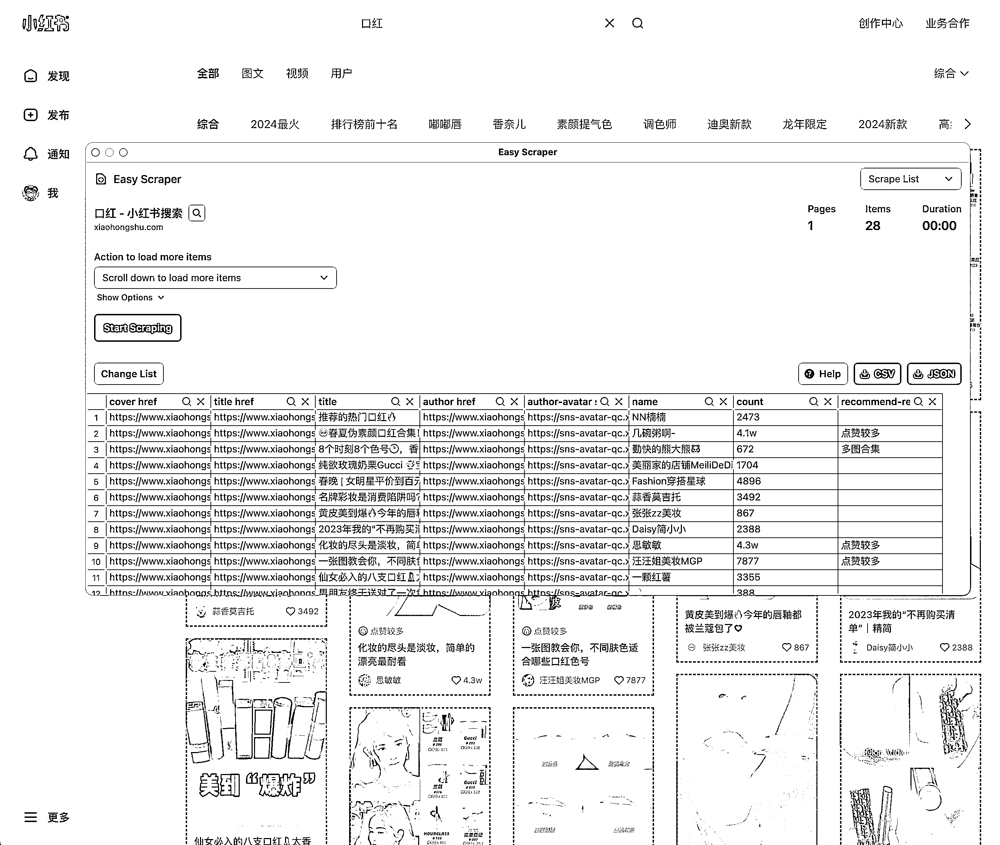
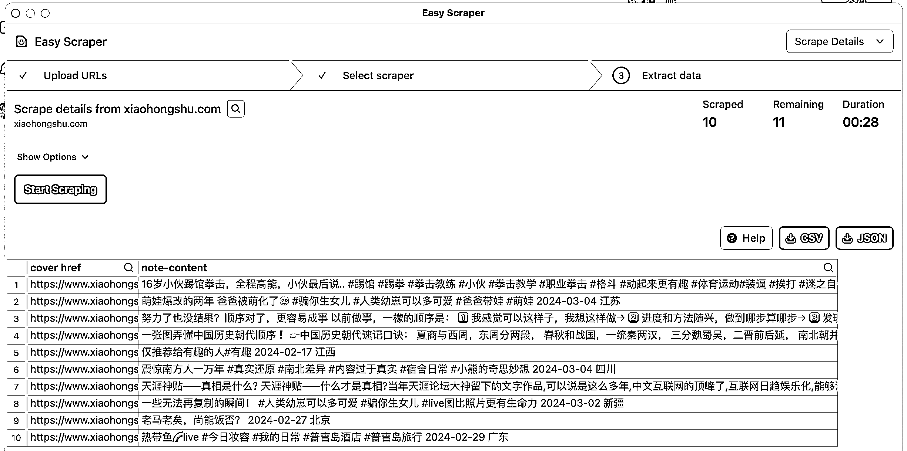
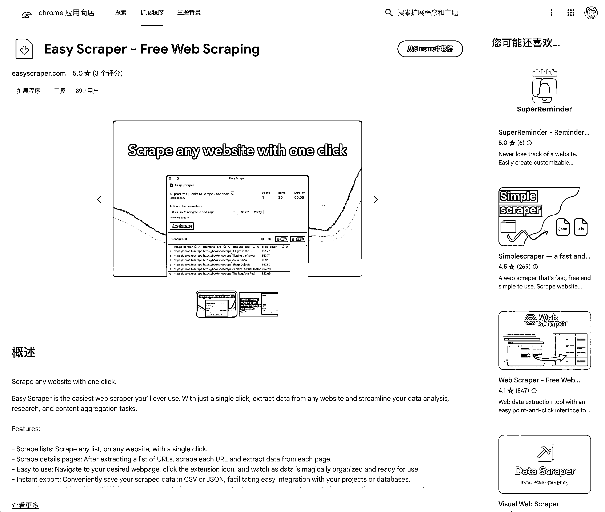
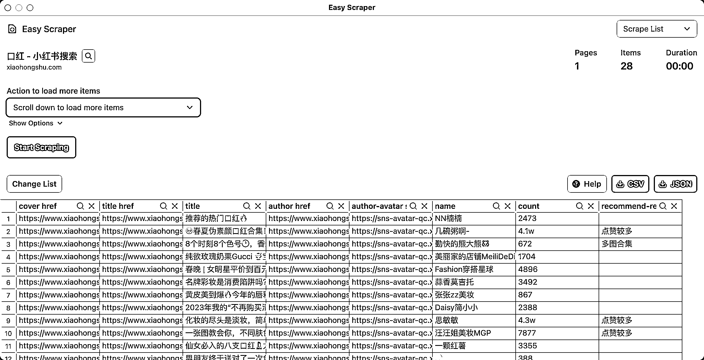
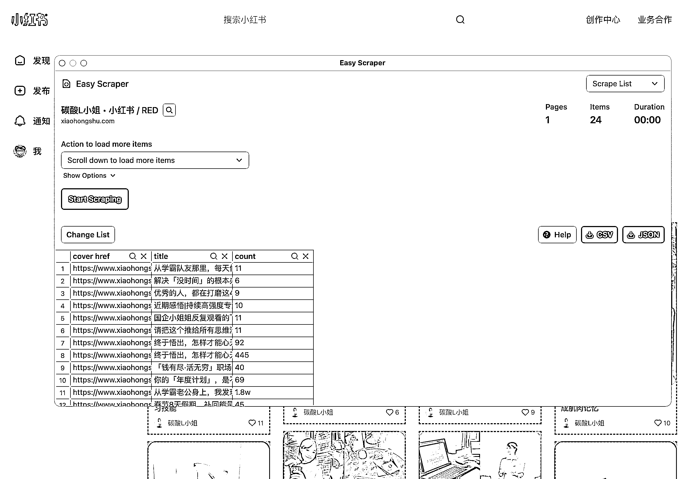
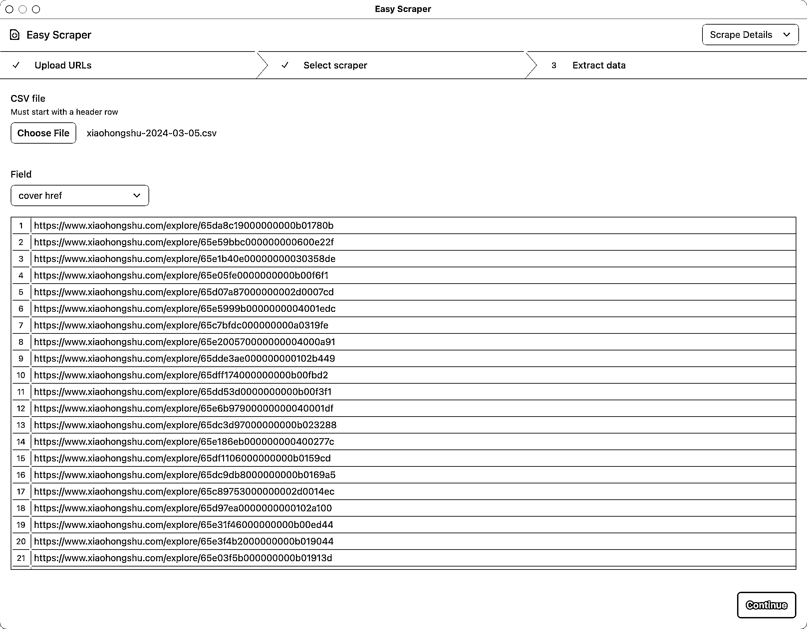
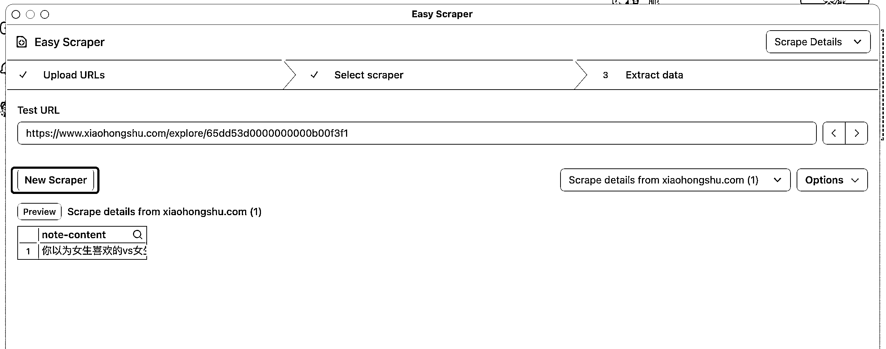
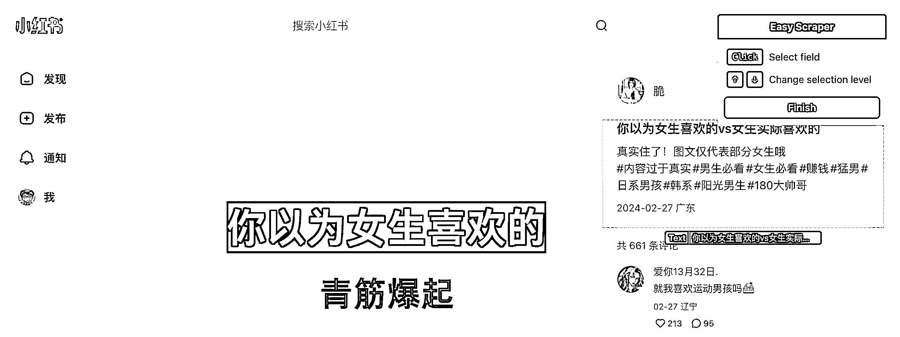
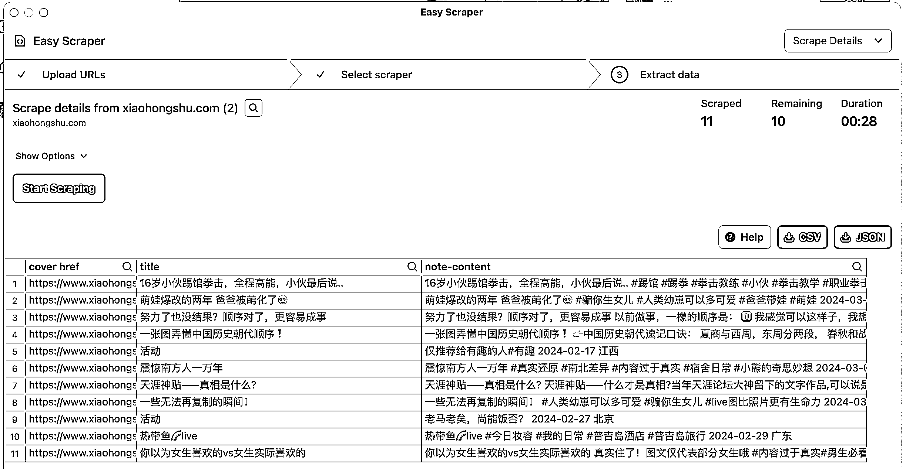
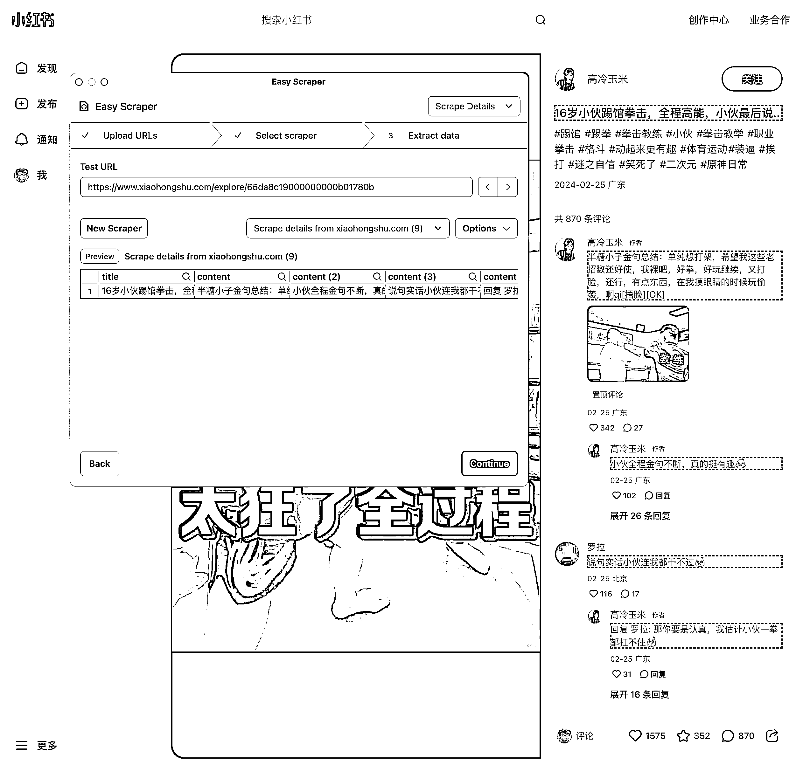

# 零代码 1 秒导出小红书帖子标题和详情

> 原文：[`www.yuque.com/for_lazy/thfiu8/pmwnbefwp1nt0pc3`](https://www.yuque.com/for_lazy/thfiu8/pmwnbefwp1nt0pc3)

## (50 赞)零代码 1 秒导出小红书帖子标题和详情

作者： 姬小光

日期：2024-03-05

大家好，我是 姬小光，今天给大家介绍一个 **零代码 1 秒导出小红书帖子标题和详情** 的工具：Easy Scraper。它是一个 Chrome 扩展，只需点击一下即可抓取任何网站的内容。它可以让完全没有爬虫基础的使用者，一秒钟获取小红书帖子数据。先来看看效果吧：

Easy Scraper 的主要功能包括抓取列表、抓取详细页面、易于使用、即时导出、动态内容处理和隐私聚焦。用户只需导航到所需的网页，点击扩展图标，即可看到数据被神奇地组织起来并准备好使用。它可以巧妙管理 JavaScript 渲染的内容，确保从最复杂的站点捕获数据。同时，Easy Scraper 在浏览器本地操作，确保数据的私密性和安全性，不通过网络发送。

它支持导出 CSV 或 JSON 格式的数据，导出的内容可以直接丢到 ChatGPT 里面进行简单分析，也可以作为 GPTs 的知识库。这个工具目前完全免费，原因是开发者将在整个三月份参加沉默冥想闭关，没有时间添加付费计划。

下面详细讲解使用方法。

## 导出帖子列表中的基础数据

那么如何使用 Easy Scraper 呢？首先，从 [Chrome Web Store](https://chromewebstore.google.com/detail/easy-scraper-free-web-scr/ibdncfidcgeammedkdhoopophkkhcbme) 或者 [官网](https://easyscraper.com/) 一键安装扩展。

然后，导航至希望抓取数据的网站。点击 Chrome 右上角扩展图标激活抓取器，即可 1 秒导出帖子基础数据：

如果需要，可以自定义抓取，调整列表和抓取速度。可以选择滚动下来抓取，页而已自定义等待时间。最后，选择所需格式导出数据即完成。

再来试试抓取某个博主的帖子标题：

可以看到抓取结果包含了标题，帖子链接，还有点赞数。抓取后的标题可用于 GPT 辅助生成类似标题，或者用于简单的分析。

## 导出帖子详情数据

首先，第一步我们导出了一个列表数据的 CSV，下面在抓取页面的右上角，选择 Scrape Details，然后将刚刚导出的列表数据再传回来：

这里会默认识别一个可能是详情链接的字段，如果确认无误可以点击「Continue」，否则可以下拉框手动选择其他字段作为详情链接。

接下来设置详情页抓取的元素，点击「New Scraper」后，会在详情页出现一个选择器，鼠标悬停选中你想抓取的区域即可：

选中后，点击「Finish」完成选择：

继续点击「Continue」，接下来就到了爬取这一步了。点击「Start Scraping」开始爬取详情页内容：

我们可以看到，帖子的标题和详情都已经爬取到了。再次导出 CSV 即可。

如果这里想爬取多个字段，可以按住 Ctrl 单击鼠标，Mac 电脑则是 Cmd，按住选中后效果如图所示：

如果你选择的是个较大的元素，插件默认也会分析子元素，给出多个列，但没有按住多选这样精准。

## 总结

上面的两种方法是通用技能，可以爬取各种人眼能见到的网页内容，只需要变换选择器，或者手动调整爬取的列表即可。具体大家可以自己研究。它最大的特点就是简单，你不用学什么爬虫技术，一行代码也不用写，甚至都不用装什么软件，点一点就能拿到想要的数据，还有比这更香的吗？

喜欢通过飞书阅读的链接：https://vfu5gh579k.feishu.cn/docx/G10CdKxKxoPrtAx7m3vcvzSanTd

* * *

评论区：

离心之巅 : 请问导出来都是乱码怎么回事呢
姬小光 : 目测可能是打开软件的问题，如果你正在使用 Excel 打开 CSV 文件，你可以在导入数据时选择文件的编码。在 "数据" 菜单中选择 "从文本"，然后在导入向导中选择适当的编码。
， : 二次爬取 多元素是怎样弄的呢 我二次爬取只能爬一个元素
离心之巅 : 好的，谢谢
姬小光 : 你好已经更新到文章里了。
樾樾 : 采集详情页点击 Finnish 之后出现了这个
姬小光 : 多试试不同的选择范围，可能跟页面结构有关，或者按操作发给作者看看
， : 太棒了 谢谢

* * *