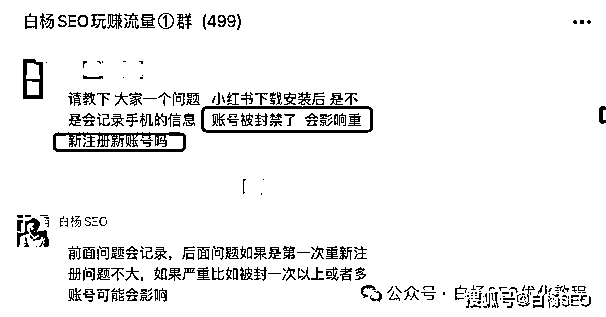
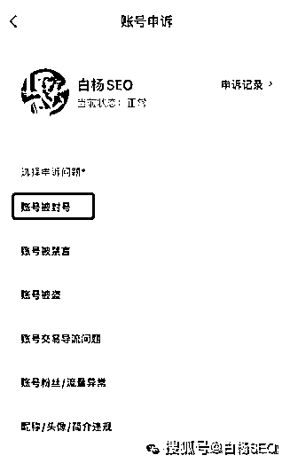
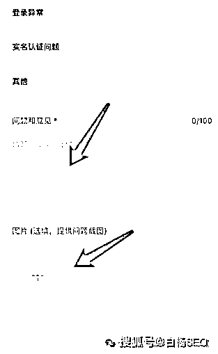
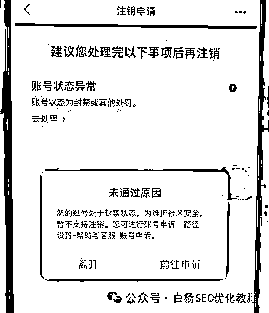
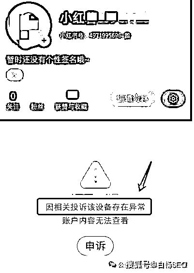
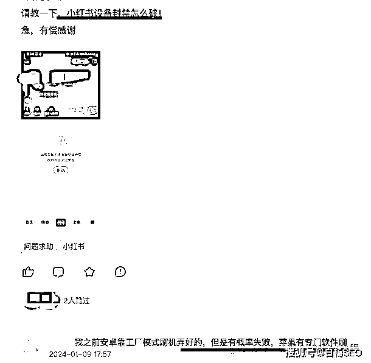
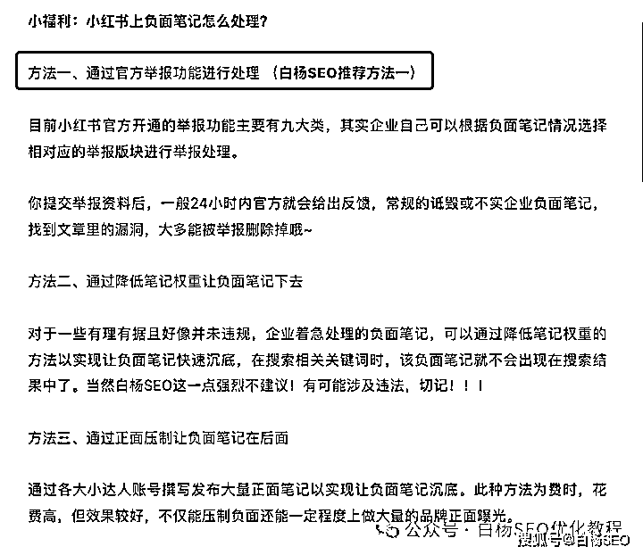

# 小红书被封号或封设备怎么办？小红书负面处理参考

> 原文：[`www.yuque.com/for_lazy/thfiu8/evogix6v71etixg3`](https://www.yuque.com/for_lazy/thfiu8/evogix6v71etixg3)

## (43 赞)小红书被封号或封设备怎么办？小红书负面处理参考

作者： 白杨 SEO

日期：2024-03-05

大家好，我是白杨 SEO，专注 SEO 方法获取精准流量，全网 SEO 实战派。

年初我在文章《[2024 年做推广选哪个平台流量更好？](http://mp.weixin.qq.com/s?__biz=MzU2NTQzMzA4Nw==&mid=2247499215&idx=1&sn=aa737b053b2acfc6ca6de36a1d4bf13e&chksm=fcb97a5fcbcef349e8f3671899be5150e30087d0e4634b39557065b15cc5596d2470067dadfd&scene=21#wechat_redirect)》有说 2024 年一定要重视短视频直播，尤其视频号和小红书！

最近有不少人问我小红书账号被封怎么解封？设备被封、小红书有负面怎么办等问题，我在生财问题也看到很多相相关问题，所以今天来写一写，希望给在小红书平台上做推广的生财朋友有些启发或帮助。

分享大纲如下：

1、小红书账号被封号怎么解决？

2、小红书账号设备被封怎么办？

3、小红书账号或设备被封重新注册会影响账号吗？

4、出现小红书负面笔记怎么办？怎么处理更好？

**小红书账号被封号怎么解决？**

小红书账号被封，最优先的解决办法是注册一个新账号重新做！或者把这个被封的号的手机号解绑，重新绑定到新的号上。

当然，你可能会说自己这个账号做了很久，数据不错，不容易，还想试试，那么你可以走账号申诉这个方式，但不一定能成功，具体操作方法如下：

第一步，打开小红书，然后点你的创作中心第二步，分两种情况：

情况一，如果你开通了小红书专业号，直接拉到最底部，点“前往帮助中心”。

情况二，如果你没有开通小红书专业号，点“更多服务”，再然后点“开通专业号”，然后在开通专业号页面顶部有联系客服。

第三步，不管情况一还是情况二做完都可以进到一个页面，这个页面里有“笔记申诉”、“账号申诉”显示，点账号申诉。

第四步，在账号申诉问题里选择账号被封号

然后填写你的申诉理由，并提供相对应的截图，点击“提交”就可以了。

正如白杨 SEO 在一开始就说了，这种方法能成功概率极小，除非你是真的被误判。那么你只有多次申诉，以及打官方电话，可能一个月左右会被解封。

上面不知道你有没有注意到，笔记申诉、账号交易导流问题也是在这里，差不多一样的处理办法。当然，如果被封的小红书账号解封不了，也是不能把账号注销哈，只能把手机解绑，绑定在新的号上去。

小红书账号注销不了怎么办呢？你可以把被封的其它绑定都解绑，只剩手机号，然后换一个手机注册一个号，不要用手机号注册，用其它形式。注册了发笔记，你把你被封号的手机号放到这手机上，点绑定即可。

PS：如果你的小红书账号已经实名认证了是解绑不了的。所以很多做推广的，小红书账号都没有做实名认证，不影响你的笔记流量哈。

**小红书账号设备被封怎么办？**

你可能会问小红书账号设备还会被封？这个设备指什么？这里是指你登录小红书账号的手机，平板或者电脑，一般是指手机或者平板。

**小红书账号设备被封怎么办？**

先说这个答案，最快的方法是换一台手机。你可能会问，小红书账号被封是不是等于这个手机设备也被封了？不是的。如果只是被封一次，问题不大。

如果这个小红书账号被第二次封禁，这个设备就危险了，就有可能被封禁！因为封设备是小红书最严重处罚！

当然，这里也有一些不一定成功的方法，参考：如果是苹果手机，可以 shua 机试试，大概率可以。如果是安卓手机，也可以 shua 机改设备信息，不过概率比苹果手机小一些。

**小红书账号或设备被封重新注册会影响账号吗？**

小红书账号被封，只要你没有做实名认证，你的手机号可以解绑，那么，你重新注册账号绑定你原来这个手机号不会影响的。

假如你在发的这个手机设备没有被封，直接在这个设备上用新的小红书账号也不会受影响的。那如果是该设备被封了呢？如果设备被封了，不管你是新注册的账号，还是其它账号来登录，都会受影响。

所以，你可以看上面解答设备被封解决办法参考那里 shua 机试试，把设备恢复正常了再说。

**出现小红书负面笔记怎么办？怎么处理更好？**

三年前，我在《[白杨 SEO：再谈小红书 SEO，小红书笔记排名因素解析及实战举例【收藏】](http://mp.weixin.qq.com/s?__biz=MzU2NTQzMzA4Nw==&mid=2247489467&idx=1&sn=0d99d3a493ff94435a412c195bd2fe54&chksm=fcba902bcbcd193db04d071523fdaf0ec106c35af6a3886259c2a09f367e7e421dba0764b84f&scene=21#wechat_redirect)》里有提到过三种方法，原文章截图：

我推荐的是方法一，如果有“恶意”用户的负面笔记处理，可以向小红书平台进行投诉维权，当然前提不是你的品牌产品自身问题，不然也很难成功。

方法三是通过正面方法，加大发布自己的小红书笔记。通过大量的素人、博主达人投放大量的正面笔记，不过这需要一定的种草笔记数量才能覆盖且必须一部分正面笔记权重要高于负面笔记。

但很多人来咨询的是方法二，降低笔记权重这个，很多人还有这个业务。白杨 SEO 在这里稍微再说一点点，一是我不推荐，二是别人吃饭的。所谓降低笔记权重，比如大量投诉举报，比如给这个笔记 shua 量等等。

今天就分享到这里，你觉得这个白杨 SEO 写的对你有帮助，可以继续关注我，已经周更原创六年，SEO、流量垂直行业 TOP 实战派自媒体。

作者介绍：

白杨 SEO，专注 SEO 十年，全网 SEO 流量实战派，对互联网精准流量有深入研究。全网同名个人品牌都是白杨 SEO。

* * *

评论区：

胖胖的梦想 : 清晰👍
白杨 SEO : 有启发就好
Kane : 好难解开[流泪]
白杨 SEO : 重新弄号吧

* * *