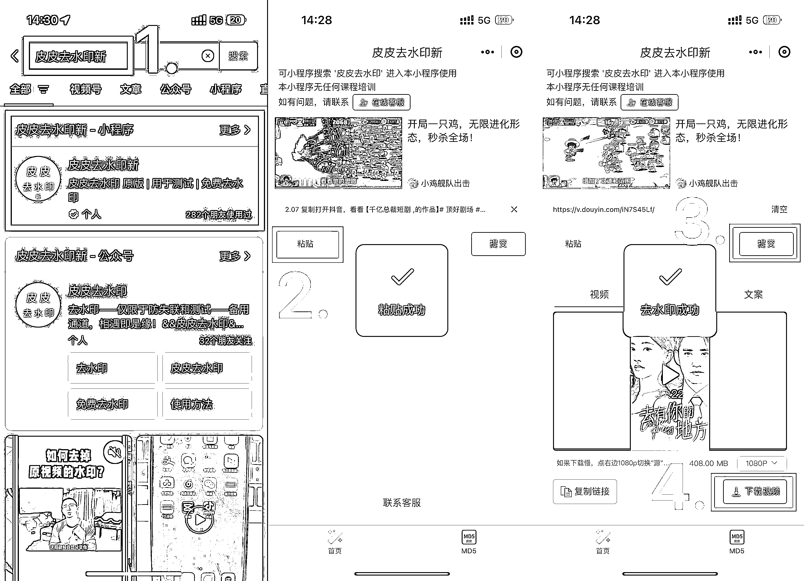
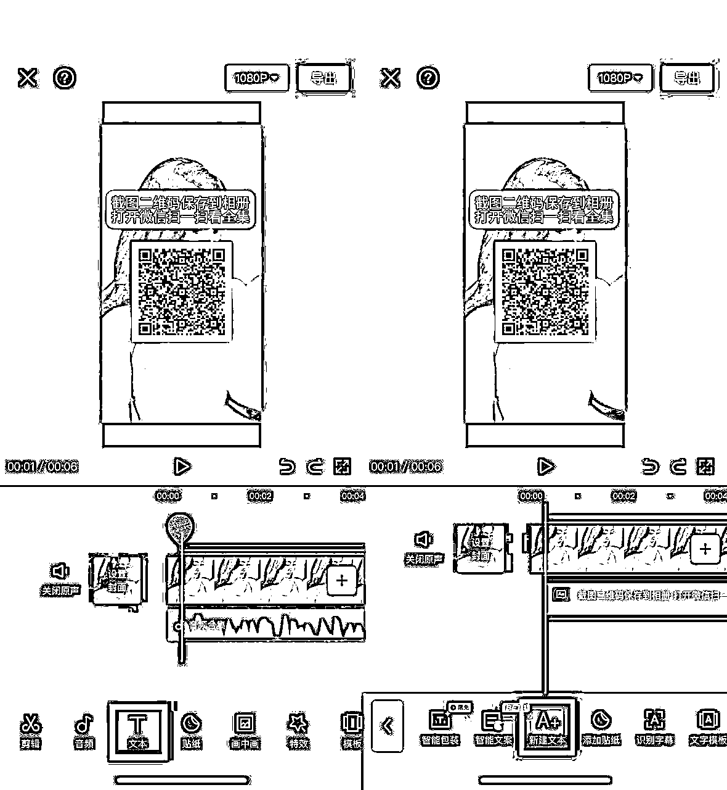
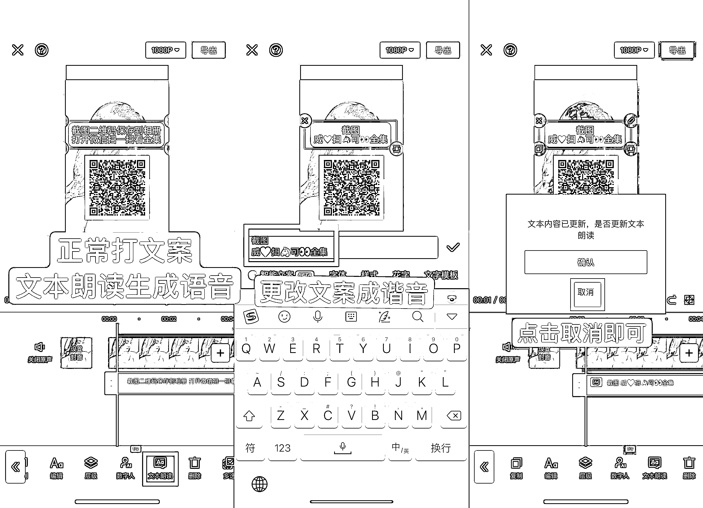

# 最适合新人练手的项目——短剧 CPS

> 原文：[`www.yuque.com/for_lazy/thfiu8/nz3r7x42i4i5z4m2`](https://www.yuque.com/for_lazy/thfiu8/nz3r7x42i4i5z4m2)

## (精华帖)(297 赞)最适合新人练手的项目——短剧 CPS

作者： 张柯 Ker

日期：2024-03-08

大家好，我是张柯 Ker，

最近大家应该看到了不少人在宣传短剧，哈哈哈哈，我开的头，

目前短剧相比于去年需要原创剪辑的打法，简单了很多，只需要简单去重即可发布，

我从 28 号开始免费拉群测试，基本上听话照做，1~3 天内都可以出单，

除了有点废号，别的都没什么不好的，可以算红利期，

把号当消耗品，发就完了，发出去就是钱，

目前最强的榜一大哥，一星期已经赚了六千多，

# 全部教程公开，

# 欢迎各位萌新尝试练手，

# 一、什么是短剧 CPS

简单来说，就是我们在抖音、视频号里，发布短剧视频，但视频都是不完整的，可以吸引用户观看后续，

用户通过视频左下角点进去看后续，则需要充值，金额从 9.9~365 块不等，

**我们能拿到 54%的充值佣金，而且佣金比例后期还可以提升，**

**也就是如果一个用户充值了 365，我们就能赚 197.1，如果十个用户呢？**

目前视频不需要原创剪辑，我们简单操作下即可发布，几分钟搞定，

因为有极少部分用户会退款（退款入口很隐蔽），充值数据同步时间需要 1~3 天，同步后即可提现，

# 二、注册短剧挂载平台

啥平台都行~~~

我用的是好省短剧，因为平台注册后进去需要邀请码，

评论区好多人问，我就直接放这了，我也能赚点哈哈哈哈哈，

邀请码：qGfciMfzhI

# 三、视频号教程

视频号 0 粉就能发，需要实名，**需要用新注册的号，老号一般没流量，**

老号点击注销后，有时候下方会显示一行小字，可以立刻注销，

## 1、视频下载

我们发抖音、视频号、快手的视频，都是去抖音，去水印后**下载别人剪辑好的成品视频，**

不用自己复杂剪辑，

**好省短剧 APP 里的网盘链接用不上，**我们简单去重一下就好，

1）**去抖音搜索，**好省短剧 APP 里，随便找一个短剧的名字，

2）找到，

**账号粉丝，10w**以下，

**发布时间，在半个月**以内，**一星期内更好，**

**点赞数，1 千~1 万**以内，

**视频时长，**

发**视频号**的视频要选 7~20 分钟的，

发**抖音**的视频要选 12~40 分钟的（越长越好，最好半小时），

发**快手**的视频要选 5~15 分钟的，

视频里如果有作者自己加的移动水印，**不用管，视频可以用，**

3）复制视频链接，到微信里搜索，皮皮去水印新，在小程序中下载即可，

注意看粘贴后的链接格式，显示[`v.douyin.com/`](https://v.douyin.com)啥啥啥的才是对的，

如果这个小程序不能用了，一样搜索去水印，有很多其他的也可以用，

如果视频内存太大，就在小程序里选择下载 720P 就行，

找短剧的时候，

左上角**「短剧」**里的可以挂载**抖音、快手、视频号，在封面的左上角有标注，**

有的剧是三个平台都可以挂，有的剧只能挂一个平台，在这个界面里搜索一下剧名就能判断了，

「推广计划」里的是只能挂载抖音，

如果剧在「短剧」里搜不到，就去「推广计划」里搜一下（仅限抖音平台），

## 2、视频去重

为了增加视频的原创性，我们要适当去重，

去重就是不让视频限流，如果你的视频和别人的一模一样，被判抄袭，就会限流，

算法检测你的视频是不是抄袭，最重要的手段就是抽帧对比，

视频是由图片组成的，一张图片为一帧，

当我们上传视频后，系统会抽一定数据的图片，与库存做对比，如果重复度达到多少，就会判断为抄袭，

因此，去重的关键就是让系统觉得你的画面和别人的不一样，让系统检测不出来

**基础去重手法：**

下载个剪映，把去水印后的视频导入，

**1）**点击视频，滑动底部菜单栏，

点击基础属性，选择缩放，

**随机拉动比例至 110%~125%，**

**2）**两根手指向内捏，缩小视频进度条，

滑动画面到视频末端，

**随机删除 1~5 分钟结尾的视频，**

**但要保证最后剩余的视频时长不低于 7 分钟，**

**且要保证在视频放完的瞬间，剧情比较留有悬念，就是那种看一半就没了的感觉，**

**这样才能吸引用户去看后续充值，**

**3）**滑动最底部的菜单栏，找到「滤镜」，

**随机选一个非 vip 的滤镜，**

把最下面的条，往左拉到 10~15，看起来不影响视频观感即可，

完成后点击右下角的勾，

**4）**添加两段原视频的画中画，

**或者自己相册里的任意视频，可以自己随便录点视频，**

**只要画中画添加的视频长度，与我们删除后的视频长度一致即可，**

放大视频、旋转，

画中画视频里，有字幕的地方不要出现在画面内（视频可以放很大），

混合模式选**滤色**，拉到 3 即可，

记得把两个画中画的音量拉到最左边，

**视频结尾处多余部分记得裁剪掉，**

**视频结尾处多余部分记得裁剪掉，**

**视频结尾处多余部分记得裁剪掉，**

**5）**画中画添加扫光特效：

直接去抖音搜索扫光，复制链接去水印下载即可，

2.89 复制打开抖音，看看【一叶飘凌的作品】发了个扫光有用的拿去，在剪影里面找混合模式点滤色到... [`v.douyin.com/iFYgJFXH/`](https://v.douyin.com/iFYgJFXH) jpq:/ [C@h.oQ](http://mailto:C@h.oQ) 01/21

和上一步一样，

添加画中画后，把扫光特效放大到铺满屏幕，

点击混合模式，选择滤色，拖到 3，

复制扫光特效直到整个视频都有扫光，

滑动到视频末端，分割后删除多余扫光，

如果觉得去重效果还不够（发布两小时以后视频 0 播放、个位数播放），

可以继续随便导入点视频，按上面一样操作即可（下图是电脑版本的剪映界面，都一样）

**6）**点击底部菜单栏的「贴纸」，

**添加三~四个**

可爱的、会动的贴纸，缩小到不太显眼，放在视频的角落，

完成后点击右侧的勾，

**7）**把添加的贴纸，长度都拉到和短剧视频一样，

**8）**在视频最后的 10~15 秒处，在贴纸里搜索「箭头」，

缩小后放在视频左下角，长度拉到短剧视频的结尾，导出视频即可，

导出的时候，如果视频太大，可以把码率拉到最左边，选择 720P 导出，

## 3、视频发布，二维码引导视频制作，评论区引导

**手机端入口：**

如果找不到，打开微信，

点击「我」→「设置」→「通用」→「发现页管理」→「视频号」→「在发现页中显示该功能」

**电脑端入口：**

[`channels.weixin.qq.com/login.html`](https://channels.weixin.qq.com/login.html)

打开微信扫一扫登录即可，需要用手机摄像头扫码，

视频号发布的时候，不要勾选原创，

三集连发后，**只有单个视频的播放量破千，才需要置顶封面引导视频，**

**二维码引导视频制作：**

**如何配音：**

打开剪映，点击「文本」→「新建文本」→打字→「文本朗读」→选择一个非 vip 的音色即可，

在好省 APP 里**下载二维码**后，

会有**两种样式**的二维码保存到相册，

**我们只发显示左边这种码的剧，**

右边这种码的剧，一部分苹果手机扫码后无法付款，影响转化，我们干脆不发，

**下载二维码后，先到相册看看码对不对，**

**自己扫进去看看能不能正常扫，再开始做视频，**

**不要等视频做完了才发现不对劲，白做，**

每部剧的二维码样式都是固定的，改不了，

**如果出现右边这种码，就换一部剧发，**

还可以打开好省短剧 APP，按步骤点击，随便找一个封面左上角写着「视频号」的，观看教程，

**封面不要出现二维码，**

**开头留一秒空白，**

置顶的引导视频，封面写上**全集**效果更好，

而且**全集两个字一定要大，**

**置顶的全集视频，一定要配音，不然会影响转化，**

**文案：**

截图二维码保存到相册

打开微信扫一扫看全集

我们发布完视频后，可以在评论区，

**评论引导用户进主页置顶视频观看后续，**

部分账号没有置顶功能，多评论回复几次就行，

如：

移步煮业有荃集可👀哦

看全集👉🏻点进主页看置顶

看我置顶[爱心]

有时候视频号会吞评论，也就是只有你自己能看到自己的评论，

所以我们需要拿另一个，**没有关注这个号的小号，**到评论区检查看有没有评论上，

## 4、发布时间

视频号路子比较野，不用养号，新号直接发，老号一般没流量，

下午开始发，晚上转化最好，**视频号的任何违规都不用管，发就完了，**

**同一部剧，先找三个不同的视频，**

去重后**同时发出去，**封面标注第一集，第二集，第三集（第几集和剧情无关，随便写），

同一个账号，发过的同一个视频可以再发一次，

不同账号，同一个视频要**重新再次去重**才能发，不然没流量

**2 小时后，**看三个视频的播放量，有三种情况，

**1）如果单个视频，播放量 0 或者个位数，**

那就是视频去重没做好，或者视频时长太短，或者命不好，要重新去重，或者直接换剧，

去重后的视频一个小时发一次，**换剧后之前发的视频不用管，放着就行，**

**2）如果单个视频，播放量几百，**

那就是账号正常，视频不行，

可以同一部剧换视频发，也可以直接换剧发，一个小时发一个视频，

**3）如果单个视频，播放量上千，**

就置顶二维码引导视频，加上评论区引导，

并把播放量最高的那个视频，原封不动再发一次，一个小时发一个视频，

**连续发播放量最高的视频三次以后，**如果播放量没有一个破万，

就换同一部的其他视频发、或者直接换其他剧发，

如果破万，就一直发破万的视频，一直不破万，就换，

一天可以怼二十次，一直发到号死为止 ，等爆单就行了，

感觉这个剧没流量了，就换个剧，

一样的方式，三个视频测试流量，然后一直发流量最好的视频，

发到彻底没流量，就注销视频号重新来过

如果账号一直有流量，就明天继续怼，

**记得做好评论区，和主页置顶视频的引导，**

## 5、查看出单

视频号出单会实时同步进好省短剧 APP 里，次日即可提现，

# 四、小红书教程

**小红书优势：**

1、有手机号就能注册，

2、0 粉丝可做，

3、不易限流，

4、不用实名，

5、违规后，可以无限注销，无限重新注册

小红书的玩法，和视频号基本上一模一样，

**不同的点有三个：**

# 1、视频下载要求不同

1）**去抖音搜索，**好省短剧 APP 里，随便找一个视频号可以发的短剧的名字，

2）找到满足以下条件的视频下载，

**发布时间，7 天内，**

**点赞数，1 千~1 万，**

**视频时长，7~20 分钟，**

如果抖音里搜不出来符合要求的，就换一个剧的名字搜，

**只有新鲜出炉的视频，去重后在小红书发才有流量，发布时间太久的都不行，**

**下载完以后，同样按视频号的去重步骤，**

**做一下去重，**

# 2、视频封面要求不同

我们**发布在小红书里的视频，不要出现剧名、不要出现封面，**

如果下载下来的视频，开头出现了封面，就把开头部分剪掉，

很多大聪明会去搜索，有很多发全集的，影响转化，

视频标题，我们直接用一些口语化的标题即可，

让他们看完以后心痒痒，只能扫码付款看后续，**不给他们搜索的机会，**

以下标题是用 AI 生成的：[豆包](https://www.doubao.com/chat/?guest_landing=1&login_source=chat_list_unlog&origin_landing=https%3A%2F%2Fwww.doubao.com%2F%3Fchannel%3Dbaidu_pz%26source%3Ddb_baidu_pz_01%26keywordid%3Dweizhi7&type=0)

随便复制一个符合剧情的就行了，也可以自己改改，

📺短剧有毒，根本停不下来！

😜这部短剧笑到我肚子疼！

💥剧情超刺激，短剧真的绝！

🤗短剧太甜了，我的少女心啊！

😱短剧里的反派，恨得我牙痒痒！

👀短剧大揭秘，结局你绝对想不到！

😍短剧主角颜值爆表，谁能不爱呢？

🤣哈哈哈，这短剧把我逗乐了！

🌟这部短剧脑洞也太大了吧！

😢短剧哭崩了，太好哭了吧！

💥哇塞，这部短剧简直绝了！

🤣笑喷了，这短剧也太搞笑了吧！

👀集美们，这部短剧一定要看！

😍短剧推荐，好看得停不下来！

😭看短剧哭惨了，真的好感动！

🔥超火短剧，不看后悔系列！

🎈剧情紧凑，这短剧看得我好爽！

🤩黑马短剧，赶紧追起来！

😜轻松搞笑短剧，拯救不开心！

👍赞爆了，这部短剧值得一看！

视频发出去的效果，就是左图这样，没有封面，

哪个视频爆了，就把哪个视频的**开头截图，打上全集，并置顶二维码引导，**

和视频号放二维码的方式一样，挂上就行，

引导的文案需要改成谐音字，但配音还是用正常的，

截图二维码保存到相册

打开微信扫一扫看全集

截图

威❤扫🐴可👀全集

注意，引导二维码的视频可能发出去了，但别人看不到，

这个时候需要我们把二维码改成艺术码，

进入网站：[`bj.96weixin.com/tools/meihua`](https://bj.96weixin.com/tools/meihua)

复制视频号短剧的链接（好省 APP 里带字的二维码无法复制链接），粘贴进网站里生成即可，

**引导视频发布后，**

**要检查视频是否会正常显示，**

# 3、视频发布节奏不同

开头和视频号节奏一样，

先把同一部剧的，**三个不同视频同时发出去，**然后看播放量，

如果播放量超过 300，就置顶二维码引导视频，

并把播放量最高的视频，原封不动的一直发，

每次发的时候，**选择剧里同一个角色的不同画面，当封面即可，**

没有任何时间限制，一整天不停的发这一个视频都可以的，

**建议少换剧，**

发到流量不过 300 或者 20 条视频都不出单，才换剧，

**不同的点在于中间的节奏，**

**我们每发三个视频，就发一个引导二维码的视频，**

**这个视频不用置顶，**穿插在里面发即可，提高转化率用，

违规了没流量就注销重新起号，永动机，

发到宇宙大爆炸，冲，

# 五、抖音教程

视频号赚钱快，但只是小打小闹，

**抖音才是短剧赚钱的主战场，**

爆一个视频，收益就是一天几千上万，

伴随着高收益，抖音自然也是有点门槛，

**1、需要有 1000 粉丝，不需要实名，**

**2、需要做 3 个号以上，**

**3、账号是老号最好，比较抗封号，**

**新号需要养号三天（顺便涨粉）**

临近特殊时期，抖音抽风，

最近特别容易封短剧链接挂载权限（不会封号），

封一次会限制挂载 3-30 天不等，

**解封后就又可以继续发了，不影响账号，**

迎难而上，

封归封，不影响我们赚钱，加号就完事了，

我们多做几个号后，

第一个号封了三天，还有剩下的几个号可以发，

发了几天后，剩下的几个号封了，前面的号也到解封时间了，

**可以无限的循环下去，收益不会停，**

**五个号以内，用 wifi 发都是没问题的，**

一个手机不要登录太多抖音账号，

有条件的一机一号最好，

因为在手机里切换抖音账号太多次，容易跳实名验证，需要你实名才能继续使用，

实名够就无所谓了，

抖音需要有 1000 粉丝才可以挂短剧的充值链接，所以我们需要先搞上千粉，

在这个过程中，可以抽点时间做神评论，养下号的权重，

打开抖音，点击搜索，

没事就发几个，好玩的，一天不要发太多，20 条最多，

## 1、涨 1000 粉

**1）花钱解决，最快最省事**

涨粉之前，先用特效自拍个七秒以上的视频，或者实拍个好看点的风景视频，

看看流量是否有 300 以上，没有就养一天再发发看，

流量有 300 以上，就可以开始用钞能力了，

如果是老号，先往下翻教程，入驻下星图，看看第二条有没有满足，满足了再开始用钞能力，

**2）免费互粉，需要 2~3 天**

不要私聊互粉，不要加群互粉，

去抖音搜索，互关互关粉，或者搜索，互粉，

刷出来的视频评论区就一堆都是想互粉的，

1）复制他们的评论，在评论区评论即可，

或者发，   捡我。焊死的那种，    后面加几个表情，

2）主动关注几分钟之前评论的人，一般都会回关，

去抖音搜索，互关互关粉抖音间，或者搜索，互粉直播间，点击直播，

随便进去一个，评论区就都是想互粉的，

1）同样，我们复制评论区的评论，主动评论+主动关注，

2）点击刚评论的人，看他的粉丝，去关注他的粉丝列表的人，一般也都会回，

## 2、账号入驻星图

账号千粉之后，我们就可以给账号授权，挂载充值链接权限了，

1）在好省短剧 APP 里，点击推广计划，随便点击一部短剧，点击申请推广，

会自动跳转到抖音，点击「确认合作」即可，

后面要发视频，就按这个步骤走，

然后点击「上传视频完成任务」就可以发带有充值链接的视频了，

想推什么剧，就在好省短剧 APP 里面搜什么，然后申请推广，

如果想确定账号有没有授权成功，

点击好省短剧 APP 左下角的「已授权账号」即可查看，

## 3、视频去重、发布

视频处理、下载和上面的视频号教程一样，

只在发布的时候，比视频号多了一步，

继续找到，

**账号粉丝，10w**以下，

**发布时间，在半个月**以内，**一星期内更好，**

**点赞数，1 千~1 万**以内，

**视频时长，12~40 分钟**的（越长越好，最好半小时），

去水印下载后，**在好省短剧 APP 的「推广计划」里，**

找到我们想要推的剧，点击申请推广后跳转到抖音，点击上传视频完成任务，

长按视频按钮，我们随便录 5 秒以上的视频，多了也没事，

完成之后，我们点击右边菜单栏圈出来的按钮，

点击加号，把我们去重好的短剧视频添加进来，

然后找到我们刚录制的几秒的视频，把他删掉，点击保存即可，

有两种界面，

界面一：

界面二：

发布页面有显示这个**「蓝色的小图标」，**就是挂载充值链接成功了，这样发出去的视频才有收益，

没有的话重新检查一下哪个步骤做错了，

作品描述可以抄同行的，或者简单把剧名写上，再加个 #短剧 等标签，

发布后，自己看自己的视频，视频左下角是没有显示充值链接的，

**要点击自己的评论区才能看到，**

注意，因为视频比较大，所以发布后不会立刻显示在抖音里，上传需要等一段时间，

这个过程中我们就刷会抖音，不要退出去，防止发布失败，

发布后，**过一小时点击视频右下角的分享按钮，点击上热门（dou+），**

如果显示左图，就是去重没到位，我们把视频隐藏掉，需要再加几层画中画来去重，

如果显示右图，**或者**是显示正常可以投 dou+的界面，就是发布成功，

## 4、引导

**播放量跑到一千以上的视频才有引导的必要，**

评论区可以用表情包、文字，引导用户观看全集，类似下图，

**可以多去同行评论区看看他们怎么引导的，这直接影响到赚钱的效率，**

要找半个月以内的视频，太久的没参考价值，

自己评论完以后，长按，置顶评论，

最后要和视频号一样，拿另一个**没有关注这个号的小号，**来评论区看看，检查有没有评论上，

## 5、发布时间

特殊时期，特殊处理，

**抖音目前一天只能发 1-3 个视频，**

**抖音目前一天只能发 1-3 个视频，**

**抖音目前一天只能发 1-3 个视频，**

一天内视频发多了很容易封号，

因为晚上的转化是最好的，

夜间流量最大，看剧的人多，晚上也比较感性，容易冲动消费，

**所以我们的发布时间都选在晚上，**特别是在审核员下班的时间后，

即，**在晚上 7 点半~凌晨 2 点都可以发视频，**

**每次发布视频至少间隔 1 小时，****不要连发，**

**一部剧最好发 2-3 个视频测试，**

**同一部剧的 2-3 个视频发完后，**

**1、如果没有视频流量破万，就换剧，**

**2、有视频流量破万，就把流量最好的视频原封不动再发一次，**

## 6、查看出单

好省短剧 APP 订单更新有延迟，可以提前在抖音中实时查看，

抖音搜索，小程序推广计划，进入后点击「我的」，点击「任务中」，即可查看实时订单数据，

3 天内没有退款就会同步到好省 APP 中，隔天即可提现，

抖音端口的 0.9%结算周期为一个月，且需要实名才可以提现，一个人只能实名一个号，

一般这 0.9%建议直接丢掉，直接开新号还赚更快，

# 六、快手教程

快手操作很简单，

**0 粉就可以挂链接，不用实名，可以多号操作，**

快手的流量机制就是坚持发得越久，流量越好，

但是转化比较差，需要多发视频，堆量才能出单，

1、一天可以发 20 个视频以上，有空就发，发布的时间间隔不讲究，

2、不用怕违规，违规的视频删了就行，

**怎么做：**

1、去抖音里找其他人剪好的短剧解说视频，

2、把解说视频里吸引人的 30 秒剪出来

3、在好省短剧 APP 里的短剧网盘下载 10 集短剧

4、把剪出来的 30 秒放在视频前面，把 10 集网盘里的短剧放在**一起**视频后面，

连在一起，发出去就是原创，

**快手的同一个视频不能发两次，每次发都需要简单剪辑一下，**

同一部剧想多剪几次，就多找几个 30 秒的片段，

**注意：**

**快手挂的链接，自己发完视频是看不到的，**自己切换账号也是看不到的，

**可以把链接发在群里，**让别人帮你看看，

或者把视频链接发给朋友帮你看看，

**视频发布方式**可以在好省短剧 APP 里，点击「操作教程」查看视频教程，

要注意的是，**快手显示发布成功，不代表已经把视频发出去了，**

视频实际上还在后台上传，骗你发好了而已，要等等才能看到，

# 八、增加账号

抖音做短剧不用实名，所以自然是账号越多越好，

每个人三个号起步，一个手机可以登录三个抖音号，wifi 也行，

弊端：多号切换账号容易跳实名，有条件的自然是一机一号最好，实名够就无所谓了，

也可以直接找朋友要私人老号，这种账号爆单概率很大，

接他的验证码登录，赚钱了分他点，

辅助号注册：

可以一个手机号同时创建两个抖音号，

抖音点击「我」→「右上角」→「设置」→「切换账号」，创建新账号，选择辅助创建，

一个月以上的号才会有这个选项，如果没有则跳过，

以上，祝大家发财，

* * *

评论区：

温酒。 : 冲冲冲～
阿仧 biu : 冲冲冲
周梦行 : 冲
鲸鱼 ken : 柯总牛逼[呲牙]
云珞 YunL : 冲冲冲，柯总牛逼
伽西莫多 : 冲冲冲
RouQiu : [强][强][强]
RouQiu : 是这个月 28 拉群吗

* * *