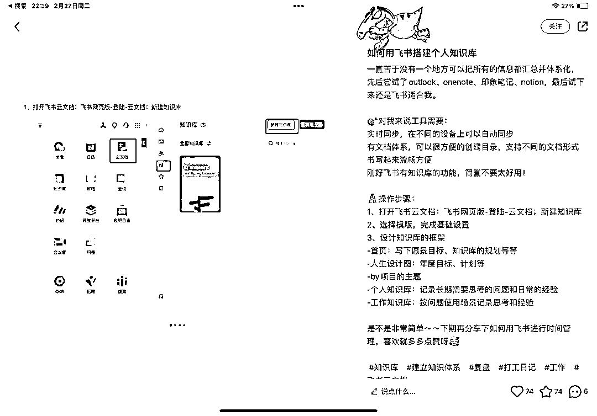

# 如何用知识管理这个技能来实现个人 IP 商业变现

> 原文：[`www.yuque.com/for_lazy/thfiu8/uo2b3carqoyzbgsn`](https://www.yuque.com/for_lazy/thfiu8/uo2b3carqoyzbgsn)

## (58 赞)如何用知识管理这个技能来实现个人 IP 商业变现

作者： 芷蓝

日期：2024-03-08

我是芷蓝，好久不见，今天为大家分享，如何用知识管理这个技能来实现个人 IP 商业变现。

这篇文章会涉及到知识管理 IP 定位、流量、产品这 3 大模块，非常适合职场人士和自媒体创业者学习，可以帮助你把平时每天都在做的事情，像素材库建立、搜索整理、内容输出等技能，变成赚钱的产品，做到一鱼多吃。文字可能会比较多，建议不要收藏，因为收藏了就不会看了，一口气读完，然后去实践就对了。

## **一、知识管理 IP 如何做定位？**

在聊如何做定位之前，先讨论一个问题，大家应该在各种自媒体平台上面看到过那种资料账号，就是分享某一个领域的各种学习资料，或者说各种模板之类的内容，这种账号他们的数据反馈都不错，点赞和收藏的比例很高，你觉得这种账号能变现吗？

答案是可以的，但除非是矩阵操作，否则很难赚到大钱，也不会接到广告，而且非常容易被平台封掉。

为什么？**这就涉及到个人 IP 定位的一个重要元素：****身份****。**

我们切换一个视角，如果你是品牌方，你会愿意付费给这种资料账号来帮你做产品服务推广吗？一定不会，推荐产品这个动作必须要由人来做才行，你的内容里面都没出现人，怎么做推荐呢？

而且，你也没有给品牌方预留产品展示空间。举个例子，比如你平常分享自己如何用飞书来做素材库，提高自己的工作效率，那你应该如何写这个帖子呢？是倾向于第一个，还是第二个呢？

一定是第 2 个对吧？因为第二个里面有场景，这个场景包括了书桌➕ipad，而不是简单的飞书软件截图。别小看多了一个场景，场景意味着产品插入，场景也在暗示有人的存在。

如果是一个在做电脑第三方配件的品牌方，看到你这篇帖子的数据不错，就可能会找你来做广告，而第一个帖子里面，没有品牌方插入产品的场景，他就接不到广告。

那如果你是做知识管理服务的，用户看到你的帖子里有书桌和电脑，书桌上还有书，就会觉得这个场景是真实的，电脑屏幕对面一定坐着一个人，真实创造信任感，信任感提升引流和成交的概率。

**总结一下，人和场景的组合会让你的内容真实感更强，那么人怎么体现在定位上呢？最简单的方法就是「加入身份」。**

接下来，就可以复习一下芷蓝的个人 IP 定位万能公式，老朋友肯定都知道啦，新朋友可以记录一下，无论你是做什么行业或者赛道，这个公式都可以让你清晰地知道自己未来做营销的方向。

**你是谁（身份）➕你的成就/技能（你会做哪些事情）➕你为谁（你的用户画像）➕解决什么问题/创建一个新的需求。**

举个例子，我的合伙人@Andrew 老师，他就是做知识管理个人 IP 营销变现的，现在通过知识付费产品，每个月的收入已经突破 5 万元了。我根据他之前的工作，以及擅长的技能和个人 IP 定位的逻辑，帮他规划了自己的定位：

**大厂设计师，知识管理教练，帮助自媒体创业者打造知识体系，赋能 IP 变现。**

设计师和知识管理教练就是身份，身份展现出了你擅长的技能，你的用户画像就是自媒体创业者，因为创业者对于知识体系搭建的需求度会更高，我自己就有体会。

这里还有一个很重要的逻辑，**知识管理必须要帮助用户解决实际的问题，**不能光管理，管理是方法，研究方法是为了解决问题，比如说通过知识管理搭建自己的营销素材库，然后辅助自己更有效率地输出，通过输出可以引流变现。

或者说，通过知识管理优化自己的职场工作流程，流程被优化之后，你的工作效率提升了，就可以提前完成工作，继而升职加薪，这个也是结果。

其实知识管理这个领域，特别适合设计师、项目管理、文案运营、产品经理等职位的小伙伴，不妨可以试试，本身每天的工作就可以作为一个结果来输出。

## **二、知识管理 IP 如何获取流量？**

**流量=优质内容➕引流技巧**

关于引流技巧，咱们就不聊了，评论区引导、交流群里面发引流钩子，小号引导、简介里置顶等等，这些都很简单，以前也分享过很多，重点就是你如何才能做出优质的内容。

什么是优质的内容？**它需要为用户提供 3 种价值，即****情绪价值，时间价值和认知价值**，知识管理重点就在于认知价值，**管理的本质是洞悉底层联系，你知道了事物的底层联系，就知道如何把他们链接在一起，变得更加有秩序，方便被使用，这就是管理。**

我观察了大量的知识管理博主，通过对他们的爆款选题做拆解，总结分析了他们的选题思路基本都在以下这 3 个层面：

> 这 3 个层面，每一个都可以根据用户的真实需求场景来做内容，举个例子，比如你在小红书的搜索栏里输入「知识体系搭建」这几个字，看一下下拉菜单，就可以得到这个关键词下最近用户的搜索需求是什么。
> 
> **我们如何去做选题呢？**只需要根据你自己擅长的技能或者经验，找到一个关键词再次输入到搜索框里，再去重置一下搜索条件，就可以看到结果了。比如说我自己对于个人知识体系的搭建和使用还算有一点心得，而且也有结果，那么我就用「个人知识体系怎么搭建」这个词来搜索，然后选择最热的帖子，就看到了以下的搜索结果。
> 
> 
> 
> 通过对搜索结果的分析，我发现了 3 个出现频率非常高的选题公式，他们分别是：
> 
> ### **1、从 xxx 到 xxx，我用知识体系实现了 xxx**
> 
> > ### **2、不要着急 xxx，先建立自己的知识体系**
> > 
> > > ### **3、xxx 推荐的知识体系搭建方法，3 个步骤让你 xxx**
> > > 
> > > > 以上，就是「知识体系搭建」这个关键词下的爆款选题模板，非常好用，只要按照这个来，就有很大的几率被系统识别，进入推荐流量池里。
> > > > 
> > > > 当然，还剩下「工具使用」和「素材填充」这 2 个关键词，我也为大家准备了这 2 个关键词下 30 天内的爆款选题数据，大家可以根据爆款选题去找到相对应的选题模板作为自己未来的素材。
> > > > 
> > > > 说回到如何创造优质内容这件事，我给大家总结一下流程，无论你是否在做知识管理赛道，都可以按照这个流程来找到爆款话题的批量制作方法。
> > > > 
> > > > ### **第一步：找到这个赛道的核心关键词**
> > > > 
> > > > 做自媒体，很多人不知道的真相就是：**信息差=关键词**
> > > > 
> > > > 很多你不知道的信息，并不是没有，而是你不知道搜索什么关键词，所以说，只要你想做一件事，就要先找到跟这件事相关的关键词，为啥有人做不出爆款，因为她都不知道这个领域的用户，每天都会搜什么！
> > > > 
> > > > 那怎么找关键词呢，除了可以利用 5118 或者灰豚这样的数据营销工具，还有最简单的方法就是平台的搜索框下拉词。
> > > > 
> > > > 你比如说为什么我能找到知识管理这个领域的 3 个选题方向，其实很简单，就是先输入「知识管理」再从下拉词里找到用户的搜索词，从搜索词里再去大量地看爆款选题，当然这一步你也可以用工具，效率会更高一点，最后就会得到结果。
> > > > 
> > > > 推荐大家要建立自己的核心关键词词库，这个词库越充分，未来你做内容就越简单和精准。
> > > > 
> > > > ### **第二步：通过关键词来找到爆款选题**
> > > > 
> > > > 一旦你找到了某个赛道，用户最喜欢搜索的词，就等于踩中了流量秘密，平台就是通过对一个个的关键词的分析，然后再进行算法推荐的。
> > > > 
> > > > 接下来，你需要大量观察那些带着关键词的爆款选题，去分析他们有哪些相同的选题模型，就比如我上面给大家分享的那些。其实这个不难，爆款选题都是有规律的，你多翻几页，一定会发现很多数据好的帖子，他们的标题话术都是一致的，甚至是封面，以及封面风格都是一致的。
> > > > 
> > > > ### **第三步：把爆款选题变成自己的选题**
> > > > 
> > > > 做自媒体去模仿别人是正确的选择，但模仿并不是抄袭，如果你直接去抄袭被人，就算平台没有识别，被原博主看到后，只要举报你成功，平台算法对你这个账号的评分就回降低，虽然不会封你的账号，但是未来你更新帖子，平台算法给你的流量推荐就会极限下降，因为你在平台的识别系统里，分数已经很低了。
> > > > 
> > > > ### **那怎样的模仿才有效果呢？**
> > > > 
> > > > 1、模仿风格：风格包含了背景、bgm、图文模板等，比如你看 2 年前抖音大蓝火了之后，一大批创作者开始模仿大蓝吼叫式的视频文案，张同学火了之后，又有一批人模仿他的第一人称镜头，程前朋友圈火了之后，又有很多人模仿他的 bgm。
> > > > 
> > > > 这些都是可以直接去抄原作者的，只要你把视频的主体换成自己，图片的主体换成自己即可。
> > > > 
> > > > 2、模仿标题：前面也说过了，爆款标题都是有公式的，公式是可以直接抄的，比如我教自己的学员，最常用的就是两两结合，把两个爆款标题，一个掐头，一个去尾，替换上你的关键词就可以了。
> > > > 
> > > > 3、模仿框架：这里说的框架是内容框架，比如说一个爆款视频，我指的是那些低粉爆款，从开头到叙述，再到结尾一定是有框架的。
> > > > 
> > > > 开头 3 秒用金句、设问和悬疑吸引人，然后叙述时用罗列、对比、故事的方法来留住用户，最后给出钩子引导用户去评论增加内容的互动。
> > > > 
> > > > 只要你把一个博主的所有视频全部刷一遍，基本就可以掌握他的内容框架了，这个时候你就可以把自己的内容和产品带进去了。
> > > > 
> > > > ## **三、知识管理 IP 如何做产品？**
> > > > 
> > > > 在你做账号之前，必须先确定自己有产品，否则你引流到微信上就没有意义，用户没有购买行为，很快就会忘记你。
> > > > 
> > > > 更重要的是，没有产品，你的内容输出方向就不确定，我们写的每一篇帖子，都是为了去卖自己后端的产品。
> > > > 
> > > > **知识付费产品的四个类型，分别是标准网课、训练营、付费社群和私教。**具体要做哪一个产品，要看你当前所处的阶段，以及你自己比较擅长的领域和性格。
> > > > 
> > > > **新手阶段：**在这个阶段，我不推荐大家去做标准的网课产品，我有很多学员一开始准备做自己的课程，但最后就被如何去写课程的大纲，如何去录制自己的课程，上架到什么平台等这些困难卡住了，导致迟迟无法行动，最后也就不了了之。
> > > > 
> > > > 针对于没有知识付费产品制作经验的伙伴来说，你一开始就可以直接选择付费社群这种产品模式，因为社群产品，你只需要把他的权益用一张海报罗列出来，然后想好自己在这个付费社群的运营过程中，具体有哪些运营动作就可以了。
> > > > 
> > > > 比如说，我的很多合伙人，他们在刚开始接触知识付费产品的时候都是直接选择了自己的 365 天陪伴群这种模式来进行交付。
> > > > 
> > > > 
> > > > 
> > > > 这种陪伴群的权益，可以用最简单的三个维度来覆盖，第一个就是这个领域的资料，第二个就是你的答疑，第三个就是每个月的打卡。
> > > > 
> > > > 举个简单的例子，比如说你现在做一个知识管理 365 天陪伴群，那你的这张付费社群海报上就可以罗列一下权益：
> > > > 
> > > > > 只要有这三个基础权益，你这个产品他就是有意义的，你在前端引流的时候就可以分享自己付费社群里面小伙伴打卡的一些截图，还有他们通过知识管理打卡获得了哪些成就等等。
> > > > > 
> > > > > **成长阶段：**在这个阶段，你可以加入自己的标准网课产品，作为付费社群产品的一个附加权益，比如说购买付费社群赠送一套网课，或者购买网课赠送自己的付费社群，网课学习，社群答疑和交流。
> > > > > 
> > > > > 但这有一点要注意，千万不要把自己的标准网课做成大而长的系统，而是要面向问题，本身解决用户在某一个场景下的具体几个痛点。
> > > > > 
> > > > > 举个例子，比如说，如果你想制作一套知识管理相关的课程，那我建议你这套课程，首先最好就保证在 5-7 节课左右就可以了，这样你制作的成本比较低，可以很快写完课程，用户在学习的时候也不会有太强的心理压力，保证他的完学率，他们的体验会更好，而且有利于帮助你去传播课程。
> > > > > 
> > > > > 在课程的选题上面，直接针对用户的某一个场景痛点，比如说你可以做一套关于《如何用知识管理来打造写作素材库？》的课程，这道课程里围绕着帮助用户建立写作，素材库，让他可以无痛输出，可以更高频率更高质量的输出来写。
> > > > > 
> > > > > 你的目标用户群体可能不是一类人，比如说有人用知识管理来提升自己在职场办公的效率，有人用知识管理来提升自己副业赚钱的效率，有人用知识管理来提升自己写作的效率。
> > > > > 
> > > > > **每一类人群➕一个场景➕n 个痛点，就可以是一套课程，多套课程结合在一起，就成为了你的整个课程体系。**
> > > > > 
> > > > > 就像刚才我说的，如果你可以打造出三套以上的课程，那么用户在购买完你的一套课程，加入你的付费社群之后，你就可以通过社群里面的行动打卡发现他们的其他痛点，然后去推荐他购买你的另外一套产品。
> > > > > 
> > > > > 关于如何制作标准的网课，如果感兴趣，可以阅读我之前写的个人 IP 系列文章，里面在产品这个模块有分享制作课程的流程和要素。
> > > > > 
> > > > > https://t.zsxq.com/18GISzANp
> > > > > 
> > > > > **高级阶段：**在这个阶段，你就可以制作自己的高客单价产品训练营或者私教了，这里有一点需要注意，做训练营会消耗你极大的精力，因为训练营是每一期都要开的，那每一期都会有招生压力，如果当前这个阶段，你没有稳定的公域流量支持，或者说你的训练营并不适合用户反复参加去学习实践，那我建议你可以先去做自己的私教产品。
> > > > > 
> > > > > 等到你赚到钱，有了自己的员工，或者说兼职，或者像我一样有很多合伙人可以共同参与到招生和交付流程中，再去做自己的训练营产品。
> > > > > 
> > > > > 至于怎么做私教产品？你可以参考我交付逻辑和步骤：
> > > > > 
> > > > > ### 第一步：收集信息
> > > > > 
> > > > > 让新加入的用户来填写「基础信息表格」，这里面会涉及到用户的基础情况，包括年收入、所处行业、之前做过什么产品、现在主要的卡点是什么等等。
> > > > > 
> > > > > ### 第二步：明确定位
> > > > > 
> > > > > 我会针对用户的基础信息和卡点，来帮助分析他当前的定位，并且跟对方明确接下来 1 年的定位方向。
> > > > > 
> > > > > ### 第三步：给出步骤
> > > > > 
> > > > > 我会根据用户的定位帮助他来导出这个定位 30 天内的爆款话题，然后汇总到一张表格上，并给出当前阶段可以模仿的对标建议。
> > > > > 
> > > > > 我会为用户提供个人 IP 故事名片的书写建议，这篇故事名片写出来后，再给出修改建议，并且为其推送做流量冷启动。
> > > > > 
> > > > > 根据不同的合伙人的目标和需求，第三步的行动是不一样的，比如用户当前的卡点就是制作自己的课程，那么我就会帮助做选题，提纲的修改，上架到我们准备好的小鹅通上，并帮助推荐和发售。
> > > > > 
> > > > > ### 第四步：持续陪伴
> > > > > 
> > > > > 我每天会固定回访 10 个私教用户，聊一下当前的进度，提醒最近朋友圈的质量，提醒坚持输出，并根据平台规则和当前的风口项目给出自己的建议。
> > > > > 
> > > > > 好啦，以上就是个人 IP 5 大模块中的定位、流量和产品这 3 大模块的营销逻辑，如果你也想通过打造自己的所在行业/领域的 IP 实现持续变现和人生复利，欢迎来和芷蓝聊聊。
> > > > > 
> > > > > * * *
> > > > > 
> > > > > 评论区：
> > > > > 
> > > > > AI 小陈 : mark
> > > > > 
> > > > > 
> > > > > 
> > > > > * * *