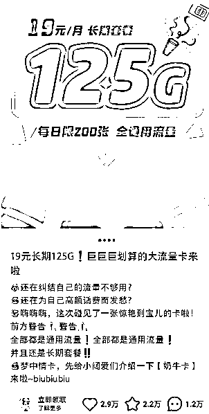
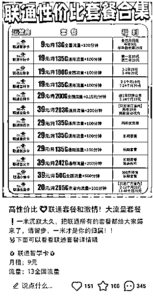
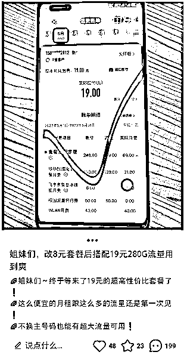
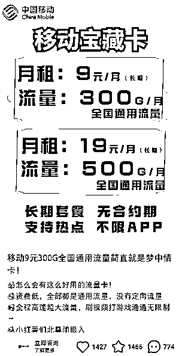
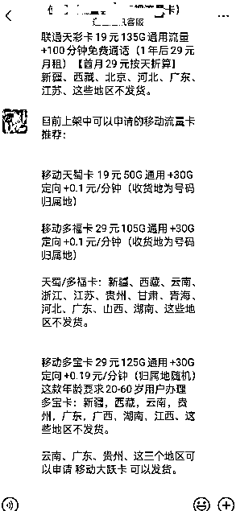

# 3 个人卖手机卡，40 个矩阵账号每月利润 5w

> 原文：[`www.yuque.com/for_lazy/thfiu8/mvvlkqgpcqtl30iu`](https://www.yuque.com/for_lazy/thfiu8/mvvlkqgpcqtl30iu)

## (35 赞)3 个人卖手机卡，40 个矩阵账号每月利润 5w

作者： 周一

日期：2024-03-08

在小红书上卖流量卡，也是一个不错的小生意，基本一单能赚 80-200。我们团队 40 个小红书账号，平均每天都能成单 20 张，最低一个月有 5w 收益。

接下来我会分享一些项目心得，包括如何找到靠谱流量卡货源，怎么注册小红书蓝 v 账号，怎么写文案，怎么引流微信，怎么引导成交，等一系列细节问题。

希望今天的分享对你有所帮助。

**一、项目概况**

大家好，我是周一，目前在电商行业里摸爬滚打 7 年，今天分享我在做的一个小项目，一句话概括起来就是：卖流量卡赚佣金。

小红书引流卖流量卡，利润 80-200 之间。

# **二、如何引流**

需要注册小红书蓝 v 号进行发布帖子，要不然很容易违规，要用到营业执照注册，有通讯经营范围就可以注册费用 600 一个。

注册之后正常活跃几天账号就可以开始发布内容了，主要是抄袭同行内容就可以，文案图片都可以直接模仿发。

笔记评论及时回复一些留言的用户，让他们关注，之后再发二维码让他们添加微信，直接在微信做成交就可以。

# 三、如何成交？

加微信之后客户有的会直接告诉需求，有的是需要 8 元套餐，然后推荐一下大流量卡，引导他们选择佣金高的卡，套餐的详情直接发给客户就行，他的问题一般再详细套餐介绍里面都有。

改套餐的办卡率不是很高，后期可以经常发一些套餐卡，做个朋友圈营销，还有一部分会推荐朋友办理的。成交总体很简单，走一遍流程就会。

这个是别人的话术，可以多加几个同行复制他们的话术也可以

# 四、如何找货源？

前期货源可以选择一些日结的试试，比如 172，号易等一些平台，如果能长期稳定合作的在签合同有个保障 ，我现在做的敢探号就是和上家签订的协议，有一些卡存在吞量，不给结算，基本上都可以找回这些问题订单。

这些直接去百度搜索就可以找到注册渠道，应该也有不少圈友在做。

# 五、问题总结

**（1）做不起来可能会有什么影响因素？**

笔记不爆，笔记爆了很快会出违规，有同行举报，有恶意引流，小红书账号违规，封禁

**（2）上面的问题可以怎么解决？**

目前我这边没有解决方案，笔记违规封了申诉，申诉不回来就放弃，账号违规申诉不回来就放弃，重新注册账号

**（3）大概单条笔记能带来多少流量呢？**

浏览量基本上在 300-500 左右，有的可以 1000-2000，还有的更多，这个主要是看内容，不一定那个会爆，如果流量不好及时换内容就可以

**（4）这个流量从有意向到转化我们会做一些什么运营动作吗？**

没有什么运营动作，只是添加微信推卡，根据他的需求来推，有一些是改套餐来的，成交率会很低，后期可以经常更新一下朋友圈，有的加了微信不会直接办卡，过十天半个月再办的也有不少

**（5）关于注册蓝 v 账号的选择上有什么注意事项？**

有通信经营范围的个体营业执照就可以，可以自行注册，我这边是找的服务商帮忙注册的。

**（6）怎么样能让笔记爆？**

我这边是持续发，找到爆款笔记及时抄，坚持发就会有爆的

**（7）除了发笔记还做了那些方法卖卡？**

还可以去被人已经爆的笔记去关注留言的用户，做好钩子就可以，成交比例基本上我这边关注 100 个能出 2 张卡

* * *

评论区：

枫宇翔 : 想问一下，营业执照通讯范围，具体是指哪些。有没有卖流量卡的个体营业执照经营范围的模板[坏笑]
Adrian : 直接和办执照的人说卖流量卡，他们就知道，这个业务很成熟。
枫宇翔 : [呲牙] OK，感谢
Rio : 这水深
不困 : 这个类型可以烧钱买量吗？
程哥虚拟电商 : 含通信或通讯 ，这两个任一个即可
纪玮 : 朋友去年做了一千万  现在入场有点晚了 卷的很
周一 : 是的

* * *