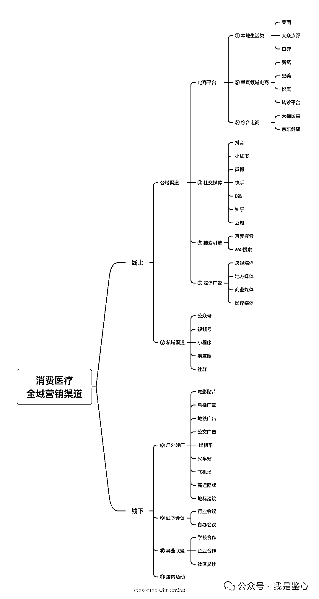
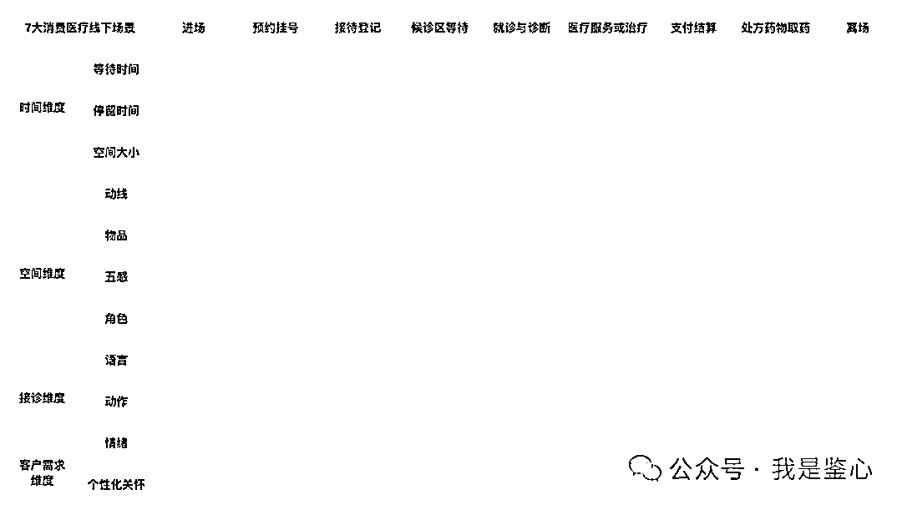

# 10 年，总结 100 条，医疗机构营销实战经验

> 原文：[`www.yuque.com/for_lazy/thfiu8/ironm4ulnyel2doq`](https://www.yuque.com/for_lazy/thfiu8/ironm4ulnyel2doq)

## (16 赞)10 年，总结 100 条，医疗机构营销实战经验

作者： 蔡蔡

日期：2024-03-06

大家好，我是鉴心，10 年前误打误撞进入一个医美 APP 做营销，之后深入到 1 线和朋友拿融资、开机构；帮助头部品牌做增长。

受到生财@芷蓝 老师的启发，我也把这些年花过的钱，踩过的坑总结出 100 个点。删掉了废话，调整了信息密度，希望有那么一两个点对医疗行业的各位有用。

-------

**1、1 个面包=2 个金条，定价的策略**

成本定价：一家面包店，根据原材料成本、劳动成本、运营成本和利润要求我们算下来可能是每个面包卖 10 块钱的时候我们有 15%的利润。

价值定价：有一天，忽然这个世界都发生了饥荒。富人家里只有金条，而面包店里还有两个面包。这个时候 1 个面包还是 10 块钱吗？

仔细观察一下，价格卖的高的项目，一定都是给自己的客户讲通了自己的价值的。

自己的产品到底哪里好，哪里稀缺，为什么是我，为什么是这个价，大家还要排着队去等，去抢。

**2、案例强，销售长**

不管你机构的销售吹的有多好，消费医疗，给客户展示做完的案例，往往更胜千言万语。

如果这个案例是一堆，就更有说服力。

如果能在这一堆中，找到和来的客户很相似的案例，那离成交就更近了。

所以平时就要注意搜集案例库，并且灵活使用案例库。

**3、能租 300 平就不要租 600 平**

我身边自己开机构的朋友，没有一个不后悔自己房子租贵了，租大了，要是重来一次一定会把这块的成本再砍半。

机构开大了，里面空荡荡的，其实挺可怕的。消费者会觉得你这个地方不行，才没有客户。

我们上街吃饭，长期人少的餐厅，你肯定觉得不好吃，也不愿意去尝试，对吧？

所以同区域内房租越少越好，能租 300 平就不要 600 平。

**4、预付费项目里的成本陷阱如何规避？**

一般情况下，利润=收入-成本，

在预付费的情况下，我们要把这个公式扩充为：

利润=收入-成本-负债

预付费的项目，如果你记了收入都要以减掉负债的形式把它减下去，

同时，预付费的项目未来你需要多次服务的，要核算清楚单次的收入和成本，我们的收入的计入应该是以服务交付的结果这一时间节点作为判断依据的，这样你的利润反映的才是公司真正的利润，反映的才是真正的公司经营的情况。

**5、爆款核心经营项目的设计有 4 个维度，别漏了**

核心经营项目的客户体验是“有意识”设计出来的。4 个维度，耗材+加医生+加服务+加环境。

可以根据自己的科室、业务去分析这四个模块里需要占的比重是多少，重点突破。

打个比方，我们是一家专门做轻医美的，我可能对于，耗材、服务环境的要求比重就比较大。

因为涉及到的操作其实没有那么的复杂，不需要一些手术类的大咖来坐镇。

客户可能关注的是耗材的品牌是否正品、这里是否环境舒适、地点方便、服务贴心，以及价格不要太贵。

**6、爆款逻辑都是一样的，不一样的是。。。**

很多人现在做短视频，在微博、公众号里面找素材，因为火过的内容还能再火。咪蒙的公众号写的很好，到短视频时代，依然通过短剧赚流量、赚钱。

其实内容的爆款逻辑都是相通的，各平台之间，只是根据这不同的 3 点来略做调整：

1、用户是什么人？比如小红书的女性用户多一些，视频号中老年多一些，抖音什么人都有。

2、打开 APP 的目的是啥？比如小红书有很多用户是搜索需求，那就多做一些搜索的内容。

3、观看习惯是啥？公众号的用户是图文阅读， 喜欢读长篇一点的东西。抖音的用户愿意看短视频直播。

**7、消费医疗行业就是一个零和游戏，抢人头的生意**

零和游戏就是，这个事情我做了，你就没有做的。

比如说一个客户要做一个牙齿矫正，我在这家做了，就不会去那家再做一次。这个需求只会产生 1 次，不是你的就是我的，除非是第一家没有给我做好。

所以我们就是在抢人头，你先把这个人头抢到了自己的手里，那别人家就永永远远失去了这个人头，未来他不会再产生一样的需求。

所以要活下来，比的就是此刻、现在，比谁家在单位时间内能够抢来更多的人。

**8、各商家被打假人盯死的地方是：**

各个平台的电商店铺，一直是重灾区。只要是官方店铺，什么大众点评&美团、新氧都会被盯死。

在平台被投诉过的用词，比如说：

“新生”“再生”“一口价性价比”“重塑”“正品”“超值热卖”“效果自然”“功效”“金奖、高资质专家”“销量 TOP”“恢复快”“专家”“名院”“除皱瘦脸”“不惧揉捏”“愈合快”“祛疤”“去红血丝”“3 天拆线”“高存货”“效果稳定”“创伤小”“正品”“人气款”“爆款”

等等，要注意文案图片不要有功能性暗示，不要有对比图，不要放模特、不要放医生。

做出来的物料有条件的，可以先让法务过一遍，减少一些被罚的概率。

**9、被打假人举报医疗广告违规，要被判罚，应该怎么处理？**

运气不好，走到了定性以及判罚的环节的话，我们一定要去提供有关广告的制作费用是多少。要提供完整的合同、发票、证据链，这样的话罚款会根据你的广告制作的成本，根据你的销售的情况来进行判罚，一般情况下是广告费用 3 倍以上 5 倍以下的罚款。

但是如果你无法提供这些证据，让广告费用它无法计算或者是明显偏低，这样的话罚款就是 20 万打底。20 万以上，100 万以下的区间。

有的广告制作费用并不高，就算 3 倍罚款也到不了 20w。

所以建议大家注意准备好完整的证据链。

**10、这是我整理好的消费医疗最全的营销渠道，大家可以保存参考**

**11、不同规模的机构的推广渠道怎么选**

中小机构：点评&美团必做。有能力做内容的话，小红书要做，从图文开始。抖音不管是短视频还是直播，上手难度高，适合内容能力更厉害的团队。其他渠道顾不过来就顾不过来吧。

头部机构：线上能全尽量全，不管什么渠道至少要都能搜的出来东西吧。线下硬广，有的地方长期投，比如有的私立口腔医院在市口腔医院门口的广告牌常年投放广告；有的地方根据营销节奏投，比如地铁广告。

**12、不同规模的机构对外推广什么样的内容**

中小型的机构，消费者对于你的品牌没有任何认知，那你就主要抓一个定位，一个卖点，把这一个点打透，无时无刻你都要做与这个卖点有关的事情。

当你的机构大到一定的规模，需要做好品牌的时候，我们就需要，1、提供优质的医疗服务的前提下，2、建立信任和关怀的形象。

好的品牌，让消费者他认可你，觉得你是国民的眼科医院、国民的齿科医院、国民的皮肤中心。不管你推出什么样的业务，我在你这里都是无脑买。我认的就是我要在这个机构进行消费，那就成了。

**13、别分次收费，客户更开心**

如果条件允许，让消费者提前缴费。这能提升消费者体验服务时的幸福感。

能够一笔收完的就不要拖到分次来收费。

因为消费者提前享受到了服务，支付时的痛苦就会被放大，客户在最后体验感就会有影响，影响峰终定律里面“终”的体验值。

**14、别搞错了，只有花了钱的才是消费者**

调研的时候要注意选择调研对象，只有花过钱的，实际买过东西的，才是消费者。

那些说自己打算买，以后会买的人，去了解他们没有意义，因为没有实际掏钱的动作。

你调研出来的结果可能是错的。

**15、成年人和青上年家长的传播链路完全不一样**

根据我们之前实地的消费者调研，给自己买项目的成年人，和给孩子买项目的青少年家长在传播链路上完全不一样。

成年人，有时间给自己在网上多挑挑，多看看，多对比，多做功课。所以就算他们的 A 项目在这里做，他们选 B 项目的时候依然会回到公域平台上去找答案。

家长就不一样，每天事情非常多，多半受身边认识的人影响，孩子同学家长的转介绍，印象中哪里是最好的，就做消费决策了。家里事情多，没时间这里看那里看找答案。

**16、差评也分级，不会影响其他消费者进店的差评是哪些？**

比如说：门诊内为客户提供服务的任何一环或几环的同事没有服务意识，态度不好；接待过程中沟通或者操作过程中的小失误，但无伤大雅。比如表述紧张，缺乏自信，浓妆艳抹没有诊所工作人员形象等；团购产品有争议、优惠价钱过期等。

回复的时候要

1、有同理心，表达对客户的重视

2、真诚道歉，给出改进/处理方案

3、感谢建议

**17、情况较严重，但是任可以拯救的差评是哪些？**

比如说：客户对医疗结果存疑的点是有争议的，我们可以证明自己提供的医疗服务和结果没有问题；操作过程中造成客户有些许的不适，比如片切切到牙龈出血，但之后可以愈合；有可以理解的隐形收费，有难度费，有其他杂费。医护报价不统一；消毒和一次性用品因为没有沟通清楚而产生的误解。这类差评，如果公开回复优秀也不会影响消费者心智，回复的时候：

1、同理心，表达重视

2、事件调查还原，言之有物给出具体解决方案

3、感谢建议

**18、但是什么样的差评/负面威力最大，一定要注意避免？**

比如说：医疗效果差，在公立医院被同行否定，且被公立医院妥善解决。接待过程中无法解答客户问题，只能对外求助；医疗操作过程无法继续，需要换人操作等；诊所无证经营；医生无证上岗；过度夸大病情并被发现等。

有这种情况发生，任何回复可能都没有办法扳回一城，只能尽量去联系客户，妥善解决，恳求客户删掉差评。

**19、开机构，没做过几次低价引流的活动，没被薅过羊毛，都不完整**

刚开店，是不是就不断有各个平台的 BD 来劝说各位，要做引流产品，要便宜，最好搞几十块钱的洗牙，或者小几百打个针？

甚至自己高薪招来的运营也来劝自己，搞搞免费的隐形牙套试戴活动吧。

但是这样引流来的客户最后升单了几个？他们多一分钱都不愿意付，羊毛薅完就走，恨不得让你你能免费给我全做。

有人计算逻辑是，平常我要花两三千营销成本来一个客户，搞活动的时候同样的成本我能来四、五个，但凡多转化 1 个客户都是赚。

但结果一定不是这样的，往往舍得了孩子，狼也没套着。

原因也简单，因为花两三千成本引流来的客户和低价引流来的人根本不是一拨人。

**20、低价营销的连锁坏效应**

除了转化低之外，因为负责接待的医生、咨询都没有业绩，他们的稳定性也会变得很差。

最重要的是，老板会开始怀疑平台，觉得抖音、小红书不适合自己，来的人都很 low，付不起钱，开始拒绝互联网，然后错过赢家通吃的大机会。

**21、能做低价引流的都是哪种狠人？**

当客户走到一个大机构，其实心里非常清楚自己是来薅羊毛的，也有这里不便宜的预期。

看到现场人多，心里也有底，不过不怕你坑我。

因为头部机构本来需要的客户量就多， 与其让一个大场子空着，不如先把人填满。

而且头部机构销售多、经验丰富、转化能力强。

他们搞低价引流，除了能够做极致性价比抢占客户，也能逼死同行，让自己少很多竞争对手。

**22、做突破用户认知的价格，会让人感到恐惧**

比如说，我们想做一个双眼皮的促销活动，在用户内心觉得，做双眼皮应该是大几千一两万的价格。

如果要做特价活动，85 折，7 折都比较正常。

但你千万不要去做什么 500 块钱的一个活动价。

这个 500 的活动价是一个突破了用户认知的价格，客户不会觉得我捡到大便宜了。他只会觉得害怕。

害怕这肯定是这医生技术不好吧，拿我练手那所以价格才那么低。

或者害怕他通过这个 500 块钱的项目把我骗到医院去，后面肯定还是会有大坑等着我。

**23、2024 年重视私域，从改掉“客服”号开始**

公域能够帮你把盘子做大，私域决定你能不能做的稳。

但是很多人对于私域的理解都太浅层次了，拿个客服号加了客户发点优惠，回答点问题就算了。

不是这样的。

你把自己当成是客户，每天在微信里愿意和谁聊天，怎么聊的，聊什么，然后怎么莫名其妙就被朋友安利买东西了？去研究这些路径把，真的把你私域里面的客户看成是人，而不是韭菜。你和你朋友怎么相处的，对客户就再更好一点。

我曾经看到过有篇文章，在私域卖高端女装的团队，五六个人，一年卖上亿，大家主要工作就是和私域里面的客户聊天，什么都聊，家长里短，生活琐事，对你应该有点启发。

所以，拜托，做私域，从大家改掉客服账号，从这个账号，姓谁名谁开始做起。

**24、大众点评&美团，还是医疗机构最稳定，最简单，获客最多的渠道**

大概能占到线上新客获客的 50%以上。

且操作简单，就那么几个板块，把该上的东西上上去，店铺整体装修体现一下重点（想卖什么就重点突出什么）。

然后做好 3 件事情：

1、评价：越多越好，注意安全。

2、广告：该投的广告要投，预算丰俭由人。预算少，多投 cpc（搜索广告），多在其他几点下功夫。

3、团购单：人都是从众的，看到销量多的店更想去。

**25、大众点评&美团广告投放小心机**

CPC 广告，人群较为精准，增加进店和转化效果好，点击均价高。

CPM 广告，展示首页信息流，流量大，增强曝光利器，扩大目标人群，价格低。

大部分商家，CPC 投放占 80%，但是贵，而且每天流量还有限。

我喜欢把 CPM 的投放物料做的非常的硬广，然后选择按照点击付费。硬到什么程度呢，如果不是有明确需求看到绝对不想点那种。用这个方法多找点有需求的人，以及降低一点成本。

**26、100 个洗牙客户，能有 1 个转化成矫正/种植客户，已经了不得了**

即使作为医生角度，你真的觉得客户的牙非常需要做矫正，那也很难。

你给洗牙的客户说他的牙怎么不行，可能激发了客户做矫正的想法，但是当他们想要去做矫正的时候，一定需要另外做功课，到处比较。

因为，洗牙可以随便找一个家附近的门诊洗，但是做大客单的矫正，或者种植，那不一样，5 位数的产品一定要多方比较的。

所以，逻辑是，想要卖什么，就多花功夫在如何找到对这个项目有需求的人，如何转化他们。

**27、大专家人设，容易让人拿着放大镜找错处**

一般情况消费者会拿着放大镜去找专家的错， 当专家是不被允许有失误的。

但凡有一个点说错了，就会丢掉大部分信任感，消费者心理是：不过如此，专家也不怎么样。

一面说自己是专家，不好意思表达一些没有深度的内容，然后越专业越没有人看。

另一方面，也害怕自己说错话，得不偿失。

反正两头不得好。

**28、代入消费者角色，找出线下体验短板，填表就行**

我自己去到一家店当神秘客的时候，会把自己代入消费者的角色，这样去感受一个店的体验好不好，很容易找到问题。

如何记录感受，表格粘贴如下，填表就行，大家可能用得上：

**29、单点的方法论永远没有办法帮助我们解决系统问题**

如周鸿祎所说，短视频和直播把现在的人都格式化了，我们习惯性的接收碎片化的内容和解决方案， 但是单点的方法论永远没有办法帮助我们解决系统问题。

医疗机构的营销、增长都是系统问题。

从用户生命周期来看，分为：诊疗前、诊疗中、诊疗后的不同运营策略

从内部不同部分的分工来看，分为：市场、咨询、医护、客服，各部分既要各司其职又要相互助力。

做得好，大家拧成一股绳，做的不好，相互甩锅。

**30、店铺评价不仅是脸面，还要能激发购买欲**

评价内容应该是让客户看了之后，有想要咨询、下单、或者想来你的店里面购买服务的冲动。

可以参考的思路：

1、完成服务的客户：谈效果，谈什么满意

2、疗程中的客户：谈感受，顺利，信任，期待长期之后的效果

3、新客户：谈原因，为什么选择在这里做，不去其他家做

文字数量：

可以有长有短，比较真实。

最后注意，差评少一点，要爱惜羽毛。

**31、店铺设计不要天天改，月月改**

线上店铺，不管在大众点评、美团、抖音、新氧...

确定好的装修和设计不要天天改，不要月月改；不要今天店铺用了粉色下个月就改成了蓝色；搞一次活动就换的面目全非。

破坏品牌一致性不说，也没啥效果，顶多就是运营向老板交差我自己干活了。

如果耐克今天一个勾，明天换成一个叉，今天是 Just do it，明天是 Just dont do it，那他还是耐克吗？

该交给时间的东西最后就是要交给时间。要上新活动，要保证品牌一致性的情况下搞。要让客户认识你是谁的情况下搞。

关于品牌层面的改动，是想清楚了之后，做 1 个动作，而不是做一堆动作之后，觉得自己很努力，感觉良好但是不知道为什么，以及未来怎么办。

有那时间多去做点内容、多去做点直播，都比天天折腾店铺设计强。

**32、抖音，本来还想写点直播干货，但是焦点访谈报了医美直播乱象之后。。。**

所有的医美直播间、团购都下架了。口腔的团购我看着还有。

本来还想写写运营干货，但是现阶段没必要了。

但总体原则就是，平台开了口子就抢在第 1 个做，卷死同行。平台禁了就不做，没必要哭天抢地，本来抖音的医美直播也是去年 1 月份才开始的新东西，在这个东西出来之前，难道大家都不吃饭了？还不是八仙过海各显神通。

禁了就禁了，规则对于所有人都是平等的，不让你做别人也做不了。

本来抖音的短视频和直播，对于做内容的门槛要求就非常高，会做的赢家通吃，不会做的干着急，但是市场上大部分的人是不会做短视频和直播的。

但是不让你做，不代表你不能去上面捞人啊。

我最近就发现，某医美老炮的销售，蹲守在各个金融直播间、创业直播间，然后花点钱去别人的私域群，在里面捞了很多客户。

规则是死的，人是活的。方法总比困难多。

**33、峰终体验做得好，转介绍少不了**

我的猫刚接回家没多久猫瘟了，在宠物医院住院期间，小护士看到猫咪两只小手捂着眼睛睡。马上把灯关掉，说让猫睡得好一点。

猫咪出院的那一天，离店之前，护士给了我一本相册，相册记录了猫咪从到医院的第一天到出院的最后一天，每一天的照片。旁边还有手写暖心的话。

再后来，我带猫咪去打疫苗或者做绝育的时候，只要说猫咪的名字，里面的护士都记得她，还会过来玩一玩她，说感觉长大了呀。

每个细节让我记住了，给朋友说的时候，他们也种草了这个宠物医院，朋友的猫要绝育也都去了同一个医院。

今天我在讲峰终体验的时候，我还会把他们拿出来做案例。看，这就是峰终体验做得好的力量。

**34、对好内容的定义不局限在抖音、小红书**

不止只有在抖音、小红书、视频号上面的内容是好内容。

一条好的评价，写出了细节，写出了卖点，能够让客户浏览店铺的时候有想要去这个店面诊的想法，也是好内容。

在微信发的朋友圈，针对仅咨询没下单的客户怎么说话，针对已成交没复购的客户怎么说话，说什么，这不都是好内容？

所以如果老板和团队，有内容意识，生意很难做啊😂

**35、新一代能起来的新品牌，老板、操盘手都很会做内容**

而且起的非常快，成本还低。

不过内容也分，会写微博的，不一定会做公众号。

在公众号火的，在短视频时代又不一定做得起来。

短视频刚知道怎么做，直播又被卡主了。

内容的呈现方式变化，对应的玩法都会变。

自己会做自己做，不会做分一部分给会做的人，把自己客户基础数量做得越来越多，亏不了的。

**36、很多机构老板做内容的卡点：没有足够的专业知识判断什么是好内容，以及谁会做好内容**

既然做内容那么重要，很多老板的第一反应是那我招个会做内容的人就好了。

但紧接着，就会发现自己根本没有办法鉴别什么是好内容，以及什么人能做好内容。以及，开的那几千一万多的工资，来应聘的人感觉都看不太上。

真正会做内容的人，不需要找工作也能自己养活自己，不管是接广告还是带货，自己搞搞也比几千一万的工资要高。

有的要一个挺高的工资，老板一算，第一反应是太贵了，请不起，比一些有点经验的医生成本还高了，觉得不划算。

有的咬牙请了，刚开始在各渠道铺内容，量变还没有引起质变，疑心病太重，一焦虑放弃了。

这些都是一般老板在做内容的时候的卡点，是普遍问题。

**37、很多员工问题，其实是业绩问题**

是不是业绩不好的时候，员工问题也特别多？

因为有活干的时候，大家都在忙着干活，没活干的时候，大部分在相互甩锅。

所以把业绩问题解决了，大部分的员工问题也就解决了。

**38、在内容平台，各商家要注意不要做患者作证的内容**

这个患者不管你是普通人，还是网红，或者是一些更有名气的人，只要你是以第一身份去讲自己的体验感受，涉及到向机构引流的所有的行为，理论上都是不合法的。

如果把这样的内容放到自己的官方的号去讲，那简直就是顶风作案，为监管机构创收。

**39、这几年我越来越少在信息流广告上花钱了**

因为信息流广告会在客户猝不及防的时候给他推送，用户不知道你是谁，不知道你的背景。

因为医广的限制，能说的东西也不多。

为了在几十秒内就收上来客户联系方式，逼着广告内容往便宜、巨大优惠的方向上做。

然后贪便宜的人又来填表单了。

相比起做 IP，做内容，做店铺这些可以沉淀出品牌信任感的方式，信息流广告真的做不出来信任感啊。

（当然每年有几个亿要投，要拿活动狂轰乱炸，且有非常好的线下转化能力的机构除外。）

**40、你有没漏记记录客户的每一次互动和交易？**

客观事实上，比如说：这个客户他来没来？他什么时候来？他有没有改约？他来了之后他有什么特殊的要求？他有没有做什么项目？是哪一个医生或者是护士为他进行服务的？服务时长是多少？他有没有投诉？他具体交了多少钱等等。

这些是客观发生的事实，是他进行诊疗的过程，事实性的东西，我们要把它记录清楚。

详细记录客户的每一次互动和交易，有助于提升企业的运营效率和决策质量。

**41、客户用户画像维度记录，精准营销的前提**

这个维度是大家可能从来没有关注过，被忽略，但是又特别重要的——是用户画像的维度。

当一个客户他到了门诊之后，到底是一个什么样的人？他的穿衣打扮是怎么样子的？他在和你沟通的过程当中有没有透露出一些关于自己的信息？比如说家庭的远近？来这里是否方便？自己有什么样的兴趣爱好？他的社会身份是什么？职业是什么等等。

因为你只有对客户画像非常的了解，你才知道你的客户他是谁，他到底是个什么样的人，他都会在什么样的地方出现，他有什么样的兴趣爱好，然后才能更有可能去找到相类似的人，把相类似的人发展成为你自己的客户。

**42、抠门老板最怕的是会错过机会**

营销费用，可多可少。

如果我们花了太多的钱在营销上，东西没有人买，那就是浪费资源。

如果我们花的太少，并没有能抢占到市场，那我们就有可能会错失机会，让竞争对手抢先一步，长此以往我们反而会失去更多的客户，特别是在我们消费医疗领域，很多项目都是零和游戏：你做了，我就没得做了。

有的老板在有效果的时候抠抠搜搜，不愿意多花钱，这其实是不对的。

抖音直播刚开始的时候，有老板花了 10 多万去学习如何直播。23 年别人家都在怨天尤人的时候，人家回来赢家通吃，吃遍了红利。

**43、如何衡量营销效率？**

一般用 CAC 和 LTV 来衡量，CAC 和 LTV 的概念大家百度都有，我直接上结论。

那一般来说，如果 LTV/CAC>3 ，及以上，我们可以被认为它是有高回报的，也就意味着每个新的顾客为公司带来的收入要远远超过获取他们所花的成本。

如果高于 3 倍更多，你都到了 5 倍，到了 10 倍的话，那就意味着你的钱花少了，这个时候你完全有能力应该多花钱啊，抢占更多的市场份额，让更多的客户来到你的门诊或者是医院，

那如果是小于 3，那就证明公司花了太多钱去获取一个客户，那你就要对自己的营销策略需要重新评估以及优化。

**44、还可以用 CAC 的回收时间来判断公司是否运营健康**

那 CAC 的回收时间，指的是一个客户，从开始在我们这里花钱消费开始，我们需要多少时间能够让客户的花费等于我们获得它的成本，

CAC 的回收周期越短，对于公司来说就越健康，

如果 CAC 回收时间越长，那就意味着公司需要更多的时间来把资金回流，那这会影响公司的现金流和盈利能力。

一个相对健康的 CAC 的回收时间可以在 6 个月到 12 个月，

当然这也只是一个一般的参考范围，具体的回收期应该根据门诊的经营情况和策略来确定。

**45、来的客户不成交，谁的锅？**

来的客户不成交，门诊说是市场来的人不对，市场说是门诊不行，到底是谁的锅？

客户成交前，见过的人，负责的部门都有责任。

但是 ，如果市场只会打折引流，不会说清楚产品的价值，品牌的价值，医生的价值，市场的责任大一点。

客户进店前知道品牌大概是个什么层次的品牌，知道价格区间，到门诊不成交，门诊责任大一点。

定价、定位问题，老板的锅大一点。因为定价定生死，定价要让一把手来。定位，老板自己都思考不清楚自己做哪部分人的生意，员工很难代劳。

**46、老板不知道营销怎么做，是因为中了知识的诅咒**

有没有发现，当你年年月月在做 1 件事的时候，有很多知识你觉得稀松平常，觉得在同行来说，都是常识的东西，但其实对消费者很新鲜，可以提出来作为卖点。

周鸿祎说，他和小米都做摄像头，他看了小米摄像头的广告语，就觉得比自己做的高档，因为小米摄像头写的是“4 片玻璃镜头”。

然后他就叫他的工程师来问，自己公司是啥镜头。工程师说也是玻璃镜头，也是 4 片。周鸿祎反问你为什么不说啊？工程师说大家都一样啊，大家都知道。

看，这就是知识的诅咒，你以为稀松平常的点，从营销层面来说可能就是非常好的卖点。而且就算是大家都一样，谁站出来第 1 个讲，点就是谁的。

**47、老板要经常在各个平台搜一下有没有关于机构的负面**

搜索词：品牌名/医生名+避雷/负面/做坏/暴雷等。

一般好事不出门坏事传千里，有时候不经常搜搜，自己客户怎么没的都不知道。

有负面要第一时间处理，别等着负面发酵。

不管一些公域渠道你做不做，但是都要经常去搜搜，看看有没有负面。

信任建立起来不容易，崩塌起来却很简单。

**48、忙了一年不赚钱，有没有发现实际上是你店里有太多预付费项目？**

好多老板一聊天，都发现有这个问题。什么是预付费项目？

我们消费医疗行业它是一个服务业，不像消费品行业一样，在现实生活中交易的时候是一手交钱一手交货，

所购产品的交付和收款是在交易的时候同时发生的。

然而我们消费医疗的服务产品有时候会推迟交付。

说直白一点就是你收钱了，但是服务不是马上就交付，它有可能是在未来某一个时间点，或者是未来的某一段时间点之内才能完成的。

比如说我们常见的场景有齿科里面的牙齿矫正，牙齿种植、医美里面可能会卖一些卡，有的可能是那种以次数为单位的卡，有的可能是以时间为单位的卡。

那像在这种预付费的场景当中，大家最容易踩的坑是什么呢？

最容易踩的坑就是算账，算不清楚，把预付费记成了是自己的收入，收钱的时候非常开心，只看到钱哗哗的来，自己的营业额飞速的增长，自己的门店里面都是客人，

但是过了好几个月甚至是一两年，一算账发现自己根本就没赚钱，累了半天可能还亏钱。

**49、没有公域引流，就没有什么私域和转介绍**

卖私域课程的老师说大家要去做私域啊，卖转介绍课程的老师说大家要去做转介绍啊。

没有公域引流，哪里来的人做私域或者转介绍？

假设转介绍率高达 50%，那成交了 100 个人，转介绍后下一轮是 50 个，在下一轮是 25 个。

没有公域流量补进来，生意岂不是越做越小？？？

营销一直都是综合结果，公域决定你能不能做大，私域决定你能不能做的稳。

两手都要抓。

**50、没有设置好成交理由就不会下单**

大家有没有见过这种人？就是前面聊挺好，你觉得他马上就要买单了，然后他说：哎呀我今天要接孩子，我先走了，回头咱微信聊。或者说，我今天先回去看一下效果，明天买的话直接转给你；我要回去跟我老公商量一下，明天给你回复；我要回去跟我姐妹商量一下，要买我们一起买 我们直接转给你。

然后，你会发现什么呢？别说明天了，明年后年你都没见他。

这是什么原因？因为你没有给到客户下单理由，我为什么一定要在今天买的理由，今天不买就亏大了的理由。

没有理由，客户不着急，那今天就不会买单。

**51、门诊筹备中，你有没有忽略掉政府关系？**

很多机构，开到一定规模 了，团队里面都还没有人对接政府部门。

平日不走动，不联系，一和卫健委的老师们见上面就是被客户投诉了，或者被打假人打假了被请喝茶，你说你这生意做的能顺畅吗？

这个点非常容易被忽视掉，和人家的对接应该从门诊装修过程就开始了。

我知道做得好的，在装修过程中，就请了人家到医院参观，这样可以对不符合规定的地方及时修正，便于医院审查验收一次通过。

否则一次不过整改约第二次，浪费的都是时间成本，增加的都是固定成本。

**52、免费试活动就是变相换好评，别想转化，淡季做**

根据我们之前的经验，免费试来的客户，转化大单的几率很小，其实就是多个广告位去介绍一下自己的门店，然后多了一些真实的客户去帮你写评价，要想通过他们赚钱，原理如同低价引流的客户很难成交一样的。

所以做这个活动的目标是，让他们帮助机构写出好的评价内容，质量高的，能够影响其他人的就可以。

能在淡季做，就选淡季做。能约在工作日，就不要放在双休日。

**53、名医出来创业前要先问自己懂多少企业经营**

诚然，医疗服务项目，交付最重要的环节是医生的手艺。但是出来创业，自己开诊所一定要要问问自己懂多少企业经营？是否有好的运营或者管理人员可以合作？

因为企业经营和诊疗是两回事，开一家门诊有太多其他工作需要处理了。

爱尔眼科从 14 年开始的合伙人计划，在新开设医院的时候，就必须要有医疗骨干和管理骨干的角色，再加上产业并购基金，三方一起去投资新建医院。

**54、平台的破价活动参加吗？**

不参加，账算不过来就不参加。

我自己还在机构做运营的时候，就从来不报低价的活动。

说实话，冲着低价来的客户后续升单难得要死，和你想要的高质量客户不是一拨人。

就算销售磨破嘴皮子，把客户留在门诊强势灌输 1 个小时，最后客户不情不愿付费了，接下来交付过程但凡有一点不满意，客户能把你屋顶掀了。

后续生意能不能做的长久，能不能良性循环，和前面引导了谁来，是怎么引导来的有直接的关系。

破价的活动，本质就是平台薅机构的羊毛，让客户为低质量服务和未知的风险买单。

**55、其他客户不认可的审美，不是好评，不要展示在公域平台行**

有的客户，特别是医美客户，有的个人风格非常明显，审美其他客户看了不一定接受。

这种自己满意，别人看了都不满意的审美，千万不要邀请他们去写好评。

即使是 5 星好评，也会影响别人看了之后的想法，影响其他客户进店。

所以老板或者运营，除了每天去看数据，一定要回头看看数据背后的内容、人，你只有数据没有洞察，都是零。

**56、很多长周期项目（牙齿矫正、医美办卡等）越做越亏**

【这条很重要】

客户交了钱，需要等一段时间之后才能把所有服务都交付的项目，比如说齿科牙齿矫正，医美医院爱搞的充值活动，都属于长周期项目。

这些项目的本质是预付费，收 1 次钱，之后都是你欠客户的，要定期还债。

后期没有钱进来，每天都是进门来做服务的客户。只要只要在这种长线的运营过程当中，机构没有实力在符合成本的时间范围内把他们送走，那这些客户每多进店一次，你就多亏一次，每多收一个客人，你就多亏一个客人。

平常我们算利润是：利润=收入-成本

但是在预付费的情况下，我们要把这个公式扩充为：

利润=收入-成本-负债

预付费的项目，如果你记了收入都要以减掉负债的形式把它减下去，核算清楚【单次进店】的收入和成本，以尽快让客户把服务做掉为目标。

不然拖得时间越长，到后面越是一笔烂账，到年底一盘，一点都不赚钱，控制不好还会亏钱。

**57、人不喜欢听知识，只想要凑热闹、讲八卦、听故事！**

没办法，这就是人性啊。

回想一下自己在刷视频的时候，看到那种很严肃的人，要给你讲一些大道理，是不是感觉压力很大，很累，想马上划走？

所以如果真的想讲什么知识，试试如何让观众凑个热闹，让观众听个八卦，让他们听个故事。

**58、人设，能做知心哥哥/姐姐，就不要当大专家**

在互联网上打造人设，千万不要让自己成为让别人仰望的角色，什么专家、老师都不好。

因为人设做高了，观众会拿着放大镜去找你的错误，但凡你做的东西有点不对，那信任就会崩塌。

我做这个事情有点经验，我对这块比较了解，我踩过很多坑现在分享给你，以后你就不用踩坑了，这样的态度在互联网说话，别人也更容易接受，对内容的容错率也比较高。

试想一下，你本来就是大专家的实力，但是说话却非常的亲切，不端着，很温暖，是不是会让观众听起来更好？

**59、营销没有效果，可以往这 3 个方向找原因**

1、找不到卖点：不知道怎么说什么，内容难产，营销很痛苦

2、卖点不精彩：没啥吸引力，消费者看了之后没感觉，购买转化低，营销成本高

3、没有差异化：内容同质化严重，看不出来对比别人的优势是什么，只能拼价格，利润越做越低

**60、如何给产品/服务设计卖点？**

用穷举的方法。

列一个表格，每个环节都列出来，每个环节里面都有什么优势，事无巨细全部列出来。

比如，涉及到会用到的原材料，产地在哪里？有什么稀缺性？达到什么标准？

比如详细服务流程：如何预约？产品和服务如何匹配？有什么你有别人没有的流程？有什么好的效果？

列出来之后，请不同的人看看，你就有思路有感觉了。

**61、什么时候都一样，业绩不行先向内求**

经济好的时，很多外行带资进场，各种烧钱抢占市场。

经济不好的时候，客户没有钱，做决策更谨慎。

所以发现没有，不管什么时候都有不一样的困难在前方等着。

所以事情做不好，没有客户，不要怨天尤人。往内看看，向内求，才会找到问题的解决方案。

**62、医疗行业的 AI 革命：营销人有效使用 Chat GPT**

很多医疗老板都在想人工智能如何和自己的生意结合。

可以确定的是，GPT 对于做内容，做营销的人工就是神来之笔。

不过前提是使用 GPT 的人，必须知道如何提问。

如何提问的关键是，先知道好内容的标准是啥，才能提得出能够得到理想答案的问题，

未来知道如何做好内容的人会越来越强，1 个人就是 1 个军队。

不会做的人，会卡在问问题的环节，有工具都做不好。

各种 prompt 我也在研究，也欢迎有所成果的朋友一起交流。

**63、在 Chat GPT 上提问的大原则**

GPT 能够治好所有不会好好提问的人的毛病。

搞 GPT 研究文案写作的高手都遵循了这个规则：

1、说清楚背景：在什么平台做什么主题的账号，受众是谁，目标策略、人设、风格等

2、设定 GPT 角色：设定对口的专家身份 + 特定经验技能

3、GPT 任务是啥：简要介绍写作任务的方向、效果预期

4、任务什么要求：语言风格、内容结构、写作技巧、模仿示例、创作流程

**64、虽然抖音流量大，小红书才应该是兵家必争之地**

小红书的用户，就是妥妥的消费医疗的客户啊！

女性占绝大部分，都是一二线城市的，收入还高，消费主义，爱美，愿意在这方面花钱，关于各个项目的讨论度还高。

医美、齿科、植发、眼科、中医、减重、产后塑型，有啥不能卖的？

19 年小红书信息流广告刚刚开始的时候，我去上海见过他们的商务，就透露过就算平台再怎么整治医美医疗方面的内容，从用户端发出来的笔记量持续增大，而且讨论度都很高。

而且小红书可以做图文啊，相对于视频和直播，图文的制作难度是不是低很多。

小红书！才是必争之地！

**65、所有的答案和密码都在消费者身上**

要学会在消费者身上找答案，他们是谁，有什么兴趣爱好，平常用手机都在刷什么，偏好什么样的内容，之前购买什么项目的时候是如何被转化的？是怎么想的？他的想法是大多数人的想法还是个人想法？对于获取其他新客户有没有参考意义？

其实基本上做几轮之后，操盘手就清楚了。

当我们在外面被这个忽悠那个忽悠的时候，关注点放回到自己消费者身上，就没有那么焦虑了。

**66、所有的线上渠道来说，大众点评&美团是最稳定来客户的渠道**

评价量、销量积累多的话，一般来量很稳定。

小红书和抖音很多时候是规则老变，一会让做一会不让做，一会又给变规则。

做得好的时候量花花来。

但民营机构，经常因为做的好，被同行举报，把一个做得好的号给封了。

我们要有一个认知，就是平台想挣消费医疗行业的广告费，这个钱他们能不能挣到，也非常看平台法务的实力，能不能为各个商家遮风挡雨。

目前来看，还是美团大众点评来量最多和最稳定。

**67、医疗营销，限制很多，唯快不破**

搞医疗营销，从第 1 天开始就在体验来自四面八方的限制。

多年起起伏伏我发现，各个平台，只有其他行业没钱赚的时候会给消费医疗行业机会，给开个口子，让你去投广告。

平台有钱赚的时候，人家都不搭理你。

所以，但凡平台开了口，说可以做什么的时候，一定要第一时间冲进去，卷在第 1 个把玩法打透，吃透。

比如抖音直播这个事情，窗口期就那么一年多的时间，捞到鱼的开开心心。

在后面观望的有啥？等来一个焦点访谈的结局，谁都做不了。

我对没有吃到这波鱼的机构感觉非常痛心，那么好的机会，赢家通吃的机会错过了。没办法，等待下次机会吧。

**68、头部商家，让品牌成为品类代名词**

有多少消费者会觉得，隐形矫正就是隐适美？

头部商家，头部商家有钱也有人，竞争策略是让品牌成为品类代名词。

比如说植发就等于谁，做牙齿就等于谁，整形就等于谁。

不是细分赛道，是整个品类。

让人一提起来做什么东西就选择你，把这个消费心智占掉。

**69、外行才会想着去成都开店**

成都的医美市场好，大家都知道，但是机构的卷也是地狱级难度。

供给太多，价格拉的还低，好医生还多。

最夸张的一次，我在成都出差，中午在川大旁边的咖啡厅，旁边有一桌就是销售给医生卖系统。下午换了一个地方，另一桌在那里算开机构的各项成本。

如果有连锁机构想要扩张的，千万别去那里卷。

**70、完整的客户投诉处理要求和技巧，收藏这张图就够了**

**71、为什么你在各个渠道上的广告成本越来越高？**

因为不会做内容。

不会做内容，只会花钱打广告，而且广告可能还是代理商套模板做的，投放后台都是统一操作的，代理商手里的各个品牌，这个价格竞过去，那个价格竞过来，套路观众都太熟悉了，那成本可不越做越高？

我们把所有五花八门的概念都忘掉，如果在营销里面挑一项最重要的能力，经济实惠并且良性发展，那我选内容能力，特别是做爆款内容的能力。

所有的社交平台都可以理解为内容平台，平台自己又不生产内容，他们需要优质的内容创作者生产好内容，帮助他们把用户留在自己的平台上。所以如果有内容能力，就不需要在广告上花冤枉钱了。

**72、一个文案水平高低的依据是，看写的东西动词含量**

这也是我努力的方向，好的文案要注意的点：

多写动词少用形容词：形容词是虚的，写出来的东西很抽象，不具体，能用来修饰句子，做不了主干，成不了主角。

只有多用动词和名词才达到写出画面感，而画面感可以控制人脑子里的画面，看下面的经典文案，是不是都是动词？

脑白金：今年过节不收礼，收礼只收脑白金。

旺仔牛奶：再看我，再看我，就把你吃掉！

联想：人类失去联想，世界将会怎样？

**73、另一个判断文案水平高低的依据：会写特写镜头**

好文案就是一个特写镜头。

特写其实就是把总结的语言写具体，比如说，强调服务好：

原文案：我们公司提供高质量的客户服务。

特写镜头：400 万次电话接通，每次都是温暖的声音亲切相迎；100%的客户问题得到解答，99%的解决方案获得满意评价。

原文案：女白领安全回家

特写镜头：放心吧！加班小女生 100%安全到家了

**74、人人都不喜欢学知识，但是都喜欢听故事**

试想一下，同样是定价问题，给你讲大道理：我们在做产品定价的时候，要用价值定价，不要用成本定价。

和另一个人给你讲故事：一家面包店，根据原材料成本、劳动成本、运营成本和利润要求我们算下来可能是每个面包卖 10 块钱的时候我们有 15%的利润。有一天，忽然这个世界都发生了饥荒。富人家里只有金条，而面包店里还有两个面包。这个时候 1 个面包还是 10 块钱吗？

哪一个你更愿意听下去？

人都喜欢听故事、听八卦、喜欢凑热闹，顺人性说话做事、做生意。

**75、我们难把东西卖给一个觉得“自己没有问题的人”**

比如说现在的小孩子牙齿虫牙龋坏年纪非常小，在没有换牙前，可能他的牙齿就已经蛀掉了。

那这种时候，从医学的层面来说，父母就应该带着孩子马上找医生。不管是涂氟也好，窝沟封闭也好，就应该是要进行蛀牙的预防与治疗。

但很多家长不觉得，换牙前牙坏了是有问题的。觉得得孩子以后都是要换牙的，现在蛀不住没有关系，不影响。

基于这个认知，他也不可能去搜索解决问题的方案。更不可能，去牙科门诊购买一个涂氟的项目。

你以医生、机构的身份告诉他你应该做什么，他越觉得你都是为了赚我钱。

所以有问题意识，一定是一个消费者在产生购买前第一步会有的想法。

**76、我真心觉得做宣传，没有比现在更好的时代了**

你擅长写字，就做公众号，做小红书的图文。你擅长对着镜头说话，就做短视频做直播。

不会做怎么办？有老师给你卖课，有三方机构给你服务。

哪像以前做广告得去竞标电视台几个有限的广告位，没几个亿拍不下来。

现在人人都有机会，平台规则对谁都公平，流量比什么时候都便宜。

所以，千万不要故步自封，不要畏难，不要不认可别人的价值。行动起来，好吗？

**77、在医疗行业做营销，我吃到过多少“做得早”的红利？**

1、20 年初，大家都在家里关 3 个月的时候，我带着团队在新氧上做直播，关的几个月在直播上成交了几十个定金+全款，还有线索几百个。等到 4 月 5 月机构刚开的时候，别人都在刚开始做点事情的时候，我们已经接待和消化客户了。

2、同年，小红书刚开始让医疗机构投信息流广告，我就第一时间接入，投搜索结果，就是那种很硬的一个海报收表单的广告，平均成本小几十一个表单，而且小红书来的客户成交率非常高，投入产出比大众点评高多了。

我去小红书公司拜访直客，他们团队负责医疗的人当时都没多少。团队想给其他机构卖广告用的截图， 还是我投的广告页面。

后来进来玩的同行越多，竞价就高了。但是不妨碍我们之前已经吃了一波了。

所以天下武功，唯快不破。有啥新东西，要第一个尝试，市场不要在那里内耗，就 1 个字，冲！

**78、线上营销，完整的数据分析框架取哪些维度？**

一般使用漏斗数据来衡量：曝光、点击、咨询、留资、预约、到诊，还有付费。

然后，算出每一层与率有关的数字，比如说点击率、咨询率、到诊率、付费率等等。

第二是可以把成本算出来，曝光成本是多少？点击成本是多少？咨询成本是多少？

算出来就可以比较不同渠道的效率。

**79、线下医疗服务也要有心机的设计峰终体验**

峰，高峰；终，终点。

让人回忆坐过山车的体验，出现在脑子里的一定是到达顶端的紧张，俯冲的刺激，旋转时候的眩晕，以及结束的时候还保持的那种兴奋感。至于排了多长时间的队伍，可能已经忘记了，这个就是非常典型的峰终定律。比如说宜家的 1 元冰淇淋。

诊疗前带着期待而来。

诊疗中，一两个高光细节，让客户超出期待。

客户离店前后再做点啥，让人回味无穷

还怕客户不会到处说你好，帮你免费宣传吗？

**80、想进入这行的新韭菜，我觉得还是劝退吧**

一不小心就入坑，看似美业、医美、口腔是暴利行业，其实只是因为没有身在其中，不知其苦。

没有两把刷子，也很容易把以前积累的资本一亏而空。

如果连机构要开多大都没谱的话，我还劝退别当新韭菜。

否则你会不知道在哪一个步骤就出师未捷身先死了。

**81、消费者调研能帮助你更系统了解自己的客户**

不知道大家是否了解消费者调研，一般是很多咨询公司在做。

但是在自己家规模不大，手头不宽裕的时候，可以自己有意识认识和积累对消费者的认知。

我们以前会按照这两个部分去了解自己的客户：

1\. 客户画像：客户的年龄、性别、收入、生活状态、对美和健康的关注程度？对不同类型诊所、项目的认知（公立/私立，医疗/消费）？

2\. 机构获客：营销是否有效？通过什么渠道、内容触达消费者？什么样的机构能形成品牌与口碑？客户看中什么而成交？品牌印象如何？转介绍情况怎么样？

**82、小规模机构：做细分市场的王**

小机构没啥钱、资源、名气，就需得懂得去找自己的细分市场，专注服务那一小撮人。

比如说，在成都有个植发机构，刚开始既不出名也不大。但他们就瞄准了那些需要植发的女性客户。

一般来说，植发的男性比女性多，但这家机构就专门宣传给女性，比如说帮她们增加发际线，减少发缝啥的，通过小红书拉流量，生意做得风生水起，口罩的期间也逆势上涨。

**83、业绩增长问题≠市场部问题**

很多老板会把企业增长不行，归结于是因为市场营销做的不到位，天天让市场团队找问题，找方案，降价打折投放推广，该做的什么都做了，收获却微乎其微。

事实上，客户从第一次了解我们的产品或和服务开始，到成为最忠实的品牌拥护者，中间那么长的链路中，需要企业去深挖客户的需求，并以此为基础优化产品和服务，优化客户的满意度，同时还要关注客户的转介绍率，通过口碑、营销、社交媒体等渠道去提高整个品牌的知名度，让整个品牌可以螺旋式的增长。

不一样的阶段对应的是不同的执行部门。

想要提高业绩，先要识别清楚问题在哪里。

**84、医患沟通得高分的关键----先听懂消费者多维度需求**

消费者走到走进门诊的时候，他的需求最内心最渴望的那个东西，可能是多维度的。

他的需求不会只是一个单一需求，每个人都希望既要又要还要。

有的医生，对方的健康考虑比较多，于是给出了一个最健康的方案，忽略了客户的美观需求。

需要照顾消费者的多维度需求，满足消费者的既要又要还要。

**85、医疗的营销推广人才，家家都难招**

营销人才，在消费品行业比较多。

在医疗行业，常常是懂营销的不懂医疗，懂医疗的不懂营销。都懂一点的，天天还得和医广/打假人做斗争，想说的说不出来，做出来的东西天天被封，月月被告。

所以招人不好招，宣传不好搞，不是一家的问题，是普遍问题。

**86、医疗项目定价：最高值和较高值有两个非常客观的数字参考**

第一是参考一下科室的学术泰斗，它在市场上的定价是多少？一般某一个科室的学术泰斗，他要么是你的老师或者是老师的老师，当他的定价摆在那里的时候，徒子徒孙定价权较弱。

第二就是参考在当地或者是一个大的区域内，最好的那个公立医院的定价是多少。比如说在西南方我们就要去看华西医院，东边参考上海的九院，在北京齿科参考北大口腔、眼科参考同仁医院。

如果说泰斗的定价限定的是最高值，那这些一流的公立医院的定价可以让你参考的是一个较高值，除非在医资水平、医疗效果相当的情况下，你又能够给到更多的服务价值，否则的话这个单价大概齐也很难超过这些非常顶尖的公立医院的定价。

**87、医疗中的不可能三角：高效、便宜还服务好！**

国家医疗体系有个不可能三角：便宜、高效和服务好。三者同样不可兼得，不然也会导致崩溃。

美国选择了高效和服务好，所以导致医疗成本巨贵无比。贵到普通家庭打个狂犬疫苗，叫个救护车就能破产。

英联邦国家和欧洲选择了便宜和服务好，结果就是见到医生很难，排队到死。

我们国家人多，人均费用紧张，选择了便宜和高效。

代价是医生高强度工作，病床高周转，门诊每个病人两分钟，为的是大家都能看上病。

做医疗项目的创业也一样，都是在这三角里面去做选择，舍谁取谁。

**88、医美营销的第一性原理**

建立信任。

不管在任何平台（抖音、小红书、视频号），任何方式（图文、短视频、直播），任何科室（齿科、医美、中医...），任何角色（机构品牌、医生个人），营销的终极目的，就是要建立消费者心目中的信任度。

其实这不仅是医美营销的第一性原理，更是做生意的第一性原理。

不要被一时的五花八门迷了双眼，也不要做损害信任度的事情。

有了信任，成为国民的医院，国民品牌，所有人才会不管你卖什么，不管你怎么卖，我信你，我在你这里无脑买。

**89、营销调研第一步，搞清楚谁掏钱**

如果你的客户是青少年，通常是父母是掏钱，孩子做服务。

比如说青少年的牙齿矫正的，18 岁成年后会做近视眼矫正的手术。当孩子没有经济来源的时候，掏钱的是父母。父母决定去哪家不去哪家，经过一番比较决定去哪里付费，购买行为是由父母完成的。

之前我们在做消费者调研的时候，研究对象是为孩子下单做消费决策的父母，研究他们为什么要买，怎么做的选择，怎么为孩子考虑的，为什么交费的。

而不是把孩子当成消费者去研究，这里别搞错了。

**90、越是高认知高学历的医生/老板，越有“表达羞耻症”**

高认知高学历的医生/老板，越有经验，越有地位，就越接受不了自己讲的东西不够有深度，或者不高级。

但越高级越专业，一般吸引的都是同行。

不要害怕你讲的东西太简单，在同行面前有点丢脸。有的东西同行觉得稀松平常，但对于消费者来说却非常新鲜。

当你说的话有 10 倍、100 的人听，什么深度，什么高级，都是你定义的。

**91、在大众点评&美团，客户对于机构的信任度更高，在社交媒体，客户对于“人”的信任度更高**

直接表现为，一般在大众点评&美团后台咨询的客户，上来会问，“什么时候可以预约？”，而社交媒体，比如小红书来的客户咨询的时候会问，“请问可以找 XXX 医生面诊吗”。

在团购、本地生活平台多体现整体机构的靠谱、规模、口碑。这就是为什么，KOL 在大众点评上掀不出水花。

在社交媒体平台，多以人为单位去做内容，通过人去传递信任感。这就是为什么机构类/品牌类的账号在社交媒体那么难做。

**92、正畸的薄利多销是伪命题**

前几年 1w+的隐形矫正项目一下冒出来很多，没多久消失的也很多，不靠谱的项目留下了非常多需要二矫的客户没人管。

矫正的核心特点就是周期长，即使是所谓的轻度用户，矫正周期也要将近 1 年。

相对于其他的医美、眼科等当时就能看到效果，就能验证医疗能力的行业不同。

矫正方案出问题、无法收尾这些问题在治疗的后期才能被发现。

一个长周期，低利润，高竞争，前期高营销投入，后期不一定收尾的医疗项目，想要赚钱是伪命题，互联网做大规模那套逻辑行不通。

**93、中小机构的营销思路是做差异化，做精品，做高价值**

在消费医疗行业，客户如果连饭都吃不饱，谁还管自己美不美？牙齐不齐？

中小机构受场地限制、医生数量限制，要提高营收要参考奢侈品的涨价逻辑，而不是打折逻辑。

把价值做高，把活做精。

医疗产品的价值不在于它的价格，而在于它能为客户带来多大的改变和帮助，客户愿意为这种改变的可能性和确定性多付费。

**94、咨询比医生赚得多，凭什么？**

很多医生可能会抱怨，咨询比自己赚的还多。但是有没有考虑这是为什么？凭什么？

在整个销售链路里，谁离引流和成交越近谁赚的越多。

客户如果是冲着医生名气来的，指名道姓了我就要谁谁医生做项目，那整个公司肯定是医生赚的最多。

客户如果是冲着医院名气来的，无所谓哪个医生给我做，那整个公司是老板赚的最多。

医院/门诊毫无引流能力，靠外面的渠道公司引流，靠咨询销售，那就是渠道/咨询赚的最多。

在医美领域，有的渠道公司甚至拿了 50%以上，剩下的钱才是机构和医生来分。

**95、自媒体是年轻医生弯道超车最好的杠杆**

年轻医生，没有知名度，没有职称，没有客户积累。

一定要做自媒体扩大自己影响力。手上的活好，效果好，市场是认的。

搞自媒体的时候，不要去搞专家的角度。连谷爱凌都没说“我是世界冠军谷爱凌”，说的是“你的朋友谷爱凌”。

所以人设就是，消费者亲切的医生朋友，不管你是多高的学历，多好的背景。

**96、做生意如做人，能够赢得信任的医疗机构，结局都挺不错**

医疗的客户并不像消费品那样见异思迁，今天我要喝奶茶，明天我要喝咖啡，后天我要奶茶式的咖啡。

他们对于选择找谁 do 脸、找谁做牙的态度，可比选奶茶和咖啡认真多了。

信任来的慢去的也慢，来了之后就只认你不认不别人。

所以，我们做的任何一次营销活动、线下运营，都要判断，我们是在增加消费者的信任还是在减少信任？承诺的事情有没有做到？有没有认真的处理每一次客户的情绪？等等

**97、聪明人如何把知识付费的镰刀变成自己的鱼塘**

最近 1 年，我把自己变成了知识付费的购买大户。

遇到问题要解决的时候，会先看看有没有比较厉害的人，把重点和知识点嚼碎，做成课。

比较水的当入门课看，买着买着就会发现高手！

我发现，会买知识付费的客户也不傻，很多人其实也是为了推广自己的产品，打开自己的圈子去买私董会。

购买私董会的价格，比起投广告的价格，便宜很多。

而且里面的人都是经过价格的筛选，真心建议各位产品比较贵的老板考虑一下这个推广自家产品的黄金渠道。

**98、我自己去年也做了知识付费课程，是这几年做过最值得的弯路**

受益于别人的课程，我自己也很有做课的冲动，于是去年把自己那么多年总结好的知识点分类，然后花了大半年时间做了一个关于消费医疗企业的增长课，这篇文章里面的很多知识点，很多是从课里面提出来。

但是卖课这件事和给机构卖项目还是有本质区别的，从第一步花大半年时间去做课我就走错了。

当然，我也在做课和买课的过程中，让自己的知识框架更完整，很多认知也在失败之后才悟了为什么这样不行。

今年有新的规划，课就不卖了，有时间我会在这个号里面，把底稿一篇篇更新出来，反正做都做了，就当积累福报了。

**99、如果你也想做课来卖，千万不要走这些弯路**

1、不要花大量时间去把课程做好了再卖，一开始捋出来提纲就可以卖了

2、就像美剧一样，边拍边写新剧本。根据学生反馈，边上课，边收集意见，边升级并更改后面的框架，甚至还可以发现新的需求，1 个课程解决不了还能卖另外 1 个新的课程。

3、课程不要做得假大空，搞清楚是针对谁，解决什么问题。或者针对企业的什么部门，解决什么问题。如果连这个都不够明晰，那肯定是有问题的。实操课更适合“经验型”人才去讲，认知课更适合有背景的人去讲。

4、不要为了卖课而卖课，而是在卖结果的过程里面，顺道通过卖课筛选客户。

**100、讲了一听就会的道理，能够让人有获得感。**

一听就会的道理，能够让人有获得感。

但是还有很多干货是需要长篇大论的。

比如：我提到的消费者调研，什么时候做定性研究，什么时候做定量研究？到底如何选择调研对象？具体问什么问题？什么人来问？安排什么地点来问？如何有效率？如何能够采到能够对未来工作有用的信息？不同阶段的公司应该问什么。

公域内容，选一听就会的道理会让读的人有获得感，但我也很想给大家分享更深刻的，对大家有用的事情，解决更难的问题。

未来欢迎同行一起交流。

* * *

评论区：

坤霖 rex : 写的太好了 句句都是行内从业人员的心得
蔡蔡 : 谢谢！

* * *