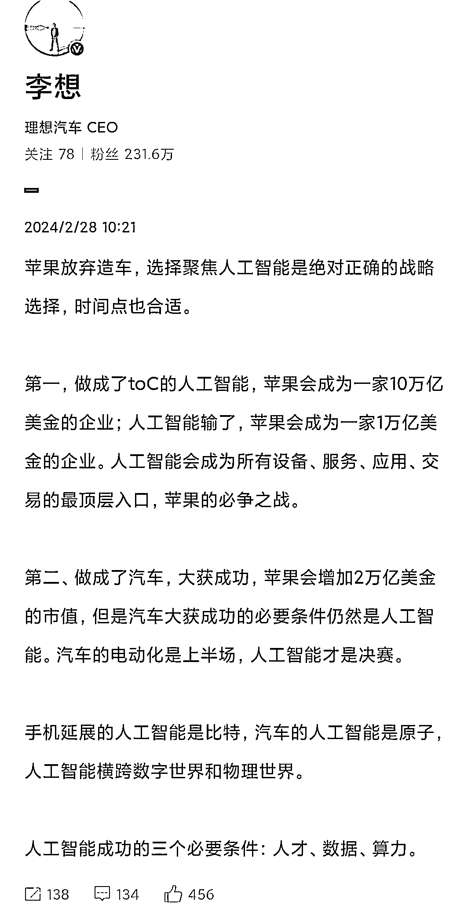
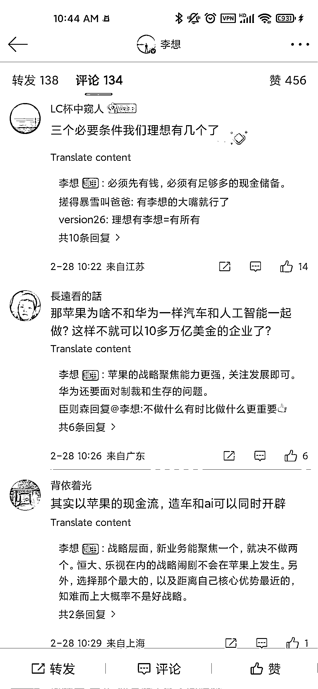

# 人工智能成功的三个必要条件：人才、数据、算力。

> 原文：[`www.yuque.com/for_lazy/thfiu8/oge5va6cfta95zpw`](https://www.yuque.com/for_lazy/thfiu8/oge5va6cfta95zpw)

## (19 赞)人工智能成功的三个必要条件：人才、数据、算力。

作者： 亦仁的收藏夹

日期：2024-03-08

人工智能成功的三个必要条件：人才、数据、算力。

* * *

评论区：

暂无评论

* * *