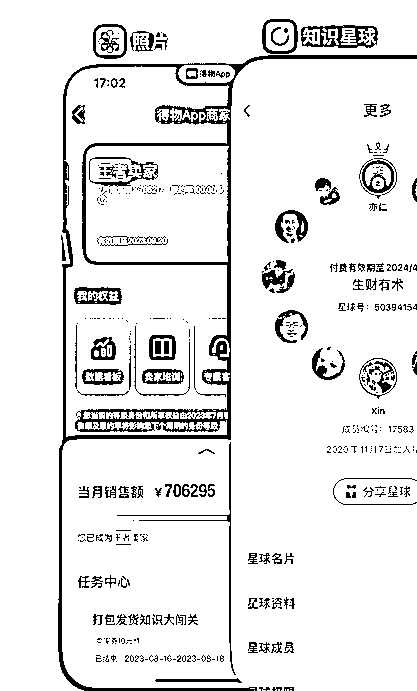

# 关于普通职场人到自由职业的一些经历和感悟

> 原文：[`www.yuque.com/for_lazy/thfiu8/gry0z0kgn2isuu44`](https://www.yuque.com/for_lazy/thfiu8/gry0z0kgn2isuu44)

## (50 赞)关于普通职场人到自由职业的一些经历和感悟

作者： Xin

日期：2024-03-01

大家好，我是 Xin，潜水多年了，第一次发帖。

背景信息：93 年，前程序员，做过亚马逊运营，后来自由职业，一个人倒腾了几个月亚马逊，失败了；得物电商赚了第一桶金，也尝试了小红书，闲鱼。这里我将分享自己的一些经历和感悟。

我是 12 年到厦门读大学，毕业后做了 4 年的程序员，Android 开发，因为学习左耳朵耗子叔的极客时间的课程《左耳听风》而认识@Y024，因为有共同的爱好篮球而有了更多的交流，2020 年的某一天，Y024 送了我一张门票，我才得以进来生财，感谢🙏。

## **一、亚马逊**

接触生财后，看了很多东西，其中比较看好亚马逊电商，看了几乎所有亚马逊的文章，特别是**seven，小焦，Lenry，Lissa 林氧氧，Edwin 等前辈的文章都追了好几遍，让本就一直崇尚自由的我跃跃欲试。**当时我自己的想法是在厦门这座城市做程序员给我带来的收获，不是我想要的，我就决定离开 it 行业，先去学习一些东西，找了一家亚马逊电商的公司做运营，大约一年后就出来单干了。

时间来到 21 年 11 月，一开始自己尝试开发产品，因为完美主义的拖延，和供应商交流也很小白，加上怕亏钱，想花最少的钱试错，我花了 4-5 个月，做了 2 个产品，上架，出极少的单，清货离场，没有得到积极的反馈。**这个过程钱是省下来了，时间却浪费了，却不知道时间才是最重要的资源！**

这个自由职业头开了很不好，家人的态度也从默许，到质疑，这几个月非常难受，也把自己搞的很没有信心。这个时间点，偶然得知，朋友在做得物电商赚零花钱，而且对象也经常用得物购物，这个事情，吸引了我的注意力，并开始实操。

## **二、得物电商套利**

2022 年中旬左右，慢慢发现利润率还不错，**感觉可以类比投资理财，项目逻辑很简单，低买高卖。**大学的时候做过类似的事，在淘宝和虎扑卖球鞋，赚了一年的生活费，一度沉迷虎扑，虎扑后来孵化了毒，也就是现在的得物，不知道为啥这么多年没再去关注这个平台，估计是程序员那段职业生涯的我过于封闭了。

得物电商的机制是官方运营商品详情，我们只能供货，没有卖家店铺的概念，价低者先卖，除了价格还包括卖家等级，履约率等参考因素来影响出售顺序。当然你也可以自己开发产品入驻得物，这是另外一件事情。总体和亚马逊还是挺相似的，这项目和亚马逊 OA，temu，tiktok 全托管等是有一些相似的地方，核心在选品+供货。

**得物平台塑造的是专业鉴定机构+潮流的形象，使得他的一些品类的销量和售价都比较高，给了卖家机会。**

1.  卖什么？什么熟悉卖什么，多平台比价，大品牌，小品牌，最好都是品牌商品，因为品牌自带流量，容易流通。鞋服包美妆都可以，只要有套利空间，只要是正品低瑕疵率。

2.  如何起量？类似批发，找一些有资源的人拿货，先款有风险，得自己判断，做好风险管控。也可能遇到杀猪盘，养肥了再杀，因此风险控制很重要。

3.  如何看销量？得物卖家中心有货值计算，可以看周销量和月销量。

4.  被得物判定瑕疵退回了，怎么办？一般都是略亏一点出给用户或者同行，回款比较重要。

5.  采购后行情凉了怎么办？选择一，快速回款，选择二，不信邪的就囤着，有时候等几个月会出现 100%～200%回报率的“奇观”，大家都没有货，你有货，就有了定价权，当然也可能更低了。

那段时间利润挺稳定，出单迅速，选好品，采购，闪电入仓到得物，手机出价就可以。

后来，我眼看着，寄过去的产品几天，甚至一天不到就卖掉了，便不满足眼前，没钱拿货了，就借钱上杆杠，这样做了一年多时间，一度成为王者卖家。

整个过程看着平台的规则不断改变，

1.  从各种吹毛求疵、放大镜鉴定（他们抖音直播间就用显微镜鉴定衣服，来告诉买家他们鉴定很专业，以此来推广，夸张啊），到不那么显微镜鉴定了，鉴定不过的时候，商品到付给你，也不一个个寄了，改成合并退了；

2.  不能转 95 分的产品也陆续可以转 95 分了；鉴定或者其他流程出错也给赔钱了；然后最近我发现，理赔变得非常困难了，连卖家券也不给了。

3.  平台陆陆续续推出更多的运费，打包费等等抬升卖家的成本；

4.  也逐渐看到一些同行出来说不好做了。

5.  我也发现项目后期很多产品不仅不赚钱，都开始略亏，甚至腰斩的怪象。我的判断是，我所掌握和拥有的信息，和资源优势已经随着时间推移逐渐凋零，是时候离场了。

应该是有大资金入场；也看到品牌方入场剔除中间商的趋势；

大鱼入场，大鱼吃小鱼，小鱼就慢慢没有了；

大部分小鱼，吃老本，没有足够精进，就会被慢慢淘汰；

少部分升级了，找到了新的水源。**比如因为高退货率延伸出来的修复行业，ip，培训**

## **小红书引流**

有段时间得物很严格，就有不少产品得走其他渠道，我也尝试做小红书引流，私域卖货，有效，但是不容易，好处是成交的用户一般都比较爽快，直接打钱，不好的地方是得常常接受询问，只能说当时的心态，得物走的太顺了，就没那么有耐心，因此后面也慢慢荒废了。

## **闲鱼**

闲鱼倒是一个不错的平台，佛系一点，价格低一些，一些产品运输破损，瑕疵严重的都能卖出去，这是我挺意外的。是一个不错的出货平台，当然也有人纯零售做的很好的，现在闲鱼也开始有条件有手续费了。

## **三、复盘**

### 可能**做对的事情：**

**判断好+下注+运气好，让我赚到了第一桶金，月均 5W+。**

现在想来，运气占了很大的比重，如果同样的动作放到现在来做，应该赚不到啥钱了。

抓住信息差，虽然起于偶然，但是花注意力在目标上。比如可以从小红书，闲鱼等平台去找，然后进各种群，蹲着，看别人怎么说，一个关键词，一个关键词解锁。其中可能会有一些人“卖”信息差或者是服务商，去观察这类人可以获取新的信息。

**和别人分润，控制好风险。**

我相信先打钱拿货的被骗的不在少数。一路上丢货，货被偷，被人骗的事也是不少，但是整个过程下来，基本上都在预想之内，也可能是运气真的好。

### 可能**做错的事情：**

1.  自由职业的过程是非常刻意的，不是说找到了项目而开始，而是暴破开始，现在看来有点过于激进了，因为后面一度因为收入问题多次想过要不要回去上班，并不好受；本可以在职场，做副业开始，但是毕竟没有重来，就讲不清楚对个人而言到底如何更好。

2.  做亚马逊项目，过早放弃，过慢的节奏导致太少的反馈。其实现在看来是那个结果非常正常的，我既没有专业的亚马逊背景，也没有像小焦那样的执行力和贵人相助，尝试的次数还不多，就中途下牌桌了，失败是非常正常的，**后来我在 Lenry 的社群看到他给个人卖家的建议大意是有多少钱办多少事，比如 5 万块钱资金，5 个产品，前期定位 20%的选品成功率，以此参考，可见一斑。此外，在遇到问题的时候，明明可以更多的“找贵人求助”，但是我做的很少。**

3.  在顺的时候，没有为可能不顺的未来准备 Plan B；

4.  放弃编程的继续学习，挺长一段时间看生财都少了；

## **四、感悟**

1.  自由职业，自由的是分配时间的权利，不自由的是需要一直在路上，怕也得走，摔了还得走，没有退路啦，那就勇敢一点，把事做成。

2.  这个过程照顾好家人的情绪，相当重要，**没有家人的支持，有心无力，难成事**。

3.  照顾好自己的情绪也非常重要，我本身是个很内耗的人，看一些哲学相关的内容，帮助不小，比如王德峰教授的课。

4.  不要随意辞职，现金流非常重要，做好 1 年不赚钱的准备比较好，当然，也可能如王健林所说的那样，清华北大不如胆子大，反正我们都是结果论的，对吗？

## **五 、现状**

1.  现在我已经逐步从得物项目里离场了，又出现了空档期，**又站在的选项目的十字路口，与之前不同的是，这一次我的干粮带的多了一些。最近老大的这两个问答又激发了我的许多思考，同时也激励着我：**

[应该选择一个自己比较熟悉但是壁垒比较低的项目去快速拿到结果；还是选择一个自己完全陌生但壁垒很高的领域去学习呢？](https://wx.zsxq.com/mweb/views/topicdetail/topicdetail.html?topic_id=188152285114152&inviter_id=15422121251822&share_from=ShareToWechat&keyword=17ELeidej)

[人到中年如何选项目？](https://wx.zsxq.com/mweb/views/topicdetail/topicdetail.html?topic_id=211452525121151&inviter_id=15422121251822&share_from=ShareToWechat&keyword=17tSztM6S)

1.  当你选择空间很小的时候，“一定要做好取舍，不能又要短期有反馈，又要长期有价值，还要自己擅长，还要自己喜欢。只选一个维度，然后往猛的干。”；

2.  当你还有选择的时候：“如果你是新手，没怎么赚到过钱，那优先选择门槛低长期空间不大的项目去拿正反馈，建立起信心很重要。**如果你有经验，赚到过钱，****有心力扛过长期不赚钱的阶段****，那可以选择长期空间大但起步比较难门槛较高的事情。**有没有壁垒不是你现阶段最核心要考虑的，长期能赚多少钱是需要优先考虑的，这个问题想清楚之后，下一个阶段才是构建壁垒。对应赚钱的三个阶段：如何赚钱？ 如何赚大钱？如何持续赚大钱？ ”

参加了几个航海，看了很多精华帖，接下来大概会做以下的项目，

1.  公众号流量主，反馈快，可以短期也可以长期，；

2.  Youtuber，出海赚美金，长期项目，反馈慢；

3.  亚马逊电商，一直想做，没做起来，长期项目；

4.  海外工具站，长期项目，老大看好的项目；

加油⛽️

* * *

评论区：

江帅 : 我也看好海外工具，准备长期投入，我们可以链接交流
狂热革命 : 海外工具站＋1，可以链接一下吗？
一缕青丝烟 : 加油[呲牙]
博鱼 : 感谢分享
哲别 : 感谢分享
土豆嘻嘻嘻 : 如何链接您？
Xin : 好的
Xin : 私信我

* * *