# 如何打造你的百万黄金人脉

> 原文：[`www.yuque.com/for_lazy/thfiu8/gqspr6m7vhd7ihp4`](https://www.yuque.com/for_lazy/thfiu8/gqspr6m7vhd7ihp4)

## (109 赞)如何打造你的百万黄金人脉

作者： 弗兰克|《多卖三倍》

日期：2024-02-27

今天分享的是黄金人脉管理方法，用这套方法，帮助我的万元客户成 1 单 50 万的转介绍，帮助我做顾问的客户，6 个月变现 200 万。

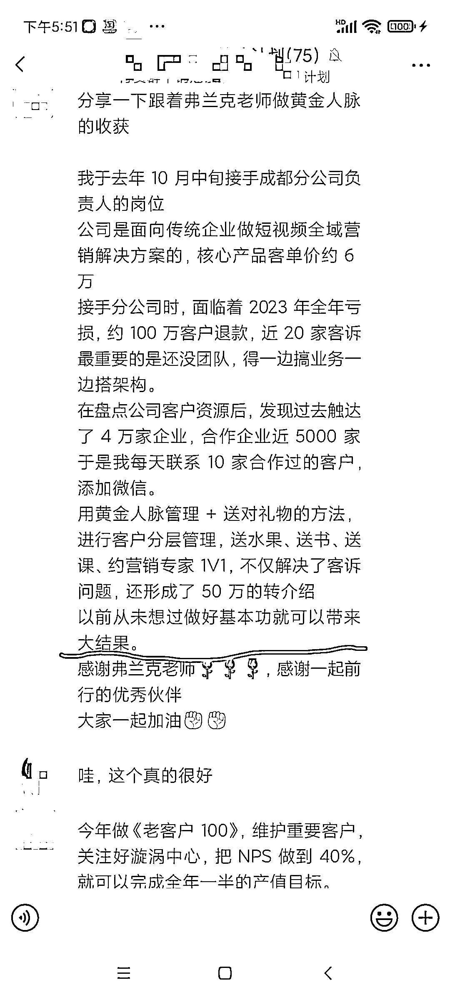

用这套方法，我介绍了一个武汉老板加入生财项目合作，同时，用这套方法，客户主动打 10 万。

这套方法，为此我去申请了知识产权。用好这套方法，能够帮助你在 2024 年多赚 10-100 万。（如果你使用得当）

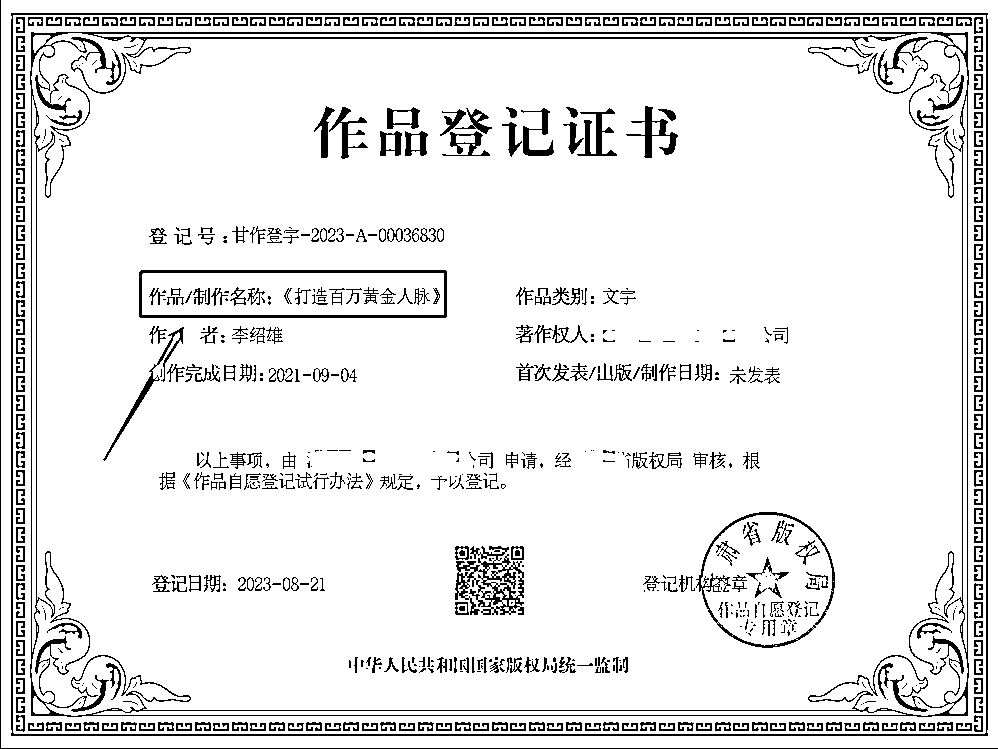

生财有很多老朋友，大家多多交流，如果你看到这篇经验贴，**觉得有用，需要给你的团队做进一步分享**，可以私信我。

对了

> 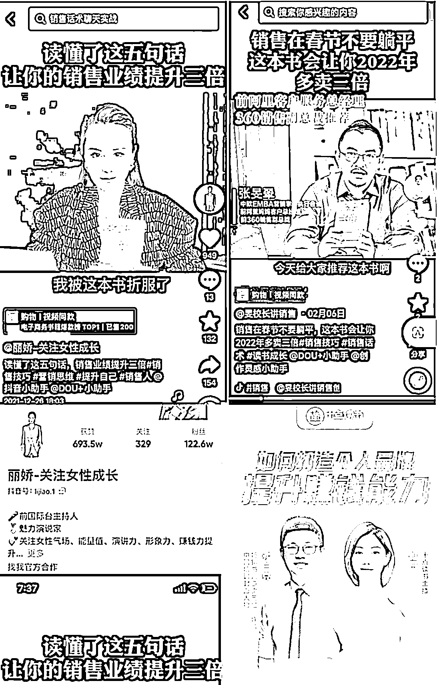
> 
> --------------塑造价值结束，正文开始--------------
> 
> ### 相信你在社交过程中，一定会遇到很多的痛点，常见 3 个痛点
> 
> 我总结了一套高效的方法，让你更加高效的社交，身心解放，业绩倍增，多卖三倍。
> 
> 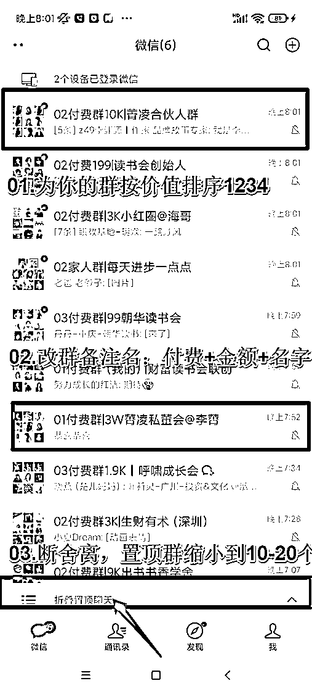
> 
> ### -------------方案 1，就是上面这张图-------------
> 
> 我的观点很简单，有三点
> 
> > 上面那张群信息管理图
> > 
> > 你可以照着梳理你的群
> > 
> > 确保你能看到重要的
> > 
> > 你需要的信息
> > 
> > 见到你想见到的人
> > 
> > 找到重要且你需要的资源和机会
> > 
> > 管理群的信息，我有 3 个原则
> > 
> > > #### 幸福=健康 X 财富 X 关系
> > > 
> > > 你可以按照这个公式为你的群排序，哪些人很重要，哪些财富机会很重要，为你的群排序。
> > > 
> > > 为什么要排序
> > > 
> > > 因为当群里有信息
> > > 
> > > 而且有大量的信息
> > > 
> > > ### 当群跳到最顶部，如果我看到是 04，我就知道，没有那么重要
> > > 
> > > 如果是 01,02，我的关注，会进去看看一下，发生了什么事情
> > > 
> > > 尽最大可能
> > > 
> > > 节省自己注意力
> > > 
> > > 不要在免费群花太多时间
> > > 
> > > 不要在 9.9 的群花太多时间
> > > 
> > > > 机会都是你管理出来的
> > > > 
> > > > 同时
> > > > 
> > > > 你需要取消所有个人聊天的置顶
> > > > 
> > > > #重要的事情说三遍
> > > > 
> > > > 你需要取消所有个人聊天的置顶
> > > > 
> > > > 你需要取消所有个人聊天的置顶
> > > > 
> > > > 你需要取消所有个人聊天的置顶
> > > > 
> > > > 操作完成之后
> > > > 
> > > > 你会远离信息苦海
> > > > 
> > > > 远离未读消息 999+
> > > > 
> > > > 你会获得更加幸福的人际关系
> > > > 
> > > > 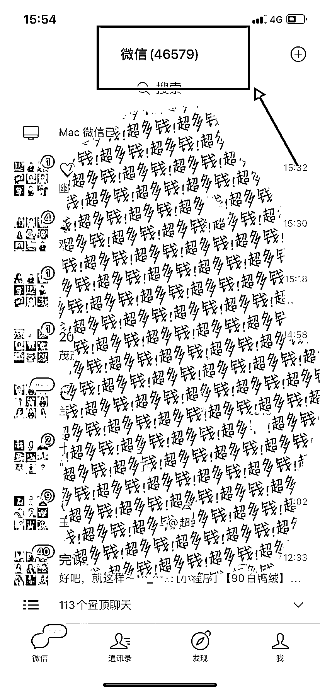
> > > > 
> > > > #### -------------**上述操作，通常需要 1 天**-------------
> > > > 
> > > > 上面分享的是
> > > > 
> > > > 非常基础的 1.0
> > > > 
> > > > 只有你开始有意思管理你的注意力
> > > > 
> > > > 管理有信息和人脉
> > > > 
> > > > 你才会理解黄金人脉的核心
> > > > 
> > > > 然后你会进入到
> > > > 
> > > > 百万黄金人脉管理的 2.0
> > > > 
> > > > 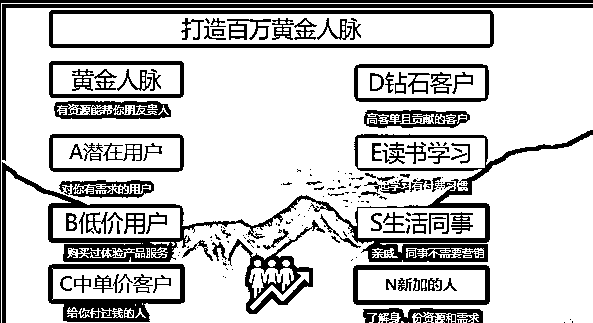
> > > > 
> > > > ## --------百万黄金人脉 2.0--------
> > > > 
> > > > 上面这张图
> > > > 
> > > > 从左到右
> > > > 
> > > > 从上到下
> > > > 
> > > > ### **第一，关注 10 个黄金人脉，每周去关注他们动态和需求，和他们建立深度关系**
> > > > 
> > > > 你最应该关注的是黄金人脉
> > > > 
> > > > 要借力
> > > > 
> > > > 要借势
> > > > 
> > > > 要杠杆
> > > > 
> > > > 而不是自己一个当老黄牛，默默努力
> > > > 
> > > > 陌生人
> > > > 
> > > > 社交场合认识的人，需要很长时间建立信任，才会彼此打开，共享资源
> > > > 
> > > > 在经历了很多事情之后
> > > > 
> > > > 我发现
> > > > 
> > > > 真正无条件给你支持的人
> > > > 
> > > > 往往是少数几个人
> > > > 
> > > > 而且是
> > > > 
> > > > 帮助过你的人，还会再继续帮助你
> > > > 
> > > > 然后
> > > > 
> > > > 我研发了这一套
> > > > 
> > > > 百万黄金人脉的方法
> > > > 
> > > > 自用
> > > > 
> > > > 并分享给我的客户们
> > > > 
> > > > ### **谁是你的黄金人脉呢？**
> > > > 
> > > > 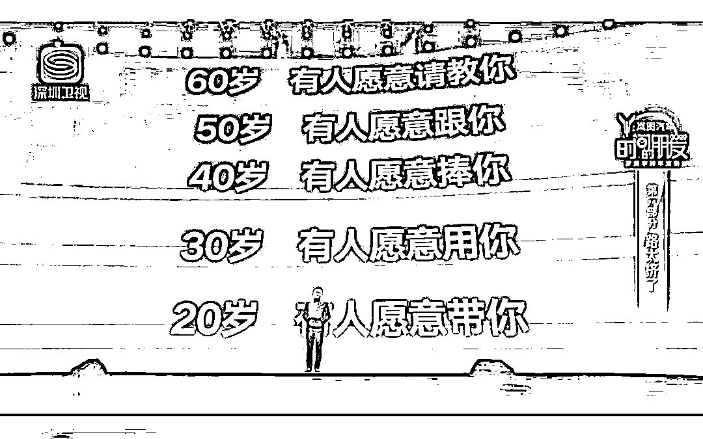
> > > > 
> > > > > 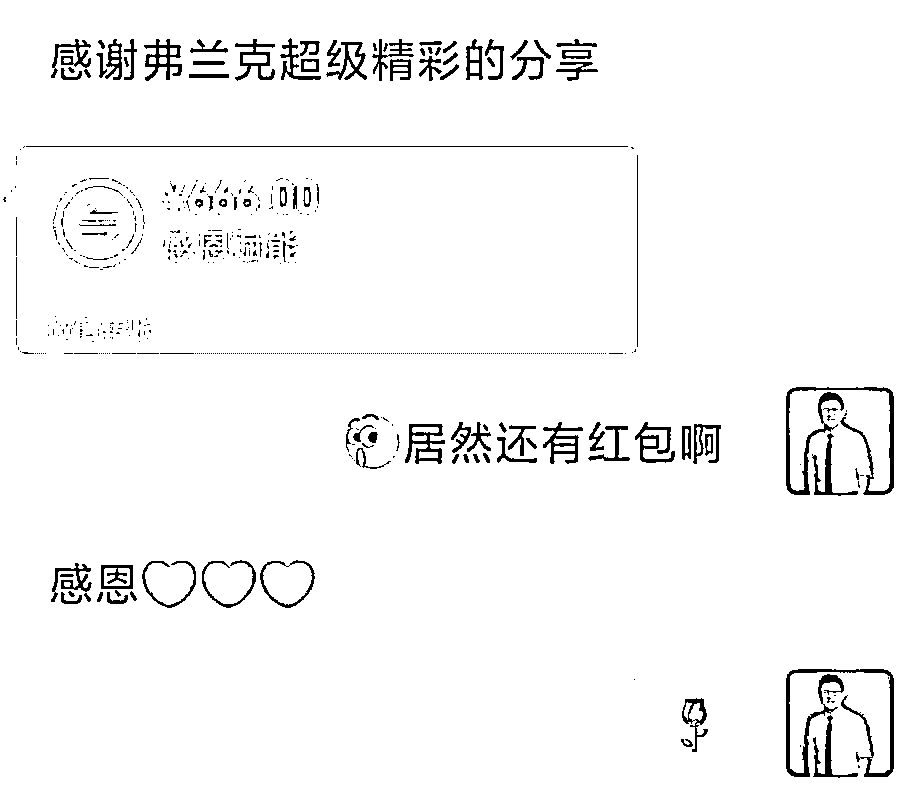
> > > > > 
> > > > > 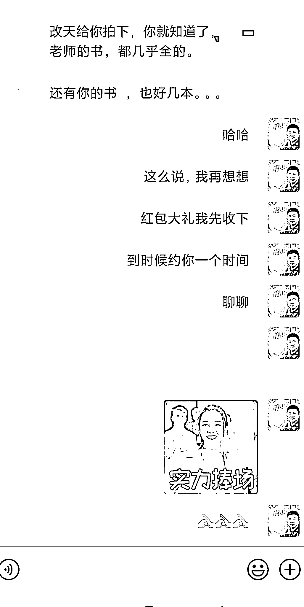
> > > > > 
> > > > > 经历了很多人
> > > > > 
> > > > > 经历很多事情之后
> > > > > 
> > > > > 我突然明白
> > > > > 
> > > > > 我最应该做的，应该是关注黄金人脉，关注我的小孩和家庭
> > > > > 
> > > > > 所以
> > > > > 
> > > > > 传给你 2023 年 2 月份开始
> > > > > 
> > > > > 我开启
> > > > > 
> > > > > **#每天帮助一个人** 计划
> > > > > 
> > > > > 去帮助我的黄金人脉
> > > > > 
> > > > > 和可能的潜在黄金人脉
> > > > > 
> > > > > 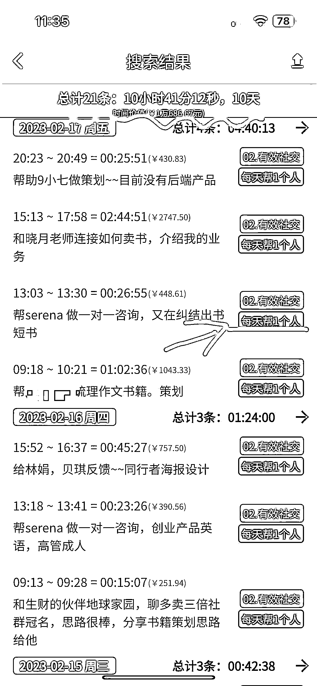
> > > > > 
> > > > > 为此
> > > > > 
> > > > > 我专门做了
> > > > > 
> > > > > 横幅挂在办公室
> > > > > 
> > > > > 提醒我自己
> > > > > 
> > > > > 不要贪
> > > > > 
> > > > > 要真的每天帮助一个人
> > > > > 
> > > > > 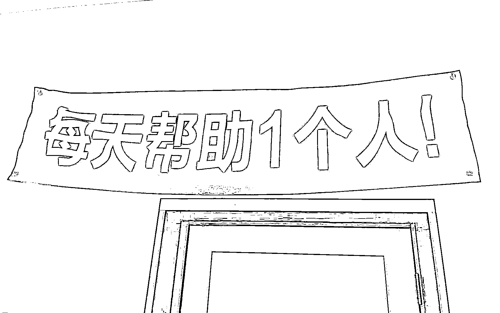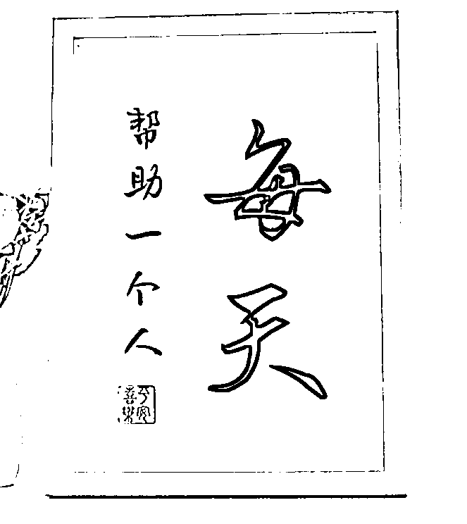
> > > > > 
> > > > > 希望这套方法
> > > > > 
> > > > > 能帮助到你
> > > > > 
> > > > > 让你身心解放
> > > > > 
> > > > > 更幸福
> > > > > 
> > > > > 同时多卖三倍
> > > > > 
> > > > > 业绩倍增
> > > > > 
> > > > > 黄金人脉
> > > > > 
> > > > > 非常重要
> > > > > 
> > > > > 核心就是关注 20%的人和事
> > > > > 
> > > > > 找到 20%的机会
> > > > > 
> > > > > 然后聚焦
> > > > > 
> > > > > 做好一件小事
> > > > > 
> > > > > 持续做好一件小事
> > > > > 
> > > > > #### --------黄金人脉梳理，通常需要 1 天--------
> > > > > 
> > > > > ### 第二，去备注梳理你的潜在用户，可能对你的产品和服务感兴趣，咨询过，有需求但现在还没买，有购买能力但是现在还没下决定，都去梳理和备注，名字备注 A
> > > > > 
> > > > > 通过管理黄金人脉，主动打 10 万客户，就是刻意管理出来的
> > > > > 
> > > > > 通过问自我介绍，了解到对方的需求
> > > > > 
> > > > > 然后备注
> > > > > 
> > > > > 分享有用资讯
> > > > > 
> > > > > 过年送问候等方式最终他决定找我做顾问，付费 10 万
> > > > > 
> > > > > 具体细节
> > > > > 
> > > > > 如果你需要
> > > > > 
> > > > > 可以做团队分享
> > > > > 
> > > > > 很多人不重视潜在客户
> > > > > 
> > > > > 请一定要梳理
> > > > > 
> > > > > 回顾
> > > > > 
> > > > > 哪些人你忽略过
> > > > > 
> > > > > 哪些人有购买实力，但是当初没有下决定
> > > > > 
> > > > > 现在把他们找出来
> > > > > 
> > > > > ### 第三，去标注 给你付费，买过你书籍，买过你 9 块 9 的伙伴，在他们的名字前面+B
> > > > > 
> > > > > 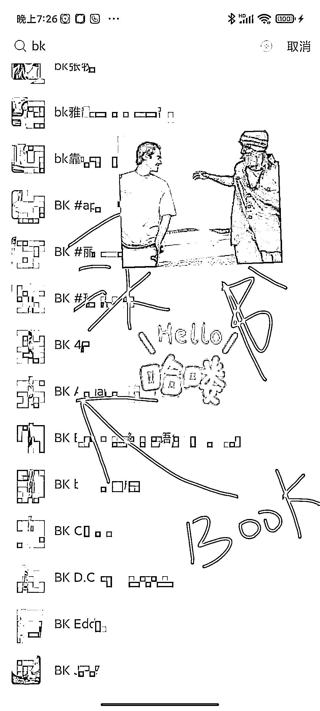
> > > > > 
> > > > > ### 第四，去标注 在我们这里花过钱，几百元，几千元，标注 C，万元级别的客户可以标注 D
> > > > > 
> > > > > 我用的是 ABCD
> > > > > 
> > > > > 最简单的管理方法
> > > > > 
> > > > > 当然
> > > > > 
> > > > > 你也可以形成你自己的体系
> > > > > 
> > > > > 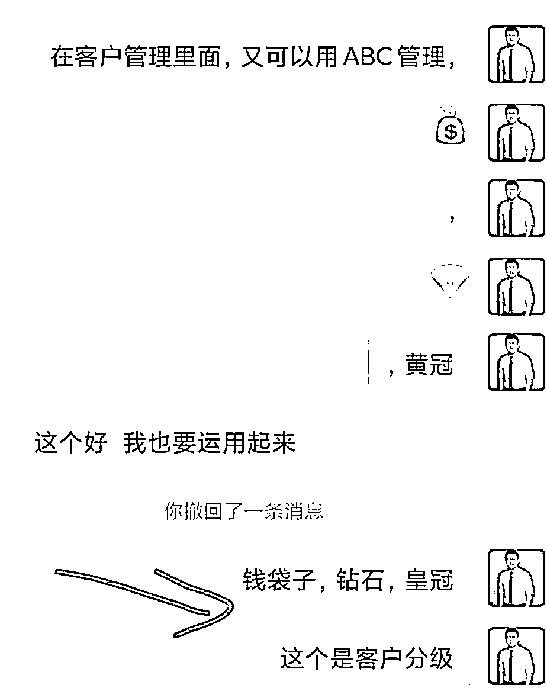
> > > > > 
> > > > > **客户管理是一个公司和一个团队的核心**
> > > > > 
> > > > > 在用这套方法之前
> > > > > 
> > > > > 我听过很多分享
> > > > > 
> > > > > 看过很多大团队的会员管理，客户管理的方法
> > > > > 
> > > > > 要么他们太复杂
> > > > > 
> > > > > 要么不适合我自己
> > > > > 
> > > > > 最后我决定关注 20%的人和事
> > > > > 
> > > > > 用 ABCD 来管理
> > > > > 
> > > > > 其他共同爱好，付费学习，同时，新加的人，可以参考下图，对与新的名称，请一定要一开始就定义好，然后执行到底，不要随意改动。
> > > > > 
> > > > > 
> > > > > 
> > > > > 相信看到这里的很多老板
> > > > > 
> > > > > 有一些心动
> > > > > 
> > > > > 这里我要特别提醒
> > > > > 
> > > > > 如果你已经有自己的体系
> > > > > 
> > > > > 不要轻易改动
> > > > > 
> > > > > 还没有自己体系的伙伴
> > > > > 
> > > > > 可以尝试在我的体系上改进
> > > > > 
> > > > > 比如
> > > > > 
> > > > > 我的客户会生活和生意分开成两个独立的微信等等
> > > > > 
> > > > > 还有客户
> > > > > 
> > > > > 把所有高付费客户导入到创始人微信
> > > > > 
> > > > > 自己管理
> > > > > 
> > > > > 其他的交给销售或者服务人员
> > > > > 
> > > > > 请仔细品味
> > > > > 
> > > > > 百万黄金人脉的底层逻辑和核心
> > > > > 
> > > > > ----------最后的最后----------
> > > > > 
> > > > > 希望你用起来
> > > > > 
> > > > > 如果你有更好的方法或者方案
> > > > > 
> > > > > 欢迎在评论区留言
> > > > > 
> > > > > 一起交流
> > > > > 
> > > > > 精进
> > > > > 
> > > > > * * *
> > > > > 
> > > > > 评论区：
> > > > > 
> > > > > 左烨紫 : 学到了[嘿哈]
> > > > > 故事、自己写 : 学到了，感谢分享
> > > > > 张文波 : 受教了，非常有用
> > > > > 田春先 : 微信这么一操作，终于没那么焦虑了👍
> > > > > 执 笔 写 洪 顺 : 学到了，感谢分享
> > > > > 阳光心橙 : 学到了，感谢！
> > > > > 叶湘伦 : 受教
> > > > > 叶湘伦 : 学到了很多，感谢分享
> > > > > 
> > > > > 
> > > > > 
> > > > > * * *