# 纯萌新也能玩转的小项目

> 原文：[`www.yuque.com/for_lazy/thfiu8/tcd34z23xfrpn3mv`](https://www.yuque.com/for_lazy/thfiu8/tcd34z23xfrpn3mv)

## (187 赞)纯萌新也能玩转的小项目

作者： bink

日期：2024-02-27

嗨，我是 bin，一如既往的为社群的萌新们送上实操中出来的无门槛小项目，希望大家都能实操起来，收获属于自己的第一个正反馈。

**本项目对于纯纯的小白非常友好，不需要你懂任意什么专业知识，成本投入之类的，都不需要，行动起来就可以做。**

1-25 的一天，偶然看到很好的朋友在用自己账号发布台球相关内容，而且第一天播放量就很不错，于是这个项目就正式开始启动了，初期他并没有意识到这是一个多么好的赚钱机会。

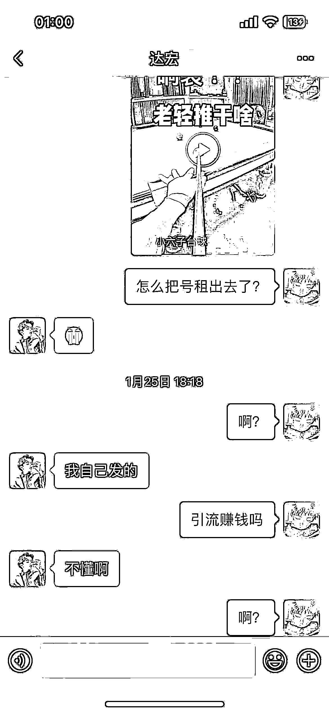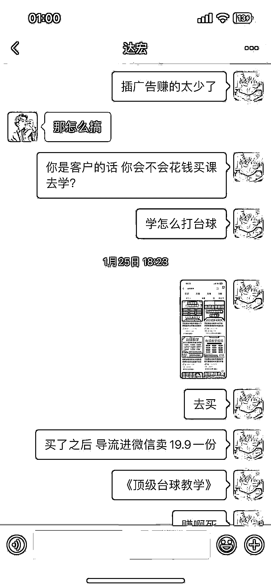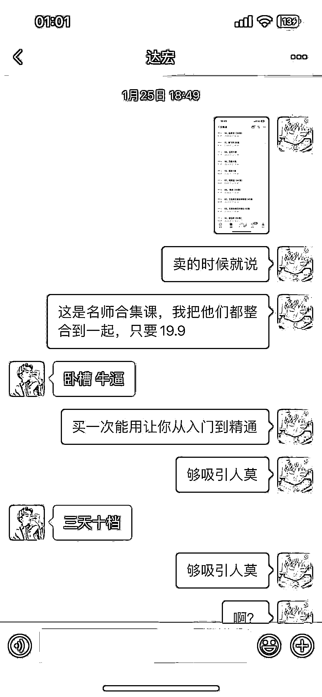

而作为一名实战老油条，当然知道这其中对于普通人来说有多么大的机会，虽然只是小钱，但是积少成多嘛。于是在当天我就给他弄好了变现的产品，并且第一天就有了成交。

## **那么话不多说，接下来进入我们的实战。**

**项目原理**：通过从抖音搬运的台球教程视频到视频号，从而用课程资料的形式吸引部分潜在用户进行购买。

**优势**：没有什么成本，每一份售卖的课程都是纯利润。素材根本搬运不完，因为这一类的视频实在是太多了。

只要行业不死，就永远会有需求

**劣势**：侵权风险。当然这里搬运的时候进行二次创作，以及账号的相关定位需要非 IP，这些都不是很大的问题

课程成本加起来没有超过五块钱，我定的售价是 19.9 一份

那么在售课的基础上，我还给加上了卖货的利润，因为我发现加过来的客户这一块的需求也是有的，既然有需求，那么我们在私域里就相当于是即将到手的钱，事实证明，我们真的把杆子卖出去了。

所以这个项目的利润组成由：视频原创收益，卖课收益，卖货收益，网盘拉新收益（在测中）

在视频号的基础上，我又安排上了小红书，没想到小红书的收益也还可以，先上一波收益图。

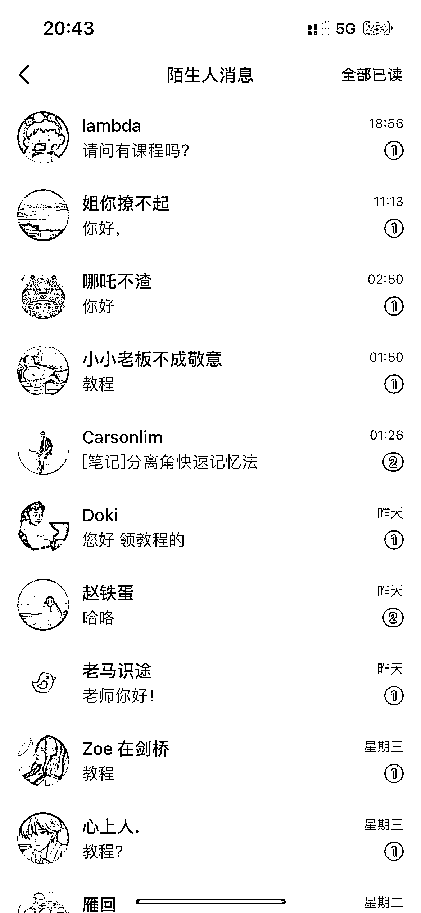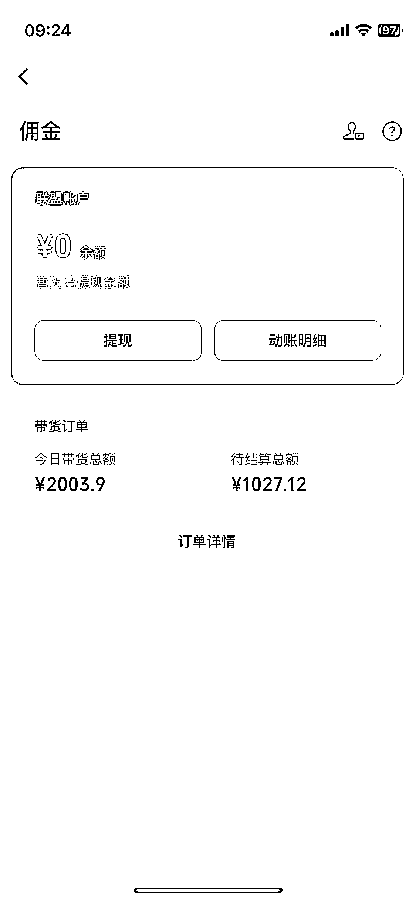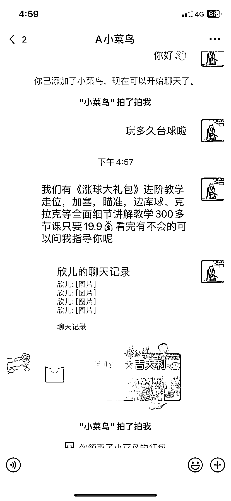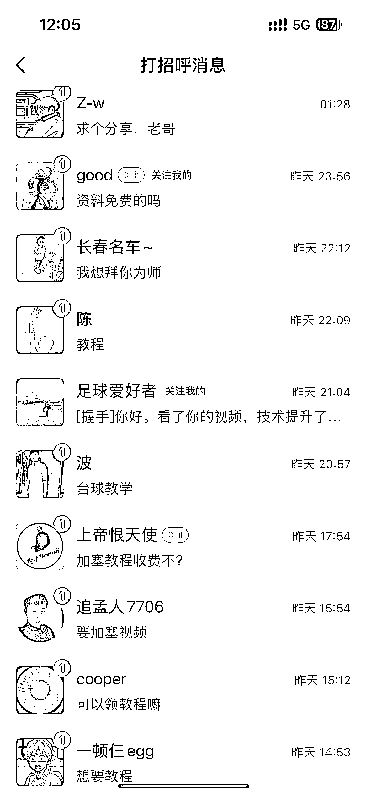

**开始到现在的综合收益应该已经超过 5000 了，光是课程就卖了 200 份。整体下来感觉还是不错的，因为这也算是在囤私域，还是垂直领域的私域。**

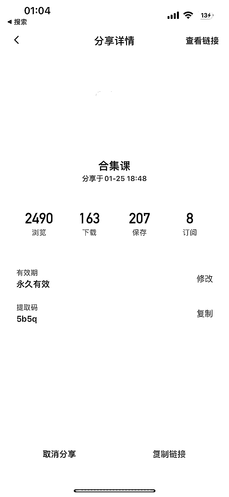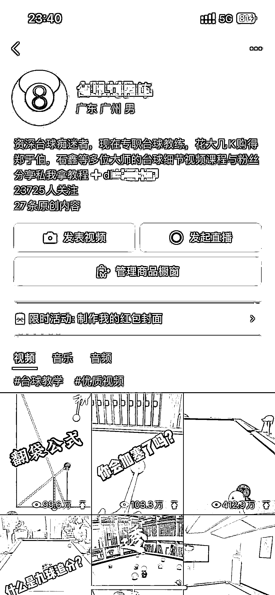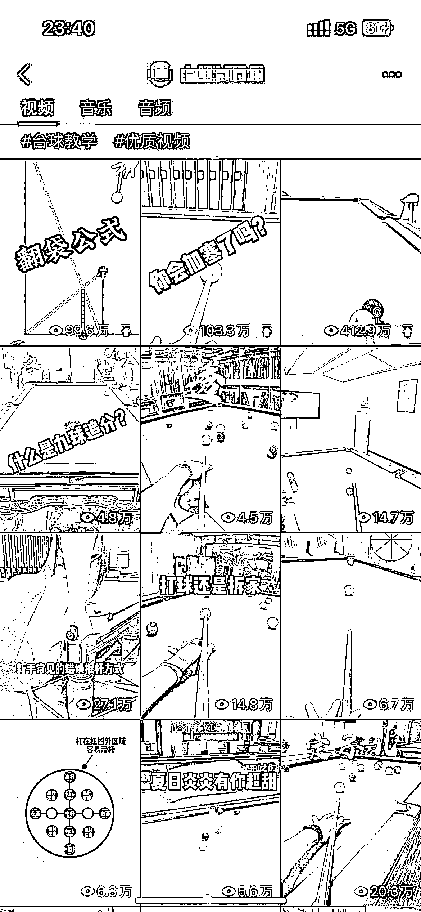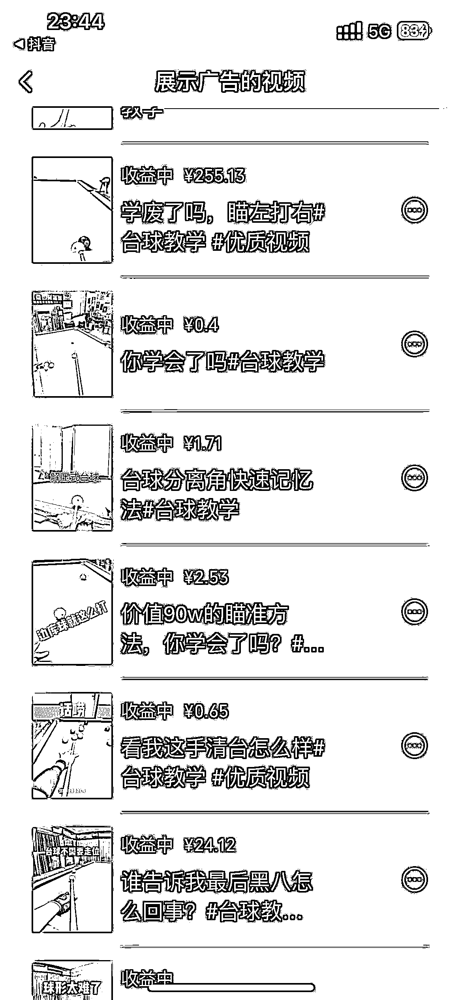

## **具体步骤**

**1.视频号的包装**

关于视频号的包装非常简单，头像用台球做为头像，而不要用抖音大 V 的照片，然后名字用台球教练的身份就可以，

**营造出一种是台球综合爱好者的感觉，因为你不能只搬运某一位博主的视频，你需要多维度的去搬运一些教学视频，混合发布就行。**

重点：视频发布完成以后评论区置顶引导的话术，比如说“想要学习准度的主页找我” 或者是让他私信你，然后你在后台私信回复引导他加微信

这句话非常重要，他直接影响你的整体导向，以及跟你的卖课收入是直接挂钩的。

这里还可以结合网盘拉新的玩法，做一波白嫖党的利润出来，具体步骤大家可以去看看关于网盘拉新的文章，然后按步骤生成推广文案既可 比如说“打开头条极速版，搜索 xxx 台球，领取 xxxx 教程”

这里会有一部分的拉新收益，单个人头大概 8 块的单价，还算不错的

小红书同理

**2.微信私域的包装**

**微信的包装就有点讲究了。因为考虑到绝大部分的受众都是男性，所以我给设计了一个美女助教的角色，每天分享一日三餐的内容，以及每日的卖课反馈，比如说会以早上性感照，下午卖课反馈，晚上高档场合的组合发朋友圈，关于朋友圈的内容，直接去小红书搬运既可**

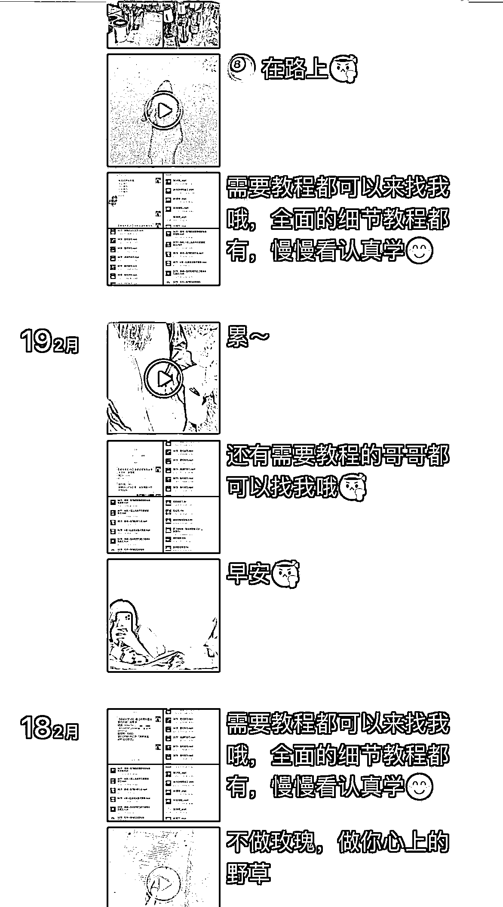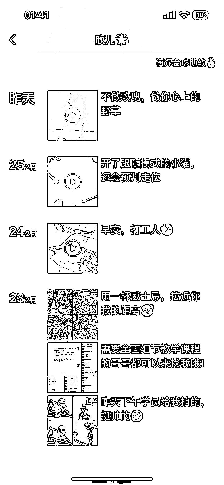

**发一些男生爱看的，然后提高触达率**

**3.课程链接的准备**

课程是这个项目最简单的一环，可以直接去淘宝搜合集，几块钱一个，拍下来保存再转发就行。

或者可以直接用我已经做好的链接

【尊敬的超级会员 V5】通过百度网盘分享的文件：合集课

链接：https://pan.baidu.com/s/1nablduEXeT_yEK4dez035w

提取码：5b5q

复制这段内容打开「百度网盘 APP 即可获取」

**完成这些步骤之后，直接从抖音找相关素材进行简单加个滤镜二创就能发布到视频号以及小红书上面了**

**然后等着回复私信，微信里面进行卖课既可**

**视频开启原创，还能有广告收益，相当于是多一种收入来源，而且这个行业是不会死亡的。需求会一直存在**

## **项目收益的延伸**

 在微信进了大概 1k 个客户之后，潜在的高客单需求也浮出了水面

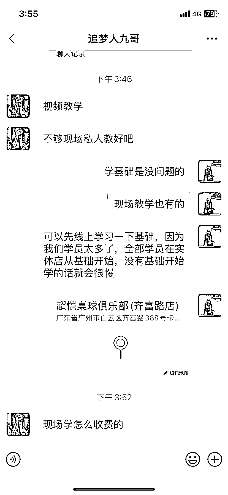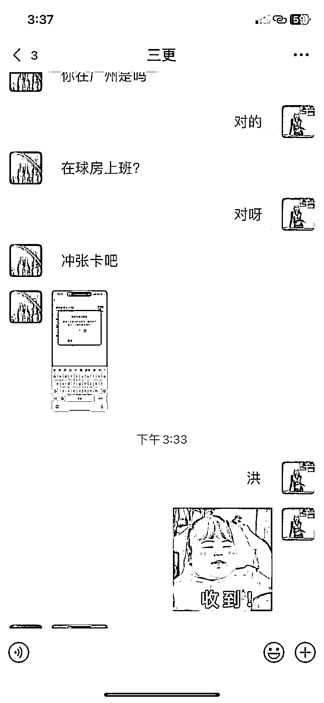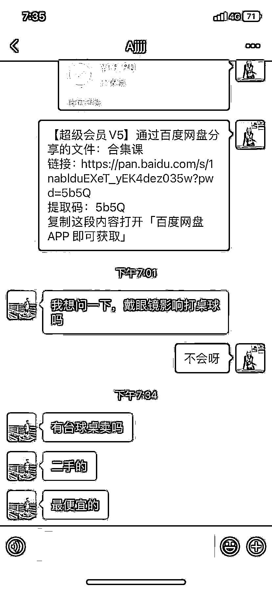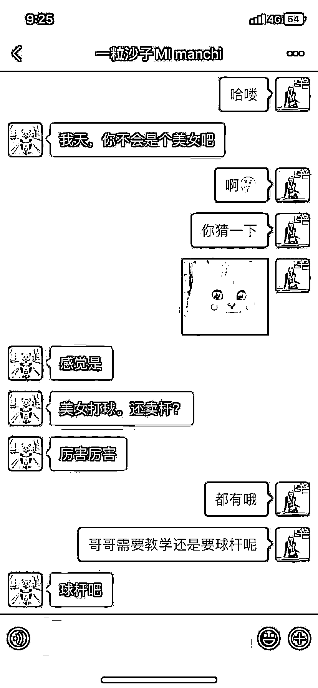

**1.线下教学**

**2.球房充值**

1.2 其实都可以考虑跟球房合作，然后分润就行，刚好我有个朋友做助教的，了解了一下大概是 98 一小时，然后有同城的客户直接选择转账预充值 2000，当然这个钱没收，因为当时还没谈好合作

或许这个项目对同城球房的老板们能有一些启发，正反馈告诉我，这种引流方式是可行的，而且现在的球房基本都是靠美女助教的卖点在进行揽客

**3.二手球桌买卖**

**对于一些相对爱好深重的客户来说，二手球桌他们还是很有兴趣的，这里可以通过同城的闲鱼进行交付，当然这个客户找过来的时候是过年期间，所以后面朋友圈就没有怎么推荐，**

**4.球杆**

球杆是进阶型爱好者的重点需求，基本上有挺多客户都是过来问球杆的，有些客户还直接在橱窗里拍了杆子。我虽然不是台球爱好者，但是我是乒乓球爱好者，我非常清楚进阶型乃至狂热爱好者对于器材有多么的渴望。乒乓球拍一块木板售价都在一千以上，只有深度爱好者才会认同这个价格，比如我，已经买了四五块了。而且是有一定水平的人，这一类人通常属于高质量用户。

END

看到这里相信你已经非常了解这个项目是怎么运转的了，以及怎么样开始你的第一步，那么接下来感兴趣的话不妨行动起来。有台球相关器材的厂家欢迎与我联系。

* * *

评论区：

发发 : 这么好的项目我可得尽快执行了[旺柴]
烽火 : 非常好的一套 sop 流程
秋闯 : 真强
浪久 : 很棒
微光磊 : 感谢，非常细的分享[呲牙]
菜菜 : 亦仁刚买了一根 3w 的杆子
cm : 非常详细的 SOP[强]
bink : 实力啊

* * *