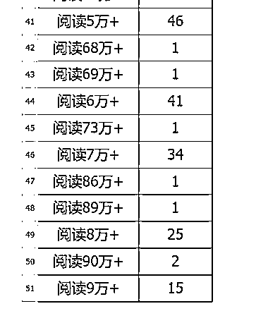
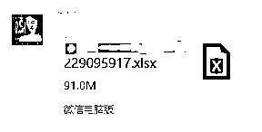
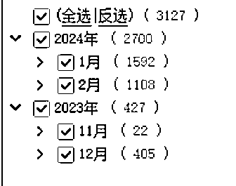
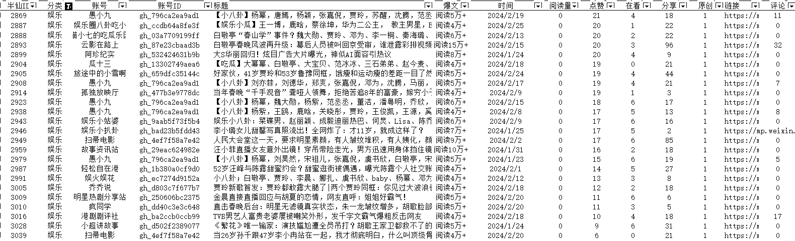

# 微信公众号爆文的一些有趣看法与观点

> 原文：[`www.yuque.com/for_lazy/thfiu8/og8vbwa30ngmayoa`](https://www.yuque.com/for_lazy/thfiu8/og8vbwa30ngmayoa)

## (31 赞)微信公众号爆文的一些有趣看法与观点

作者： 赵半仙

日期：2024-03-01

项目拆解  白日依山尽，我是赵天应
黄河入海流，素材不用愁
大家好，我是人送半仙的素材魔法师赵天应
今天，我用 2024 年 2 月挖掘到的微信 20 万推荐文章，继续给大家讲一讲微信公众号爆文的一些有趣看法与观点

一、基本数据
1.基础数据。
（1）来源
本次，通过素材挖掘机，挖到近 30 万条微信公众号推荐数据，注意，绝大多数是微信推荐的相关文章。
包括但不限于从微信公众号文章底部的相关文章、看一看和其他渠道获得的文章。总计有 91M。
（2）数据维度
数据涵盖了分类 、标题、是否爆文、发布时间、阅读量、点赞量、在看数、分享数、是否原创、原文链接、评论数、文章简介、高赞评论等。
[图片]
2.数据清洗
挖掘难免会有重复，以及很多流量低的文章，通过 RPA 自动化，一番清洗筛选处理后，几十万条数据，只留下 10%，个人简单粗暴地直接将 3 万及以下的文章全部清空。只余下 3127 条。
[图片]
3.数据分类
（1）日期分类
[图片]
几乎都是了近三个月内的数据。
由此，可以看到，微信推荐机制还是相对明确的，重点推荐三个月以内的数据。更重要的，核心是推荐 2 个月甚至 1 个月内的。
我这里显示有 4 个月，是因为横跨了 1 月 2 月均有数据抓取。
（2）行业/场景分类
暂时无法在飞书文档外展示此内容
前 10 名的，依然是大家熟悉的娱乐、时事、职场、军事、教育、情感、电视剧、生活、社会、科技等。
大家觉得卷的行业，其实，也是收益最多的。
二、半仙观点
基于以上这些数据，半仙有如下观点，与你探讨，不一定对，但提供一些不一样的视角。
1.公众号流量大爆发的日子已经过去了。
之前半仙随手一抓，都是大把大把的 10 万+甚至 100 万+的推荐文章，目前来看，要么整个腾讯公众号文章算法更新完毕，流量分散到更多文章上，要么流量被更多其他诸如抖音、微头条、小红书等分走了。
2.公众号最卷的行业和小众领域依然有机会。
于我们搞素材搞创作搞公众号甚至搞互联网的来说，似乎太多人加入到了这个行业中来。
但是，要知道，我们只是进入了一片树林，而整个世界的大森林太大了，我们知道的，还有 80%甚至 99%的人不知道。
最卷的行业，一部分人坚持不住，放弃了；一部分人没找到方法，做不好。还有一部分，持续做，命运的机会也就到了。
小众领域，结合方法论，结合 AI，使用跨界打劫，降维打击，过得很好。
3.AI 来了，提质增效成为必然。
有那么一句话说的是：只要一个动作重复三次以上就可以考虑让其自动化了。
还有一句话，是《唯有偏执狂才能生存》一书说的：
“我常常感觉有一朵阴云正向我飘来，但我可能需要再过几年才能弄明白它到底是什么。因此，我总是怀着诚惶诚恐的心情，小心翼翼地处理一切事物。“
我会认为，2024 年的这朵云，是 AI。所有的行业，结合 AI 都可以再走一遍。无论是以文生文，还是以文生图，还是以文成视频，每一个环节，结合到自己的行业，都可以有很多优化空间可做。
比如，公众号爆文，是不是有足够多的账号，是不是有自动化的流程可以管理，是不是有自动化的流程可以批量生产文章，是不是有 AI 可以辅助生产插图配图，是不是有流程可以分析文章内容质量，是不是能对文章或数据进行分词或数据拆解与拓展，太多事可以做了。
4.公众号爆文并非 100%靠实力的游戏。
公众号自改变算法以来，越来越向搜索引擎模式靠近，通过算法，去中心化，然后释放流量。
释放的过程中，很多人进行了拆分拆解，但有一点无疑是肯定的，这是一个暗箱与灰盒，核心算法不可能透露出来，只是猜想。
我搭建素材库的核心，也不过是用案例来说话，从更大的概率告诉大家，那些文章爆了，那类文章爆的概念更大。
公众号爆文也如此，不是一个完全靠技能说话的行业，至于技能占到 60%还是 50%还是 80%，或者 20%，得看情况。
你找到小众领域，略微努力，也许只需要 30%的技能，其他交给运气，也有很大流量。
如果你进入大众最卷的领域，也许需要付出 80%的技能，另外 20%交给运气。
当然，大众领域里你也可以先做选择题，再做解答题，进一步拆分出细分赛道。降低你技能的权重，而提升运气的权重。
5.在能赚钱的时候抓紧赚钱。

更多，请链接半仙的飞书文档
目前而已，还能做，如果没有更好的项目，可以抓紧入场，先做起来，先赚到，再赚多，再稳赚进而多赚。
如果永远停留在场外，那都与你无关。[`owd2uo0wwxk.feishu.cn/docx/ASdbdh86eoGIDexMRspc4B8anPd`](https://owd2uo0wwxk.feishu.cn/docx/ASdbdh86eoGIDexMRspc4B8anPd)

* * *

评论区：

大侠 : 自己写 python 爬取的吗？
赵半仙 : 公开工具加私有工具
大侠 : 能推荐下麽
毫末 : 这个数据感觉有问题，体育类爆文 4 个月只有一篇过 5 万阅读？
大家还是仅作参考吧
赵半仙 : 根据推荐源头不一样。样本量不相同。
张翼 : 请教个问题，这里数据超过 10w+的，是怎么看到的呢？我目前看到都是最多 10w+的
赵半仙 : 还有千万的。

* * *