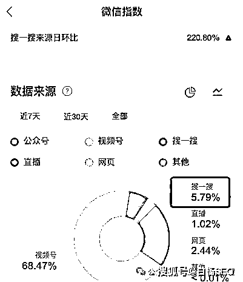

# 微信搜一搜里文章排名靠前，但没什么人看，什么原因，怎么解决？

> 原文：[`www.yuque.com/for_lazy/thfiu8/utfxc7oxsk1xu7m9`](https://www.yuque.com/for_lazy/thfiu8/utfxc7oxsk1xu7m9)

## (15 赞)微信搜一搜里文章排名靠前，但没什么人看，什么原因，怎么解决？

作者： 白杨 SEO

日期：2024-02-28

这个问题来自白杨 SEO 群的一个群友向我提问：

“文章排名靠前，没什么人看，这个情况该怎么破？”

假如这个问题抛给你，你该怎么回答？你可以先留在自己脑子里，往下看，看看和你想的有多少相同？

白杨 SEO 补充：其实这个问题它提问时还差了一个头，就是哪个平台的文章排名靠前他没有说，后面聊天问到才知道说的是**微信搜一搜**上。

好，我们先来拆解这个问题。

**先要说一下排名靠前与排名第一的区别**

问题中说排名靠前，肯定不是第一。要么第二，要么第三。就像一个人不是清华北大毕业的，说 TOP3 毕业的，因为这个 TOP3 的第三不一定一样。

所以如果是第一，就不会说排名靠前。假如是百度或者谷歌搜索引擎的话，排名第一与排名第二、第三以及后面的被用户点击的比例，那差别很大。据说排名第一的点击率是排名第二的 2 倍，排名一二是后面前 8 排名点击总和。

做我们这行懂的人就知道排名第一的重要性！但是，问题就是，不管是哪个平台，排名第一这个不是你想第一就第一，哪怕是做数据！因为你的同行也都盯着这个第一！

行业小秘密：如果某人说，你做某个平台保证你的排名第一，内部有人之类，99%都是套路。

**再说一下文章排名靠前，没什么人看这点**

“文章排名靠前，没什么人看”从这句里的文章，其实可以大概率猜到不是百度或者抖音、小红书之类平台。

因为百度上一般会说网站或者网页，抖音会说视频，小红书会说笔记，所以大概率是公众号文章，当然也有可能是百家号或者今日头条文章。

没什么人看，他的判断依据应该是该文章的浏览量不多。所以他开始怀疑他做那个词到底有没有真实流量？

好，白杨 SEO 正式来说一下这个问题原因以及解决方法，附举例。

1、该文章标题里的关键词没有什么流量

我们做 SEO 知道，一些词竞争极少或者没人搜，没什么流量，只要布局就会有排在前面。比如，百家号运营怎么做？白杨 SEO 顾问收费之类的词。

解决办法：我们选关键词的时候，最好是用微信指数，有条件的用腾讯广告里查词月的搜索量看看。（看微信指数时一定要看搜一搜占比）

另外，可以针对这个有流量的词至少发 3-10 篇，而不是只发一篇文章。如果是长尾词，就多发文章。

2、该文章标题里的关键词太宽泛，没有提到用户痛点

比如一些热门的事件或者电视剧什么的，你写的标题只是命中那个关键词，比如繁花。又或者你写的用户知道的常识之类。

解决办法：如果是要做精准的搜索流量，我们就尽量找准用户的痛点词。怎么找，很简单就是微信搜一搜下拉。比如我要写小红书排名这个话题，如图

3、该文章标题太普通，没有什么可以吸引用户点击的点

很多人写文章标题就是，XXX 怎么样，XXX 好不好，完全没有占在用户角度来写。

解决办法：要想吸引用户的点击，除了命中用户的痛点以外，还要加一些会让用户行动的词，比如干货，收藏，必看。有些人还会加一些具体数字，如 18 种，大全之类的。

4、该文章首段内容没有吸引或者与标题无关

用户除了看标题还会看里面缩略这个内容，有可能是你缩略的内容不行。

解决办法：就是在首段一定要点明主题，我举个最简单截图，你就懂了。

看懂了吧，我的排在第四，那个排在第一。当然，白杨 SEO 写文章有时也不是完全为了微信 SEO，因为我还要考虑用户体验和品牌。不然，为什么我以前的文章标题前都加白杨 SEO 呢，哈哈哈。

5、该文章的配图没有多少吸引力或与文章主题无关

很多人做公众号文章搜一搜流量，不重视这个封面配图，甚至有时配图完全无关。

解决办法：要么自己设计，要么去找 AI 生成你想要的。重点一定要关注那个 1：1 那个地方（下图），因为搜一搜结果都看那里。

6、排名第一的解决了用户的需求

不管排名第一的是广告，还是视频，还是你同行的文章，但它已经解决了用户的搜索需求，所以你的排在第二或者第三就没人或者少人看了呗。

解决办法：你可以努力让自己的文章排名第一。啥，怎么让自己的文章排名第一，上面 5 个点的解决办法你都要做到。同时你还可以给你这个文章做一些好的数据。

比如文章阅读量，点赞，在看，留言，分享，你都可以让一些朋友分享啥的。对吧？

当然，切记不要用软件去耍文章阅读，有可能会适得其反！

如果你说，我还不知道微信搜一搜这个公众号文章的排名规则啥的，你看一下我写过的这两篇：

[白杨 SEO：微信公众号 SEO 搜索优化排名规则原理和实操举例](http://mp.weixin.qq.com/s?__biz=MzU2NTQzMzA4Nw==&mid=2247483924&idx=1&sn=f9852c99e01614a5e09463dc5e393470&chksm=fcba8584cbcd0c9290d0f8970eb754d8ae26dccf442de3d09ae7373c4e4a0562026992c9e457&scene=21#wechat_redirect)

[解密搜一搜！微信搜一搜算法机制和搜一搜 SEO 排名规则是什么？举例](http://mp.weixin.qq.com/s?__biz=MzU2NTQzMzA4Nw==&mid=2247495262&idx=1&sn=73c10672d228fe56921e8ce30e54a401&chksm=fcb969cecbcee0d8e8a887a8a6349f13219c8b0696ee5c1acb7bf0ca8767b6bef131ce49177e&scene=21#wechat_redirect)

白杨 SEO，专注 SEO 十年，全网 SEO 流量实战派，对互联网精准流量有深入研究。全网同名个人品牌：白杨 SEO。

* * *

评论区：

暂无评论

* * *