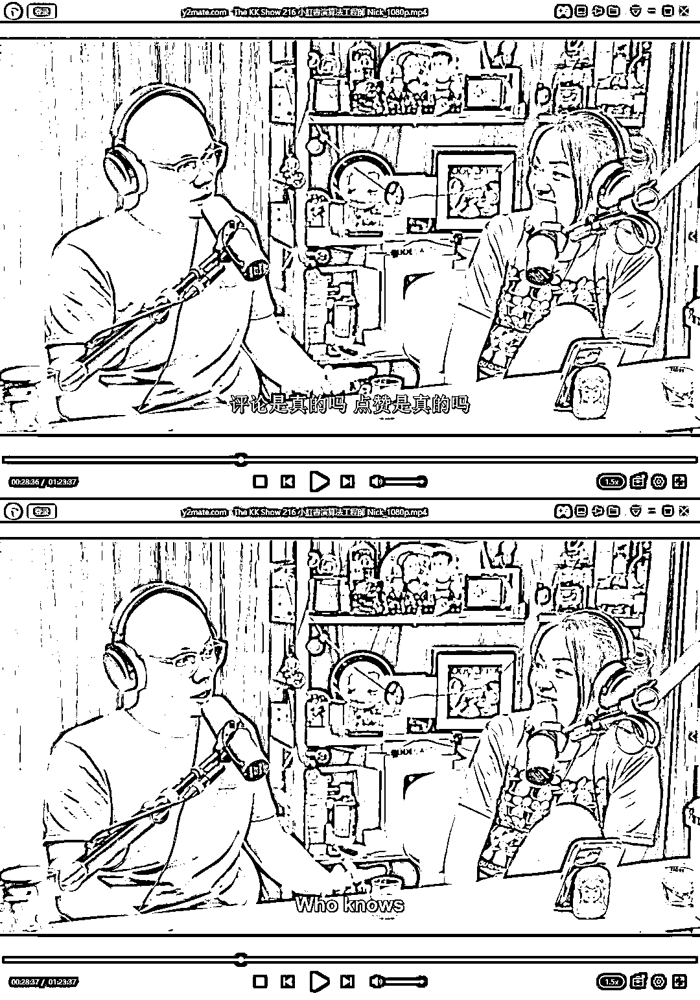

# YouTube 上 前小红书演算法工程师的访谈，一些比较有价值的观点

> 原文：[`www.yuque.com/for_lazy/thfiu8/xfygmh4kw6c9t23u`](https://www.yuque.com/for_lazy/thfiu8/xfygmh4kw6c9t23u)

## (41 赞)YouTube 上 前小红书演算法工程师的访谈，一些比较有价值的观点

作者： 林歌

日期：2024-02-29

花了 3 个小时，仔细看完 YouTube 上 前小红书演算法工程师的访谈，

得出一些比较有价值的观点，分享给大家，

1、用小红书时间久了，会发现，刚跟朋友说完某个产品、想要去某地旅游，转头打开小红书的推荐就刷到了，怎么做到的？

2、演算法如何帮助平台更多赚钱？

3、推荐算法的工程师角度去看流量玄学这件事？

4、浏览平台内容时，哪些数据会被系统记录下来？

5、小红书平台有哪些反直觉的数据？等等

详情请看飞书文档

[`qnfoes1o78.feishu.cn/docx/DqqBdmi6RoBjynxX7UfcJlaCn3c?from=from_copylink`](https://qnfoes1o78.feishu.cn/docx/DqqBdmi6RoBjynxX7UfcJlaCn3c?from=from_copylink)

* * *

评论区：

博鱼 : 感谢分享

* * *