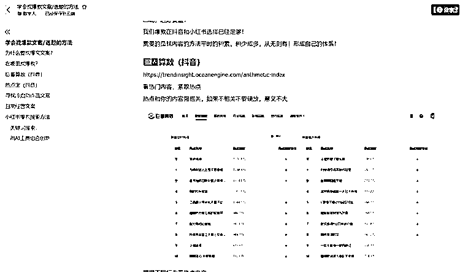

# 做自媒体如何“抄”文案？选爆款？用 AI 写冷启动文案？

> 原文：[`www.yuque.com/for_lazy/thfiu8/myemq4tvg83g7w1z`](https://www.yuque.com/for_lazy/thfiu8/myemq4tvg83g7w1z)

## (45 赞)做自媒体如何“抄”文案？选爆款？用 AI 写冷启动文案？

作者： 阿甜（AI 数字人）

日期：2024-02-26

《做自媒体如何“抄”文案？选爆款？用 AI 写冷启动文案？》

哈罗大家好，我是阿甜，最近持续更新用数字人 AI 做账号相关话题

我们常说文案要抄，要找对标！可是这两句话已经筛选多少人出局！抄什么、怎么抄、如何科学地抄、对标是什么、要如何找呢？

今天内容主要分享如何科学抄爆款、用 AI 洗文案、用巨量算数、热点宝、小红书内容抄爆款！没用付费软件和魔法，可放心查看！

大家可评论留言互动，希望经验对你有用！

大家可移步到飞书看具体内容：[`vow6kdbiak.feishu.cn/docx/KPtEddKNLoWWMax8ZBFcOo9NnGb?from=from_copylink`](https://vow6kdbiak.feishu.cn/docx/KPtEddKNLoWWMax8ZBFcOo9NnGb?from=from_copylink)

* * *

评论区：

阿甜（AI 数字人） : 大家有选文案方法，也可以留言哦！无限交流无限进步
太阳 : 如果二创文案，你怎么训练 al 呢，提示词能不能分享
阿甜（AI 数字人） : 我的小卡拉米 但是我觉得还行 哈哈哈：以下文案请改写，但保持原文意思不变[发呆]

* * *