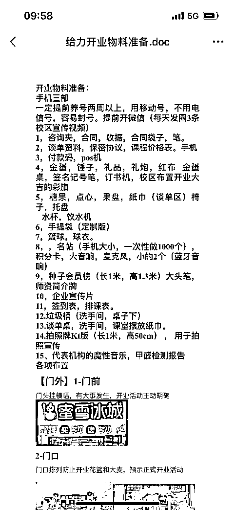

# 教培又行了？靠一次火爆开业让校区快速回本

> 原文：[`www.yuque.com/for_lazy/thfiu8/dgfb9o0xv8e7qn71`](https://www.yuque.com/for_lazy/thfiu8/dgfb9o0xv8e7qn71)

## (25 赞)教培又行了？靠一次火爆开业让校区快速回本

作者： 爱莲老师

日期：2024-02-29

做过校区的都知道，双减+疫情之后，教培机构就很容易死掉。但凡事也没有定论，只要开业开得好，最快 3 个月也能回本。比如我曾经就靠一场开业活动，把营收做到了 300 万。

对于新机构来讲，与其空守一月几万块的固定成本，不如想方设法把钱花出去，招到更多学生。

所以今天我准备从选址、到种子用户、到宣传渠道，再到开业活动等各个环节，来聊聊新校区开业时实现快速回本这件事儿。

教培机构的群体，目标用户基本差不多。只要是新的校区或者新的流量，就可以用验证过爆款活动重复去做，老流量就是用新的活动，新的噱头或者角度去做，只要产品足够好，再加一点发售技巧基本没问题。

感恩生财提供的机会，有幸和大家交流分享教培新校的开业。

大家好，我是爱莲老师，10 年的教培人，百万教培校长。之前一直做英语赛道，双减前最高峰开了 6 家校区，去年一直青少年体能运动馆开业。

一次火爆的开业就可以让校区快速回本，其中有个校区一开业就回本，一开业就做了 300 多万。好多校区因为开业开得好 3-6 个月回本。从校区得选址筹建到新校种子用户得招募和开业火爆营收整个过程我做一个具体分享。

欢迎做教培的朋友交流更多开业和周年庆营收爆破的方法。

2023 年，10 月份刚好给泉州石狮做了一次热闹的开业，以这个校区的开业准备时间为轴回顾整个开业的过程。

**新校情况：**这个是石狮运动馆第三个分校，校区的团队是全新的，从校长到前台，老师，销售都比较新，经验比较少需要培养。

校区位置有点偏，离商圈 1.5 公里，离最近的小区 1 公里。由于租金成本比较高，去到 2 万，人工成本也比较高，5 万（有 9 个员工）。

所以预约我们团队来开业，希望能快速回本。新机构就是要考虑一个月的几万的成本怎么花出去，让多些学生来体验。因为没有学生，一个月的人工和水电租金成本都是固定的。

**一、新校开业分三个阶段**

**（1）新校筹备期**

新校筹备期，最关键的就是选址，一定要严格按照选址要求。好的选址就像好的出生，一出来就具有天然的优势。出于对利润整体运营的考虑，教培机构目前比较好的选址在大型社区的集中点。

并且，同行竞品不超过 3 个，附近的群体比较匹配，消费得起品牌得课程。当然校区尽量做得漂亮大气上档次些。

选好地址后，就是和严格把控装修得质量和时间进度，装修时间长，相当于租金就多交了。装修好之前提前 1-2 个月招聘员工，特别是老师和销售，按照开业期得匹配去招聘。

**（2）新校种子用户招募 ，这阶段超级重要**

筹备期准备好了，校区装修好了+人员招聘匹配好了就开始招募种子用户。这个阶段非常重要，新校是没有客户沉淀的，所以种子用户，第一批体验用户的招募就非常重要，决定了后续校区的运营和现金流和人气。

需要注意得是，新校家长很介意甲醛和新校装修味道，祛除味道，甲醛，才开始招募种子用户。

这次开业我们用了线上和线下的招募方式，方式如下：

**1、地推招 188 元 6 次课 3-10 岁的体验生**

地推是教培新校或者实体店开业很有效的招生引流的方式，地推收上来的学生的质量和地推人员的素质和设计的体验课时相关。

这次石狮的开业，我们安排了 8 人的全职团地推了 5 天收了 300 人 188 的体验生，课时都是 6 次课体验的。

那么为什么要设置 188 元 6 次课呢，不设置其他价格？这个运动管的价格一年是 5000 左右，均价在半年的课时 90 元左右，所以地推引流的课时设置在常规价格的 3/1，这样吸引的家长才比较精准。

另外因为是新校设置 6 节课是最合适的，新校的品牌影响力小些，同时团队都是新的，家长需要多体验几次的信任度和效果好些，成交率也高些。

另外因为是新校人气非常重要，有 6 次课，让家长觉得一直看到学生上课，觉得人气很旺，对机构的信心就会越好。

如果是老校学位少些，课时成本比较大，就设置 1、2-3 次课。另外年龄的设定也非常关键，哪个年龄段的转化率高，或者会来学习，就招这个阶段的。教培结构像运动馆，3-7 岁是转化最好的，有时间，需要锻炼，再大些要不没意识，要不在其他地方学习了。

地推除了人员，课时价格很重要，同时要买一个吸引小朋友的礼品和产品相关的产品。比如运动馆 188 的体验课，还送了价值 188 的礼品：篮球和球衣，还有玩具礼物，这样地推的成交也简单些，高效些。

地推一般时间在 3-5 天，前 2 天主要是一对一地推，有第一波家长报名后，就送一些小礼品让家长转发朋友圈，转发附近的宝妈群。

这样新校的势能就会越来越大。地推需要注意的一个点：地推的位置要精准，离机构在 2 公里以内，越近越好，超过这个范围的不要地推，去好的幼儿园门口，小学门口，商圈，小区。支付力差的地方幼儿园和城中村不要去。来的流量是转化不了的

**2、线上渠道：异业合作，抖音同城招生**

除了地推我们还安排了 3 个小伙伴，专门去跑异业合作。比如谈附近 1 公里以内的宝妈，学生群体的异业，我们谈了附近的游泳机构和附近的托管机构，还有附近一个团购群的大团长。

这些异业合作给我们推了 50 多个流量。

很多同行问，要不要上美团，要不要上抖音，要不要异业合作，在新校流量渠道方面有效得都可以上，可以全渠道打开。只要符合机构支出的，新校开业最需要势能。

线上除了异业合作，就是线上的推广平台，美团，抖音，小红书。今年的抖音推荐同城流量也很不错，最好一开始地推就同时安排抖音带团购，如果机构精力够，最好做校区账号矩阵号，让家长觉得新机构很有品牌，很有知名度。

特别是双减+疫情后，很多机构运营不善。新校一来就是给家长信任的感觉，势能很好的感觉。这次的开业由于投资人非常喜欢用抖音招生，所以还没开校前就让我们开始运营了，做了好几个矩阵号，当家长一搜鲨鱼队长运动馆，出来了好多矩阵号，家长感觉是大品牌，信任度很高。

现在的家长消费习惯在线上，喜欢通过抖音和视频号去找自己需要的东西和品牌。所以教培机构或者传统的实体店，我们要跟上用户的消费习惯，除了线下渠道，必须增加线上渠道，这样我们获客的方法才能多起来，才有源源不断的客源。开业期间两周抖音的流量 100 的体验客户。

抖音可以找本地服务去做，也可以自己去做账号矩阵。如果是找本地服务商做，就安排宝妈类型粉丝来带课程。

**3、校区开业的业绩爆破发售期**

校区的第一批种子用户慢 200 人以后，到新校开业发售期，这时候我们作为总部开业团就带 4 人小团队下校助力做开业。

开业团下校之前，团长会在线上对接开业物料，一下校区就可以开始干活了。到校区后第一件事就是团队互相认识，培训开业的流程和每个人的工作分配，以上培训讲完后，就是根据用户数，拆解开业目标，通过喊口号等方式调动士气。

物料图片如下

**二、教培机构开业大发售分 4 个阶段**

**（1）名单收集，排课，分资源**

1.  分资源方面：越厉害的销售，分的资源越好，这样能保证资源最大的利用起来，大销售就能出大单

1.  排课方面：排课非常重要，根据当地的黄金时间段，最优的时间排给最好转化的年龄段。无论在英语还是其他艺培机构，最好转化的年龄段是 3-7 岁

**课表：（**盘点所有渠道，开业种子用户在老师排课能承受范围内越多越好，如果第一批种子用户不够，体验课中利用送课，奖品，礼物等再次裂变）同时布置开业环境

**（2）鸣枪示警**

在环境布置方面，就是高调告诉周边和学员我们准备开业啦，准备搞大活动啦。除了横幅，地毯外，我们现在还安排了金蛋桌子，礼花，喊麦

上了 1-2 次课后，   我们会朋友圈+群私法同步，发筛选微信，让意向的人举手，比如发：**校区开业啦，开业优惠，报多少送送多少，仅限前 30 名，感兴趣的回复 1

回复感受感兴趣的我们会优先邀约过来做咨询体验，深度挖掘需求。

**（3）预热阶段**

学校显眼处放品牌宣传，包括客户反馈，比赛，师资，平时上课活动风采等。

**（4）加速预热**

学校前台放金蛋处，安排托，每个黄金段都安排，砸完金蛋就喊麦。把场热起来。

**（5）脉冲发售**

开业当天，开放抢购名额。开业把所有有意向的邀约过来，越多人越好，显得热闹，同时安排留人的环境，比如安排小丑表演魔术，开业美食，开业礼物。

当天也会安排托砸金蛋，如果没有意向的场，就需要安排，无论是学生报名还是托报名都大声喊麦，并且让报名学生拍照拍视频，签名，把仪式感拉满。

一般会发售一周左右，只要举国手的，就紧跟，深度挖掘需求，测试支付力，看下考虑的点。只要不是钱的问题，其他问题都想办法去解决

这个节点，把控每个成交手的成交数据，做数据分析，做业绩排名，梳理意向名单。一单都不能漏。

活动最后 3 天，朋友圈+群私发，活动倒计时告知活动即将结束。同时现场同时喊麦高知所有在场的家长，那么确保活动的消息通知到每位家长。同时每一天下班前大家复盘，每个部门一起复盘，不断的调整，迭代。这样新团队也会成长很快。

那么一场开业发售活动做下来，种子用户够的情况下，至少完成回本的一半。开业后剩余一般的体验课，再用漏斗方案，不同的价格方案，陆续把学生收进来

以上就是一场设计好的开业发售活动，让多家校区快速回本的交流分享。

**三、那么开业新校开业的关键节点是什么，需要注意些什么呢？**

做大业绩的校区或者业绩校区好的都具备以下几个条件：

1、好的选址，就是好的出生，选址慎重，选好后可以让同行，让家长看一下。或者找专门的选址经理去选址，教培建议选优质社区店

2、好的师资，新的老师不怕，就是把教学服务培训到位

3、足够多的种子用户，体验用户，势能一下就能起来，新校最怕冷清

4、够大够漂亮的校区

以上是关键也是需要注意的，哪一点缺了，都会营销业绩营收

如果是老校，就是把周年庆的噱头设置好，发售场准备好，目标续费用户和新流量准备好，打一场有准备的仗。同时平时常规的引流做好，线上的引流方式一定要打通。

教培机构的群体，目标用户基本差不多。只要是新的校区或者新的流量，就可以用验证过爆款活动重复去做，老流量就是用新的活动，新的噱头或者角度去做，只要产品足够好，再加一点发售技巧基本没问题。

大家如果对内容有疑问，欢迎在评论区互动交流

* * *

评论区：

暂无评论

* * *