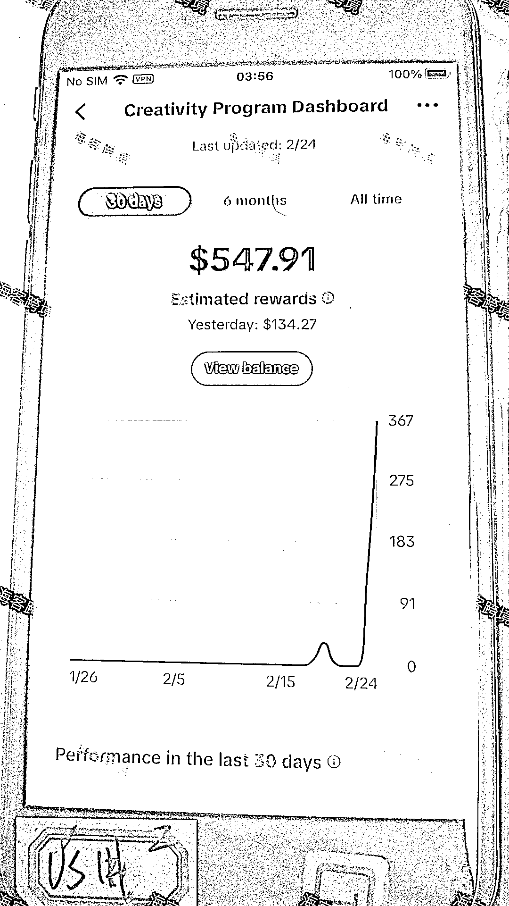
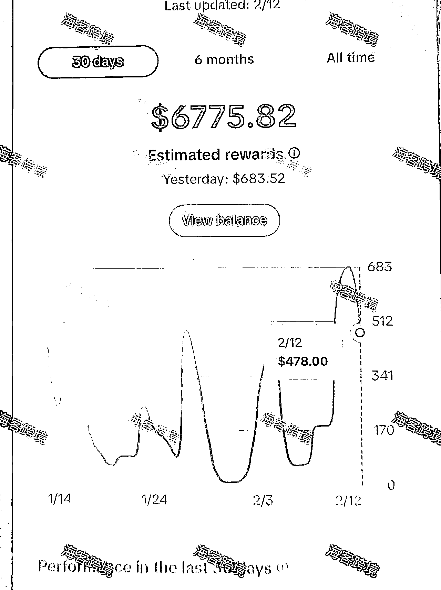
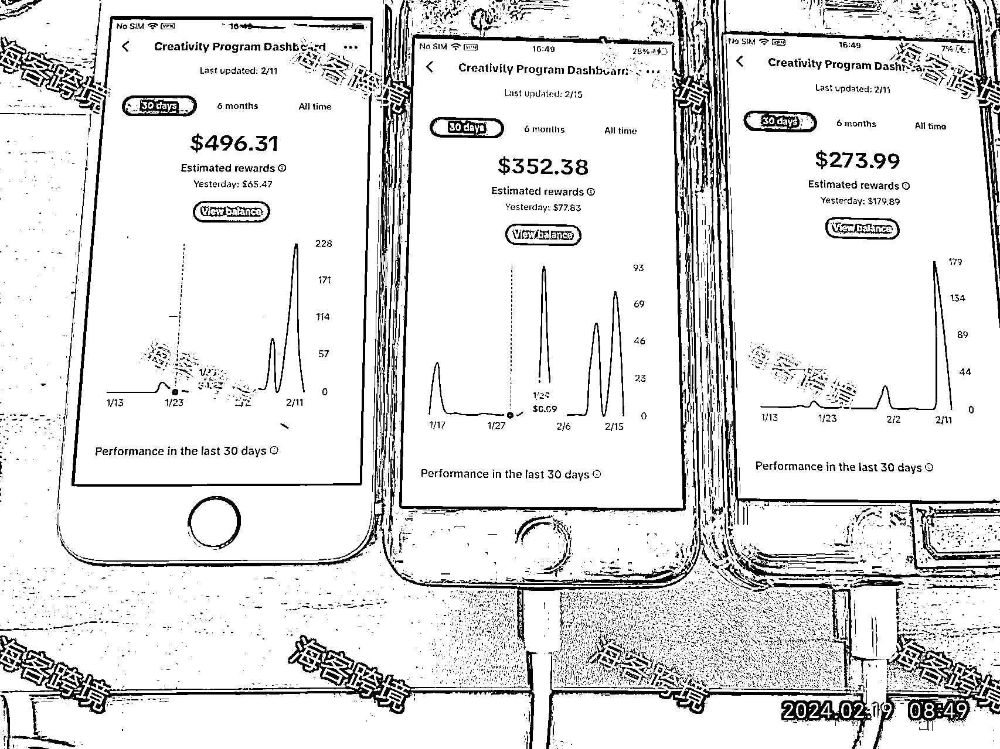
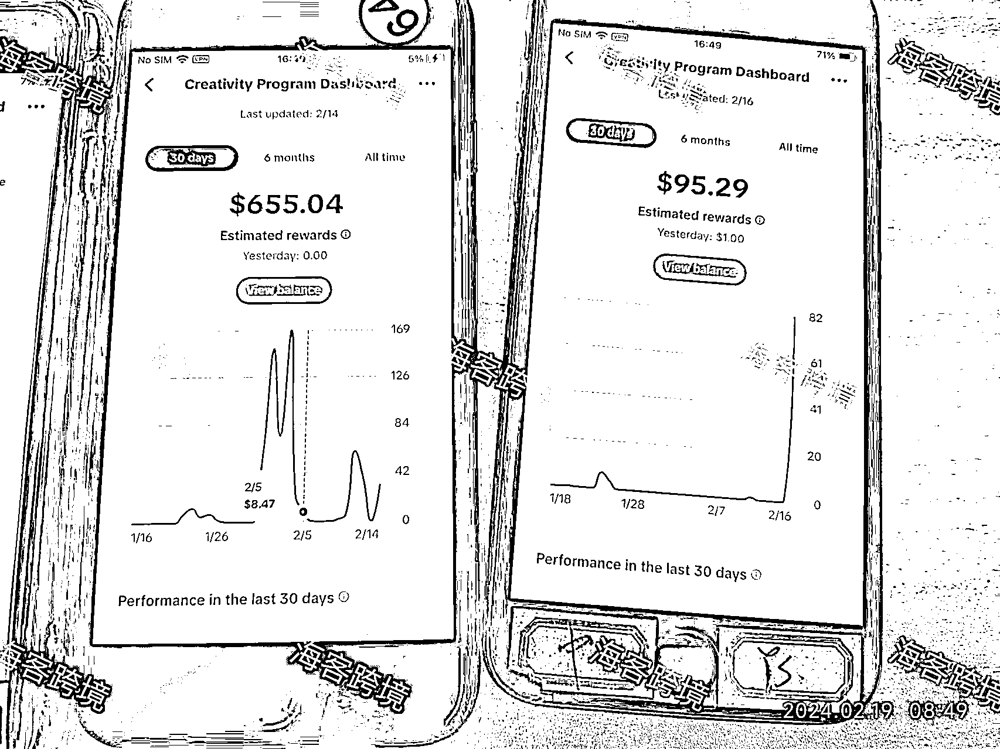
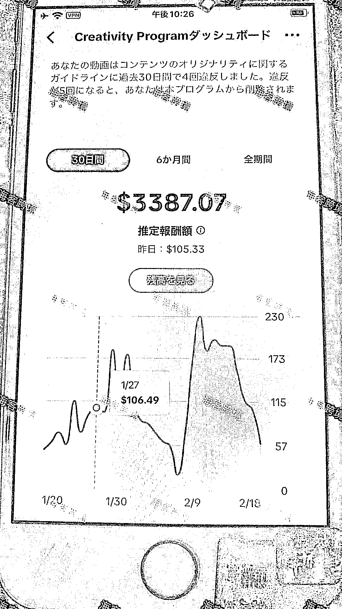

# TikTok 中视频计划

> 原文：[`www.yuque.com/for_lazy/thfiu8/ri4e8x1x6evqzzqc`](https://www.yuque.com/for_lazy/thfiu8/ri4e8x1x6evqzzqc)

## (52 赞)TikTok 中视频计划

作者： 子白

日期：2024-02-26

【TikTok 中视频计划】
大家好呀，我是子白！我又来叨叨了，今天聊的是 TK 中视频。

对抖音玩家来说，中视频计划不是什么新鲜玩意儿，21 年 6 月西瓜视频、抖音、今日头条就在国内发起了中视频计划，投资 20 亿补贴创作者。什么意思呢？就是你在平台上发 1 分钟以上的视频，按照播放量给你奖励。

我们主营是 tiktok 投流卖货+自然流直播卖货，脑子里只有卖货。所以早就知道 tiktok 开了中视频计划，也没当回事，去年 11 月中旬才开始实操。说实话，也是看到许多人拿到大结果，天天在朋友圈里面晒收益，这才把我们胃口吊起来了。

可我们很悲催，来的不是时候，正赶上平台转型，封杀了很多玩法，踩了 N 个坑才拿到了不大的结果。

今天把保姆级教程整理出来，给大家一些实操上的指导，少踩点坑。这件事需要投入的只有精力，壁垒是选内容素材，再加上一点点运气就可以跑通了。非要说成本的话，起步阶段只需要 1 台电脑加 3-5 台 iphone 手机即可。注意，必须是 iphone8 及以上，现在 iphone7 已经被平台认定为工作室手机，无论如何都不给你起号。

为了完善的阅读体验，请移步飞书[`spg0xsnzv2.feishu.cn/wiki/C3OcwL6Nhik3JDkNiR5cilqHneh?from=from_copylink`](https://spg0xsnzv2.feishu.cn/wiki/C3OcwL6Nhik3JDkNiR5cilqHneh?from=from_copylink)

* * *

评论区：

子白 : 小白还不会安装 TikTok 的，直接看本教程第四章。

* * *