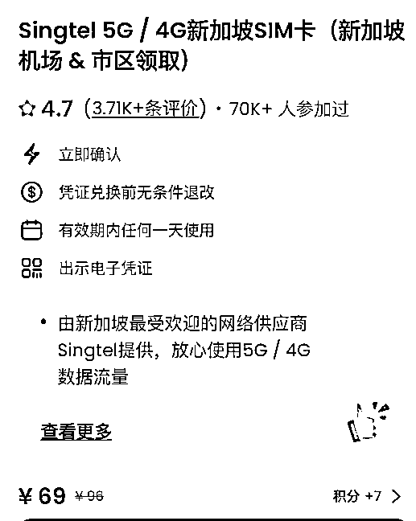
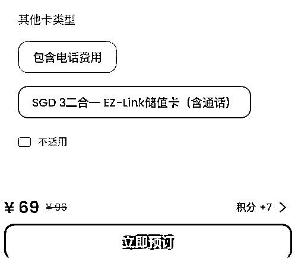

# 新加坡有哪些商业机会？-附 2024 新加坡免签入境指南

> 原文：[`www.yuque.com/for_lazy/thfiu8/gtgqge13gn97emor`](https://www.yuque.com/for_lazy/thfiu8/gtgqge13gn97emor)

## (21 赞)新加坡有哪些商业机会？-附 2024 新加坡免签入境指南

作者： 希声

日期：2024-02-28

参加了生财航海家比浪组织的新加坡游学，有不少收获。

1.大多数来新加坡的人一般是下面这些需求：

读书教育——新加坡的教育在全球排名前列，许多人会把小孩送过来读书，或者是大人自己做学历提升。

资产配置——富翁们做一些海外资产的配置。

全球总部——做出海生意的，很多会把全球总部放在新加坡。同时随着中美的贸易摩擦加剧的原因，许多产业需要转移到东南亚，那么很多老板会在新加坡来设立一个分部，然后再逐步扩展到东南亚的其他国家。

高端医疗——许多有钱人会喜欢来新加坡做体检，同时新加坡这边也能有许多最新的药品，几乎和欧美同步。

2.新加坡本地的生意并不好做。

新加坡很小，面积只有深圳的三分之一，人口有五百多万，所以本地的市场很小。

比如在这边做一个共享充电宝就是一个很差的生意，因为市场太小可能成本都无法覆盖。

3.新加坡的电商并不发达，快递速度也不快。

新加坡有个特点，在每一个居住聚集区，几乎都会有很大的商场，所以他们对于电商的需求并不大。

得益于过去三年的疫情，电商的占有率有了明显的增长，但还是占比不高。同时因为快递服务不好，丢包率较高，速度也不快（本地商家发货，都要一周左右的送达时间），这些都影响了电商的发展。

4.新加坡人口组成复杂，宗教信仰多样化。

新加坡有华人，有印度人，马来人，印尼人，欧美人……所以在新加坡生意的时候必须考虑文化差异和信仰差异。

5.新加坡注册公司的成本和维护成本比较高，要求也比较多，比如需要至少一名本地的董事。

6.新加坡人力成本很高，也比较躺平。

这里的人到点就下班，拒绝加班，周六周日也几乎找不到人。

7.新加坡更适合做富人的生意，更适合做 B 端商家的生意。

比如今天的一位做财税规划的顾问就分享了一个商机：给新加坡的本地商家做线上营销推广是一个很不错的生意。因为这里的商家还是停留在线下的推广，很少会做线上营销。所以可以给本地商家做网站 SEO 推广，社媒引流等生意。

需要准备的东西：

1.护照。有效期最好在六个月以上。

2.最好提前两三周预定好往返飞机票和酒店。

一是会更便宜，二是最好提前把飞机票和酒店单据打印两份出来，方便入境的时候审查——虽然最后没用上。

我是在去哪儿网上预定的，对比了一下比携程预定得相对便宜一些。

3.电话卡。

可以淘宝买或者在“Klook”app 上买 Singtel 5G 套餐，有一种电话卡与交通卡二合一的卡，把电话卡取下来之后，整个卡片可以直接在地铁站充值作为交通卡。

如果要购买这个卡，记得选择这个二合一套餐：

这个卡需要下了飞机，出了闸机之后去现场柜台领取。

注意要提前一天购买，当天购买是不行的。

购买订单页面的二维码记得提前截图，不然现场领卡要扫描二维码，手机却没流量就傻了。

机场的这个柜台领取：

4.国际信用卡，带 visa 或万事达标志的都行，但最好是不带银联标志的。最好不同银行的卡多带几张，有些卡片有时候用不了（比如有个伙伴做地铁刷招商卡进去，结果出来的时候提示卡错误…）。

5.可以提前在中国银行预约取个一千左右的新币（面值最好小一些），或者下了飞机机场也有兑换点，但是汇率不是很好。

一般玩个一周的话，一千新币也非常够了（最后我们现金就用了三百多），因为 90%的场景都可以刷信用卡，少部分可以刷支付宝和微信。

6.带短衣短裤，天气很闷热。

7.手机下载好这些 app：

谷歌地图，谷歌翻译，grab（叫车和叫外卖软件）。如果是华为手机，可以下载一个出境易 app，或者是 petal 地图 app 作为谷歌地图的替代品。

高德地图和百度地图也能用，多个地图软件有的时候可以交叉查看路线和信息。

8.插座转接头。

其他注意事项：

1.入境前三天要填写电子入境卡，网址是：*[`eservices.ica.gov.sg/sgarrivalcard/`](https://eservices.ica.gov.sg/sgarrivalcard)*

具体可以看这篇教程：[《免签入境新加坡该做哪些准备工作？》](https://mp.weixin.qq.com/s?__biz=MzkwODU4OTg4OA==&mid=2247483939&idx=1&sn=05a6770d120a21db31f1672a41d83dde&scene=21#wechat_redirect)

2.如果提前填好了电子入境卡，新加坡入境就很方便，会有一个电子闸机验证护照和右手大拇指指纹，全程无需人工接触就可以入境。

3.如果没有买我上面提到的二合一卡，那么坐地铁需要买一张交通卡。但如果你有带国际信用卡，也可以直接刷卡进站，无需购买交通卡。

不过我们一行人测试后，有的卡可以有的卡不行，如果你的信用卡不行，那还是办一张交通卡。

4.都说新加坡有很多奇怪的规定，比如地铁上不能喝水吃东西，公共场所不要抽烟，但除了在地铁上最好老实些，实际上也没那么多警察盯着人，到处都有人在角落大摇大摆地抽烟。

5.我预定的酒店是 funan 的 lyf 公寓，大概一千人民币一晚，没有拖鞋，没有牙刷牙膏，房间很小，但是挺干净。

6.打车很贵，出行尽量坐地铁或者公交车。

地铁一定要注意换乘问题，从机场过来的地铁，有的时候是两边都开门，两个方向是不同的换乘方向，所以不要搞错。

7.华人很多，基本上你看到华人的面孔，都可以直接用中文交流。

8.物价偏贵，但可以接受，不过再次吐槽酒店真贵……

9.商场里吃饭一般会收取 9%的消费税和 10%的服务费，如果是小店或者食阁（需要自己收拾餐具的那种），则一般没有这两个费用。

**如果分享对你有帮助希望点个赞哦~**

**————————**

**我在生财的其他文章链接：**

[跨境创业？新手下场前必看的赚钱指南！](https://articles.zsxq.com/id_n97vrpiahx5w.html)

[保姆级教程！注册 Midjourney 并开通付费订阅功能](https://articles.zsxq.com/id_gnm2x96buu9t.html)

[跨境电商的 ChatGPT 应用指南全集 v3.0](https://articles.zsxq.com/id_eh50cr4chn8a.html)

[1 天内如何启动电商/外贸/跨境网站？ChatGPT 来助力！](https://articles.zsxq.com/id_1azlnfovac6q.html)

[一个工具管理上百个社媒账号？指纹浏览器使用全攻略！](https://articles.zsxq.com/id_u2ub0iv60p1g.html)

[白嫖！3000 元的谷歌广告优惠你要吗？](https://articles.zsxq.com/id_sa1bz4dckqeq.html)

[Etsy 注册最新最全指南！一文回答如何注册、需要哪些材料、如何避免封店、如何申诉](https://articles.zsxq.com/id_590wii7jr4iu.html)

[批量做小红书图片/视频的方法-canva 批量创建](https://articles.zsxq.com/id_pnpv1g2m5fi6.html)

[一个 ChatGPT 高效使用技巧—编辑原有内容](https://articles.zsxq.com/id_5twbrd3idlbw.html)

[效率飙升！跨境电商领域的 ChatGPT 应用指南 v1.0](https://articles.zsxq.com/id_7wu5dtpkh4m4.html)

[《段永平投资问答录-商业逻辑篇》精华金句摘录](https://articles.zsxq.com/id_xrltpwocer4p.html)

[《段永平投资问答录-投资逻辑篇》精华金句摘录](https://articles.zsxq.com/id_2k5d3mdace44.html)

[《穷查理宝典》精华金句摘录](https://articles.zsxq.com/id_er7b3dm8lx7w.html)

[《零编程知识怎么在 AI 帮助做一个贪吃蛇的游戏》](https://articles.zsxq.com/id_nqxxc79whz1t.html)

[快速获取谷歌 SEO 流量的一个策略](https://articles.zsxq.com/id_txli3kufpvig.html)

[ChatGPT 4.0 新功能，让你的数据和设计工作事半功倍！](https://articles.zsxq.com/id_it0blu6we0p4.html)

[打造转化率页面的 13 个技巧大公开](https://articles.zsxq.com/id_ohdbfoxwndkx.html)

[什么是跨境电商独立站？有哪些运营模式？](https://articles.zsxq.com/id_3lz2mf370csx.html)

[公众号想要 10 万+？试试这几招！](https://articles.zsxq.com/id_4mnsrw79as1d.html)

[《新手如何入场 Tiktok》—Sky 老思的直播记录](https://articles.zsxq.com/id_d7qg98gocnvh.html)

[4 个技巧获取无限个邮箱账号！](http://4%E4%B8%AA%E6%8A%80%E5%B7%A7%E8%8E%B7%E5%8F%96%E6%97%A0%E9%99%90%E4%B8%AA%E9%82%AE%E7%AE%B1%E8%B4%A6%E5%8F%B7%EF%BC%81)

* * *

评论区：

阿甜（AI 数字人） : 还有游学项目？刚来的新人眼睛发光！我也觉得去哪儿是最便宜的，但是又听说携程买下了去哪儿，但是去哪儿就是比携程便宜！听说那边消费蛮高的，而且税也是真的高，不愧是高精尖人人才聚集了！
希声 : 私人组织的，不是官方弄的[汗]

* * *