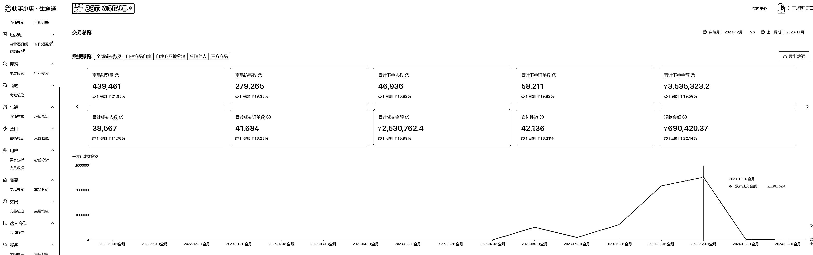
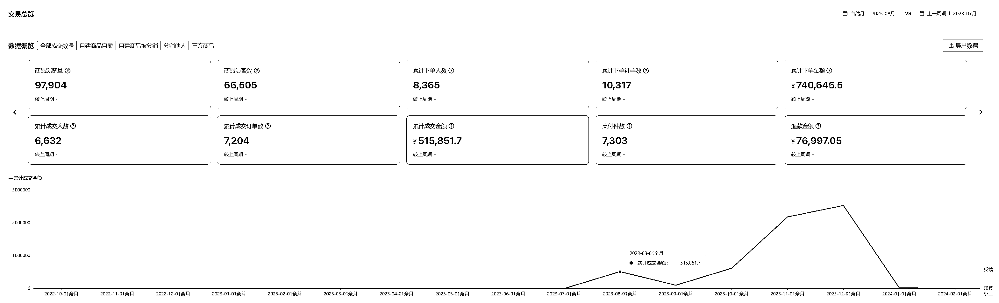
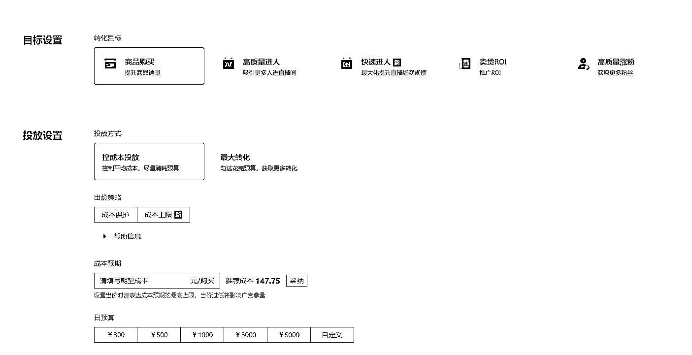
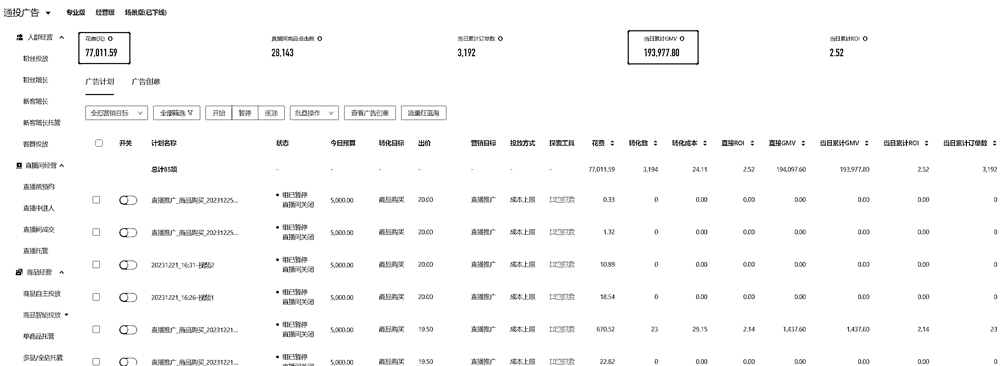
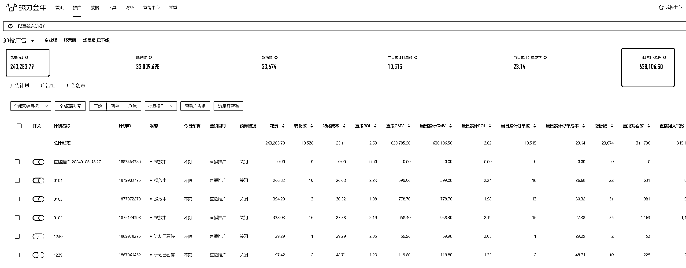

# 快手应季单品净利润 120 万， 4 个月实操复盘付费投流打法万字解析

> 原文：[`www.yuque.com/for_lazy/thfiu8/bneftnn2wsotf10y`](https://www.yuque.com/for_lazy/thfiu8/bneftnn2wsotf10y)

## (114 赞)快手应季单品净利润 120 万， 4 个月实操复盘付费投流打法万字解析

作者： 书豪

日期：2024-03-01

大家好，我是一直在努力提升利润的龙珠圈友书豪，也是小红书店铺和直播航海教练。

2024 年，电商会越来越艰难，内容电商这个行业，会有越来越多的人出局。直到被内容电商行业彻底洗出去。

不论是小红书、快手、视频号、还是抖音。给我们的生存路径只有两条，一条卷低价，一条卷内容。

无他，我们这些电商小玩家，能走的路只有一条，升级内容能力。

流量不会回暖，流量只会越来越贵。做短视频直播的团队大家都清楚，内容电商平台的利润会越来越惨淡，对于测品团队、白牌玩家特别不友好。

**小红书+快手双平台测品联动，多个内容电商平台切利润，是当下打品团追求利润的一种方式之一。**

短视频直播还是电商的那个风口吗？我想告诉你，绝对不是 Easymoney 了。

如果你尝试过短视频直播打品，相信你有很强的体感，赚钱真难。

自然流、微付费模式现在也就达人敢说能挣到钱，连大品牌都不敢说这句话了。

前段时间和电商圈的朋友交流，席间有人突然发出感悟“想挣钱想走得稳，打品团队好像只有付费这条路可以走了！”

直播其实是一门大生意，他是一个大渠道，渠道下有多种打法多个平台，这个平台太卷那就果断锚定下个平台，这个打法不 OK 就找个护城河高的打法。

*电商只是一门生意，咱们都是普通人，做生意目的仅仅为赚钱*

电商人什么时候都要以利润为核心作为衡量赚钱的驱动力。

那做付费投流也好，做无人直播也罢，变换不同方式的核心目的是为了做到降本增效。

前段时间做得一个品，频繁爆量，从每天 2 万暴增到 50 万 GMV；利润也随着翻倍；可大家知道吗？这个品打了三个月，人工成本近乎可忽略不计。

这篇文章，我会将整体选品、测品、内容、投放的整体思路和实操方法分享给大家，希望能为正在做电商直播的同道中人提供一些思路和价值。

**-----目录-----**

1.  **短视频直播电商的一些思考**

2.  **选品测品的核心原则**

3.  **内容制作底层逻辑思路**

4.  **投放实操的整体链路思考**

回顾过去自己的电商入门之路，不知不觉间其实走了很多弯路；

拿自然流项目举例子，虽然自然流项目的成本很低，但流量和模式会受到平台很大影响，团队作战项目不稳定，利润不稳定，每天都活在焦虑当中，如果只是每个月的收入不稳定，从几千到几万，那这个生意对于老板来说太不划算。

**一个成熟的团队和模式需要保证三个条件**

1.  **可持续盈利，或有几率利润扩大+规模扩大，从而拉高收入空间；**

2.  **变现模式相对稳定，能从以天为跨度到月为跨度的转变，更利于团队项目规划；**

3.  **团队成员有可增长机会，提高人效空间；**

思考一件事情：如果一个项目做不到提高人效拉升利润，就意味着你的成本会日渐增长但利润稳定不动，那带来的结果就是想赚更多钱就要找更多人，人力成本上升并没有带来利润的同比翻倍；

快手无人直播就是我认为目前能实现这一商业模式的承载工具。

# 一、**选品测品的核心原则**

选品是决定一个项目能够成功的方向，这是最重要的商业决策，没有之一，选品选对了，事半功倍，这是最扎心的体感。

不同的平台选品策略是不同的，核心原因是平台主力人群是有差异度的，比如你在小红书上卖光腿神器大概买你货的是 18~35 岁女性人群，但快手上可能就要变成 35~50 岁人群了，人群画像发生了变化，人货场的要求也随之改变。

选品的底层逻辑就是：针对平台的主力人群，选取最大需求商品卖给真正需要的人。

快手不同于其他平台，对于“品退问题”监管严格，所以快手选品要做到三选三不选

## 三选：

1.  选择季节性&增长类产品

2.  选择毛利润高的产品

3.  选择卖点可视化强的产品

季节性较强的产品势必会有淡旺季，对于小卖家来说提前切入赚钱的效率会更高；毛利润高的产品会平摊掉支付的广告付费成本，更利于在阔量的时候获得可观利润；我们做的是短引的付费投放逻辑，所以可视化强的卖点更能抓住用户的需求；

## 三不选：

1.  不选高退货&品质退货的产品

2.  不选供应链不稳定、货品较复杂的产品

3.  不选需要高频问答、用户操作复杂的产品

其他平台退货率高的商品，快手一样很高，而且品质退货罚款是硬伤；供应链不稳定一旦爆单的话，会影响你的发货速度，卖的很好结果发不出货是极其痛苦的；高频回答、操作复杂会导致你的售后变得很重，影响退货率的同时会增加人工成本；

# 二、**内容制作底层逻辑思路**

以我们在快手打的加绒棉裤为例，如何去做内容撬动利润。

我们在快手打的加绒棉裤，三个月的时间卖了 600 万+销售额，利润在 120 万。

短视频产出了超 2000 个作品，打造 50 个爆款视频【这里我指的是信息流广告过万点赞的视频】

需要产出这么大量级的作品，那剪辑的素材从哪里来？

电商里面一直流传着一句话叫“80%的财富都来源于复制粘贴”

这句话，听起来有些忽悠人，但真正战斗在一线像我们一样的打品团队才能深刻明白这句话，复制粘贴不是空穴来风，我们的素材大多都是复制粘贴来的，要明白原创素材能力不是一般人可以具备的，对于小白玩家或者专门搞利润的团队来说，对于内容的控制是一种能力，对于内容的创作又是另一种能力。

**我们产出这么多短视频的背后素材，大部分来源于公域流量的素材检索，也就是所谓的复制粘贴后的二次创作！**

如果自己想要赚到钱，就不要被各种各样的规矩束缚住！

尤其是从小到大我们学习的东西，只是教会我们怎么去做一个好员工，做一个好人，但没有教会我们如何做一个有钱人，如何做一个会赚钱的人！

想知道内容制作的底层逻辑思路，我们需要搞清楚，用户对于内容的敏感度

**你可以不具备创造内容的能力，但你一定要具备拥有用户思维的能力，从用户视角去审视内容，从用户逻辑去评判内容，从用户心理去感受他们内心的挣扎和痛苦！**

以加绒棉裤为例，我们的产品定价在 60 块；

**我们的用户是一群什么样的人？**

他们是被人忽略的一群人，他们可能是老年人、中年人，生活在县城、生活在农村，他们对衣服的要求不像生活在大城市那些光鲜亮丽的白领；

**用户喜欢或者说用户想要的产品是什么样子？**

我们现在知道了他们大概的生活场景、生活面貌，我们在思考一下，他们想要的裤子是不是能过冬、能保暖且穿起来方便工作、既轻松自在又便于清洗；

我们就可以整理出来他们想要的产品标签：高性价比、加绒加厚一条过冬、可不美观但要舒服、轻松便于生活；

在明白用户想要什么喜欢什么之后，你的内容是不是就有了一个清晰的方向了？

**所以内容制作要牢记：用户思维是内容制作方向的第一参考维度；**

OK，在我们知道内容方向之后，我们下面就要思考什么样的内容能够吸引住用户视线？

这里我们又要再次回到用户思维上，用户对什么样的内容感兴趣且有强烈购买欲望？

优质内容没有绝对成功标准，什么叫优质内容？激发用户主观能动性的内容就是优质内容

这里激发用户主观能动性，包括用户对视频的互动、用户对于视频的观看停留、刺激用户购买欲望等等，这都算！

而且这也和平台提倡的内容电商达成了一致，你为平台拉长了用户停留，平台就会为你扩散广告渠道；

加绒棉裤的优质内容说出来很简单，就是三个方向：第一直观展示产品的卖点，加绒加厚|体感自在|性价比高；第二结合社会热点，将产品融入进入，比如降温、比如元旦、比如过年送礼；第三用户痛点结合，产品对比体感直击等等；

# 三、**投放实操的整体链路思考**

投放实操是不同的人有不同的方法

但真正投放做的好的操盘手，一定是个耐心细心且有持续学习反省能力的人。

大家如果去拜访过业界 TOP 级别的公司也会发现这个结论；

在做一件事情的时候，先不着急想细节，先把核心本质内容思考清楚再做决定；

**关于投放，我们主要思考了二个维度：**

**心态、工具附加价值**

### 第一个思考：心态

我们思考一个投放最本质的问题，投放平台上是不是就是一个杠杆工具；

投放平台的作用就是基于平台自身的大量用户数据，在数据分析后将内容推送给有需求或者有潜在需求的用户，所以我们不要觉得平台是故意再压榨我们，这里我们自己也走了几个月的心理弯路；

我们的加绒棉裤，最开始是在 89 月份开始打的，而且 7 天时间里就完成了 20 万的 GMV 累计，但一周后出现了广告订单成本增加，出价影响阔量，所以我们到 9 月将这个品暂停了，开始进行团队项目复盘；

**这次复盘我们最大的收获是“心态一定要摆正”；**

心态看似是个虚东西，但是会直接影响到自我判断。带来重大改变的背后是我们意识到不要和平台成为竞争关系，平台作为工具本质上是要再保证自己利益的同时实现他人利益增长。

我们要做的是找寻平台流量算法依据，并在测试中找到我们自身和平台“合作”最舒服的方式，这里就包含着出价范围、内容制作以及直播间数据。

### 第二个思考：工具附加价值

很多跟着我们一起打品的学员，每天会问我们很多问题，在回答这些问题的同时我们自己也会学习和思考，因为一个团队遇到的问题一定没有三四百个团队加在一起的基数大。

那加绒棉裤举例子，在打加绒棉裤的时间段里面，我们对于磁力金牛的理解又加深了一个维度；

磁力金牛里面涉及到的小工具太多了，比如 PC 端磁力金牛户包括了专业版、经营版，每个版本里面更细致的小功能，这些小功能组合在一起，又是很多种打法，所以就意味着这么多打法，我们能尝试的方式也太多，不要被自己限制住，要去开拓打法，开拓工具。

所以在打这个品的时候，我们开拓了一个新的领域，磁力金牛的经营版应用以及快手粉条的应用；

单单这两个玩法，就给我们带来了 200 万的 GMV 提升，而且 roi 提高了 25%，从 ROI2.6 提升到了 3.1；

希望这篇分享对大家有帮助，2023 年能大爆一波自然流，能够付费通投拉满拿到高 ROI！

（我目前主要在做小红书、快手这两个平台，基本所有平台短视频内容的核心逻辑都是想通的，没有特别大的差异，希望这次的分享能够对大家有帮助，如果对上述分享有疑问的，也欢迎跟大家多多交流，探讨，定当知无不言，我的微信：wsh137552775）

* * *

评论区：

冬日暖阳 : 您是个人做还是
书豪 : 在杭州下沙，团队
Miss 董｜依依妈 : 太厉害了，学到很多
清一 : 书豪太猛了
叶千岁 : 书豪太棒了！！！优秀
瑞希 Rissy : 感谢分享
张小厨 : 优秀
小小杨 : 好厉害

* * *