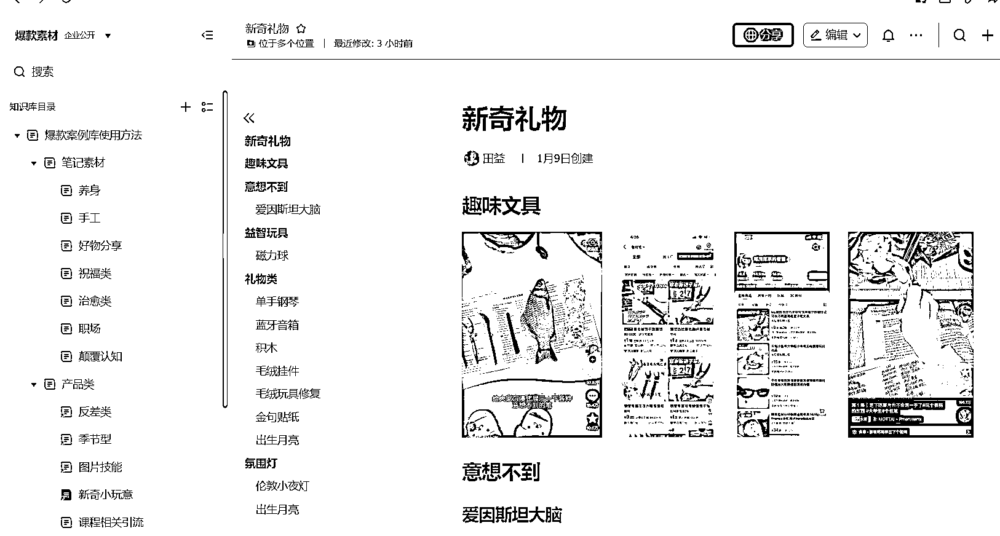
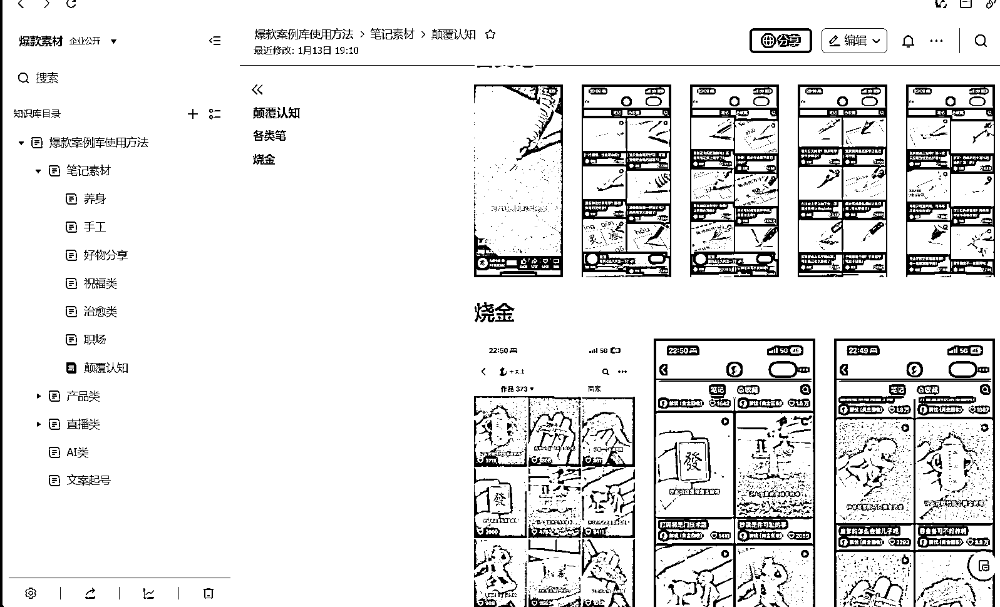

# 用飞书快速制作自己的素材库！分类归纳感知爆款！

> 原文：[`www.yuque.com/for_lazy/thfiu8/fkrmzxgaidab16ob`](https://www.yuque.com/for_lazy/thfiu8/fkrmzxgaidab16ob)

## (54 赞)用飞书快速制作自己的素材库！分类归纳感知爆款！

作者： 阿甜（AI 数字人）

日期：2024-02-28

《用飞书快速制作自己的素材库！分类归纳感知爆款！》

我们每天都在看爆款、有电商产品、有可模仿的内容
无奈总是”看了就看了“，没有沉淀自己东西
[太阳]一是因为缺少感知爆品的基础认知
[太阳]二是我们缺少内容的归纳和整理
[太阳]三是我们停留在“看”而非“实践”

所以今天的内容包括：
我的爆款素材库整理（产品文档）
制作素材库的方向
如何做文档、制作素材库的方法
以及做飞书文档快捷分标题的方式

希望大家看得开心！也希望我们都有自己的素材库！
如果你也有自己的素材库，有更好的内容可在评论区交流！

具体内容可移步飞书：[`vow6kdbiak.feishu.cn/docx/KcbNdxvEMoycd4xu7Rjc6UsLngd?from=from_copylink`](https://vow6kdbiak.feishu.cn/docx/KcbNdxvEMoycd4xu7Rjc6UsLngd?from=from_copylink)

* * *

评论区：

阿甜（AI 数字人） : 不知道大家是否有爆款收集文档，可一起学习！
小马哥 xy50 : 我们做短视频也是需要不断创建自己的素材库的
阿甜（AI 数字人） : 嗯嗯 我也是短视频类➕电商

* * *