# 格子全职自媒体 500 天的“蝶变“：负债 20 万到月入 10 万的一些干货分享

> 原文：[`www.yuque.com/for_lazy/thfiu8/duyelg37km9hqheo`](https://www.yuque.com/for_lazy/thfiu8/duyelg37km9hqheo)

## (88 赞)格子全职自媒体 500 天的“蝶变“：负债 20 万到月入 10 万的一些干货分享

作者： 格子

日期：2024-03-15

hello，各位星友们，大家好。

感谢星主，感谢星友们，百忙之中还能抽空看看格子的小故事！

**​我是格子，是公众号#格子的方程式主理人，主要聚焦于公众号流量主和小红书商单变现两个领域。**

格子是一名 90 后女生，几年前是一家小小公司的财务，后来裸辞创业，经营了几家外卖店，最后因为上海疫情，全部关店，负债 20w+。

在创业期间，因为经历了多次起起落落，患上了重度抑郁症+重度焦虑症。

或是上天的眷顾，格子在一次又一次经历失败后，误打误撞进入了自媒体，并且已经摸爬滚打了 500 多天了，在这 500 天当中，我不到一年的时间还清了 20w+的债务，并且实现了最高月入 10w+。

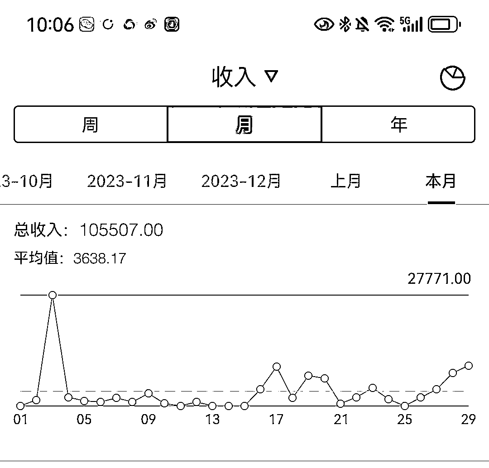

今天给各位大佬分享一下格子的经历，与实际操作过程中的一些干货。

格子坚持长期主义，做时间的朋友，坚持自律，相信时间带来的复利，自媒体这条路一个人坚持很难，与格子一起加油，与君共勉。

格子接下来分享的内容，有一些是成长过程中的感悟，有一些是实操过程中的干货，占用各位宝贵的时间，

写得不好的地方，还请多指教！格子非常珍惜每一次互动与链接，如果觉得格子的经历有共鸣，帮格子点个赞鼓励一下噢。

**一、格子失败的实体外卖店**

**1、创业的躁动，能一辈子打工吗？**

格子在做财务的时候，和很多职场人士一样，早九晚六，其实也是很惬意的，比上不足比下有余！

那时正是外卖兴起的第一个年头，在偶然间的一次搬家，饿了么上点了一份外卖，不知道是饿坏了，还是确实外卖口感不错，这一份外卖像一股仙汁美味，流进了格子的梦想心田，打破了那一潭死水般沉寂的灵魂。

不想整天与数字打交道，不想整天做报表，不想整天被老板拿捏，为领导背锅，被同事嘲讽的格子，或者是因为那一句：**"总要彻彻底底的绝望一次，才能重新再活一次"**的诗和远方所感动，格子辞职创业了。

7 月的无锡，不但天气炎热，人也特别热情，来到无锡一家店，纯小白的格子居然天不怕地不怕地学起了做外卖，当时花了 38000 的学费，只教你做菜品，并不教运营。

事后想起来，砍砍价，8000 应该也可以拿下噢。但什么也不懂的格子，爽快的直接支付了全款，带着自己的第一位事业合伙人：堂妹，学习 7 天后开起了人生的第一家外卖店。

从创业的想法冒出到租好店铺到辞职到店铺开业，不过一周的时间！格子一直就是个风风火火的人，从这件事就能很直观地感觉出来。

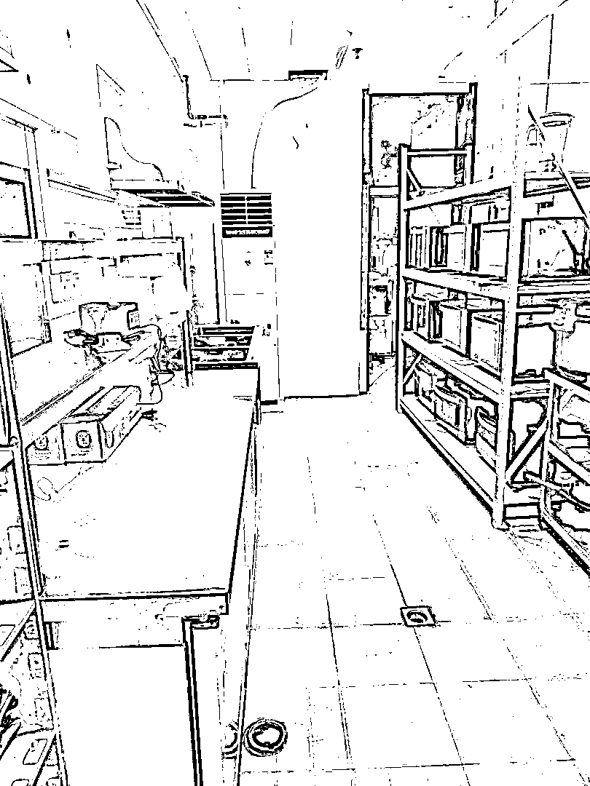

第一家店

接下来，格子直接简单写一些用惨痛经历，换来的干货吧，其他的略过。

**2、第一次被骗，二房东跑路**

开店一开始挺顺利，但开了 1 个月后，大房东突然跑过来说，二房东拿着租金和押金跑路了，于是把我们的店都给砸了。

这当头一棒，惨痛的经验让格子瞬间不知所措，觉得天都塌下来了。

**现在回忆起来，第一家店，当时格子犯的错和做得好的几个点：**

2.1 、 选址是成功的，格子当时选择了最繁华的黄浦江边，租金虽然高，但提高了竞争对手的门槛，两年内无同行周边找店开业，但租金高也是压垮骆驼的最后一根稻草，打价格战的时候，根本扛不住。

2.2、 产品选择口感是非常好的，但是菜单较单一，容易出爆品，缺点是长期吃也容易腻。

2.3、 红包运营策略得当，抓住了一部分回头顾客。具体策略是通过发外币红包的方式，与顾客建立起了一种念念不忘的连接，外币在国内无法使用，但确实又是真实的钱，丢了舍不得，很多顾客都会当个纪念，每当顾客一看到时，自然就想起了咱们的店。

2.4、 粘性服务，通过会员卡免费送鸡汤，让用户得便宜，增加了一种持续链接的通道。

2.5、 踩中了外卖的红利风口期，员工团结，一家 15 平米的店，最高时日营业额突破 1 万+，并且我还成功把这个品类做到全黄浦区第一，全上海第一。

这家店最失败的点是，由于前期缺少深入调查，导致签的合同是与二房东签的，二房东是个老赖，1 个月后直接跑路，房租和押金损失了 6 万元左右，即使打官司胜诉，现在依然没拿回一分钱。

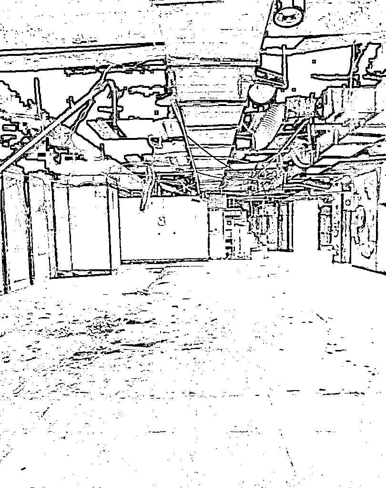

店被砸了

**3、冲昏头脑的扩张，分店商战**

第一家的成绩超出预期，不久后被初次胜利冲昏了头脑，选择了一个 4 平方公里内，同时多人在那区域开店，结果打起了价格战，互相差评。

开店之前，不知道己经有人也想在这个区域开，小品牌无保护，有些人买了配方就能开。

分店失败的核心是选址失败，且这个品牌管理混乱，没有区域保护导致的这个局面。

**4、遇疫情封控，陷债务危机，多品牌同时关店**

后来，格子又经历了多次开店，加盟了几个品牌后都以失败告终，2022 年上海疫情封控政策，全部员工被关在家里 2 个半月之久，而我资金链断了，陷入了债务危机，导致最终关闭大吉。

前后投入超过 40 万，最后清算负债 20 多万，经历这些惨痛的教训，格子总结了关于餐饮外卖的几点，方便有这方面的创业想法的朋友避免一些坑：

1）餐饮行业看上去门槛低，导致竞争也非常大。

2）很多新人觉得餐饮是刚需求，但差异化竞争至关重要。

3）餐饮要自创品牌，才有自主规则制定权，否则容易受制于人。

4) 加盟品牌时，要深入考察已加盟店的财务营收情况，选址很重要。

5）餐饮行业也是需要考虑到一些特殊风险的，比如：疫情，天灾等。

格子本次餐饮创业失败，核心因素是疫情，除了直接关 2 个半月，房租需要照付，员工吃喝以外，

因为疫情导致外地人口外流，恢复营业后，也没有以前的人流，单量急剧下降，连房租钱都挣不回来。

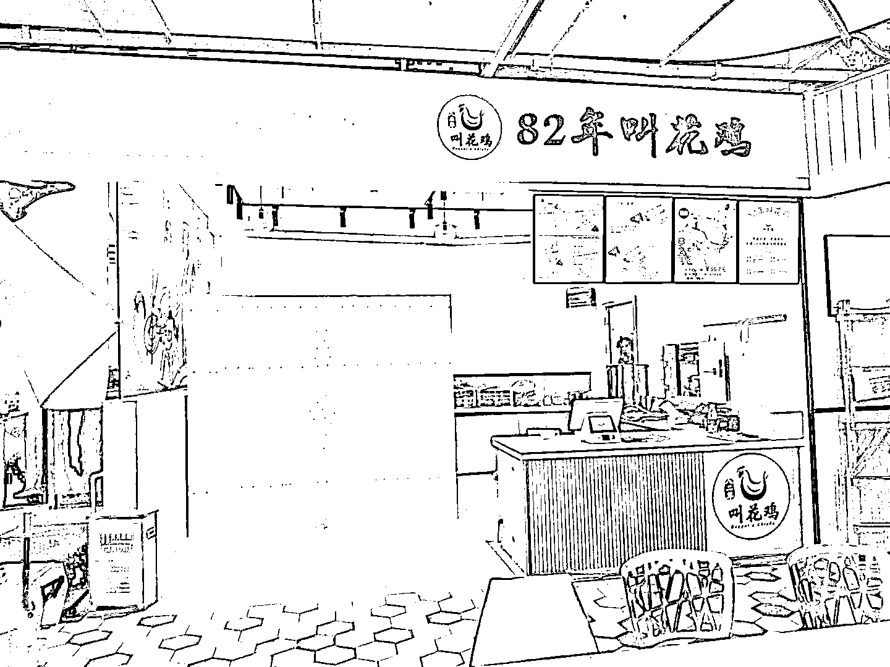

第二家店

**二、格子是怎么走上自媒体之路的？**

**1、不屈服的韭菜，学费扔了再扔**

在创业的这几年，因为经历了起起伏伏，格子得了重度抑郁症，买了很多抑郁相关的书籍，其中有一句印象深刻，**"活着，就要坚定地走向未来，用信念去照亮前行的道路，用希望去点燃生命的每一个希望。"**

瞎猫碰上死耗子，闲赋在家找不到工作的格子，一次偶然的机会，花了 3999 报了一个视频剪辑的课程，从此走向了自媒体。

毫无疑问，自媒体小白的我，一次又一次的充当了韭菜，各种副业项目层出不穷，而我眼花缭乱，包里的钱一次又一次地往外掏，每周不是在拜师，就是在拜师的路上。

现在回想起来：**如果一定要当韭菜，那就做一颗不屈服的韭菜吧。**

**2、偶遇领路贵人，一来老师**

珍惜你的低谷，你会看到很多真相。

时间能渡的都是愿意自渡的人，没有谁的人生一帆风顺，低谷期的苦难就是为了积蓄力量。

哪怕是裂缝里透出的光，也要牢牢抓住，然后生出向阳而生的勇气！

低谷的时候，我就不断用这几句话给自己打鸡血。

好在，老天也还算公平，在一次又一次的希望破灭之时，我遇到了一来老师，也就是我现在的私教合伙人。

就像那阴暗的山洞底部，突然射下来了一道光，这是一道引人向上的打开自媒体之路的光。

报了一来老师的课后，我做的第一个项目就是今日头条写作，一开始也不顺利，也曾怀疑过自己，是不是真的干啥啥不行。

**但是，坚持是可以打败一切的，努力才能迎来硕果。**坚持了一个月后，在头条，我也出了不少 10w+甚至 100w+的爆款。

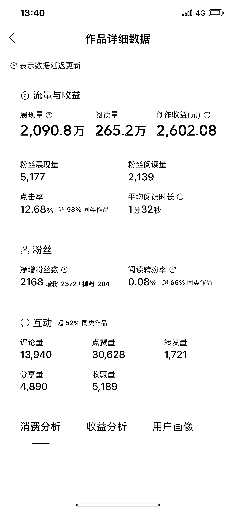今日头条的百万爆款

而真正让我在自媒体站稳脚跟的，就是公众号流量主。

随着公众号文章分发机制的更改，我们发布的文章能够在微信生态下的"看一看"，获得流量推荐，即使公众号的粉丝数量不多，文章的阅读量仍有可能达到几千甚至 10W+。

公众号的运营者可以通过平台自动插入的广告获得稳定的收入，这个收益模式不仅适用于拥有大量粉丝的公众号，也适用于新起的号。

**3、天选之号，单篇爆款 300 万+**

2018 年期间，格子有时偶尔为了写作情怀，会写一些碎碎年发在公众号上，真是无心栽枊枊成阴，这个公众号竟然会成为一个天选之号，格子普及一下知识：公众号流量主，号越老越容易进流量池，越容易获得更多的流量推荐。

2022 年 11 月底，格子入局公众号流量主，做了很多不同类别的号，从法律到民生，从穿搭到军事。

其中让格子坚定写爆文的原因是，公众号流量主爆款确实收入非常可观，公众号的收益主要是基于阅读量，即通常所说的流量。流量越高，收益通常也越高。此外，公众号的流量具有长尾效应，即内容在发布后仍能持续吸引读者，长期产生收益。

但是，流量的单价并不是固定不变的，它受多种因素影响。这些因素包括文章中和文章末尾的广告展示量、广告点击量、文章的完读率等。这些因素共同决定了流量的单价，进而影响收益。

公众号运营者可以通过微信的“微信广告助手”小程序查看收益。一旦开通了流量主功能，系统会提示绑定这个助手。绑定后，每天早上 7 点之后，就可以查看前一天的收益情况。

**在做公众号流量主期间，格子最多的一篇爆款是 300w+阅读量，一篇收益 1w+，这燃起了希望之光。**

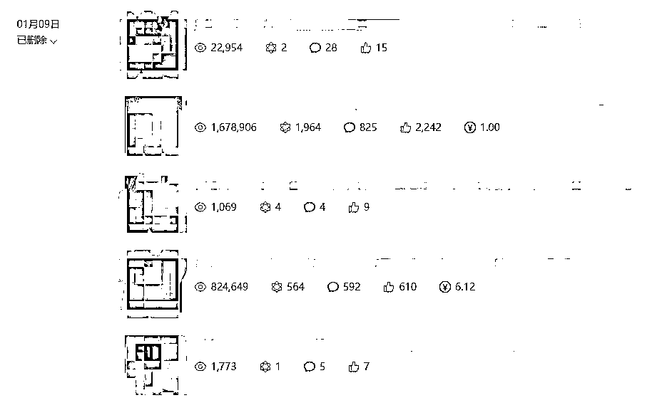

**4、渐入佳境，一周内 2 篇百万爆款**

经历了百万爆款的产生，格子坚定的启动了矩阵公众号的运营模式，从身边亲人好友处，要到了多个公众号同时运营，最多的时候运营了 6 个号，不同领域都进行尝试。

**功夫不负有心人，格子每天坚持输出 10000 字的同时，收获也来得非常及时，有一周，甚至一个号出现了 2 篇百万爆款！**

做过自媒体的朋友都知道，第一步是很难的，一旦有正反馈之后，一发就不可收拾，格子在不停的写作，坚持，再坚持下，试着写不同的领域，到现在回想起来，己经写了差不多几千篇文章，每月的收益也稳定下来，到后来基本公众号能带来 1~2 万左右的稳定收益。

**公众号的一些干货总结：**

01、找准对标账号，同领域的可以上看一看，通过热点里找。

02、爆款标题，公众号目前标题党还是挺有流量的。

03、坚持原创，不要用 AI 输出，目前公众号对 AI 检测越来越严格。

04、通过一些特殊的写作手法，引导用户进行评论，点赞，互动。

05、写用户爱看的内容，而不是写自嗨的内容。

06、热点内容适当的添加，比如最近较火的 sora，但不要生搬硬套。

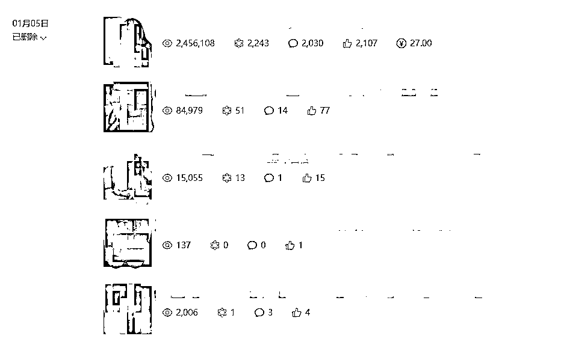

**5、自创项目，悟性大开**

格子韭菜被割的多了，反而开悟了，记得当时是付费了小红书图文带货，折腾了 1 个月什么结果也没有拿到，连千粉都到不了。

不服输的格子，经过不断的尝试和分析后，意外的发现了小红书商单项目，惊讶的发现全网竟然还很少有人去矩阵化做这个项目，而且市面上也没有做培训的。

**我当时觉得是个机会，于是说干就干，选了一个视频赛道，结果三天千粉，第四天就接广告，完成了一个项目的闭环。**

这个项目的核心流程就是通过制作爆款视频获得流量，有流量后吸引粉丝，1000 个粉丝后可以开通广告接单，而广告只需要复制粘贴，钱轻轻松松就挣到手了。

尝到甜头后，我开始开了矩阵账号进行项目成功率，各种数据的分析，流程优化，花最少的时间进行内容创作。

跑出来项目数据模型后，尝试招收小红书商单变现学员，到目前为止已经有 300+学员参与这个项目，严格按要求去执行的学员，80%都成功拿到了正反馈。

开辟小红书新赛道，格子在想，单纯一个赛道如果流量不好，那么这个项目就没办法持续操作和交付了，于是在废了几十个小红书号的情况下，不断试错，成功又开辟出来了多种流量效果好的领域，截止到目前，已经更新了 12 个领域。

而自己也挑战了下，三个小红书号纯接广告，月入过万。

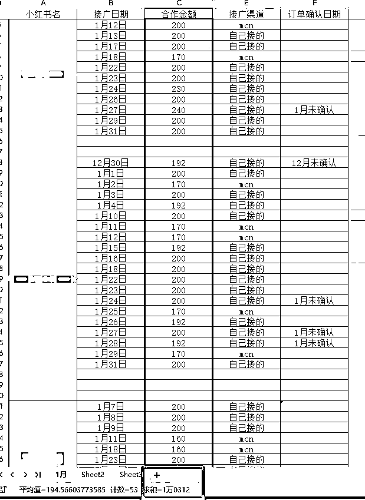

小红书 1 月份接广告的收益

基于这些尝试，和帮助学员解决各种问题的同时，我对小红书有了非常深入的了解，突然有一种悟性大开的感觉。

自媒体的形和神是博大精深的，只要掌握了自媒体的流量运营法则，赚钱的方法真的太多了，格子总结了几点干货：

1、原创对任何平台都有价值，坚持原创。

2、AI 可以帮助大幅度提高效率。

3、好的内容才是重点，AI 做还是人做都是一样。

4、敢于变通，两种思路的碰撞，达到 1+1 大于 2 的效果。

5、多付费学经验，只要不放弃，积累足够多后，会有量变到质变的突破性成长。

6、微创新带来的是新的思维和变现逻辑升华，敢于打破常规。

**三、《格子的方程式》 IP 成长之路**

**1、心智初开，转做个人 IP**

当格子的项目做得风声水起的时候，一来老师的一句话，点醒了格子，为什么不做一个知识类的个人 IP 呢？格子思考和筹划了 1 个月后，开始行动起来，做个人 IP 的初心是利他，帮助他人在自媒体行业赚到钱。

每天很多人都会添加格子来咨询各种各样的问题，自媒体行业一个人坚持确实很难，那何不组建一群人，一起坚持，相互打气，直到成功为止呢？

底层逻辑思考总结下来，主要是以下几点：

1）自媒体行业，是具备可复制性的。

2）账号成为矩阵化的稀缺资源，比如公众号。

3）授人以鱼，不如授人以渔。

4）格子能做出成绩，很多人比格子优秀，一定也能做出成绩。

5）圈子和平台的构建，寻志同道合的人，长期坚持学习，探索，会碰撞出更多的模式。

6）真诚期望能帮助到他人，格子每一个学员都是采用一对一方式，不找中间人和助理，用心服务好每一个细节，才能掌握不同问题的解决办法。

**基于以上的思考，格子从 0~1 构建起了#格子的方程式个人 IP 公众号，以及免费的知识星球《格子自媒体|副业创富圈》。**

而后又和一来老师一拍即合，出了万元私教陪跑项目，承蒙大家信任，23 年 12 月推出到现在，短短几个月的时候，已经招募了 13 名私教学员。

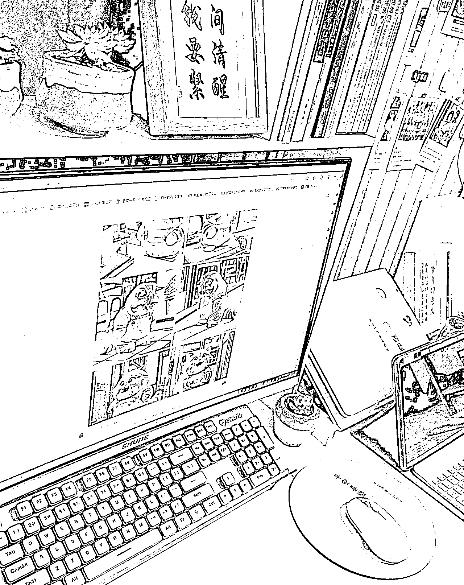

**2、事上练，难上得**

王阳明说过"事上练，难上得"，凡事开头都是非常非常难的，格子的个人 IP 构建之旅，充满了非常多的挑战和艰辛。从一个粉丝为 0 的公众号开始运营，到目前 4 千多粉丝，格子每天练习怎么写经历分享。

期间数据不断的遭到质疑，凭什么你做小红书就这么轻松能赚钱，我做了一个月啥结果也没有？

格子每天都不断的拿数据出来说话，公众号赚不到钱是吧，我截图给你看。

小红书出不了爆款是吧，我把账号粉丝给你看，数据他不会骗人。

每次招到一个学员，格子并不是收到钱了就很开心，而是用心的评估，你适合做小红书吗？

不合适的，劝退，格子明白，当成事业来经营 IP 号需要的是长期主义，口碑非常重要。

真诚，真心，毫无保留的给到学员所有知道的，人与人的相处都是相互的，以心换心。

**3、先利他，再利己**

格子在自媒体领悟最深刻的道理就是：先利他，再利己。

首先，对于格子与平台，格子首先想到的是输出干货，给平台带来有价值的内容。

其次，格子对于学员，格子是诚心相待，帮助学员成长为初心，严选项目赛道。

最后，与各位自媒体人，也是掏心窝子的分享干货，相互交流和学习，携手共进。

长期积累这三条初心后，格子的学员口口相传，帮助格子的个人 IP 也迅速成长起来。

格子的粉丝量并不多，但客单价高，基本上合作过的，复购其他项目的也非常多，价值回报正是源自于无私与深度利他的的这种坚持。

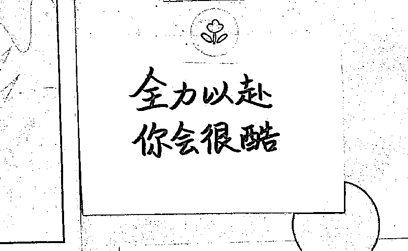

**4、提高认知与破圈**

如果要问格子，500 多天最大的收获是什么？

**格子会说是认知的提高！人都赚不到认知以外的钱，一个人的强大，表现在她的认知层面。**

如果说，阳明心学让格子内心逐渐强大起来，那么，《天道》这本书，让格子真正意识到需要提高认知和破圈。

一流人才，他们研究的是框架，规律与本质。"第一性原理"是什么？那些一眼就能看到本质的人，注定与那些一辈子也看不到本质的人会站在不一样的高度。

二流人才，他们研究的是方法论，体系与系统。这类人，他们知道系统的架构，如何应用方法论构建自己的商业体系，打造商业模式，最终形成一套闭环且可盈利的商业系统。

三流人才，他们研究的是方法，与方案。方法是具体的解决方式，而方法论则是在抽取共性基础上的高度抽象。方法论是一种以解决问题为目标的体系或系统，是对方法进行系统总结并提炼出一般性的原理及原则，并加以体系化。

四流人才，他们研究工具，行为，与操作。最近很多人都在教大家怎么使用 chatgpt，怎么样使用 AI 工具画图，这类人也不是最底层的人，他们有专业技能，能够帮助到人提高效率，获得知识，简化工作流程。

五流人才，他们的认知来自于所处环境，他们只能研究现象和表象。比如大学生，学校里教的，他认为就是对的，在这类人眼里，这世界非黑即白，非对即错。

认知的升华过程，就像一位老禅师所说的，**「看山是山，看山不是山，看山还是山」。**

又如《金刚经》三句义：**佛说世界，既非世界，故名世界。**

又日《道德经》里的：**道，可道，非常道；名，可名，非常名 。**

对普通人来讲，认知升级就像爬楼梯的过程，从 1 楼往上爬，爬累了就休息一会，回过头看一看，不要太在意这个楼有 100 层或者更高，坚持每天往上爬 1~2 层，就会超过很多人。

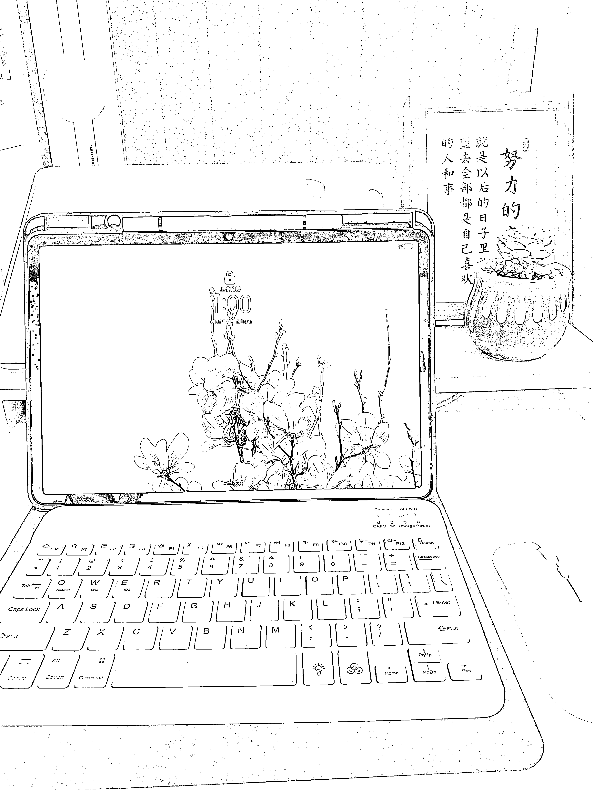

格子从一名底层认知人士，日复一日的往上爬，格子每天不断领悟，看看自己处于哪个认知层面。

不断的看看自己所属层级与上一个层级的差距，还需要补充哪些知识。

格子在自媒体领域，离不开知识星球上的大佬支持，圈层决定了你与什么样的人在一起，不同圈层的人格局与远见是完全不一样的，每年格子要花 5 位数，加入各种知识类社群(比如**生财有术**)，也会主动去链接很多优秀的大佬，保持空杯心态，持续学习。

经历了 500 多天，目前格子的名片上，增加了四位合伙人，分别是：**老徐/老马/宫城/一来 这几位合伙人。**

很多人都在讲生态位，与牛人合作，学习他们本领，模仿他们行为，用好他们的人脉资源，或许是普通人破圈的一种好的方式。

**5、合作共赢，携手未来**

格子私教，是经过了 3 个月的思考后，与"一来"老师共同推出的，一来老师是格子的贵人，带着格子从 0~1 手把手教会，格子非常珍惜这位历害又有耐心的自媒体道路上的导师。

**听说，一根手指头，再强大，也掰不过五根手指头组合起来的拳头，自媒体是一个合作共赢的行业。**

在 23 年底，格子推出私教陪跑，总共 13 名小伙伴报名了，不少小伙伴获得了正反馈。当然在此期间，格子也劝退了几名私教成员，如果共赢不了的学员，没有执行力，没有条件，没有时间和精力的，格子并不会为了私教收入而选择合作。

**格子经常会遇到别人问起，帮你引流分销小红书课程，怎么合作呢？格子说，55 分成，999 元的课程，格子只要 499，你可以拿 500 元。**

与格子合作，你可以比格子拿得多，这 1 块钱，是格子合作的态度。李嘉诚曾说过，你和别人合作项目，假如你拿七分合理，八分也可以，那我们李家拿六分就可以了。

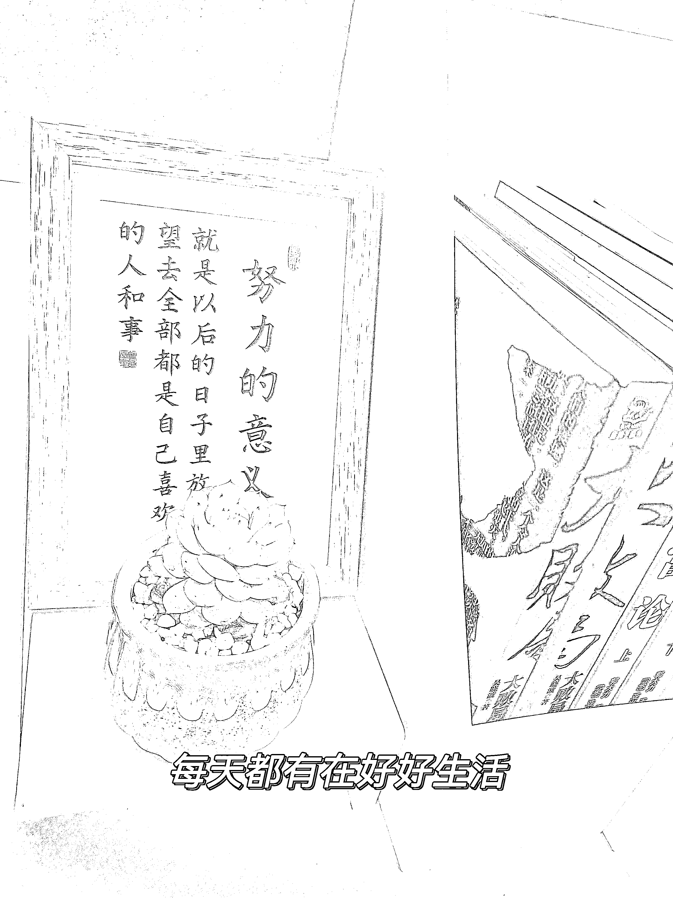

**6、资源整合，破茧成蝶**

24 年 2 月份是春节，在强大的自驱与自律下，格子这个春节几乎没有任何社交，也没有外出旅行，一门心思都朴在自己的矩阵项目上面，5 个公众号，6 个小红书号，10 多台手机，是这个春节的独特记忆，每当坚持不下去的时候，总是想到一句话：**"努力到无能为力，拼搏到感动自己"。**

**随着各星球的干货分享，以及格子 IP 号的 500 多天沉垫，在 2 月底，格子的月收入突破了 10 万元。**

格子的合伙人们，学员们，导师们，所有资源全部进行初步整合，终于在 2 月份，格子的收入上了一个台阶，当 105507 这个数字统计出来的那一刻，放下了所有的自卑。

那一瞬间，格子就像一只彩碟，经历了蛹期的挣扎和折磨，终于化作绚烂的蝶，勇敢地挣脱束缚，破茧而出，飞舞在生命的舞台上。

这 500 多天，格子无社交，无娱乐，无旅行，平均 16 小时的工作时间，每天坚持输出 1000+文字，6 个视频，关起门来，做就是了。

**曾经被债务折磨的无数夜晚的失眠，焦虑，都瞬间释放在此刻。向阳而生的希望，是打破这无尽黑夜的黎明，最好的礼物！**

**四、格子 24 年的期待**

**1、运动健身**

500 多天的坚持，格子身体变得虚弱，体重也慢慢增加，24 年最大的目标就是健身房办卡，

把身体锻炼好，再出发，征战下一城的制高点。

**2、小红书个人 IP 号**

小红书今年上春晚啦，格子也知道，未来挣大钱一定在小红书上，所以计划在 24 年打造出小红书个人 IP 号。

一个广告四五位数，小红书个人 IP 的春天，24 年才刚刚开始。

**3、招募 100 个私教学员**

在格子看来，个人 IP 将是未来最好的机遇，每个人都有机会成长为超级个人 IP.

格子接下来的一年，期望更多的人与格子一起，打造成一个个独立的，超级赚钱的个人 IP 主。

**格子，一个从大山里走出来的 90 后小姐姐，她从不服输，也从不信命，​只信自己！**

**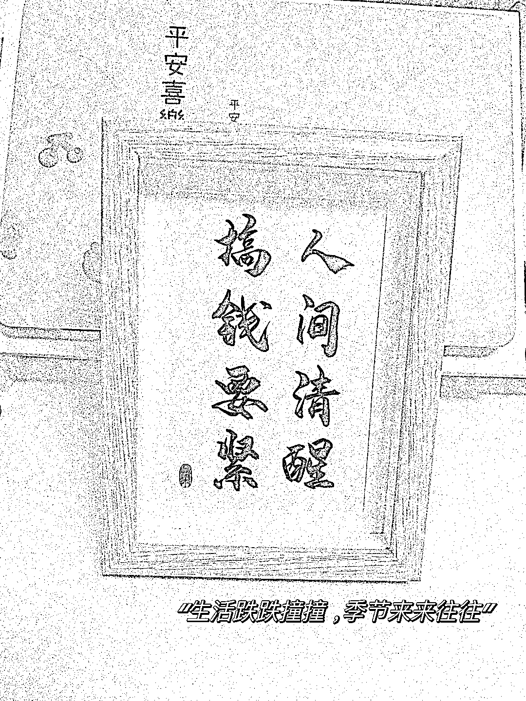**

**听说，被火烧过的才是凤凰。**

23 年，格子领悟过痛，也承受过至亲人的冷嘲热讽，总之人情冷暖自知。

​但是呢，我一直坚信：**那些不能将你毁灭的，终将让你变得更强大。**

最后，这个春天，格子以一首诗送给大家，愿意星球的所有朋友，24 年都能够心想事成，开开心心。

格子-桃花岛

碧海蓝天海风细

绿草欢声喜开颜

鸟语欢声脚步欢

情人岛边念桃花

* * *

评论区：

小牛 : 牛逼 plus
易芬 : 厉害[强][强][强]
Rio : 人间清醒搞钱要紧，自媒体最终出路还是收徒么？
千花百卉 : 厉害了👍
张小多 : 好厉害，向你学习！
小 c : 厉害的圈友 向你学习
修之 : 感悟，干就完了。
格子 : 6000 字的总结和分享，感谢大家宝贵的时间。

* * *