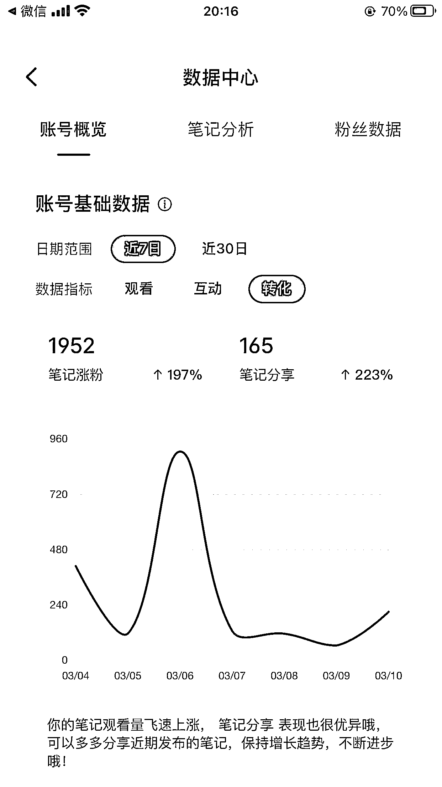
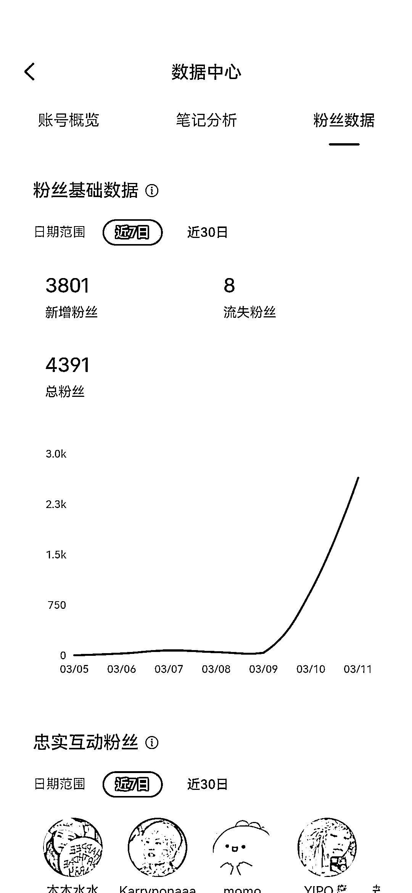
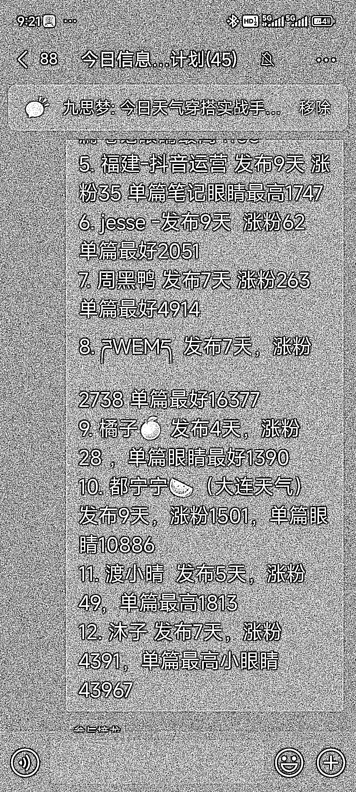

# 小红书 7 天 4300 粉！最适合新人拿信心的项目

> 原文：[`www.yuque.com/for_lazy/thfiu8/qgaboyk669fqusrc`](https://www.yuque.com/for_lazy/thfiu8/qgaboyk669fqusrc)

## (66 赞)小红书 7 天 4300 粉！最适合新人拿信心的项目

作者： 九思梦

日期：2024-03-13

小红书 7 天 4300 粉！最适合新人拿信心的项目——小红书天气穿搭号
先说战果，小红书 7 天 4300 粉！
在今年二月中旬的时候刷风向标，看到一个关于小红书天气穿搭的，然后就立马去小红书看了看，发现很多地方还没有，还只有几个人在做，立马就和另一个朋友尝试了一下，当时做的那个号是七天 2000 粉。就觉得有搞头，就立刻开始写手册，写实操，但讲实话，觉得并没有什么难度，所以说也就打算放开给大家一起看，一起来共同完善这个项目。

请大家移步飞书吧
今日天气穿搭实战手册[`fij9onv1q4.feishu.cn/docx/R6Jrd1EGboccbtxvtebcGE0TnAJ`](https://fij9onv1q4.feishu.cn/docx/R6Jrd1EGboccbtxvtebcGE0TnAJ)

* * *

评论区：

小吴姐 : 天呐，莫不是我之前发的风向标？ 厉害厉害
九思梦 : 有可能哦，哈哈哈谢谢圈友的风向标[爱心]
玛卡瑞纳💫 : 学习学习，谢谢分享[强]
辰安 : 正反馈来的很强烈啊圈友！   但是没有想到好的持续更新方案，每天发 2~3 条内容的话 ， 除了固定的天气穿搭外，还能做点啥赚钱呢？
九思梦 : 我们现在认为这个可以和玄学穿搭接上，然后由玄学类来承接流量。然后群里面现在第一批做号的基本上都有本地的商家来找他们投广告了。更多的变现和扩大手段就还在探索嘛，毕竟这个项目才一周
九思梦 : 共同进步！
辰安 : [强][强][强] 感谢分享
silent : 感觉这个可以尝试唉[发呆]

* * *