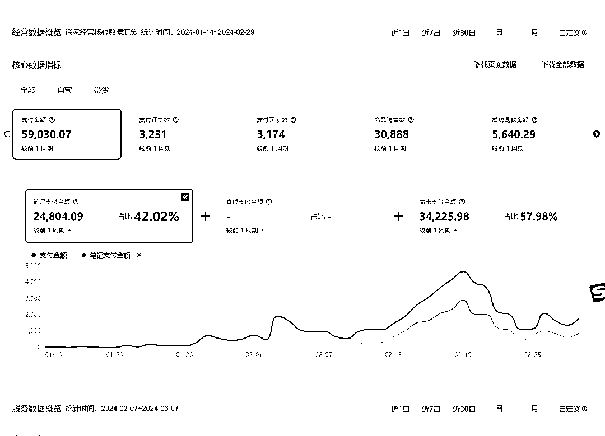
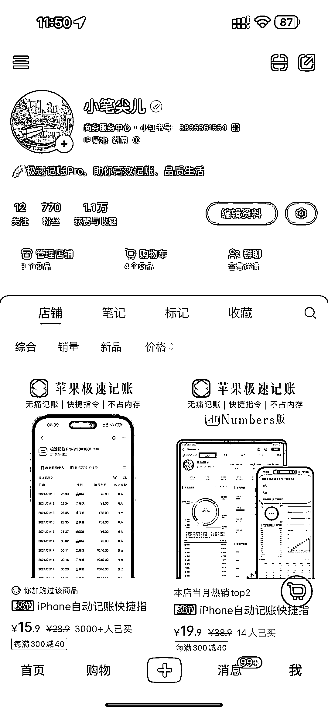
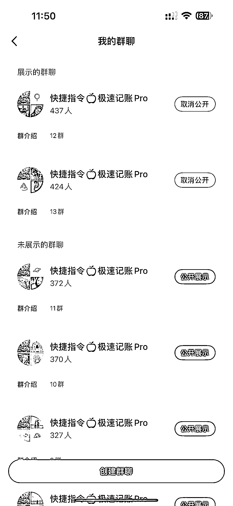
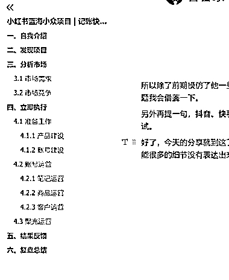

# 小红书蓝海小众项目｜记账快捷指令 实操全复盘

> 原文：[`www.yuque.com/for_lazy/thfiu8/no73wgdmm6l9qkie`](https://www.yuque.com/for_lazy/thfiu8/no73wgdmm6l9qkie)

## (57 赞)小红书蓝海小众项目｜记账快捷指令 实操全复盘

作者： Gemini

日期：2024-03-11

小红书蓝海小众项目｜记账快捷指令 实操全复盘

开头先上总结：1 人 45 天 30 篇笔记 营收 5.8W 销量 Top3

大家好，我是 Gemini【巅峰】，一个在互联网上摸爬滚打了 6 年的 00 后，目前处于创业失败阶段的自由职业人。

今年本命年，通过记账快捷指令这个项目结合上一次小红书店铺航海的知识在小红书拿到了一点正反馈，算是本命年开了个好头吧！今天就来复盘一下我是如何用一个小红书新号通过这个项目从 0 到 1 拿到正反馈的全历程。

如果你有类似的点子/好的想法，涉及到类似于指令开发、脚本制作、平台系统开发等技术问题，可以链接交流一下，不用担技术壁垒！

文章内容稍微有点长，为了提高文章的阅读体验，请移步飞书文档：[`uq17tj7uobh.feishu.cn/wiki/VTFIwLnY3ivI6KkRc5jcFP7FnRg`](https://uq17tj7uobh.feishu.cn/wiki/VTFIwLnY3ivI6KkRc5jcFP7FnRg)

* * *

评论区：

西昂 : 感谢分享[强]
米笠 : 对标的对象也在这里，
Gemini : 哈哈哈，看到了
键凯 : 怎么链接一下
Gemini : YL518118
菜菜 : 哈哈，这个我也关注了，销量很 6
加麻 : 很有勇气
芷蓝 : 这个有点意思，卖快捷指令

* * *